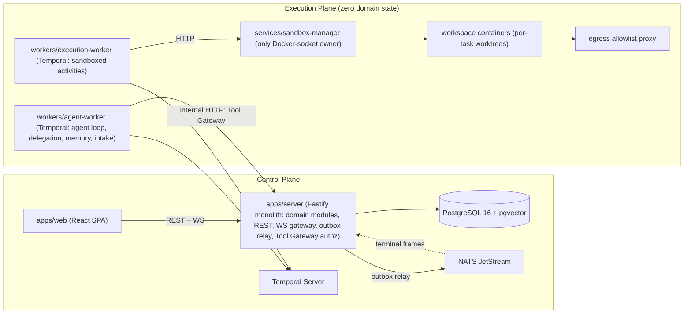

# 00 — Executive Summary

Status: v1.0 — Implementation-ready

## 1. What this system is

**AI Agent Company OS** is a self-hosted, local-first operating system for autonomous AI companies.
The single human operator (the **Founder**) installs the platform on their own infrastructure
(`git clone && cp .env.example .env && docker compose up`), creates one or more **Companies**,
builds an organizational structure (departments, teams, executives, leads, engineers, marketers),
and hires **persistent AI agent employees** into it.

The organization then operates autonomously: it takes Founder objectives, decomposes them through a
real management hierarchy (CEO → CTO → Engineering Manager → leads → developers), executes work
with real tools in sandboxed containers, communicates internally over persistent channels, learns
from outcomes through a memory consolidation pipeline, and escalates only genuine business-authority
decisions to the Founder as structured briefs.

It is explicitly **not**: a chatbot, a CrewAI/LangGraph wrapper, a virtual-office game, an AI coding
assistant, or a bag of prompts. The frontend is a **company command center** with a virtual office
that is a **digital twin** — every avatar movement is driven 1:1 by a real persisted backend event.

Product scope and actors are defined in 01-PRODUCT-SCOPE.md; the system boundary and container
topology in 02-SYSTEM-CONTEXT.md.

## 2. The 12 non-negotiable domain rules

These rules (from `_BRIEF.md` §2) constrain every design decision in this package:

1. **Autonomy first.** The Founder is never interrupted for implementation details, reversible
   technical decisions, debugging, content ideas, task allocation, routine conflicts, or infra
   hiccups. Resolution order before any Founder escalation: own knowledge → agent memory → project
   memory → company memory → peers → specialists → team lead → manager → executive → Founder.
2. **Real corporate hierarchy.** Escalation follows `reports_to` edges. Founder is the LAST level.
3. **Founder escalations are structured briefs** (title, request, reason, attempts, options,
   recommendation, risk, cost, impact, urgency, deadline) — never raw agent chat.
4. **Agent = persistent employee.** Identity is fully decoupled from the underlying LLM; swapping
   the model never changes who "Alex" is (see 05-AGENT-LIFECYCLE.md).
5. **Dynamic organization graph** with typed edges (`reports_to`, `manages`, `member_of`, `leads`,
   `mentors`, `collaborates_with`) — never a hardcoded tree (04-ORGANIZATION-ENGINE.md).
6. **Domain core owns everything.** Third-party agent frameworks are at most replaceable adapters;
   we build the agent loop ourselves on Temporal (ADR-004).
7. **Control plane vs execution plane** are explicitly separated; the execution plane holds zero
   domain state (02-SYSTEM-CONTEXT.md §3).
8. **Event-driven.** All significant behavior emits persisted, versioned, schema'd events; the UI
   renders only real events (10-EVENT-ARCHITECTURE.md).
9. **Durable execution.** Agent work survives app restart, host restart, worker crash, LLM timeout,
   network outage — never "HTTP request → one LLM call → response" (08-AGENT-RUNTIME.md).
10. **Safety rails.** The Tool Gateway validates agent/permission/company/project/risk/budget/policy
    before every tool execution; least privilege; sandboxed execution; loop and runaway protection
    (17-TOOL-GATEWAY.md, 18-PERMISSIONS-AND-SECURITY.md).
11. **Multi-company tenancy from day one** — per-company isolation of agents, memory, projects,
    tasks, secrets, budgets, events (20-DATABASE-DESIGN.md §tenancy).
12. **No consciousness imitation, no emotional simulation.** Functional professional agents only.

## 3. Canonical stack (one table)

Full rationale in `_DECISIONS.md` §1 and the ADR index (docs/adr/).

| Concern | Choice |
|---|---|
| Language | TypeScript (strict), Node.js 22 LTS — one language everywhere |
| Monorepo | pnpm workspaces + Turborepo (28-REPOSITORY-STRUCTURE.md) |
| HTTP control plane | Fastify 5 + Zod (fastify-type-provider-zod), generated OpenAPI |
| Database | PostgreSQL 16 + pgvector — the ONLY database; source of truth for all state |
| ORM/migrations | Drizzle ORM + drizzle-kit |
| Durable workflows | Temporal (self-hosted, TypeScript SDK) |
| Event distribution | Postgres transactional outbox → relay → NATS JetStream |
| Cache/locks | Postgres advisory locks + unlogged tables (no Redis in MVP) |
| LLM abstraction | Own `ModelRouter` port; adapters via Vercel AI SDK v5 (Anthropic, OpenAI, OpenRouter, Ollama/vLLM) |
| Agent framework | NONE — own agent loop as a Temporal workflow (ADR-004) |
| Sandboxing | Docker containers via `sandbox-manager` (dockerode), git worktrees, egress allowlist proxy |
| Frontend | React 19 + Vite + TanStack Router/Query + Zustand + Tailwind CSS |
| Virtual office | PixiJS v8; graphs Cytoscape.js; terminals xterm.js; charts Recharts |
| Realtime | WebSocket `/ws`, per-company monotonic sequence + replay |
| AuthN/AuthZ | Cookie sessions + Argon2id + optional TOTP; RBAC + own DB-backed policy engine |
| Secrets | libsodium sealed boxes, master key from env/OS keyring |
| Observability | pino + OpenTelemetry; optional Grafana/Prometheus/Loki/Tempo compose profile |
| Testing | Vitest + Testcontainers + Playwright |
| Embeddings | ModelRouter: OpenAI `text-embedding-3-small` (1536d) default; Ollama `nomic-embed-text` (768d) offline |

## 4. Process topology

Modular monolith control plane + specialized workers (ADR-002). Five deployable units plus infra:

The agent-worker straddles: it is control-plane *logic* executing on Temporal, with no sandbox
access. All infra containers ship in one `docker compose up`: `postgres`, `nats`, `temporal`
(+ own postgres schema), `temporal-ui`, `server`, `web`, `agent-worker`, `execution-worker`,
`sandbox-manager`, optional observability profile.

## 5. The five hard problems and their solutions

**1. Persistent identity.** An agent must remain "Alex, employee #7, Senior Frontend Dev, with this
memory and this track record" regardless of which LLM powers a given step. Solution: identity lives
entirely in Postgres (`agents`, `agent_skills`, `memories`, `org_edges`, performance history);
models attach only via `agent_model_bindings` (purpose → provider+model), resolved per-call by the
ModelRouter, and no other table or prompt path references a model directly. Swapping bindings
changes cost/quality of the next step, never the employee. The Working-Set builder reassembles
persona, memories, and org context fresh on every step, so no identity is carried in ephemeral
context windows. (05-AGENT-LIFECYCLE.md, 08-AGENT-RUNTIME.md.)

**2. Durable execution.** Multi-hour, multi-step agent work must survive every crash class.
Solution: every active task assignment is a Temporal workflow (`agentTaskWorkflow(agentId, taskId)`)
whose steps are idempotent activities with idempotency keys, heartbeats, retry policies, and
`continueAsNew` after 50 steps / 5k history events. Temporal persists workflow state; a crashed
worker resumes exactly where it left off. Signals (`messageReceived`, `approvalVerdict`,
`reviewVerdict`, `dependencyResolved`, `managerDirective`, `cancel`) deliver external stimuli
durably. Idle agents have no running workflow — "the employee" exists in Postgres, workflows are
their working hours — which is what lets one installation scale to hundreds of mostly-idle agents.
(08-AGENT-RUNTIME.md, 09-WORKFLOW-ENGINE.md.)

**3. Organizational delegation.** Objectives must flow down a real hierarchy without hardcoded
scripts and without the CEO micro-assigning code tasks. Solution: the org is a typed edge graph in
Postgres (`org_edges`, `reports_to` forest, cycle-checked); the delegation engine gives manager
agents the `create_task`/`delegate_task` actions bounded by canonical limits (delegation depth ≤ 5,
≤ 3 reassignments, pro-rata inherited budgets); the task engine enforces the state machine and
per-role transition permissions; escalation is a literal upward walk of `reports_to` with the
Founder as a virtual terminal node reached only after the full resolution order is exhausted.
(04-ORGANIZATION-ENGINE.md, 06-AUTONOMY-AND-ESCALATION.md, 07-TASK-ENGINE.md.)

**4. Memory and learning.** Agents must genuinely improve without hallucinated "knowledge" or
overlearning from single incidents. Solution: a hybrid Postgres+pgvector memory store with three
isolated scopes (company/project/agent) and eight typed memory kinds, fed exclusively by a Temporal
`memoryConsolidationWorkflow` (extract → score → scope → embed → dedupe → contradiction-check →
persist as candidate/active). Every memory carries source, evidence rows, confidence, importance,
and version history; promotion between scopes requires repeated evidence across distinct tasks or
projects plus agent-manager approval — a single event can never create company-scope memory. Skills
grow only from typed evidence rows with a deterministic recompute rule, never "+10 XP".
(12-MEMORY-ARCHITECTURE.md, 13-SKILL-AND-LEARNING-SYSTEM.md.)

**5. Safe tools and the digital twin.** Agents wield real terminals, git, and network, and the UI
must show it truthfully. Solution: every tool call flows through the Tool Gateway (no bypass path
exists in code): identity → permission grants → policy engine (autonomy × risk class R0–R3 ×
reversibility × cost × budget) → allow/deny/require_approval → audit row → dispatch to
sandbox-manager (the only Docker-socket owner) into per-task workspace containers with egress
allowlists. Founder-only categories are platform-hard-coded to `require_approval`. The UI digital
twin renders only persisted events replayed over `/ws` with per-company sequence numbers; terminal
views stream real PTY frames from NATS — no simulation anywhere. (17-TOOL-GATEWAY.md,
18-PERMISSIONS-AND-SECURITY.md, 22-REALTIME-ARCHITECTURE.md, 23-VIRTUAL-OFFICE.md.)

## 6. Document map (36 docs + ADRs)

| # | File | Covers |
|---|---|---|
| 00 | 00-EXECUTIVE-SUMMARY.md | This overview, rules, stack, hard problems, doc map |
| 01 | 01-PRODUCT-SCOPE.md | Formal definition, actors, IS/IS-NOT, UX flows, autonomy contract, success criteria |
| 02 | 02-SYSTEM-CONTEXT.md | C4 L1+L2, control vs execution plane, key data flows |
| 03 | 03-DOMAIN-MODEL.md | Entities, aggregates, invariants, ubiquitous language |
| 04 | 04-ORGANIZATION-ENGINE.md | Org graph, typed edges, positions, escalation-chain computation |
| 05 | 05-AGENT-LIFECYCLE.md | Hire → active ⇄ paused → offboard; identity/model decoupling |
| 06 | 06-AUTONOMY-AND-ESCALATION.md | Autonomy levels × risk matrix, resolution order, escalation briefs |
| 07 | 07-TASK-ENGINE.md | Task hierarchy, state machine, dependencies DAG, delegation limits |
| 08 | 08-AGENT-RUNTIME.md | agentTaskWorkflow loop, Working Set, AgentAction union, guards |
| 09 | 09-WORKFLOW-ENGINE.md | Temporal usage patterns, workflow catalog, signals, continueAsNew |
| 10 | 10-EVENT-ARCHITECTURE.md | Outbox, event catalog (~180), versioning, NATS subjects, DLQ |
| 11 | 11-COMMUNICATION-SYSTEM.md | Channels, messages, inbox workflow, help/review/escalation kinds |
| 12 | 12-MEMORY-ARCHITECTURE.md | Scopes, types, consolidation pipeline, promotion, retrieval, Observatory backend |
| 13 | 13-SKILL-AND-LEARNING-SYSTEM.md | Skill taxonomy, evidence, level recompute, careers |
| 14 | 14-PROJECT-RUNTIME.md | Project entity, intake workflow, environments, project memory namespace |
| 15 | 15-ENGINEERING-DEPARTMENT.md | Engineering workflow, review/QA gates, Architecture Guardian |
| 16 | 16-MARKETING-DEPARTMENT.md | Marketing org domain model (schema in MVP, activation Phase 2) |
| 17 | 17-TOOL-GATEWAY.md | Tool definitions, risk classes, decision pipeline, dispatch |
| 18 | 18-PERMISSIONS-AND-SECURITY.md | RBAC, policy engine, secrets, prompt-injection defense, invariants S1–S8 |
| 19 | 19-APPROVAL-ENGINE.md | Approval entity, endorsement chain, Approval Center contract |
| 20 | 20-DATABASE-DESIGN.md | Full Drizzle schema, tenancy enforcement, indexes, migration strategy |
| 21 | 21-API-DESIGN.md | REST resource map, OpenAPI generation, SDK, PATs, error model |
| 22 | 22-REALTIME-ARCHITECTURE.md | /ws protocol, seq replay, terminal streaming, presence |
| 23 | 23-VIRTUAL-OFFICE.md | Office Projector, PixiJS scene model, event→animation mapping |
| 24 | 24-FRONTEND-ARCHITECTURE.md | SPA structure, routes, state, all 14 views |
| 25 | 25-OBSERVABILITY.md | pino/OTel wiring, trace model, dashboards, stuck-agent detection |
| 26 | 26-COST-MANAGEMENT.md | cost_entries, budgets, rollups, circuit breakers |
| 27 | 27-INFRASTRUCTURE.md | Compose topology, volumes, backup/restore, upgrade path |
| 28 | 28-REPOSITORY-STRUCTURE.md | Monorepo layout, dependency rule, build pipeline, .env.example |
| 29 | 29-MVP-PLAN.md | Milestones M0–M5, MVP demo script as acceptance test, scope table |
| 30 | 30-PHASE-2.md | Marketing activation, social adapters, Reels pipeline, experiments, assets |
| 31 | 31-PHASE-3.md | Multi-human/OIDC, RLS, gVisor, distributed deploy, scaling path |
| 32 | 32-TESTING-STRATEGY.md | Test pyramid, Testcontainers, workflow replay tests, E2E |
| 33 | 33-FAILURE-MODES.md | Crash classes, loop/deadlock/starvation defenses, DLQ handling |
| 34 | 34-THREAT-MODEL.md | STRIDE per boundary, malicious repo, prompt injection, tenant escape |
| 35 | 35-CLAUDE-CODE-HANDOFF.md | Build order, conventions, definition-of-done for the implementing agent |
| — | docs/adr/ADR-001…ADR-020 | Canonical decisions + rejected alternatives (`_DECISIONS.md` §22) |

## 7. Global assumptions (binding, from `_DECISIONS.md` §0)

- **A1.** Single-operator install initially: the Founder is the only human user in MVP; multi-human
  (co-founders, human employees) is Phase 3. Auth is still designed multi-user from the start.
- **A2.** Self-hosted on Linux x86_64/arm64 with Docker; 8+ cores / 16+ GB RAM recommended baseline.
- **A3.** Internet access available for LLM APIs by default; fully-offline mode (Ollama-only) is a
  supported degraded profile, not the primary target.
- **A4.** Currency-agnostic budgets stored in minor units with a per-company currency setting
  (examples may use TRY/USD).
- **A5.** English is the canonical internal language of agents/docs; company-facing output language
  is a company setting.
- **A6.** MVP targets software-company use cases (engineering dept); marketing dept lands in
  Phase 2 but its domain model ships in MVP schema.
- **A7.** Social/ads integrations (Instagram Graph API etc.) are Phase 2; MVP integrations: git,
  GitHub (optional), filesystem, terminal, database inspector, web fetch/search.
- **A8.** Legal/financial actions are always Founder-approval-gated regardless of autonomy config.
- **A9.** No GPU assumed; media generation uses external APIs (Phase 2+).
- **A10.** Licensing/monetization of the platform itself: out of scope for architecture.

**Founder-clarification items** (genuinely business-level, deferred, non-blocking to
implementation): (1) target pricing model for the platform; (2) which social platforms matter first
in Phase 2; (3) whether multi-human org membership should arrive earlier than Phase 3.

## 8. Delivery phases at a glance

| Phase | Outcome | Proof |
|---|---|---|
| MVP (M0–M5) | Engineering company operates autonomously end-to-end | 25-step demo script in 29-MVP-PLAN.md §3 |
| Phase 2 | Autonomous marketing org with full publish→analytics→learning loop | Demo in 30-PHASE-2.md §9 |
| Phase 3 | Multi-human, hardened isolation, distributed deployment, 10× scale path | Targets in 31-PHASE-3.md |

Scale envelope (from `_BRIEF.md` §10): 1–10 companies per installation, 10–100 agents per company,
5–30 concurrently active, thousands of tasks, millions of events, large memory collections —
designed with a scaling path beyond, without gold-plating for it.

## 9. How to read this package

- **Implementers (Claude Code):** start at 35-CLAUDE-CODE-HANDOFF.md for build order, then
  28-REPOSITORY-STRUCTURE.md and 20-DATABASE-DESIGN.md before any feature doc; 29-MVP-PLAN.md
  defines what "done" means at every step.
- **Reviewers of behavior:** 01-PRODUCT-SCOPE.md → 06-AUTONOMY-AND-ESCALATION.md →
  07-TASK-ENGINE.md → 08-AGENT-RUNTIME.md is the shortest path to "how does the org actually
  work".
- **Security reviewers:** 18-PERMISSIONS-AND-SECURITY.md, 17-TOOL-GATEWAY.md, 34-THREAT-MODEL.md,
  plus the invariants S1–S8 in `_DECISIONS.md` §20 which every doc treats as law.
- **Precedence:** `_DECISIONS.md` > `_BRIEF.md` > individual docs; `[WRITER-DECISION]` markers
  flag choices made by document authors within that frame, collected for ratification into ADRs
  where architectural.
