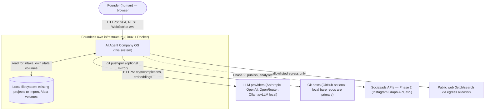
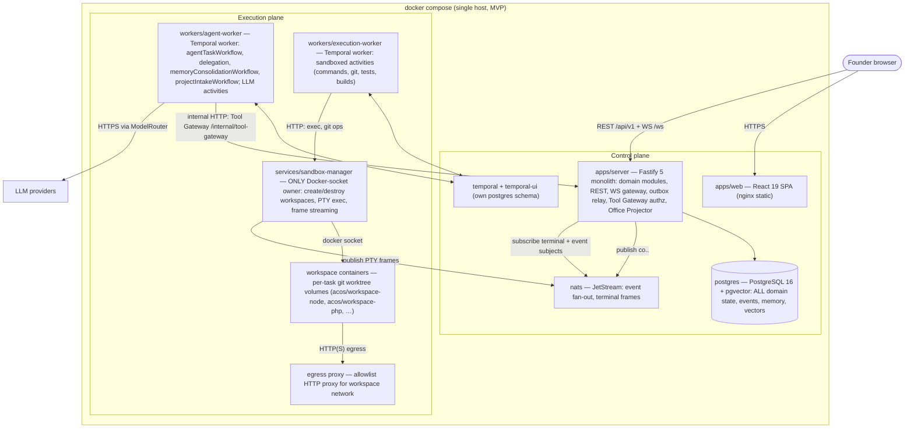
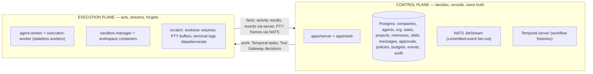

# 02 — System Context (C4 Levels 1 & 2)

Status: v1.0 — Implementation-ready

This document fixes the system boundary, the container topology, the control-plane/execution-plane
split, and the four canonical data flows every other document builds on. Terminology and process
names come from `_DECISIONS.md` §1–§3.

## 1. C4 Level 1 — System Context

Boundary notes:

- The **Founder's browser** is the only human interface (A1). All UI state derives from REST reads
  plus the `/ws` event stream (22-REALTIME-ARCHITECTURE.md).
- **LLM providers** are reached exclusively through the `ModelRouter` port in `packages/llm`
  (ADR-015); offline profile uses Ollama only (A3).
- **Git hosts are optional.** The source of truth for every project is a server-side bare repo at
  `/data/repos/<project_id>.git` (ADR-010); GitHub is a mirror/integration, not a dependency.
- **Social APIs** appear only in Phase 2 (A7) through integration adapters (30-PHASE-2.md).
- **Local filesystem**: project import reads a Founder-provided path (14-PROJECT-RUNTIME.md);
  all persistent state lives on named Docker volumes under `/data`.

## 2. C4 Level 2 — Containers

Container responsibilities (canonical, `_DECISIONS.md` §2):

| Container | Responsibility | Holds state? |
|---|---|---|
| `apps/server` | All domain modules (org, agents, tasks, projects, memory, skills, comms, approvals, policies, costs, events), REST API, WebSocket gateway, leader-elected outbox relay (Postgres advisory lock), Tool Gateway authorization, Office Projector | No (Postgres does) |
| `apps/web` | React SPA served statically; renders only REST + event data | No |
| `workers/agent-worker` | Temporal workflows/activities for the agent loop, delegation, consolidation, intake, experiments; the only LLM-calling process besides embeddings | No |
| `workers/execution-worker` | Temporal activities that need a sandbox: run command, git op, test, build, (Phase 2 browser/media). Talks only to sandbox-manager | No |
| `services/sandbox-manager` | Owns `/var/run/docker.sock` (invariant S1). Creates/destroys workspace containers, execs with PTY, streams frames to NATS, enforces cpu/mem/pids/disk limits | Ephemeral container registry only |
| `postgres` | Source of truth: domain, events (outbox), memory + vectors, audit, costs | Yes — the ONLY domain state |
| `nats` | JetStream streams for committed events; ephemeral subjects for terminal frames | Delivery state only |
| `temporal` | Workflow histories (its own postgres schema) — execution progress, not domain facts | Execution state only |
| workspace containers | Per-task worktree, branch `task/<task-number>-<slug>`; destroyed after merge/discard | Scratch only; results land in git/Postgres |
| egress proxy | Allowlist (package registries for `coding` level; per-level policy in `_DECISIONS.md` §13) | No |

## 3. Control plane vs execution plane

Rule 7 of `_BRIEF.md` demands an explicit boundary. It is drawn as follows:

**The execution plane holds ZERO domain state.** Precisely:

- **Lives ONLY in the control plane (Postgres):** every entity in 20-DATABASE-DESIGN.md — org
  graph, agent identity, task states, project records, memories, skills, messages, approvals,
  permissions, budgets, cost entries, the append-only `events` table, `tool_invocations`,
  `audit_log`, secrets (encrypted).
- **Lives in the execution plane, and is disposable:** running workflow *progress* (recoverable
  from Temporal history, itself re-derivable domain-wise from Postgres facts), workspace
  filesystems (recreatable from the bare repo), PTY ring buffers (64KB) and rolling terminal logs
  (`/data/terminals/<session_id>.log`, 7-day retention — observability artifacts, not domain
  state), container metadata inside sandbox-manager.
- **Crossing rules:** the execution plane never writes Postgres directly. Workers mutate domain
  state only via (a) Temporal activity results consumed by control-plane logic, and (b) the Tool
  Gateway internal HTTP API on `apps/server`, which performs the transactional write + outbox
  event. sandbox-manager's only upstream write path is NATS ephemeral subjects (terminal frames)
  and its HTTP responses to execution-worker. Destroying every execution-plane container loses no
  domain fact; in-flight tasks resume from Temporal + Postgres (rule 9).
- **Security overlay:** only sandbox-manager touches the Docker socket (S1); workspace containers
  get no docker socket, no host mounts beyond their volume, dropped capabilities, allowlist egress
  (S8); secrets never enter the execution plane in raw form — tools inject credentials server-side
  (S2).

## 4. Canonical data flows

### 4.1 Founder objective → working organization

1. Browser `POST /api/v1/companies/:companyId/tasks` (kind=`goal`, objective text, constraints).
2. `apps/server` task module: insert `tasks` row (owner = CEO agent) **and** `task.created` event
   row in one transaction (outbox pattern, 10-EVENT-ARCHITECTURE.md).
3. Outbox relay publishes `co.<companyId>.task.created` to JetStream after commit.
4. Task module starts `agentTaskWorkflow(ceoAgentId, taskId)` on Temporal (agent-worker picks it
   up).
5. CEO loop: Working Set → LLM → `AgentAction`s: `create_task` (initiatives) + `delegate_task`
   to CTO → each delegation inserts tasks/edges + events + starts child workflows. Recursion
   continues down the hierarchy within delegation-depth/budget guards.
6. Every step's events reach the browser via `/ws` (flow 4.4); the Founder watches, uninvolved.

### 4.2 Tool call (e.g. developer runs `npm test`)

1. Inside `agentTaskWorkflow`, the LLM step returns `AgentAction{type:"use_tool",
   tool:"terminal.run", args:{cmd:"npm test", workspaceId}}`.
2. agent-worker activity `invokeToolActivity` calls Tool Gateway (`apps/server` internal HTTP)
   with agent/task/tool/args + idempotency key.
3. Gateway pipeline (17-TOOL-GATEWAY.md): validate identity → `tool_permissions` grants → policy
   engine (autonomy level × risk class × cost × budget remaining) → decision
   `allow | deny | require_approval` → write `tool_invocations` audit row (+ event).
4. On `allow`, gateway returns a signed dispatch ticket; the agent-worker schedules the sandboxed
   activity on execution-worker's task queue; execution-worker calls sandbox-manager
   `POST /workspaces/:id/exec` (PTY).
5. sandbox-manager execs in the workspace container; streams frames (flow 4.3); returns exit
   code/output summary.
6. Result + measured cost recorded via gateway callback (`tool_invocations` update +
   `cost_entries` row + `tool.invocation.completed` event); activity result feeds the next loop
   step. On `require_approval`, the workflow issues `wait_for` until an `approvalVerdict` signal
   arrives (19-APPROVAL-ENGINE.md).

### 4.3 Terminal frame → Founder's screen

1. PTY in workspace container emits bytes; sandbox-manager chunks them into frames
   `{sessionId, ts, seq, bytes}`.
2. Frames go to NATS **ephemeral** subject `co.<companyId>.workspace.terminal.output` — never the
   events table (`_DECISIONS.md` §9) — plus a 64KB in-memory ring buffer and append to
   `/data/terminals/<session_id>.log`.
3. `apps/server` WS gateway subscribes; forwards to browsers subscribed to
   `terminal:<sessionId>`.
4. xterm.js renders raw frames. On reconnect the client sends `{op:"resume", topic, after_seq}`;
   the gateway replays from the ring buffer (or tail of the log file) — real output only, never
   simulated.

### 4.4 Domain event → UI (office, timelines, monitors)

1. Any state change writes its event row in the same transaction (per-company gap-free `seq`).
2. Relay (leader-elected via advisory lock) publishes to `co.<companyId>.<type>`; sets
   `published_at`.
3. WS gateway consumes JetStream; fans out `{topic:"events:<companyId>", seq, events:[...]}` to
   subscribed clients; the **Office Projector** module additionally maps domain events to office
   instructions (`agent.message.sent` → `office.avatar.moved` + `office.interaction.started`) so
   the PixiJS renderer stays dumb (23-VIRTUAL-OFFICE.md).
4. Client stores last seq per topic; on reconnect `{op:"resume", topic:"events:<companyId>",
   after_seq}` replays from the events table — guaranteed gap-free by the per-company sequence.

## 5. Trust boundaries, ports, protocols

Trust zones (threat analysis per boundary in 34-THREAT-MODEL.md):

| Zone | Members | Trust level |
|---|---|---|
| Z0 Browser | Founder's browser | Authenticated human; session cookie + CSRF |
| Z1 Control plane | server, web, postgres, nats, temporal | Trusted; internal HTTP guarded by `INTERNAL_API_TOKEN` (mTLS Phase 3) |
| Z2 Workers | agent-worker, execution-worker | Trusted code, untrusted *content* (LLM outputs, repo text) — all effects mediated by Tool Gateway |
| Z3 Sandbox | sandbox-manager (privileged) | Trusted, minimal, audited codebase; only Docker-socket owner |
| Z4 Workspaces | workspace containers | UNTRUSTED: runs agent-authored and imported code; S8 restrictions; allowlist egress only |
| Z5 External | LLM APIs, git hosts, social APIs, public web | Untrusted content (S5 provenance marking); TLS + key auth outbound |

Canonical ports/protocols (compose-internal names):

| Path | Protocol/port |
|---|---|
| browser → web | HTTPS 443 (nginx) → static SPA |
| browser → server | HTTPS `/api/v1/*` REST + WS `/ws` (proxied via web/nginx) |
| server/workers → postgres | 5432 |
| server/sandbox-manager → nats | 4222 |
| workers → temporal | gRPC 7233 |
| agent-worker → server | HTTP 3000 `/internal/tool-gateway` (bearer `INTERNAL_API_TOKEN`) |
| execution-worker → sandbox-manager | HTTP 3010 |
| workspaces → egress-proxy | HTTP CONNECT 3128 (only route off `acos-workspaces` network) |
| agent-worker → LLM providers | HTTPS 443 via ModelRouter |

## 6. Deployment context

MVP is a single host running the compose stack (27-INFRASTRUCTURE.md): services `postgres`, `nats`,
`temporal`, `temporal-ui`, `server`, `web`, `agent-worker`, `execution-worker`, `sandbox-manager`,
egress proxy, plus the optional observability profile (otel-collector, Prometheus, Grafana, Loki,
Tempo). Workers scale out to additional VMs in Phase 3 by pointing at the same Postgres/NATS/
Temporal (31-PHASE-3.md); nothing in this document's boundaries changes when they do.
