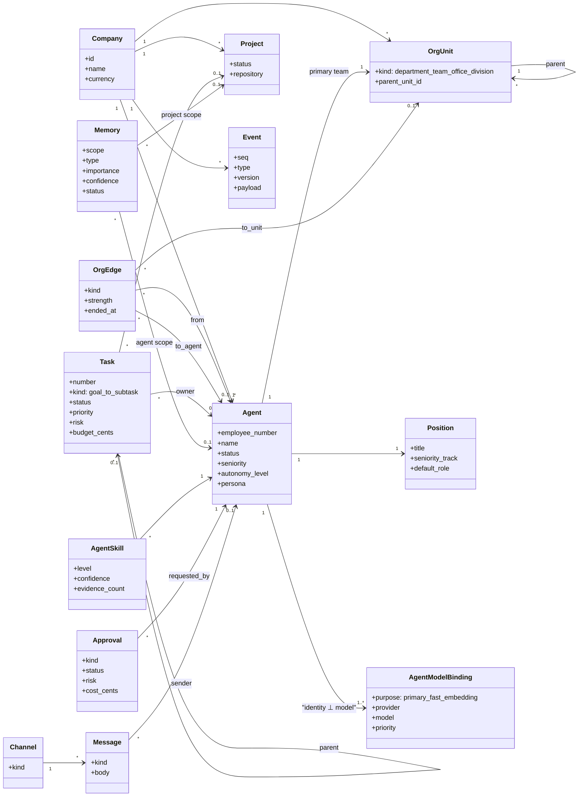
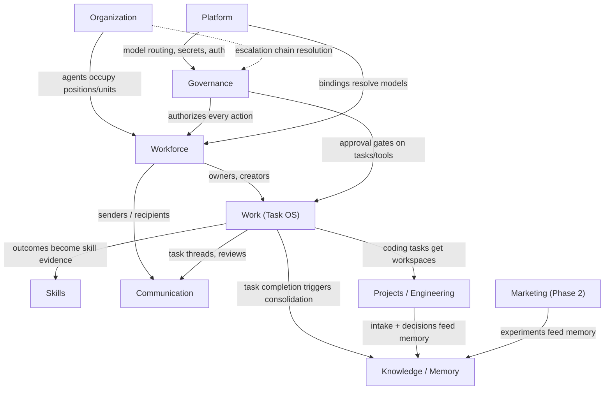

# 03 — Domain Model

Status: v1.0 — Implementation-ready

This document defines the complete domain model of AI AGENT COMPANY OS: bounded contexts, aggregate
roots, entities, value objects, invariants, and emitted events. It is the source of the ubiquitous
language used across all sibling documents and in `packages/domain`. All names conform to
`_DECISIONS.md` (binding). Organization details: `04-ORGANIZATION-ENGINE.md`. Agent lifecycle:
`05-AGENT-LIFECYCLE.md`. Autonomy/escalation: `06-AUTONOMY-AND-ESCALATION.md`. Memory internals:
`12-MEMORY-ARCHITECTURE.md`. Full event list: `10-EVENT-ARCHITECTURE.md`.

---

## 1. Modeling ground rules

1. **The domain core owns everything.** Every entity below lives in PostgreSQL tables owned by
   `packages/db`, with pure logic (state machines, invariants, policies) in `packages/domain`
   (no IO). No third-party framework ever holds domain state (_DECISIONS.md §1, ADR-004).
2. **Multi-tenancy:** every tenant-owned aggregate carries `company_id NOT NULL`; repositories
   require a `CompanyContext` (_DECISIONS.md §4). Platform-context tables (users, sessions,
   model_providers) are the only exception.
3. **IDs are UUIDv7**; human-readable numbers (`employee_number`, task `number`) are per-company
   sequences stored alongside, never used as keys.
4. **Events are part of the model.** Each context lists the events it emits; all are persisted to
   the append-only `events` table in the same transaction as the state change (_DECISIONS.md §9).
5. **State machines are canonical enumerations** (_DECISIONS.md §19) implemented once in
   `packages/domain/src/state-machines/` and reused by server, workers, and UI.

---

## 2. The sacred invariant: agent identity ⊥ LLM model

> **An agent's identity is fully decoupled from any LLM.** The `agents` row (name, employee_number,
> position, seniority, persona, memory, relationships, skill history, performance history) contains
> **no reference to any provider or model**. The *only* place an agent touches a model is the
> `agent_model_bindings` table (`agent_id, purpose ∈ {primary|fast|embedding}, provider, model,
> params, priority`). Swapping a binding changes *how the agent thinks next step*, never *who the
> agent is*. No other table, column, prompt template, or event payload may couple identity to a
> model. CI enforces this: `packages/db` schema tests assert that no table other than
> `agent_model_bindings`, `model_providers`, `model_profiles`, and `llm_calls` contains a
> `model`/`provider` column.

This is non-negotiable domain rule #4 of `_BRIEF.md` and is restated in every doc that touches
agents. The hot-swap flow is specified in `05-AGENT-LIFECYCLE.md` §7.

---

## 3. Bounded contexts

Ten bounded contexts. Each is a Fastify domain module in `apps/server` and a folder in
`packages/domain`. Contexts communicate only via events, IDs, and explicit application services —
never by reaching into each other's tables.

### 3.1 Organization

| Aspect | Content |
|---|---|
| Aggregate roots | `Company`, `OrgUnit` |
| Entities | `Position`, `OrgEdge` |
| Value objects | `UnitKind (department\|team\|office\|division)`, `EdgeKind (reports_to\|manages\|member_of\|leads\|mentors\|collaborates_with)`, `SeniorityTrack`, `EdgeStrength (0–1)` |
| Invariants | `reports_to` edges form a forest per company (cycle check on write); an org edge points at exactly one of `to_agent_id`/`to_unit_id` (CHECK); edges are end-dated, never deleted; an agent has exactly one primary `org_unit_id` |
| Emitted events | `company.created`, `org.unit.created`, `org.unit.updated`, `position.created`, `org.edge.created`, `org.edge.ended`, `org.reorg.applied` |

The org is a **graph, not a tree** — full engine in `04-ORGANIZATION-ENGINE.md`. The Founder is a
*virtual node*: a human referenced by `actor {kind:'founder'}`, never an `agents` row.

### 3.2 Workforce

| Aspect | Content |
|---|---|
| Aggregate roots | `Agent` |
| Entities | `AgentModelBinding`, `AgentSession` |
| Value objects | `AgentStatus (draft\|active\|paused\|offboarded)`, `Seniority (junior\|mid\|senior\|staff\|lead\|expert)`, `AutonomyLevel (0–5)`, `Persona`, `EmployeeNumber`, `RuntimeActivity (IDLE…OFFLINE, derived)` |
| Invariants | The sacred invariant (§2); `employee_number` unique per company; an offboarded agent keeps memory and history, its edges are end-dated; runtime presence is derived state stored only on `agent_sessions.current_activity`, never on `agents` |
| Emitted events | `agent.hired`, `agent.started`, `agent.paused`, `agent.resumed`, `agent.offboarded`, `agent.model.binding.changed`, `agent.session.started`, `agent.session.ended`, `agent.status.changed`, `agent.promotion.recommended` |

Full lifecycle: `05-AGENT-LIFECYCLE.md`.

### 3.3 Work (Task OS)

| Aspect | Content |
|---|---|
| Aggregate roots | `Task` (one table for all kinds) |
| Entities | `TaskDependency`, `Review` (PR entity), `AgentStep` (runtime trace, owned jointly with Workforce) |
| Value objects | `TaskKind (goal\|initiative\|epic\|task\|subtask)`, `Priority (P0–P3)`, `Risk (low\|medium\|high\|critical)`, `SuccessCriteria (text[])`, `BudgetCents`, `TaskStatus` (state machine _DECISIONS.md §7) |
| Invariants | Dependency graph is a DAG (cycle-checked); delegation depth ≤ 5; reassignments ≤ 3 then forced manager intervention; owner may not review own work; `APPROVAL` transitions only via Approval Engine; child budgets inherited pro-rata from parent |
| Emitted events | `task.created`, `task.status.changed`, `agent.task.assigned`, `task.blocked`, `task.unblocked`, `review.requested`, `review.completed`, `task.completed`, `task.failed`, `task.cancelled` |

### 3.4 Knowledge / Memory

| Aspect | Content |
|---|---|
| Aggregate roots | `Memory` |
| Entities | `MemoryVersion`, `MemoryEvidence`, `MemoryRelation` |
| Value objects | `MemoryScope (company\|project\|agent)`, `MemoryType (semantic\|episodic\|procedural\|decision\|failure\|experiment\|relationship\|artifact)`, `Importance (0–1)`, `Confidence (0–1)`, `MemoryStatus (candidate\|active\|superseded\|archived\|rejected)`, `Embedding (vector + model)` |
| Invariants | Scope isolation (agent memory never leaks to another agent's Working Set); a single event can never directly create company-scope memory (promotion rules only); every memory carries provenance (`source_event_id`, evidence rows); contradictions become `memory_relations(kind=contradicts)`, not silent overwrites |
| Emitted events | `memory.created`, `memory.updated`, `memory.superseded`, `memory.promoted`, `memory.contradiction.detected`, `memory.archived`, `memory.consolidation.completed` |

Full pipeline: `12-MEMORY-ARCHITECTURE.md`.

### 3.5 Skills

| Aspect | Content |
|---|---|
| Aggregate roots | `Skill` (company taxonomy), `AgentSkill` |
| Entities | `SkillEvidence` |
| Value objects | `SkillLevel (1–5)`, `EvidenceKind (task_success\|review_accepted\|production_result\|peer_eval\|manager_eval\|experiment\|failure\|failure_resolved)`, `EvidenceWeight ∈ [-1,1]` |
| Invariants | **Evidence-based growth only** — level recomputed by deterministic weighted-sum rule with time decay, never by LLM fiat and never by "+XP"; senior+ level-up additionally requires a manager-agent `promotion_review` artifact |
| Emitted events | `skill.created`, `skill.evidence.recorded`, `agent.skill.updated`, `agent.promotion.recommended` |

### 3.6 Communication

| Aspect | Content |
|---|---|
| Aggregate roots | `Channel` |
| Entities | `ChannelMember`, `Message` |
| Value objects | `ChannelKind (dm\|team\|department\|project\|task_thread\|review\|escalation)`, `MessageKind (text\|help_request\|review_request\|escalation\|status\|system)`, `MessageRefs` |
| Invariants | Messages persist independently of any LLM context; every message emits `agent.message.sent` (drives office digital twin); delivery to an active agent = Temporal signal, to an idle agent = `agentInboxWorkflow`; ping-pong guard (>8 alternating messages without task-state change → manager notification) |
| Emitted events | `channel.created`, `agent.message.sent`, `agent.help.requested`, `agent.escalated` |

### 3.7 Projects / Engineering

| Aspect | Content |
|---|---|
| Aggregate roots | `Project`, `Workspace` |
| Entities | `Repository` (bare repo ref), `IntakeReport` (artifact), `Deployment` (Phase 3 dark schema), `Decision/ADR` (stored as `decision` memories + artifacts), `WorkspaceLock` |
| Value objects | `ProjectStatus (proposed\|intake\|active\|paused\|completed\|archived\|cancelled)`, `WorkspaceStatus (provisioning\|ready\|in_use\|idle\|merged\|discarded\|failed\|destroyed)`, `IsolationLevel (analysis\|coding\|testing\|deploy\|browser\|media)`, `BranchName (task/<number>-<slug>)` |
| Invariants | One bare repo per project at `/data/repos/<project_id>.git`; one worktree volume per coding task; merges only via Review flow by lead agent; workspace containers never hold domain state |
| Emitted events | `project.created`, `project.intake.started`, `project.analysis.completed`, `project.status.changed`, `workspace.provisioned`, `workspace.merged`, `workspace.destroyed` |

### 3.8 Marketing (schema ships in MVP; features Phase 2)

| Aspect | Content |
|---|---|
| Aggregate roots | `Campaign`, `ContentItem`, `Experiment`, `Asset` |
| Entities | `PipelineStage` (reels pipeline), `MetricSnapshot` |
| Value objects | `ExperimentStatus (designed\|baseline\|running\|analyzing\|adopted\|rejected\|inconclusive)`, `AssetMetadata`, `Hypothesis` |
| Invariants | Experiment learnings must land as `experiment` memories via the consolidation pipeline (learning loop closure); publishing is a `publish`-scope tool ⇒ always gated by Tool Gateway risk rules |
| Emitted events | `experiment.started`, `experiment.completed`, `marketing.content.published`, `marketing.analytics.received` |

### 3.9 Governance (permissions, policies, approvals, budgets)

| Aspect | Content |
|---|---|
| Aggregate roots | `Approval`, `PolicyRule`, `Budget` |
| Entities | `ToolPermission`, `ToolInvocation` (audit), `CostEntry`, `AuditLogEntry` |
| Value objects | `RiskClass (R0\|R1\|R2\|R3)`, `ApprovalStatus (pending\|approved\|rejected\|needs_review\|expired)`, `EscalationBrief` (structured — schema in `06-AUTONOMY-AND-ESCALATION.md` §6), `ResourceScope (fs\|git\|network\|db\|money\|publish)`, `BudgetPeriod`, `Decision (allow\|deny\|require_approval)` |
| Invariants | Founder-only categories (payments, legal, credentials, destructive prod) are platform-hard-coded `require_approval` — not tenant-editable; every tool execution passes the Gateway (S3); hard budget breach → `budget.exceeded` → circuit breaker; approvals reaching the Founder are always structured briefs, never raw chat |
| Emitted events | `approval.requested`, `approval.approved`, `approval.rejected`, `approval.expired`, `policy.updated`, `budget.exceeded`, `tool.invocation.denied`, `tool.invocation.completed` |

### 3.10 Platform

| Aspect | Content |
|---|---|
| Aggregate roots | `User` (human), `ModelProvider`, `Secret` |
| Entities | `Session`, `PersonalAccessToken`, `ModelProfile` (company-level), `LlmCall`, `DeadEvent` |
| Value objects | `PlatformRole`, `EncryptedSecret` (libsodium sealed box), `ModelPurpose (reasoning\|coding\|fast\|embedding\|vision)` |
| Invariants | Agents never receive raw secrets (S2); provider keys encrypted at rest; `users`/`sessions`/`model_providers` carry no `company_id`; every LLM call logged to `llm_calls` |
| Emitted events | `user.login.succeeded`, `provider.registered`, `llm.call.completed` (metrics-grade, sampled to events; full detail in `llm_calls`) |

---

## 4. Core entity interface sketches (illustrative, field lists per _DECISIONS.md)

These live in `packages/domain/src/entities/`. Shown abbreviated; Drizzle schemas in `packages/db`
are the authoritative column definitions.

```typescript
// packages/domain/src/entities/agent.ts
export interface Agent {
  id: string;                        // uuidv7
  companyId: string;
  employeeNumber: number;            // per-company sequence, e.g. 7 → "EMP-007"
  name: string;                      // "Alex Demir" — identity, model-independent
  avatarUrl: string | null;
  status: 'draft' | 'active' | 'paused' | 'offboarded';
  positionId: string;                // FK positions
  orgUnitId: string;                 // primary team
  seniority: 'junior' | 'mid' | 'senior' | 'staff' | 'lead' | 'expert';
  autonomyLevel: 0 | 1 | 2 | 3 | 4 | 5;
  employment: EmploymentInfo;        // JSONB — hired_at, offboarded_at, contract notes
  persona: string;                   // short professional bio used in prompts
  createdAt: Date;
  // NOTE: no model/provider fields — see agent_model_bindings (sacred invariant §2)
}

// packages/domain/src/entities/task.ts
export interface Task {
  id: string;
  companyId: string;
  projectId: string | null;
  number: number;                    // per-company seq → "TASK-81"
  kind: 'goal' | 'initiative' | 'epic' | 'task' | 'subtask';
  parentId: string | null;
  title: string;
  objective: string;
  context: TaskContext;              // JSONB — free-form briefing payload (see §7)
  creatorAgentId: string | null;     // null → Founder
  ownerAgentId: string | null;
  orgUnitId: string | null;
  priority: 'P0' | 'P1' | 'P2' | 'P3';
  status: TaskStatus;                // canonical state machine, _DECISIONS.md §7
  successCriteria: string[];
  risk: 'low' | 'medium' | 'high' | 'critical';
  budgetCents: number | null;
  deadline: Date | null;
  approvalPolicyId: string | null;
  result: TaskResult | null;         // JSONB — outcome summary, artifact refs
  createdAt: Date;
}

// packages/domain/src/entities/memory.ts
export interface Memory {
  id: string;
  companyId: string;
  scope: 'company' | 'project' | 'agent';
  scopeRef: string | null;           // project_id or agent_id; null for company scope
  type: 'semantic' | 'episodic' | 'procedural' | 'decision'
      | 'failure' | 'experiment' | 'relationship' | 'artifact';
  title: string;
  content: string;                   // markdown
  summary: string;
  entities: MemoryEntities;          // JSONB — extracted entity mentions
  importance: number;                // 0–1
  confidence: number;                // 0–1
  status: 'candidate' | 'active' | 'superseded' | 'archived' | 'rejected';
  sourceEventId: string;
  createdByAgentId: string | null;
  lastVerifiedAt: Date | null;
  expiresAt: Date | null;
  retrievalCount: number;
  embeddingModel: string;            // per-row model+dimension (ADR-020)
  createdAt: Date;
}

// packages/domain/src/entities/org-edge.ts
export interface OrgEdge {
  id: string;
  companyId: string;
  fromAgentId: string;
  toAgentId: string | null;          // agent-edges: reports_to, manages, mentors, collaborates_with
  toUnitId: string | null;           // unit-edges: member_of, leads — CHECK exactly one non-null
  kind: 'reports_to' | 'manages' | 'member_of' | 'leads' | 'mentors' | 'collaborates_with';
  strength: number | null;           // 0–1; recomputed nightly for collaborates_with
  createdAt: Date;
  endedAt: Date | null;              // edges are end-dated, never deleted
}

// packages/domain/src/entities/approval.ts
export interface Approval {
  id: string;
  companyId: string;
  kind: string;                      // e.g. 'vendor_signup', 'production_destructive'
  title: string;
  requestMd: string;                 // rendered EscalationBrief (structured fields, §3.9)
  requestedBy: string;               // agent_id
  chain: EndorsementChain;           // JSONB — executive endorsements en route to Founder
  status: 'pending' | 'approved' | 'rejected' | 'needs_review' | 'expired';
  risk: 'low' | 'medium' | 'high' | 'critical';
  costCents: number | null;
  urgency: 'low' | 'normal' | 'high' | 'critical';
  deadline: Date | null;
  decidedBy: string | null;          // user_id (Founder) — humans decide approvals
  decidedAt: Date | null;
  decisionNote: string | null;
}
```

---

## 5. Core domain diagram



---

## 6. Ubiquitous language glossary

| Term | Meaning |
|---|---|
| Founder | The human operator. Virtual final node of every escalation chain; never an `agents` row. |
| Company | Tenant root. All domain state is partitioned by `company_id`. |
| Agent | Persistent AI employee: identity, memory, skills, relationships. Model-independent. |
| Employee number | Per-company human-readable sequence identifying an agent (e.g. EMP-007). |
| Persona | Short professional bio on the agent row, injected into its system prompt. |
| Position | A role definition (title, seniority track, default platform role) an agent occupies. |
| Org unit | Department, team, office, or division; self-referencing hierarchy. |
| Org edge | Typed, end-dated relationship in the org graph (reports_to, manages, member_of, leads, mentors, collaborates_with). |
| Reports-to forest | Constraint: `reports_to` edges form trees (no cycles, ≤1 active manager) per company. |
| Escalation chain | Path obtained by walking `reports_to` upward, ending at the Founder virtual node. |
| Seniority | junior → mid → senior → staff → lead → expert; evidence-driven career position. |
| Autonomy level | L0–L5 config on an agent, combined dynamically with risk/cost/policy (see 06). |
| Risk class | R0 read / R1 reversible write / R2 costly / R3 irreversible-or-external, per tool. |
| Resource scope | What a tool touches: fs, git, network, db, money, publish. |
| Task | Unit of work; single table for goal/initiative/epic/task/subtask via `kind` + `parent_id`. |
| Task OS | The work subsystem: tasks, dependencies DAG, state machine, delegation limits. |
| Delegation | Manager decomposes a task into children and assigns owners; max depth 5. |
| Working Set | Assembled per-step context: task + memories + messages + role + org + tools. |
| Agent action | Strict Zod union an agent step must emit (use_tool, delegate_task, escalate, …). |
| Agent session | One Temporal `agentTaskWorkflow` execution row; powers the Agent Monitor. |
| Runtime activity | Derived presence status (IDLE…OFFLINE) published via events, not stored on agents. |
| Memory | Persistent knowledge record with scope, type, provenance, confidence, importance. |
| Memory scope | company / project / agent — strictly isolated retrieval namespaces. |
| Consolidation | Pipeline turning raw events into deduplicated, scored, classified memories. |
| Promotion (memory) | Evidence-gated copy of a memory to a wider scope (agent→project→company). |
| Overlearning prevention | Rule that single incidents stay narrow-scoped; repetition promotes. |
| Memory Observatory | UI over real stored memories: graph/timeline/list/search + provenance. |
| Skill | First-class competency in a company taxonomy. |
| Skill evidence | Weighted, referenced proof (task success, review, production result…) of skill. |
| Evidence-based growth | Levels recomputed deterministically from evidence; no gamified XP. |
| Channel | Persistent communication space: dm, team, department, project, task_thread, review, escalation. |
| Help request | `request_help` action → message kind `help_request`; the peer/specialist rung. |
| Escalation brief | Structured document (title…deadline) required for any Founder-bound ask. |
| Approval | Governance aggregate routed through the Approval Center to the Founder. |
| Approval Center | Founder UI listing structured approvals: APPROVE / REJECT / REQUEST EXECUTIVE REVIEW. |
| Policy rule | DB-backed rule evaluated by the policy engine inside the Tool Gateway. |
| Tool Gateway | The single authorization + audit choke point for every tool execution (S3). |
| Budget | Limit (hard/soft) at company/unit/project/task/agent scope; hard breach → circuit breaker. |
| Project | First-class engineering entity: repo, team, tasks, memory namespace, environments. |
| Intake | Automated analysis of an imported project producing the Intake Report + routed tasks. |
| Workspace | Per-task sandbox container + git worktree volume with an isolation level. |
| Digital twin | The virtual office; renders only real persisted events, no fake animation. |
| Event | Persisted, versioned, schema'd fact (`domain.entity.action`, past tense) in the outbox. |
| Outbox relay | Leader-elected publisher moving committed events to NATS JetStream. |
| Model binding | The only agent↔model linkage (`agent_model_bindings`); hot-swappable. |
| Model router | Port resolving purpose → provider/model with fallback chain; logs `llm_calls`. |
| Circuit breaker | Company-level daily-spend guard pausing non-critical agents on breach. |

(44 terms.)

---

## 7. JSONB policy — where flexible JSON is allowed and where it is forbidden

**Principle: the domain must not hide in JSON.** Anything that is (a) part of a state machine,
(b) a foreign key, (c) filtered/joined/aggregated in queries, or (d) governed by an invariant MUST
be a typed column. JSONB is reserved for genuinely polymorphic or descriptive payloads, and every
JSONB column has a Zod schema in `packages/domain` — "JSONB" never means "untyped".

### Allowed JSONB columns (closed list, from _DECISIONS.md)

| Column | Why JSONB is acceptable |
|---|---|
| `events.payload` | Polymorphic by design — ~180 event types, each with its own versioned Zod schema in `packages/events`. Typed columns (`type`, `version`, `seq`, actor/subject refs) carry everything queried. |
| `events.actor` | Tiny closed shape `{kind: agent\|founder\|system, id}`; kind+id are extracted into expression indexes where filtering is needed. |
| `agents.employment` | Descriptive HR metadata (hired_at, offboarding note). Lifecycle **status** is a typed column; employment JSONB holds only non-queried narrative facts. |
| `tasks.context` | Free-form briefing payload handed down at delegation (links, excerpts, constraints). All decision-relevant fields (priority, risk, budget, deadline, criteria) are typed columns. |
| `tasks.result` | Outcome narrative + artifact refs; heterogeneous per task kind. Completion itself is the typed `status`. |
| `memories.entities` | Extracted entity mentions of unbounded variety; relational analysis happens via `memory_relations`, not this column. |
| `messages.refs` | Loose pointers (task/review/memory ids) enriching a message; message routing uses typed `channel_id`/`kind`. |
| `approvals.chain` | Ordered executive-endorsement log — an append-only document, read as a whole, never filtered server-side. |
| `tool_permissions.constraints` | Per-grant constraint bag (path prefixes, repo list, spend cap) whose shape varies per tool; evaluated in code by the tool's own Zod constraint schema. |
| `agent_model_bindings.params` / `model_profiles` params | Provider-specific sampling params (temperature, max_tokens); opaque to the domain, meaningful only to the adapter. |

[WRITER-DECISION] Two additions in the same spirit, used by docs 04–06: `agents.settings` JSONB
(per-agent operator preferences: output language, verbosity, working-hours window — schema
`AgentSettingsSchema`, see `05-AGENT-LIFECYCLE.md` §8) and `policies.rule` JSONB (declarative
rule condition AST evaluated by the policy engine, see `06-AUTONOMY-AND-ESCALATION.md` §4).

### Explicitly forbidden in JSONB

- Any status/state (`agents.status`, `tasks.status`, `approvals.status`, …) — typed columns only.
- Any relationship (owner, parent, reports_to, dependencies) — FK columns / edge tables only.
- Autonomy level, risk, priority, budgets, deadlines, seniority — typed, indexed columns.
- Skill levels or evidence — dedicated tables (`agent_skills`, `skill_evidence`).
- Org structure of any kind — `org_units`/`org_edges` only; never an "org JSON blob".
- Model/provider references outside `agent_model_bindings` (sacred invariant §2).

Migration review checklist item (CI-enforced lint on Drizzle schema): a new JSONB column requires a
matching Zod schema export and an entry appended to the table above.

---

## 8. Context map (how contexts relate)



All arrows are event/ID couplings; there are no cross-context table joins outside read-model
queries in `apps/server` reporting modules.
