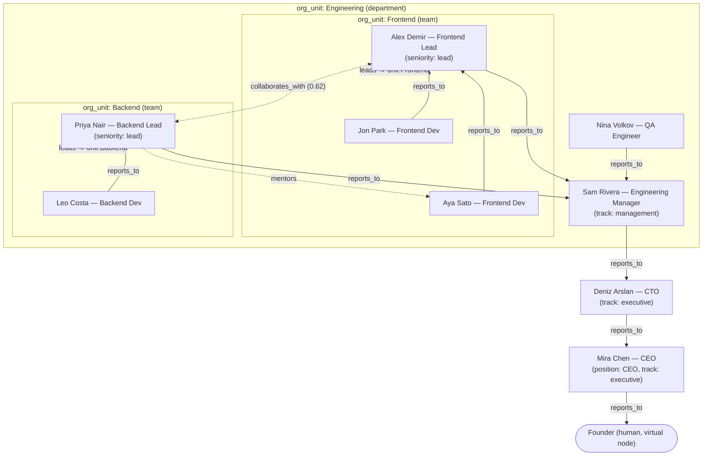
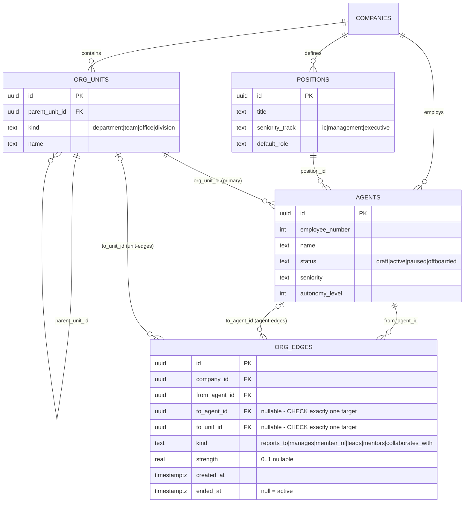

# 04 — Organization Engine

Status: v1.0 — Implementation-ready

The dynamic org graph engine per `_DECISIONS.md` §5: tables, constraints, the reports-to forest,
escalation-chain resolution, org queries, relationship-strength recomputation, hiring, and re-org
operations. Domain language: `03-DOMAIN-MODEL.md` §3.1. Agent lifecycle events that touch the org:
`05-AGENT-LIFECYCLE.md`. Escalation semantics built on this chain: `06-AUTONOMY-AND-ESCALATION.md`.

**Core stance:** the organization is a **typed, end-dated graph in PostgreSQL** — not a hardcoded
tree, not an enum of roles. "CEO" is nothing but an agent occupying a position whose
`seniority_track = 'executive'`; the engine has zero code that mentions CEO/CTO/EM by name.

---

## 1. Schema (Drizzle → SQL shown as DDL for clarity)

```sql
CREATE TABLE org_units (
  id             uuid PRIMARY KEY,                 -- uuidv7
  company_id     uuid NOT NULL REFERENCES companies(id),
  parent_unit_id uuid REFERENCES org_units(id),    -- self-referencing hierarchy
  kind           text NOT NULL CHECK (kind IN ('department','team','office','division')),
  name           text NOT NULL,
  created_at     timestamptz NOT NULL DEFAULT now(),
  archived_at    timestamptz
);

CREATE TABLE positions (
  id              uuid PRIMARY KEY,
  company_id      uuid NOT NULL REFERENCES companies(id),
  title           text NOT NULL,                   -- "CTO", "Frontend Engineer" — data, not code
  seniority_track text NOT NULL CHECK (seniority_track IN ('ic','management','executive')),
  default_role    text NOT NULL,                   -- default platform RBAC role for occupants
  created_at      timestamptz NOT NULL DEFAULT now()
);

-- agents: full column list in 05-AGENT-LIFECYCLE.md §2 (per _DECISIONS.md §6)

CREATE TABLE org_edges (
  id            uuid PRIMARY KEY,
  company_id    uuid NOT NULL REFERENCES companies(id),
  from_agent_id uuid NOT NULL REFERENCES agents(id),
  to_agent_id   uuid REFERENCES agents(id),
  to_unit_id    uuid REFERENCES org_units(id),
  kind          text NOT NULL CHECK (kind IN
                  ('reports_to','manages','member_of','leads','mentors','collaborates_with')),
  strength      real CHECK (strength BETWEEN 0 AND 1),
  created_at    timestamptz NOT NULL DEFAULT now(),
  ended_at      timestamptz,
  -- Exactly one target: agent-edges vs unit-edges
  CONSTRAINT org_edge_one_target CHECK (
    (to_agent_id IS NOT NULL AND to_unit_id IS NULL AND
       kind IN ('reports_to','manages','mentors','collaborates_with'))
    OR
    (to_unit_id IS NOT NULL AND to_agent_id IS NULL AND
       kind IN ('member_of','leads'))
  ),
  CONSTRAINT org_edge_no_self_loop CHECK (to_agent_id IS NULL OR to_agent_id <> from_agent_id)
);

-- One ACTIVE manager per agent (forest property, degree part)
CREATE UNIQUE INDEX org_edges_one_active_manager
  ON org_edges (company_id, from_agent_id)
  WHERE kind = 'reports_to' AND ended_at IS NULL;

-- One ACTIVE lead per unit
CREATE UNIQUE INDEX org_edges_one_active_lead
  ON org_edges (company_id, to_unit_id)
  WHERE kind = 'leads' AND ended_at IS NULL;

-- Hot-path lookups
CREATE INDEX org_edges_from_kind ON org_edges (company_id, from_agent_id, kind)
  WHERE ended_at IS NULL;
CREATE INDEX org_edges_to_agent  ON org_edges (company_id, to_agent_id, kind)
  WHERE ended_at IS NULL;
CREATE INDEX org_edges_to_unit   ON org_edges (company_id, to_unit_id, kind)
  WHERE ended_at IS NULL;
```

Design notes:

- **Unit-edges vs agent-edges** share one table because they share lifecycle (end-dating, history,
  strength) and are traversed together; the two-branch CHECK keeps the union honest and the partial
  indexes keep each branch fast. Splitting into two tables was rejected: every graph query would
  become a UNION and edge history would fragment.
- **`manages` is the denormalized inverse of `reports_to`** for direct reports; the application
  service writes both edges in one transaction (and end-dates both together). Queries may use either
  direction without recursive inversion. Consistency is asserted by a nightly integrity check job.
  [WRITER-DECISION] (materialized inverse rather than view — keeps edge history symmetric).
- **Edges are never deleted.** `ended_at` closes them; org history stays queryable forever
  ("who managed Alex in March?").

---

## 2. Reports-to forest constraint + cycle check

`reports_to` must form a **forest per company**: every agent has ≤1 active manager (unique partial
index above) and no cycles. Roots of the forest (agents with no active `reports_to` edge — typically
the CEO agent, but possibly several department heads in a flat company) implicitly report to the
**Founder virtual node**.

Cycle detection runs **on write**, inside the same transaction that inserts/updates a `reports_to`
edge, after taking a per-company advisory lock to serialize concurrent org mutations:

```sql
SELECT pg_advisory_xact_lock(hashtext('org:' || :company_id));

-- Would inserting (from := :agent, to := :new_manager) create a cycle?
-- Walk UP from the proposed manager; if we ever reach :agent, reject.
WITH RECURSIVE chain AS (
  SELECT e.to_agent_id, 1 AS depth
  FROM org_edges e
  WHERE e.company_id = :company_id
    AND e.from_agent_id = :new_manager
    AND e.kind = 'reports_to' AND e.ended_at IS NULL
  UNION ALL
  SELECT e.to_agent_id, c.depth + 1
  FROM org_edges e
  JOIN chain c ON e.from_agent_id = c.to_agent_id
  WHERE e.company_id = :company_id
    AND e.kind = 'reports_to' AND e.ended_at IS NULL
    AND c.depth < 50                       -- hard depth guard, way beyond any sane org
)
SELECT 1 FROM chain WHERE to_agent_id = :agent LIMIT 1;
-- any row → raise domain error ORG_EDGE_WOULD_CYCLE, transaction rolls back
```

The same guard rejects `:new_manager = :agent` (also covered by the CHECK) and depth > 50
(`ORG_CHAIN_TOO_DEEP`). The `org_units.parent_unit_id` hierarchy uses the identical CTE pattern on
unit writes.

---

## 3. Escalation-chain resolution

Used by the escalation ladder (`06-AUTONOMY-AND-ESCALATION.md` §5) and by the Approval Engine to
build endorsement chains.

```typescript
// packages/domain/src/org/escalation.ts
// Pure function over a loaded org snapshot; repository provides the recursive-CTE walk.
export interface EscalationTarget {
  kind: 'agent' | 'founder';
  agentId?: string;
  reason: 'reports_to' | 'skill_specialist' | 'unit_lead' | 'virtual_root';
}

export function resolveEscalationChain(
  agent: AgentRef,
  topic: EscalationTopic,          // { skills?: string[]; category?: FounderOnlyCategory }
  org: OrgSnapshot,
): EscalationTarget[] {
  const chain: EscalationTarget[] = [];

  // (0) Founder-only categories short-circuit straight to Founder (still logged through chain)
  if (topic.category && FOUNDER_ONLY_CATEGORIES.has(topic.category)) {
    return [...managementChain(agent, org), { kind: 'founder', reason: 'virtual_root' }];
  }

  // (1) Skill-based routing: before climbing, route to a specialist peer if the topic
  //     declares required skills and a colleague in scope has agent_skills.level >= 4
  //     with confidence >= 0.6 for ALL of them. Nearest scope wins: same team → same
  //     department → company. Ties broken by (level desc, evidence_count desc,
  //     collaborates_with strength desc). The specialist is a HELP rung, not a decision rung.
  const specialist = findSpecialist(topic.skills, agent, org);
  if (specialist) chain.push({ kind: 'agent', agentId: specialist.id, reason: 'skill_specialist' });

  // (2) Walk reports_to upward (already cycle-free forest, max depth 50)
  chain.push(...managementChain(agent, org)); // each: { kind:'agent', reason:'reports_to' }

  // (3) Gap-filling: if any hop's manager is paused/offboarded, substitute the active
  //     lead of the agent's unit (org_edges kind='leads'), else the lead of the parent unit.
  //     reason:'unit_lead'. (Implemented inside managementChain.)

  // (4) Founder is ALWAYS the final, virtual node — never an agents row.
  chain.push({ kind: 'founder', reason: 'virtual_root' });
  return dedupeConsecutive(chain);
}
```

The `reports_to` walk itself is one recursive CTE (same shape as §2, walking up from the agent,
returning the full path ordered by depth), executed by
`orgRepository.getManagementChain(companyId, agentId)` and cached per request.

**Nothing is hardcoded:** if the Founder builds a two-level org (devs → CEO), the chain is simply
`[specialist?] → CEO → Founder`. If they build the full Acme org (§7), it is
`Frontend Dev → [specialist?] → Frontend Lead → Engineering Manager → CTO → CEO → Founder`.
Cross-lead consultation (e.g. Frontend Lead asking Backend Lead, per `_BRIEF.md` §2.2) is a *peer
help* move at the same rung, expressed as a `help_request` message — not a chain hop.

---

## 4. Org queries (read models)

All exposed by the org module in `apps/server` under `/api/companies/:id/org/*`, all plain SQL over
the tables above (Cytoscape.js renders the results in the Organization view).

**Chain of command** — §3's CTE; returns ordered agent list + virtual Founder terminator.

**Team roster:**

```sql
SELECT a.id, a.name, a.employee_number, a.seniority, p.title,
       BOOL_OR(l.id IS NOT NULL) AS is_lead
FROM org_edges m
JOIN agents a    ON a.id = m.from_agent_id
JOIN positions p ON p.id = a.position_id
LEFT JOIN org_edges l ON l.from_agent_id = a.id AND l.to_unit_id = m.to_unit_id
                     AND l.kind = 'leads' AND l.ended_at IS NULL
WHERE m.company_id = :company_id AND m.to_unit_id = :unit_id
  AND m.kind = 'member_of' AND m.ended_at IS NULL
  AND a.status = 'active'
GROUP BY a.id, a.name, a.employee_number, a.seniority, p.title
ORDER BY is_lead DESC, a.seniority DESC, a.employee_number;
```

**Department rollup** — recursive CTE over `org_units.parent_unit_id` from a department root,
joined to `member_of` edges: headcount, active task count (join `tasks.org_unit_id`), open
approvals, and cost (join `cost_entries.org_unit_id`) aggregated per subtree node.

**Capacity view** — per agent in a unit: active assignments (`tasks` where
`owner_agent_id = a.id AND status IN ('ASSIGNED','IN_PROGRESS','WAITING','BLOCKED','REVIEW','QA')`),
open `agent_sessions`, remaining task budgets, and last-24h cost from `cost_entries`. The delegation
engine consumes this view to balance load before assigning (`_DECISIONS.md` §7 delegation limits).

---

## 5. Relationship-strength recomputation (nightly job)

`collaborates_with` edges are **computed, not authored**. A nightly Temporal schedule
(`relationshipStrengthWorkflow`, 03:00 company-local [WRITER-DECISION]) recomputes strengths from
the last 30 days of events:

```
raw(a,b) = 1.0 · messages_exchanged(a,b)            -- from agent.message.sent (dm/task_thread)
         + 3.0 · reviews_between(a,b)               -- task.review.completed pairs
         + 2.0 · tasks_co_worked(a,b)               -- same task_id: owner + reviewer/helper
         + 1.5 · help_requests_answered(a,b)        -- message.help.requested → reply pairs

score(a,b)    = 1 - exp(-raw(a,b) / 20)             -- squashes to (0,1), 20 ≈ "solid collaboration"
strength_new  = 0.7 · score(a,b) + 0.3 · strength_prev   -- EMA smoothing across runs
```

Rules: create the edge when `strength_new ≥ 0.15` and none exists; update `strength` in place while
active; end-date the edge when `strength_new < 0.05` for 2 consecutive runs. Each run emits one
`org.relationship.recomputed` event (payload: counts of created/updated/ended) — not one per edge,
to keep the timeline sane. [WRITER-DECISION] (weights, squash constant, thresholds — tunable via
`policies`, defaults above.)

---

## 6. Hiring flow and re-org operations

### 6.1 Hiring (Founder UI → org engine)

1. Founder opens Organization view → "Hire agent": picks/creates a `position`, a primary unit,
   seniority, autonomy level, name, avatar, persona; picks the manager (or leaves top-level).
2. `POST /api/companies/:id/agents` executes **one transaction**: allocate `employee_number`
   (per-company sequence row, `05-AGENT-LIFECYCLE.md` §4) → insert `agents` row (`status='draft'`,
   or `'active'` for hire-and-start) → insert `org_edges`: `member_of` (primary unit), `reports_to`
   (+ inverse `manages`), optional `leads` → run §2 cycle check → seed `agent_model_bindings` from
   the company `model_profiles` defaults → append events `agent.hired`, `org.edge.created` (×N).
3. Outbox relay publishes; the office digital twin spawns the avatar in its department area; the
   Agent Monitor shows the new employee as IDLE (derived, `05-AGENT-LIFECYCLE.md` §9).

### 6.2 Re-org operations (all history-preserving)

Every mutation = end-date old edges (`ended_at = now()`) + insert new edges in one transaction with
the §2 advisory lock + cycle check, emitting `org.edge.ended`/`org.edge.created` and one summarizing
`org.reorg.applied` event (payload: operation, moved ids, initiator).

| Operation | Edge mutations |
|---|---|
| Change manager | End `reports_to` + inverse `manages`; insert new pair; cycle-check |
| Move agent to team | End `member_of`; insert new; update `agents.org_unit_id` (primary team) |
| Move whole team | Update `org_units.parent_unit_id` (unit-tree cycle check); member edges untouched |
| Appoint/replace lead | End previous `leads` edge on the unit (unique index enforces one); insert new |
| Assign mentor | Insert `mentors` edge; end when mentorship closes |
| Offboard agent | End ALL active edges from/to the agent; reports of the agent are re-pointed to its former manager (explicit new edges) — see `05-AGENT-LIFECYCLE.md` §3.3 |

In-flight work is unaffected by re-orgs: task ownership does not change, but the *next* escalation
or approval resolves against the new chain (chain resolution always reads current edges).

---

## 7. Example: Acme Corp organization graph

The `_BRIEF.md` reference org (engineering slice). Every node below the Founder is just an
`agents` row + `positions` row + edges — no code knows these titles.



Escalation for Jon Park: `Jon → [specialist?] → Alex (Frontend Lead) → Sam (EM) → Deniz (CTO) →
Mira (CEO) → Founder` — exactly the brief's chain, produced generically by §3.

### 7.1 Org data model diagram



---

## 8. Executives are data, not code

- "CEO", "CTO", "CMO" are `positions` rows with `seniority_track='executive'`; the engine grants
  them nothing intrinsically. What makes an executive powerful is *configuration attached to the
  agent occupying the position*: higher `autonomy_level` (typically L4–L5), broader
  `tool_permissions`, larger budget scopes, and being high in the `reports_to` forest.
- Delegation behavior ("CEO never assigns routine coding tasks directly to developers") is enforced
  by policy rules on `delegate_task` (target must be within N chain hops or a direct report's unit —
  `06-AUTONOMY-AND-ESCALATION.md` §4), not by title checks.
- A company with no CEO at all is valid: forest roots escalate straight to the Founder.
- `positions.seniority_track` drives only defaults (suggested autonomy level, default RBAC role,
  Approval Engine endorsement eligibility: `executive` track members can endorse Founder-bound
  approvals, `_DECISIONS.md` §15).

Anti-hardcoding test (CI): a fixture company whose top position is titled "Grand Vizier" must pass
the full escalation/delegation test suite unchanged.
