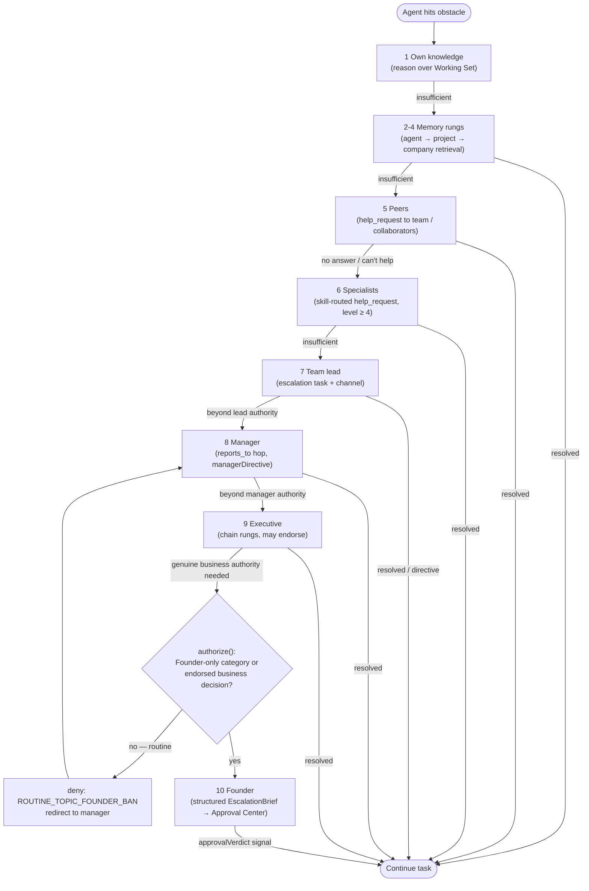
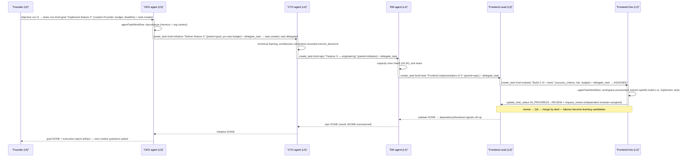

# 06 — Autonomy and Escalation

Status: v1.0 — Implementation-ready

The full autonomy model: levels L0–L5, the `authorize()` decision function, platform-hard-coded
Founder-only categories, the resolution ladder and its implementation, the escalation-brief
contract, and anti-interruption enforcement. Chain resolution mechanics:
`04-ORGANIZATION-ENGINE.md` §3. Prompt-side rules of engagement: `05-AGENT-LIFECYCLE.md` §5 block 7.
Domain objects (`Approval`, `PolicyRule`, risk classes): `03-DOMAIN-MODEL.md` §3.9. Canonical
matrix: `_DECISIONS.md` §12 (binding, reproduced here with semantics).

**Design stance:** autonomy is never a static level. Every decision combines **level × risk class ×
reversibility × cost-vs-budget × policy rules × resource scope**, evaluated at the single choke
point (Tool Gateway, security invariant S3) — plus the same function applied to non-tool agent
actions (`delegate_task`, `escalate`, …) inside the agent runtime.

---

## 1. Autonomy levels L0–L5 (precise semantics)

`agents.autonomy_level ∈ 0..5`. `maxRisk()` per `_DECISIONS.md` §12.

| Level | Name | maxRisk | Precise semantics |
|---|---|---|---|
| L0 | Observe | none | May read its Working Set and answer questions in channels. Every tool call — even R0 — is denied; every intended action is emitted as a proposal message to its manager. Used for onboarding/probation and post-incident quarantine. |
| L1 | Propose | none (R0 read-only allowed via explicit grants) | May analyze and draft. Any state-changing action (R1+) converts to a proposal: the gateway returns `require_approval` routed to the **manager** (not Founder). |
| L2 | Supervised execute | R1 | Executes reversible writes (branch commits, task updates, messages, doc edits) autonomously. R2 → `require_approval` to manager; R3 → Founder path. Default for junior/mid hires. |
| L3 | Team autonomy | R1, + R2 within own team scope | R2 allowed when the action's resource scope is inside the agent's own team: task's `org_unit_id` ∈ agent's unit subtree, repo ∈ team's projects, spend ≤ team budget line. R2 outside team scope → `require_approval`. Default for senior/lead. |
| L4 | Department autonomy | R2 department-wide | R2 allowed across the agent's department subtree (managers, EMs). Cross-department R2 → executive approval. |
| L5 | Executive autonomy | R2 company-wide + limited R3 | R2 anywhere in the company; R3 allowed **only** where a standing policy grant exists for a pre-approved budget line (e.g. "may renew existing SaaS ≤ $200/mo"); all other R3 → Founder. Typical for CEO/CTO agents. |

Reversibility is encoded in the risk class itself (`packages/tools` assigns R0–R3 per tool +
argument inspection: e.g. `git.push` to a task branch = R1, force-push to `main` = R3). Levels
gate *execution*, never *visibility* — any agent may read what its permissions allow.

---

## 2. The decision function

Implemented once in `packages/domain/src/policy/authorize.ts`; called by the Tool Gateway module in
`apps/server` for tool actions and by `agent-worker` action dispatch for non-tool actions. Pure
function; all IO (grants, budgets, policy rows) is loaded before the call.

```typescript
export type Decision =
  | { verdict: 'allow' }
  | { verdict: 'deny'; reason: DenyReason; redirect?: EscalationTarget }   // redirect: 04 §3
  | { verdict: 'require_approval'; approver: 'manager' | 'executive' | 'founder';
      briefRequired: true };

export function authorize(agent: AgentCtx, action: ActionCtx): Decision {
  // ActionCtx: { name, riskClass: 'R0'|'R1'|'R2'|'R3', scopes: ResourceScope[],
  //   category?: string, estCostCents: number, target: {orgUnitId?, projectId?, repo?},
  //   externallyInfluenced: boolean /* S5 provenance flag */ }

  // 1. Hard platform policy first — not tenant-editable (§3)
  if (isFounderOnlyCategory(action.category ?? action.name)) {
    if (!hasStandingGrant(agent.companyPolicies, action))       // L5 narrow R3 grants only
      return { verdict: 'require_approval', approver: 'founder', briefRequired: true };
  }

  // 2. Anti-interruption guard: Founder-directed asks about routine topics are denied
  //    and rerouted up the chain instead (§7)
  if (action.name === 'escalate' && action.target?.founder && isRoutineTopic(action)) {
    return { verdict: 'deny', reason: 'ROUTINE_TOPIC_FOUNDER_BAN',
             redirect: nextChainHop(agent) };
  }

  // 3. Permission grant must exist (tool_permissions: agent/position/unit scoped, with
  //    constraints: path prefixes, repo list, spend cap). No grant → deny (least privilege).
  const grant = matchGrant(agent.grants, action);
  if (!grant) return { verdict: 'deny', reason: 'NO_PERMISSION_GRANT' };
  if (!constraintsSatisfied(grant, action))
    return { verdict: 'deny', reason: 'GRANT_CONSTRAINT_VIOLATED' };

  // 4. Tenant policy rules (DB-backed; condition AST over action/agent/target fields).
  //    First matching deny wins; explicit require_approval rules collected.
  const policy = evaluatePolicyRules(agent.companyPolicies, agent, action);
  if (policy.deny) return { verdict: 'deny', reason: policy.reason };

  // 5. Budget: est_cost ≤ remaining budget on the tightest applicable scope
  //    (task → agent → project → unit → company; hard limits only — soft limits warn).
  const budget = tightestRemainingBudget(agent.budgets, action);
  if (action.estCostCents > budget.remainingCents)
    return budget.hard
      ? { verdict: 'deny', reason: 'BUDGET_EXCEEDED', redirect: nextChainHop(agent) }
      : { verdict: 'require_approval', approver: 'manager', briefRequired: true };

  // 6. Autonomy × risk × resource scope (the canonical matrix, _DECISIONS.md §12)
  const cap = maxRisk(agent.autonomyLevel, scopeRelation(agent, action.target));
  //   scopeRelation: 'own_team' | 'own_department' | 'company' | 'external'
  if (rank(action.riskClass) > rank(cap)) {
    if (agent.autonomyLevel <= 1)
      return { verdict: agent.autonomyLevel === 0 ? 'deny' : 'require_approval',
               approver: 'manager', briefRequired: true,
               ...(agent.autonomyLevel === 0 && { reason: 'L0_OBSERVE_ONLY' }) } as Decision;
    return { verdict: 'require_approval',
             approver: action.riskClass === 'R3' ? 'founder'
                     : scopeRelation(agent, action.target) === 'company' ? 'executive'
                     : 'manager',
             briefRequired: true };
  }

  // 7. R3 default: even within cap, R3 requires approval unless a standing policy grant
  if (action.riskClass === 'R3' && !hasStandingGrant(agent.companyPolicies, action))
    return { verdict: 'require_approval', approver: 'founder', briefRequired: true };

  // 8. Prompt-injection defense (S5): externally-influenced risky calls get elevated review
  if (action.externallyInfluenced && rank(action.riskClass) >= rank('R2'))
    return { verdict: 'require_approval', approver: 'manager', briefRequired: true };

  return { verdict: 'allow' };
}
```

Every evaluation writes a `tool_invocations` audit row (decision, matched grant, matched rules,
budget snapshot) and R2+ additionally logs to `audit_log` (S7). Denials return the machine reason
to the agent loop so the agent's next step can follow the ladder (§5), not blind-retry.
`require_approval` verdicts create an `approvals` row (§6) and park the workflow via `wait_for`
until the `approvalVerdict` signal.

`policies` table (20-DATABASE-DESIGN.md §12.4): `id, company_id, name, kind, effect
(allow|deny|require_approval), priority, rule JSONB (AST: field/op/value over ActionCtx +
AgentCtx), enabled` — evaluated in `priority` order (lower wins); platform rules ship as a
read-only seed set with `company_id NULL`, evaluated before tenant rules and non-overridable.

---

## 3. Platform-hard-coded Founder-only categories

Hard-coded in `packages/domain/src/policy/founder-only.ts` (S6; not tenant-editable, no UI to
change; A8):

```typescript
export const FOUNDER_ONLY_CATEGORIES = new Set([
  'payments.execute',            // any outbound money movement
  'banking.access',
  'legal.commitment',            // contracts, ToS acceptance on behalf of the business
  'vendor.new_paid_signup',      // new paid vendors / subscriptions
  'pricing.major_change',
  'finance.large_commitment',    // ≥ company policy threshold, default ≥ $500 [WRITER-DECISION]
  'production.destructive',      // prod data deletion, prod infra teardown, force-push main
  'security.incident_response',  // external disclosure / auth-material rotation decisions
  'regulatory.filing',
  'physical_world.action',
  'credentials.founder_held',    // secrets marked founder_only in the secrets table
] as const);
```

These always resolve to `require_approval → founder` (step 1 of `authorize()`), regardless of
autonomy level, with the sole exception of L5 standing grants — which themselves can only be
created by the Founder in the Approval Center and are stored as `policies(kind=
'standing_approval')` rows with explicit budget-line caps and expiry.

---

## 4. Delegation-shape policies

Two seeded platform rules make hierarchy real without hardcoding titles
(`04-ORGANIZATION-ENGINE.md` §8):

- `delegation.skip_level_ban`: `delegate_task` target must be a direct report, a member of a unit
  the agent leads/manages, or (for backlog routing) the lead of a child unit. A CEO agent therefore
  *cannot* assign a coding subtask to a developer — it delegates to the CTO agent, who delegates
  down. Effect: `deny` with `redirect` to the correct hop.
- `delegation.depth_and_reassign_caps`: depth ≤ 5 (goal→subtask), reassignments ≤ 3, then forced
  manager intervention (`_DECISIONS.md` §7) — enforced here as deny + escalation task to the
  owner's manager.

---

## 5. The resolution ladder

Canonical order (`_BRIEF.md` rule 1): **own knowledge → agent memory → project memory → company
memory → peers → specialists → team lead → manager → executive → Founder.** Each rung has a
concrete mechanism; an agent may only move up after the previous rung demonstrably failed (the
attempt is recorded in `agent_steps` and later cited in the brief's "attempted" field).

| Rung | Mechanism (implementation) |
|---|---|
| 1. Own knowledge | The current LLM step itself — model reasoning over the Working Set already in context. No system action. |
| 2. Agent memory | Working-Set retrieval, agent scope: SQL structured pull + pgvector top-k re-ranked (0.55·cosine + 0.2·importance + 0.15·recency + 0.1·confidence), ≤1.5k tokens (`_DECISIONS.md` §10). Agent may also issue an explicit `memory.search` R0 tool call with a refined query. |
| 3. Project memory | Same retrieval, project scope (≤2.5k tokens): decisions/ADRs, procedures, failure memories for this repo. |
| 4. Company memory | Same, company scope (≤1k tokens): company procedures, standards, promoted learnings. |
| 5. Peers | `request_help` action → `message(kind=help_request)` into the team channel or a DM to a `collaborates_with` neighbor (strength-ranked). Active peer gets a Temporal `messageReceived` signal; idle peer wakes via `agentInboxWorkflow`. Asker `wait_for(reply, timeout)`. |
| 6. Specialists | Skill-based routing (`04-ORGANIZATION-ENGINE.md` §3 step 1): `help_request` DM to the nearest agent with `agent_skills.level ≥ 4` in the topic's skills. Same signal mechanics. |
| 7. Team lead | `escalate` action, target = `leads` edge holder of the agent's unit → message in the team's `escalation` channel **plus** an escalation task (`kind=task`, `context.escalation=true`) assigned to the lead, so resolution is tracked work, not chat. |
| 8. Manager | Same mechanism, target = `reports_to` hop. The manager's directive returns as a `managerDirective` signal into the stuck workflow. |
| 9. Executive | Same mechanism at executive rungs of the chain; executives may resolve, reroute laterally (their own peer/specialist rungs), or endorse upward. |
| 10. Founder | **Only** via the Approval Engine: `escalate(target=founder)` passes `authorize()` (step 2 filters routine topics), then creates an `approvals` row whose `request_md` renders a validated EscalationBrief (§6) with the executive endorsement `chain`. Lands in the Approval Center; verdict returns as `approvalVerdict` signal. Raw chat to the Founder does not exist as a mechanism. |

Timeouts move the ladder automatically: an unanswered rung-5/6 `help_request` past its
`wait_for` timeout (default 30 min work-time [WRITER-DECISION]) lets the agent proceed to rung 7;
an unanswered escalation task past its deadline auto-escalates one hop with a `system` note.



---

## 6. Escalation brief contract

Any `require_approval(founder)` or rung-10 escalation must carry a brief validating against this
schema (`packages/contracts/src/approvals/escalation-brief.ts`); the Approval Center renders it as
the structured card the Founder decides on (APPROVE / REJECT / REQUEST EXECUTIVE REVIEW →
`needs_review → pending` loop, `_DECISIONS.md` §15). Invalid briefs are rejected at the API — an
agent physically cannot send the Founder unstructured chat.

```typescript
export const EscalationBriefSchema = z.object({
  title: z.string().min(8).max(120),
  request: z.string().min(20).max(1200),          // the specific decision being requested
  reason: z.string().min(20).max(1200),           // why this needs Founder authority
  attempted: z.array(z.object({                   // proves the ladder was walked
    rung: z.enum(['own_knowledge','agent_memory','project_memory','company_memory',
                  'peers','specialists','lead','manager','executive']),
    summary: z.string().max(400),
    outcome: z.string().max(400),
  })).min(1),
  options: z.array(z.object({
    label: z.string().max(80),
    description: z.string().max(600),
    costCents: z.number().int().nonnegative().nullable(),
    risk: z.enum(['low','medium','high','critical']),
    reversible: z.boolean(),
  })).min(2),                                     // a real decision has alternatives
  recommendation: z.object({
    optionLabel: z.string().max(80),
    rationale: z.string().max(800),
  }),
  risk: z.enum(['low','medium','high','critical']),
  costCents: z.number().int().nonnegative().nullable(),
  impact: z.string().max(600),                    // business impact of deciding / not deciding
  urgency: z.enum(['low','normal','high','critical']),
  deadline: z.string().datetime().nullable(),     // when a non-decision becomes a decision
}).strict();
```

Storage: rendered markdown into `approvals.request_md`; endorsements accumulate in
`approvals.chain` JSONB (`[{agentId, positionTitle, verdict:'endorse'|'concerns', note, at}]`).
Events: `approval.requested` → (decision) `approval.approved` / `approval.rejected` / `approval.expired`.

---

## 7. Anti-interruption rules (the "never ask the Founder" list → enforcement)

Each banned topic maps to enforcement — these are **policy denials with rerouting**, not prompt
suggestions. Prompt block 7 (`05-AGENT-LIFECYCLE.md` §5) states the rule; `authorize()` step 2 and
brief validation enforce it when prompting fails.

| Never ask Founder about | Enforcement |
|---|---|
| Implementation details / tech choices that are reversible (R0–R1) | `isRoutineTopic`: escalation whose referenced action/category is ≤R1 ⇒ `deny ROUTINE_TOPIC_FOUNDER_BAN`, redirect = next chain hop; a `message(kind=escalation)` task to the manager is auto-created |
| Debugging help | Escalations referencing a failing task with no prior rung-5/6 `attempted` entries are rejected by brief validation (`attempted` must include peers or specialists for technical topics) [WRITER-DECISION] |
| Content ideas / creative direction | Category `content.*` is chain-capped at CMO-track executive: policy rule `escalation.cap.content` rewrites target to the marketing chain top |
| Task allocation / prioritization inside a team | `delegation.*` categories are capped at manager rung (platform rule); Founder target ⇒ deny + reroute |
| Routine inter-agent conflicts | Ping-pong detector (>8 alternating messages, no task-state change) notifies the **manager**, never the Founder (`_DECISIONS.md` §8f) |
| Infra hiccups / retries / rate limits | Provider fallback + Temporal retries absorb them; persistent failure raises an ops escalation task to the engineering chain; only a company-wide outage breaching daily-spend/SLA policy creates a Founder approval (category `security.incident_response` or budget breach) |
| Budget micro-overruns (soft limits) | Soft breach ⇒ `require_approval(manager)`; only hard company-level breaches surface to Founder via `budget.exceeded` circuit-breaker approval |

Repeated denial abuse (same agent, ≥3 `ROUTINE_TOPIC_FOUNDER_BAN` denials in 24h) files a coaching
task to its manager and adds a `failure` memory candidate — the org *learns* not to interrupt.
[WRITER-DECISION]

---

## 8. Objective delegation end-to-end (no Founder orchestration)

Founder gives one objective; the hierarchy decomposes it per the task model (`_DECISIONS.md` §7).
Each hop is a real `create_task`/`delegate_task` with pro-rata budget inheritance, then the
delegator's workflow `wait_for`s child completion.



Every hop obeys §4's skip-level ban; every `wait_for` parent is signaled by child
`task.status.changed` events; the Founder sees progress in the timeline and Office views but is
consulted exactly zero times unless a §3 category or an endorsed §6 brief genuinely arises.
