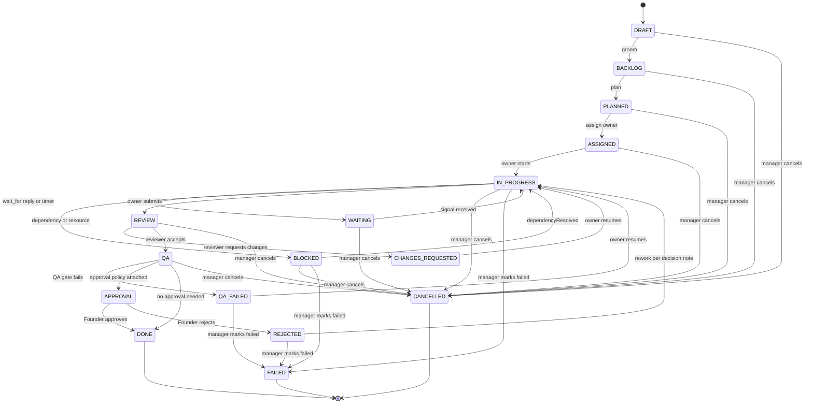

# 07 — TASK ENGINE (The Task OS)

Status: v1.0 — Implementation-ready

The Task Engine is the persistent work model of the platform: every unit of work — from a
Founder-level goal down to a 20-minute subtask — is a row in one `tasks` table, moved through one
canonical state machine, connected by a dependency DAG, and executed by exactly one
`agentTaskWorkflow` per active assignment (see 08-AGENT-RUNTIME.md). This document is the
authoritative spec for the schema, the state machine, the delegation engine, capacity, scheduling,
and the result contract. Events emitted here are cataloged in 10-EVENT-ARCHITECTURE.md.

---

## 1. The `tasks` table (canonical column spec)

One table for the whole hierarchy (per `_DECISIONS` §7). Drizzle schema lives in
`packages/db/src/schema/tasks.ts`.

| Column | Type | Null | Default | Notes |
|---|---|---|---|---|
| `id` | `uuid` (UUIDv7) | no | app-generated | Primary key, time-ordered |
| `company_id` | `uuid` FK → `companies` | no | — | Tenant key; every query filtered (see `_DECISIONS` §4) |
| `project_id` | `uuid` FK → `projects` | yes | — | Null for company-level goals not tied to a project |
| `number` | `bigint` | no | per-company sequence | Human-readable `TASK-81`; allocated from `company_counters` row under tx lock |
| `kind` | `task_kind` enum | no | — | `goal \| initiative \| epic \| task \| subtask` |
| `parent_id` | `uuid` FK → `tasks.id` | yes | — | Hierarchy edge; null only for `goal` (or orphan `task` created ad hoc) |
| `title` | `text` | no | — | ≤ 200 chars, enforced in Zod contract |
| `objective` | `text` | no | — | What "done" means in prose; shown verbatim in Working Set |
| `context` | `jsonb` | no | `'{}'` | Free-form structured context (links, constraints, intake refs) |
| `creator_agent_id` | `uuid` FK → `agents` | yes | — | NULL = created by the Founder |
| `owner_agent_id` | `uuid` FK → `agents` | yes | — | Current assignee; null until ASSIGNED |
| `org_unit_id` | `uuid` FK → `org_units` | yes | — | Owning department/team |
| `priority` | `task_priority` enum | no | `'P2'` | `P0 \| P1 \| P2 \| P3` |
| `status` | `task_status` enum | no | `'DRAFT'` | See §4 state machine |
| `success_criteria` | `text[]` | no | `'{}'` | Checked in the result contract (§10) |
| `risk` | `task_risk` enum | no | `'low'` | `low \| medium \| high \| critical`; feeds policy engine |
| `budget_cents` | `bigint` | yes | — | Minor units; inherited pro-rata (§9); null = inherit-at-spend-time from nearest budgeted ancestor |
| `deadline` | `timestamptz` | yes | — | Wall-clock guard input (08-AGENT-RUNTIME.md §9b) |
| `approval_policy_id` | `uuid` FK → `approval_policies` | yes | — | Non-null ⇒ QA→APPROVAL instead of QA→DONE |
| `result` | `jsonb` | yes | — | Result contract (§10); set on DONE/FAILED |
| `delegation_depth` | `smallint` | no | `0` | `[WRITER-DECISION]` Materialized depth (goal=0); CHECK `delegation_depth <= 5` |
| `reassignment_count` | `smallint` | no | `0` | `[WRITER-DECISION]` Incremented on owner change; CHECK `<= 3` enforced in domain layer with manager override path (§8) |
| `blocked_reason` | `jsonb` | yes | — | `[WRITER-DECISION]` `{kind: 'dependency'\|'help'\|'approval'\|'resource', ref, note}`; set on BLOCKED/WAITING |
| `assigned_at` / `started_at` / `completed_at` | `timestamptz` | yes | — | `[WRITER-DECISION]` Lifecycle timestamps for reporting; set by state-machine service |
| `created_at` / `updated_at` | `timestamptz` | no | `now()` | — |

Indexes: `(company_id, status, priority, deadline)` for scheduling (§7); `(company_id, owner_agent_id, status)`
for WIP counting; `(company_id, project_id)`; `(parent_id)`; unique `(company_id, number)`.

Spend is **not** a column: remaining budget = `budget_cents − SUM(cost_entries.amount_cents WHERE task_id ∈ subtree)`,
computed by `getTaskSpendActivity` against the `cost_entries` rollups (`_DECISIONS` §18). This avoids
double-write drift between costs and tasks.

## 2. Kind hierarchy

```
GOAL (Founder/CEO intent, quarters)
└── INITIATIVE (executive-owned program, weeks–months)
    └── EPIC (lead/manager-owned deliverable, 1–3 weeks)
        └── TASK (single-agent unit, hours–days)
            └── SUBTASK (single-agent step, minutes–hours)
```

Structural rules (enforced in `packages/domain/task/hierarchy.ts`, pure function, unit-tested):

- Parent kind must be strictly one level higher (`subtask`'s parent is a `task`, `task`'s parent
  an `epic`, etc.) — no level-skipping. What IS allowed: a `task` created without a full chain
  above it (`parent_id = null`, e.g. ad-hoc maintenance work filed by the Architecture Guardian);
  its `delegation_depth` starts at 0. `[WRITER-DECISION]`
- `delegation_depth` = parent depth + 1 (root = 0). Max 5 total levels; the CHECK plus the runtime
  guard (08-AGENT-RUNTIME.md §9f) both enforce it — a `delegate_task`/`create_task` action that
  would exceed depth 5 is rejected with a structured error the agent sees in its next step.
- `goal` and `initiative` never enter IN_PROGRESS by an individual contributor: they are containers;
  their status is **derived-but-persisted** — a nightly job plus child-completion triggers move a
  container to DONE when all children are terminal-successful, FAILED if any critical-path child
  FAILED without replacement. `[WRITER-DECISION]`

## 3. Dependency DAG

```sql
CREATE TABLE task_dependencies (
  id            uuid PRIMARY KEY,            -- uuidv7
  company_id    uuid NOT NULL REFERENCES companies(id),
  task_id       uuid NOT NULL REFERENCES tasks(id),
  depends_on_task_id uuid NOT NULL REFERENCES tasks(id),
  kind          text NOT NULL DEFAULT 'blocks',   -- only 'blocks' in MVP
  created_at    timestamptz NOT NULL DEFAULT now(),
  UNIQUE (task_id, depends_on_task_id),
  CHECK (task_id <> depends_on_task_id)
);
```

- **Cycle check on write:** inside the same transaction that inserts the edge, run a recursive CTE
  from `depends_on_task_id` following outgoing `blocks` edges; if `task_id` is reached, abort with
  `TASK_DEPENDENCY_CYCLE`. Company-scoped, bounded by `WITH RECURSIVE ... LIMIT 10000`. Same pattern
  as the `reports_to` forest check (`_DECISIONS` §5).
- A task cannot leave BLOCKED (dependency kind) while any `blocks` predecessor is non-terminal.
  When a predecessor reaches DONE, the state-machine service emits `task.dependency.resolved` and
  signals `dependencyResolved` into every waiting dependent workflow (08-AGENT-RUNTIME.md §5).
- Cross-project dependencies are allowed within a company; cross-company never (tenancy).

## 4. Task state machine

Canonical states and transitions from `_DECISIONS` §7. Implemented as a pure transition table in
`packages/domain/task/state-machine.ts`; the only writer is `TaskStateService` in `apps/server`,
which (in one transaction) validates the transition + permission, updates the row, and appends
`task.status.changed` to the outbox.



Notes:

- WAITING = voluntarily paused by the owner's `wait_for` action (reply/timer/approval);
  BLOCKED = involuntarily stopped (unmet dependency, missing resource, unresolved help).
- REJECTED and QA_FAILED and CHANGES_REQUESTED are *rework* states: they exist so the reason for
  rework is queryable, and each carries the verdict payload in `blocked_reason`.
- FAILED is never entered automatically by guards alone; guards force `request_help`/escalation
  first (08-AGENT-RUNTIME.md §9). Only manager-or-above (or the Founder) declares FAILED.

## 5. Transition permission matrix

Actor classes: **Owner** (current `owner_agent_id`), **Reviewer** (different agent holding
`reviewer` capability for the org unit), **QA** (agent with `qa` capability), **Manager+** (any
agent on the owner's upward `reports_to` chain, or an executive of the owning unit), **Approval
Engine** (system, acting on Founder verdict), **Founder**, **System** (guards, dependency resolver).

| Transition | Owner | Reviewer | QA | Manager+ | Approval Engine | Founder | System |
|---|---|---|---|---|---|---|---|
| DRAFT→BACKLOG | creator | — | — | ✔ | — | ✔ | — |
| BACKLOG→PLANNED | — | — | — | ✔ | — | ✔ | — |
| PLANNED→ASSIGNED | — | — | — | ✔ (only) | — | ✔ | — |
| ASSIGNED→IN_PROGRESS | ✔ | — | — | — | — | — | ✔ (workflow start) |
| IN_PROGRESS→WAITING / WAITING→IN_PROGRESS | ✔ | — | — | — | — | — | ✔ (signal) |
| IN_PROGRESS→BLOCKED / BLOCKED→IN_PROGRESS | ✔ | — | — | ✔ | — | — | ✔ (dep resolver) |
| IN_PROGRESS→REVIEW | ✔ (only) | — | — | — | — | — | — |
| REVIEW→CHANGES_REQUESTED | — | ✔ (must be ≠ owner) | — | — | — | — | — |
| REVIEW→QA | — | ✔ (must be ≠ owner) | — | — | — | — | — |
| QA→QA_FAILED / QA→APPROVAL / QA→DONE | — | — | ✔ (≠ owner) | — | — | — | ✔ (test gate) |
| QA_FAILED→IN_PROGRESS | ✔ | — | — | ✔ | — | — | — |
| CHANGES_REQUESTED→IN_PROGRESS | ✔ | — | — | ✔ | — | — | — |
| APPROVAL→DONE / APPROVAL→REJECTED | — | — | — | — | ✔ (only) | via engine | — |
| REJECTED→IN_PROGRESS | ✔ | — | — | ✔ | — | — | — |
| any→CANCELLED | — | — | — | ✔ (only) | — | ✔ | — |
| →FAILED | — | — | — | ✔ (only) | — | ✔ | — |

"No developer approves their own work" is structural: the REVIEW→* and QA→* rows require an actor
different from `owner_agent_id`; the domain function receives both IDs and refuses equality.

### 5.7 Founder directive — one request, the same legal transitions

Giving the company work took **five operations**: create a goal task, DRAFT→BACKLOG,
BACKLOG→PLANNED, find the CEO in a flat list of every agent, assign. Step four was the wall — the
`topExecutive` resolver already existed (intake routing and the executive report both use it) but was
**exposed on no API route**, so no screen could say who the top of the company was. The Founder could
not find where to hand over new work, which is a fair verdict on the flow rather than on the Founder.

- `GET /companies/:id/tasks/top-executive` → `{ agentId, name, positionTitle }`. Single source:
  `ProjectsService.topExecutive`, extended to carry the title (the join was already there) because a
  Founder-facing surface has to say *what* this person is, not only who.
- `POST /companies/:id/directives` → `{ title, objective, priority, successCriteria }`. The server
  runs the same **legal** sequence in order: create the goal, groom it through BACKLOG and PLANNED,
  assign it to the top executive (which starts their loop per 09 §4).

**This is not a shortcut.** The §2 state machine and the §5 permission matrix apply unchanged, every
step still emits its own event, and the resulting history is byte-for-byte what the manual path
produces — verified on the live stack: `task.created → DRAFT→BACKLOG → BACKLOG→PLANNED →
channel.created → PLANNED→ASSIGNED → agent.task.assigned → agent.task.started`. The only thing that
shrank is the Founder's click count.

The office surfaces it twice (24 §6.4): a header button naming the executive, and the CEO's avatar
marked in the scene with a gold crown and ring so the Founder can find the person before clicking.

### 5.6 Board archive — hiding, never deleting

A closed task keeps its board card forever, and a busy company drowns in them: the live floor
reached **32 CANCELLED against 3 DONE**, at which point the board stopped answering "what is
happening" and answered "what once happened" instead. Two mechanisms fix that without a delete
path.

- **`tasks.archived_at`** — the Founder removes a card from the board; the row, its events, its
  steps, its artifacts and every memory derived from it stay exactly where they are (INV-11 is
  append-only, and a deleted task would orphan the causal chain those records point at). Setting
  the column back to NULL restores the card. **Founder only** — agents must not be able to sweep
  their own traces off the board.
- **Automatic fade** — a task whose `closed_at` is older than `TERMINAL_FADE_DAYS` (7) leaves the
  default board on its own. It is a *query window*, not a sweep job: nothing is written, so the
  boundary moves with time and can never desynchronise from the data.

`GET /tasks?include=` selects the window: `active` (default — not archived, and open or closed
within the window), `archived` (the other side of that same line), `all` (audit/export).

**Archive is not a state.** The 16-state machine of §2 is untouched and no transition is
recorded, because nothing about the work changed — only what the Founder wants to look at. It is
therefore also not in the permission matrix above; the route enforces the Founder check directly.

Decomposition is not a special subsystem — it is a manager agent's `agentTaskWorkflow` emitting a
sequence of **AgentActions** (`create_task` then `delegate_task`, 08-AGENT-RUNTIME.md §4):

1. Manager's Working Set includes the parent task, team roster with current WIP/skills, and
   relevant memories (prior decompositions, procedures).
2. LLM proposes child tasks; each `create_task` action is executed by `createTaskActivity`
   (validates hierarchy §2, depth ≤ 5, allocates number, splits budget §9, writes row + outbox
   `task.created`).
3. Each `delegate_task(taskId, toAgentId)` runs `delegateTaskActivity`, which performs the
   **capacity check** (§6.1). On pass: PLANNED→ASSIGNED (manager permission), emit
   `agent.task.assigned`, and — if the assignee is idle and the task is unblocked — start
   `agentTaskWorkflow(assignee, task)` (09-WORKFLOW-ENGINE.md §5).
4. On capacity failure the activity returns `{ok:false, reason:'WIP_LIMIT', candidates:[...]}` with
   alternative team members and their load — the manager's next step re-plans (reassign, queue as
   PLANNED, or negotiate cross-team via `request_help`).

Delegation follows reporting lines: an agent may delegate only to agents it `manages`/`leads`
(direct or transitively within its unit) unless it holds the `cross_team_delegation` grant
(executives). CEO-level agents delegate to executives, never to individual contributors — enforced
as a policy rule, not a prompt suggestion.

### 6.1 Capacity model (WIP limits)

`[WRITER-DECISION]` Defaults, all configurable per company:

- **Per agent:** `wip_limit` on `positions` (default: IC 2, lead 3, manager 5, executive 8 — counts
  tasks in `{IN_PROGRESS, REVIEW, CHANGES_REQUESTED, QA_FAILED, REJECTED}` where agent is owner)
  plus an **assigned queue cap** of 5 (ASSIGNED but not started).
- **Per team (org_unit):** `wip_limit` on `org_units`, default `2 × active member count`; counts
  all member-owned active tasks. Prevents a manager flooding one team while another idles.
- Capacity check = both limits, computed in one SQL query with the `(company_id, owner_agent_id,
  status)` index; evaluated inside `delegateTaskActivity` in the same transaction as the
  assignment (no TOCTOU).

## 7. Priority scheduling (what an idle agent picks)

When an agent becomes idle (workflow completed) or its inbox workflow decides to act
(08-AGENT-RUNTIME.md §7), the **Task Scheduler** module (`apps/server/modules/tasks/scheduler.ts`)
answers "next task for agent A":

```sql
SELECT * FROM tasks
WHERE company_id = $1 AND owner_agent_id = $2 AND status = 'ASSIGNED'
  AND NOT EXISTS (unresolved blocking dependency)
ORDER BY priority ASC,               -- P0 < P1 < P2 < P3 (enum order)
         deadline ASC NULLS LAST,
         created_at ASC
LIMIT 1;
```

Rules: pull-based (agents pick from their own assigned queue; nothing self-assigns from other
queues in MVP); P0 preempts nothing already IN_PROGRESS automatically — instead the scheduler
notifies the agent's manager, who may issue a `managerDirective` signal to pause/re-prioritize.
Starvation guard: a task ASSIGNED > 48h (P2/P3) or > 4h (P0/P1) without start emits
`task.deadline.missed`-precursor notification to the manager. `[WRITER-DECISION]` (thresholds).

## 8. Blocker resolution & reassignment limits

**Blocker flow:** owner hits an obstacle → resolution ladder from the brief (own knowledge → memory
→ peers → lead → manager) expressed as actions: retry with memory retrieval → `request_help`
(creates help_request message, 11-COMMUNICATION-SYSTEM.md §6) → task WAITING. If unresolved after
the `wait_for` timeout (default 2h `[WRITER-DECISION]`) → BLOCKED + escalation one level up the
`reports_to` chain (`agent.escalated`). Managers resolve by: answering, adding a dependency,
reassigning, re-scoping, or cancelling.

**Reassignment limit (max 3):** `reassignment_count` increments whenever `owner_agent_id` changes
after first assignment. The 4th attempt is refused by the domain layer; the task is auto-flagged
`needs_manager_intervention`, a P1 review task is created for the manager, and only a Manager+
actor with an explicit `force_reassign` override (audited) can move it again. Prevents hot-potato.

**Delegation depth (max 5):** see §2; both statically CHECK-ed and guarded at runtime (guard f).

## 9. Budget inheritance (pro-rata)

When a parent with `budget_cents = B` is decomposed into children with estimated weights
`w1..wn` (the manager's `create_task` payload includes `estimated_effort` 1–13 fibonacci
`[WRITER-DECISION]`), each child gets `floor(B × 0.8 × wi / Σw)`; 20% stays reserved at the parent
for review/coordination/rework. `[WRITER-DECISION]` (80/20 split). Children created later draw from
the parent's remaining reserve. A child with explicit `budget_cents = null` spends against the
nearest budgeted ancestor. Overspend attempts are stopped by guard (a) in the step loop and by the
Tool Gateway cost check — spend is checked at both planes.

## 10. Success criteria & result contract

`success_criteria: text[]` is written at creation (delegators must supply ≥1 criterion for
`task`/`subtask`; contract-enforced). On `complete_task`, the agent must produce the **result
contract** stored in `tasks.result`:

```ts
// packages/contracts/src/task-result.ts
export const TaskResult = z.object({
  summary: z.string().min(1).max(4000),          // markdown, what was done
  criteria: z.array(z.object({
    criterion: z.string(),                        // echoed from success_criteria
    met: z.boolean(),
    evidence: z.string(),                         // link/ref/explanation
  })),
  artifactIds: z.array(z.string().uuid()),        // §11
  metrics: z.record(z.string(), z.number()).optional(), // e.g. tests_passed, coverage
  followUps: z.array(z.string()).optional(),      // suggested new tasks
  cost: z.object({ tokensIn: z.number(), tokensOut: z.number(), cents: z.number() }),
});
```

A `complete_task` with any `met:false` criterion is refused by `completeTaskActivity` unless the
reviewer/manager already granted a scope reduction (recorded as a `record_decision` artifact).
The result feeds review (reviewer sees criteria vs evidence), memory consolidation
(12-MEMORY-ARCHITECTURE.md), and skill evidence (`_DECISIONS` §11).

## 11. Artifacts linkage

`[WRITER-DECISION]` Canonical `artifacts` table (referenced by tasks, reviews, memories, approvals):

```sql
CREATE TABLE artifacts (
  id uuid PRIMARY KEY, company_id uuid NOT NULL,
  project_id uuid, task_id uuid,
  kind text NOT NULL,        -- 'code_diff'|'document'|'report'|'test_run'|'log'|'media'|'decision'
  title text NOT NULL,
  uri text NOT NULL,         -- repo ref (branch@sha), /data path, or inline: pointer
  content_hash text,         -- sha256 for integrity/dedupe
  meta jsonb NOT NULL DEFAULT '{}',
  created_by_agent_id uuid, created_at timestamptz NOT NULL DEFAULT now()
);
```

Tasks link artifacts via `result.artifactIds` and reviews via `reviews.artifact_id` (the PR
entity). Memory evidence rows point at artifacts by id (`memory_evidence.kind='artifact'`).

## 12. Sequence: Engineering Manager decomposes an epic

```mermaid
sequenceDiagram
    autonumber
    participant EM as EM agentTaskWorkflow (epic TASK-40)
    participant ACT as agent-worker activities
    participant DB as Postgres (tasks + outbox)
    participant T as Temporal
    participant D1 as Dev A agentTaskWorkflow
    participant D2 as Dev B agentTaskWorkflow

    EM->>ACT: buildWorkingSetActivity (epic, roster+WIP, memories)
    ACT-->>EM: working set
    EM->>ACT: callModelActivity (purpose "reasoning")
    ACT-->>EM: AgentAction create_task ("API endpoint", est 5)
    EM->>ACT: createTaskActivity (idempotency key = step id)
    ACT->>DB: insert task TASK-41 + outbox "task.created" (one tx)
    EM->>ACT: createTaskActivity ("UI form", est 3) → TASK-42
    EM->>ACT: createTaskActivity ("integration tests", est 2) → TASK-43
    Note over EM: next steps parse delegate_task actions
    EM->>ACT: delegateTaskActivity (TASK-41 → Dev A)
    ACT->>DB: capacity check (Dev A WIP 1 of 2) OK, ASSIGNED + outbox "agent.task.assigned"
    ACT->>T: startWorkflow agentTaskWorkflow (DevA, TASK-41)
    T-->>D1: workflow started ("agent.task.started")
    EM->>ACT: delegateTaskActivity (TASK-42 → Dev B)
    ACT->>DB: capacity check (Dev B WIP 2 of 2) FAIL
    ACT-->>EM: ok false, reason WIP_LIMIT, candidates [Dev C]
    EM->>ACT: delegateTaskActivity (TASK-42 → Dev C) → OK, workflow started
    EM->>ACT: executeActionActivity (wait_for dependency TASK-41..43)
    Note over EM: epic WAITING; resumes on dependencyResolved signals,<br/>then moves epic to REVIEW
    T-->>D2: (Dev C shown as D2) begins step loop in isolated workspace
```

## 13. Cross-references

- Runtime execution of every action above: 08-AGENT-RUNTIME.md.
- Workflow lifecycle, queues, crash recovery: 09-WORKFLOW-ENGINE.md.
- `task.*` event payloads: 10-EVENT-ARCHITECTURE.md §8.
- Help/review/escalation messaging: 11-COMMUNICATION-SYSTEM.md.
- Task completion → memory candidates: 12-MEMORY-ARCHITECTURE.md.
