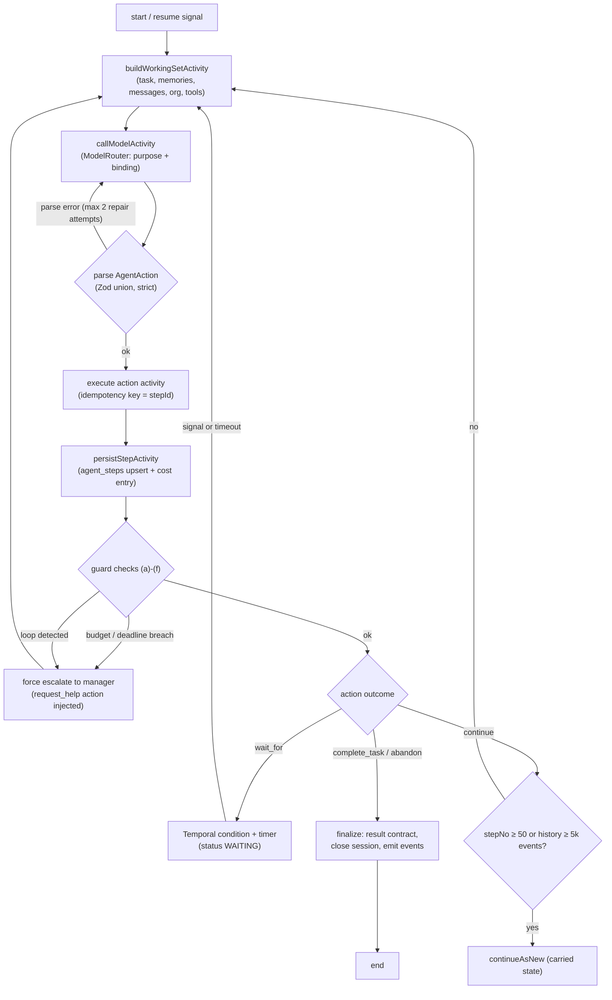
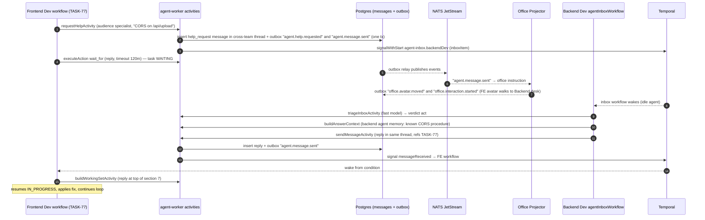

# 08 — AGENT RUNTIME (agentTaskWorkflow)

Status: v1.0 — Implementation-ready

This is the heart of the system: how a persistent agent employee actually works. There is no agent
framework (ADR-004) — the loop is our own Temporal workflow, `agentTaskWorkflow`, one execution per
active task assignment (`_DECISIONS` §8). The employee's identity lives in Postgres; workflows are
their working hours. Idle agents run **no** workflow; incoming messages start a cheap
`agentInboxWorkflow` (§7). Temporal deployment/queues/versioning: 09-WORKFLOW-ENGINE.md. Events:
10-EVENT-ARCHITECTURE.md. Task semantics: 07-TASK-ENGINE.md.

---

## 1. Workflow identity & inputs

```ts
// workers/agent-worker/src/workflows/agent-task.workflow.ts
export interface AgentTaskInput {
  companyId: string;          // uuidv7 — tenancy, mandatory everywhere
  agentId: string;            // the employee
  taskId: string;             // the assignment
  sessionId: string;          // pre-created agent_sessions row id
  attempt: number;            // 1..n across REJECTED/QA_FAILED rework cycles
  carriedState?: CarriedState; // set only by continueAsNew (§10)
}
```

- Workflow ID (deterministic, collision = already running): `agent-task.<taskId>.<agentId>` on task
  queue `agent-tasks`. Started by `delegateTaskActivity` or the scheduler (07-TASK-ENGINE.md §7).
- On start: `startAgentSessionActivity` marks `agent_sessions.status='running'`, emits
  `agent.task.started` and presence `agent.status.changed (WORKING)`.
- On any terminal path: `closeAgentSessionActivity` finalizes tokens/cost and emits session end.

## 2. The step loop

Each iteration ("step", numbered `stepNo` from carried state) is: **build Working Set → call LLM →
parse AgentAction → execute → persist step → guards**. All IO happens in activities; the workflow
function only orchestrates (determinism rules: 09-WORKFLOW-ENGINE.md §6).



Step identity: `stepId = uuidv5(namespace=sessionId, name=String(stepNo))` — deterministic in the
workflow, replay-safe, and the idempotency key for every effectful activity in that step (§11).

## 3. Activities of the loop (contracts)

| Activity | Queue | Purpose | Timeout / retries (§12) |
|---|---|---|---|
| `buildWorkingSetActivity` | `agent-tasks` | Assemble prompt inputs (§8) | 30s, std retry |
| `callModelActivity` | `agent-tasks` | ModelRouter call, returns raw text + usage | 120s, LLM retry class |
| `executeToolActivity` | `execution` | `use_tool` via Tool Gateway → sandbox-manager | per-tool (§12) |
| `sendMessageActivity` | `agent-tasks` | persist message + events + recipient signal (11-COMMUNICATION-SYSTEM.md §5) | 15s |
| `createTaskActivity` / `delegateTaskActivity` | `agent-tasks` | 07-TASK-ENGINE.md §6 | 15s |
| `updateTaskStatusActivity` | `agent-tasks` | state machine transition | 15s |
| `recordDecisionActivity` | `agent-tasks` | writes `decision` artifact + memory candidate | 15s |
| `requestReviewActivity` / `escalateActivity` / `requestHelpActivity` | `agent-tasks` | messaging + status moves | 15s |
| `completeTaskActivity` | `agent-tasks` | validates result contract, IN_PROGRESS→REVIEW or QA→DONE path | 30s |
| `persistStepActivity` | `agent-tasks` | upsert `agent_steps` + `cost_entries` + guard counters | 15s |
| `getGuardSnapshotActivity` | `agent-tasks` | budget remaining, daily spend, deadlines | 10s |

`agent_steps` table `[WRITER-DECISION]` (referenced by `_DECISIONS` §8, spec here):
`id (=stepId) PK, company_id, session_id, agent_id, task_id, step_no, working_set_digest,
model, prompt_tokens, completion_tokens, action_type, action_json, action_result_json,
guard_flags jsonb, latency_ms, cost_cents, created_at` — unique `(session_id, step_no)`.
Powers the Agent Monitor drill-down and the loop detector.

## 4. AgentAction — the strict Zod union (13 actions)

Canonical 12 actions from `_DECISIONS` §8 plus `think` `[WRITER-DECISION]` (a no-effect action that
persists structured reasoning to `agent_steps` — lets the model pause to plan without burning a
tool call; capped at 2 consecutive `think` steps by guard (d) normalization).

```ts
// packages/domain/src/agent/agent-action.ts  (no IO — pure schema)
import { z } from 'zod';

const Ref = z.object({ kind: z.enum(['task','message','approval','artifact','review']), id: z.string().uuid() });

export const AgentAction = z.discriminatedUnion('type', [
  z.object({ type: z.literal('use_tool'),
    tool: z.string(),                       // must exist in packages/tools registry
    input: z.unknown(),                     // validated against the tool's own Zod input schema
    reason: z.string().max(500) }),
  z.object({ type: z.literal('send_message'),
    channelId: z.string().uuid(),
    kind: z.enum(['text','help_request','review_request','escalation','status']),
    body: z.string().min(1).max(8000),
    mentions: z.array(z.string().uuid()).default([]),
    refs: z.array(Ref).default([]) }),
  z.object({ type: z.literal('create_task'),
    kind: z.enum(['initiative','epic','task','subtask']),
    parentTaskId: z.string().uuid(),
    title: z.string().max(200), objective: z.string(),
    successCriteria: z.array(z.string()).min(1),
    priority: z.enum(['P0','P1','P2','P3']),
    estimatedEffort: z.number().int().min(1).max(13),
    risk: z.enum(['low','medium','high','critical']).default('low'),
    orgUnitId: z.string().uuid().optional(),
    deadline: z.string().datetime().optional() }),
  z.object({ type: z.literal('delegate_task'),
    taskId: z.string().uuid(), toAgentId: z.string().uuid(),
    note: z.string().max(1000) }),
  z.object({ type: z.literal('request_review'),
    taskId: z.string().uuid(), artifactId: z.string().uuid(),
    reviewerHint: z.string().uuid().optional(),   // lead may override
    summary: z.string().max(2000) }),
  z.object({ type: z.literal('request_help'),
    topic: z.string().max(200), body: z.string().max(4000),
    audience: z.enum(['peer','team','lead','manager','specialist']),
    targetAgentId: z.string().uuid().optional() }),
  z.object({ type: z.literal('escalate'),
    reason: z.string().max(2000),
    attempted: z.array(z.string()),               // resolution ladder evidence
    options: z.array(z.object({ option: z.string(), risk: z.string(), cost: z.string() })),
    recommendation: z.string() }),
  z.object({ type: z.literal('update_task_status'),
    taskId: z.string().uuid(),
    to: z.enum(['IN_PROGRESS','WAITING','BLOCKED','REVIEW']),
    note: z.string().max(1000) }),
  z.object({ type: z.literal('record_decision'),
    title: z.string().max(200), decision: z.string(),
    alternatives: z.array(z.string()), consequences: z.string() }),
  z.object({ type: z.literal('complete_task'),
    result: TaskResult }),                        // 07-TASK-ENGINE.md §10
  z.object({ type: z.literal('wait_for'),
    what: z.enum(['dependency','reply','review','approval','timer']),
    refId: z.string().uuid().optional(),
    timeoutMinutes: z.number().int().min(1).max(1440).default(120) }),
  z.object({ type: z.literal('abandon'),
    reason: z.string().max(2000) }),              // → manager review, never silent FAILED
  z.object({ type: z.literal('think'),           // [WRITER-DECISION] 13th action
    thought: z.string().max(4000),
    plan: z.array(z.string()).optional() }),
]);
export type AgentAction = z.infer<typeof AgentAction>;
```

Parsing: `callModelActivity` requests structured output (JSON mode / tool-call channel per
provider). The workflow parses in-workflow (pure Zod, deterministic). On failure: up to 2 repair
retries with the Zod error appended to the prompt; a 3rd failure counts as a failed step and guard
(c) accounting continues — persistent unparseable output eventually forces `request_help`.

## 5. Signals and handlers

All signals carry `{signalId: uuid, sentAt}` for dedupe (workflow keeps a bounded seen-set in
carried state).

| Signal | Payload | Handler behavior |
|---|---|---|
| `messageReceived` | `{messageId, channelId, senderAgentId, kind, preview}` | Append to `pendingMessages` buffer. If waiting on `reply` for this channel/thread → wake. Otherwise the buffer is injected into the next Working Set (agent sees it next step; no preemption mid-activity). |
| `dependencyResolved` | `{dependsOnTaskId, result: 'DONE'\|'FAILED'\|'CANCELLED'}` | Remove from awaited set; if waiting on `dependency` and set empty → wake, move task BLOCKED→IN_PROGRESS. FAILED dependency wakes with a `dependency_failed` note (agent must re-plan or escalate). |
| `reviewVerdict` | `{reviewId, verdict: 'accepted'\|'changes_requested', notes}` | Wake if waiting on `review`; verdict placed at top of next Working Set; task already moved by reviewer's workflow. |
| `approvalVerdict` | `{approvalId, verdict: 'approved'\|'rejected'\|'needs_review', note}` | Wake if waiting on `approval`; on rejected, decision note becomes rework directive. |
| `managerDirective` | `{directive: 'pause'\|'resume'\|'reprioritize'\|'rescope'\|'handoff', note}` | `pause` → workflow idles in WAITING until `resume`; `rescope` note injected; `handoff` → graceful wrap-up step then workflow completes with status ASSIGNED for the new owner. |
| `cancel` | `{by, reason}` | Run `cancellationCleanup` (release workspace locks, post status message, close session), task → CANCELLED by caller, workflow ends. Uses Temporal cancellation scope so in-flight activities are cancelled/heartbeat-aborted. |

Signals-vs-updates rationale: 09-WORKFLOW-ENGINE.md §9 (signals chosen; no caller needs a
synchronous return value from a running agent).

## 6. Waiting semantics (`wait_for`)

`wait_for` maps to Temporal primitives — never polling:

```ts
case 'wait_for': {
  await updateTaskStatusIfNeeded('WAITING' /* or BLOCKED for dependency */);
  emitPresence('WAITING');
  const woken = await condition(() => wakeConditionMet(action), action.timeoutMinutes * 60_000);
  if (!woken) handleWaitTimeout(action);   // §6.1
}
```

- `dependency` → wakes on `dependencyResolved` draining the awaited set (task BLOCKED meanwhile).
- `reply` → wakes on `messageReceived` matching channel/thread.
- `review` / `approval` → wake on respective verdict signals.
- `timer` → pure Temporal timer (used for scheduled re-checks, e.g. CI run polling is NOT done this
  way — CI completion arrives as an event-driven signal from the execution plane).

**Timeout ladder (§6.1):** first timeout → one nudge (`send_message` status ping / re-request);
second timeout → forced `request_help` to lead; third → `escalate` one level up `reports_to`
(brief rule 2.1 resolution order). Timeout count carried per wait target.

## 7. `agentInboxWorkflow` (idle agents)

Idle employees must be reachable without paying for a full loop. Workflow ID:
`agent-inbox.<agentId>` (one per agent, started on demand via `signalWithStart`, task queue
`agent-tasks`).

- Buffers incoming `inboxItem` signals (messages, mentions, help requests).
- Debounce 5s, then `triageInboxActivity`: **cheap model** (ModelRouter purpose `fast`) classifies
  each item → `act | queue | ignore`:
  - `act`: reply directly (single `sendMessageActivity`, e.g. answering a factual help request from
    memory) — inbox workflow may execute at most 3 consecutive act-steps `[WRITER-DECISION]`,
    anything larger becomes a task (`create_task` on own queue, self-assigned if within autonomy).
  - `queue`: create/attach a task in the agent's ASSIGNED queue (07-TASK-ENGINE.md §7).
  - `ignore`: FYI/broadcast — mark read.
- Completes after 10 minutes idle (`continueAsNew` if long-lived and history grows). Cost of an
  idle agent ≈ zero; cost of a triage ≈ one small-model call.

## 8. Working Set construction & prompt assembly

`buildWorkingSetActivity` produces a deterministic, budgeted context (retrieval scoring per
`_DECISIONS` §10; details in 12-MEMORY-ARCHITECTURE.md). Token budgets per section
(defaults, company-configurable; total target ≤ 12k input tokens `[WRITER-DECISION]`):

| # | Section (assembly order) | Source | Token budget |
|---|---|---|---|
| 1 | System: role, persona, seniority, autonomy, non-negotiable rules | `agents`, `positions` | 600 |
| 2 | Org context: team, manager, escalation chain, collaborators | `org_edges` walk | 400 |
| 3 | Task card: title, objective, success criteria, priority, deadline, budget remaining, parent chain | `tasks` | 800 |
| 4 | Company memory (semantic top-k, re-ranked) | `memories` scope=company | 1,000 |
| 5 | Project memory (+ recent decisions/ADRs structured query) | scope=project | 2,500 |
| 6 | Agent memory (procedures, failures, preferences) | scope=agent | 1,500 |
| 7 | Recent thread: last messages in task_thread + pending signal buffer | `messages` | 1,200 |
| 8 | Recent steps: last 5 step summaries (action + result digest) | `agent_steps` | 800 |
| 9 | Tool list: name, description, input schema digest, risk class — only tools the agent is granted | `packages/tools` × `tool_permissions` | 1,000 |
| 10 | Output instructions: AgentAction JSON contract + current constraints (guards state, e.g. "budget low") | static + guard snapshot | 400 |

External content (repo files, web fetches) enters only via tool results in section 8, wrapped in
provenance markers (`_DECISIONS` §20 S5). **No agent ever sees another agent's Working Set or any
shared global context** — cross-agent knowledge moves exclusively through messages and memory.

## 9. Runaway protection — the six guards

Evaluated in-workflow after every persisted step, using `getGuardSnapshotActivity` data (refreshed
each step) + carried counters. Enforcement is code, not prompt text.

| Guard | Threshold | Enforcement point & effect |
|---|---|---|
| (a) Task budget | remaining `budget_cents` ≤ est. next-step cost, or ≤ 0 | Post-step check + pre-check in Tool Gateway. Effect: inject forced `request_help` to manager with spend report; task WAITING. Manager may top up (budget re-allocation) or cancel. |
| (b) Wall-clock deadline | `now > deadline` (checked per step + a Temporal timer set at workflow start fires at deadline even mid-wait) | Forced status message + `escalate` to manager with progress summary; manager decides extend/rescope/reassign. |
| (c) Step cap | `stepNo ≥ 40` soft warn (injected into section 10), `≥ 50` hard | Hard: forced `request_help`; continueAsNew boundary is independent (§10) — the cap counts cumulative steps across continues via carried state. |
| (d) Loop detector | `hash(actionType + normalizedArgs)` equal ≥ 3 times within last 6 steps | Workflow-side ring buffer of hashes. Effect: forced `request_help` to manager, guard flag persisted on step, `agent.escalated` event. Normalization: lowercase, strip volatile fields (timestamps, uuids of new entities). |
| (e) Message ping-pong | > 8 alternating messages between same agent pair on same thread without any task-state change between them | Detected centrally in the message pipeline (11-COMMUNICATION-SYSTEM.md §9) — counter on `(channel_id, pair)` reset by `task.status.changed`. Effect: both workflows get `managerDirective(pause_thread)` note + manager notification message. |
| (f) Delegation depth | `create_task`/`delegate_task` that would make depth > 5 | Rejected in `createTaskActivity` (domain CHECK, 07-TASK-ENGINE.md §2); the structured error appears in the next Working Set; repeated attempts trip guard (d). |

**Company circuit breaker:** `budget.exceeded` (hard daily company/unit budget, `_DECISIONS` §18)
→ policy engine pauses all non-critical (priority > P1) agents via `managerDirective(pause)`
broadcast; approval-gated resume.

## 10. `continueAsNew` policy

Trigger: `stepNo % 50 === 0` OR `workflowInfo().historyLength > 5_000` OR
`historySize > 20 MB` `[WRITER-DECISION]`. Carried state (small, schema-versioned):

```ts
interface CarriedState {
  stepNo: number; guardCounters: GuardCounters;
  pendingMessages: InboxItem[];            // capped 50
  awaitedDependencies: string[]; waitTimeoutCounts: Record<string, number>;
  seenSignalIds: string[];                 // capped ring 200
  version: 1;
}
```

Signals delivered during transition are re-delivered by Temporal to the new run (signalWithStart
semantics); `seenSignalIds` dedupes. Nothing else is carried — task truth stays in Postgres.

## 11. Idempotency (exactly-once effects)

Temporal guarantees at-least-once activity execution; effects are made exactly-once at the DB:

- Every effectful activity takes `idempotencyKey = stepId` (plus a discriminator for multi-effect
  steps, e.g. `stepId:msg`).
- DB writes are upserts keyed by it: `agent_steps.id = stepId`; `messages.id`,
  `tasks.id` (created tasks), `cost_entries.id` = `uuidv5(stepId, effectName)`; outbox events carry
  the same id as `causation_id` so consumers dedupe too (10-EVENT-ARCHITECTURE.md §7).
- Tool executions: Tool Gateway stores `tool_invocations.idempotency_key` unique per company;
  a retried activity returns the recorded result instead of re-executing. R2/R3 tools additionally
  require the sandbox/integration adapter to honor the key (e.g. git push is naturally idempotent
  by commit SHA; external POSTs use provider idempotency headers where available).
- LLM calls are safe to retry (no external effect); the `llm_calls` row is keyed by
  `uuidv5(stepId,'llm')` so cost is not double-counted.

## 12. Timeouts, retries, heartbeats per activity class

| Class | startToClose | Heartbeat | Retry policy |
|---|---|---|---|
| LLM call (`callModelActivity`) | 120s | 30s (streaming progress) | 3 attempts, exponential backoff initial 2s, factor ~3, max 60s; retryable: timeout/429/5xx (router also fails over provider per `_DECISIONS` §17); non-retryable: 4xx auth/validation |
| Fast DB activities (task ops, messages, steps) | 15s | — | 5 attempts, 500ms → 10s |
| Working Set build | 30s | — | 3 attempts, 1s → 10s |
| Tool: R0 read (fs read, search, db inspect) | 60s | 15s | 3 attempts |
| Tool: terminal/test/build (execution queue) | per tool, default 600s, builds 1800s | 15s (PTY liveness) | 2 attempts; retry only on infra failure (container died), never on non-zero exit (that is a *result*) |
| Tool: git ops | 120s | 30s | 3 attempts (idempotent by SHA) |
| Tool: network/web fetch | 60s | — | 3 attempts |
| Tool: R2/R3 external effects | 120s | 30s | 1 attempt + idempotency key; failure surfaces to agent |

Heartbeats carry progress details (bytes streamed, current command) → visible in Agent Monitor.
Worker crash ⇒ heartbeat timeout ⇒ Temporal reschedules on another worker (see
09-WORKFLOW-ENGINE.md §8 disaster diagrams).

## 13. Cost accounting per step

`persistStepActivity` writes, in one transaction: the `agent_steps` upsert, one `cost_entries` row
per cost source of the step (`llm` from usage, `tool`/`compute` from gateway result), and updates
`agent_sessions.tokens/cost`. Guard (a) reads the task-subtree spend view; the cost-aggregator
consumer (10-EVENT-ARCHITECTURE.md §5) maintains daily rollups per `_DECISIONS` §18.

## 14. Sequence: developer asks another team for help



## 15. Cross-references

- Task states, capacity, scheduling: 07-TASK-ENGINE.md.
- Temporal queues, workers, replay/crash recovery, testing: 09-WORKFLOW-ENGINE.md.
- Event catalog (all events named here): 10-EVENT-ARCHITECTURE.md.
- Message pipeline, ping-pong counter, inbox delivery: 11-COMMUNICATION-SYSTEM.md.
- Retrieval scoring and consolidation feeding sections 4–6: 12-MEMORY-ARCHITECTURE.md.
