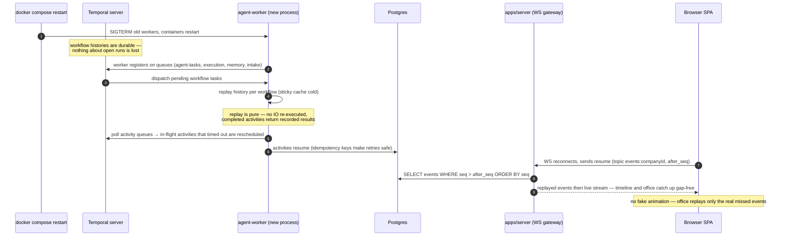
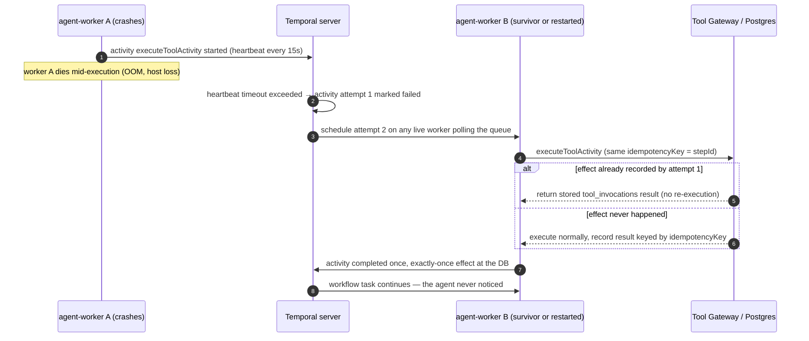

# 09 — WORKFLOW ENGINE (Temporal Architecture)

Status: v1.0 — Implementation-ready

Every long-lived behavior in the platform — agent work, memory consolidation, project intake,
reviews, pipelines — runs as a Temporal workflow. This document specifies why Temporal, how it is
deployed self-hosted, the namespace/queue/worker topology, the workflow inventory, determinism and
versioning rules, disaster behavior (with required sequence diagrams), schedules, and testing.
The workflows' domain logic is specified in 07-TASK-ENGINE.md and 08-AGENT-RUNTIME.md; events they
emit are in 10-EVENT-ARCHITECTURE.md.

---

## 1. Why Temporal (ADR-005 summary)

The brief's durability rule ("agent work survives app restart, host restart, worker crash, LLM
timeout, network outage — never HTTP → one LLM call → response") is exactly the problem class
Temporal solves: workflows are replayable event-sourced state machines; activities are retried
with policies; timers and signals are durable; long waits cost nothing.

Rejected alternatives (one line each, full text in ADR-005): custom Postgres state machine
(months of reinventing recovery/timers/signals), BullMQ (queues are not durable *workflows* — no
replay, no signals, no deterministic resume), n8n (visual automation, wrong grain for a code-owned
agent loop). Temporal self-hosted keeps the local-first promise: it is one compose service backed
by our existing Postgres instance.

## 2. Namespaces and task queues

- **One Temporal namespace per installation**: `acos` (default). Multi-company tenancy is enforced
  in our domain layer (`companyId` in every workflow input, repository-level filtering,
  `_DECISIONS` §4) — not by Temporal namespaces. Rationale: 1–10 companies per install share
  workers and capacity; namespace-per-company would multiply worker fleets for no isolation gain
  at this trust boundary (single Founder operates all companies). `[WRITER-DECISION]`
- Namespace retention: **7 days** (closed-workflow history kept for debugging; domain truth lives
  in Postgres, so short retention is safe).

Task queues (routing = which worker class executes):

| Queue | Consumed by | Carries |
|---|---|---|
| `agent-tasks` | `workers/agent-worker` | `agentTaskWorkflow`, `agentInboxWorkflow`, `reviewWorkflow`, all control-plane activities (LLM calls, DB ops, messaging) |
| `execution` | `workers/execution-worker` | Sandboxed tool activities: run command, git ops, tests, builds; (Phase 2) browser, media |
| `memory` | `workers/agent-worker` (separate worker instance in same package, own queue for isolation) | `memoryConsolidationWorkflow` + embedding/extraction activities |
| `intake` | `workers/agent-worker` | `projectIntakeWorkflow` + analysis orchestration activities (its sandbox activities still dispatch on `execution`) |

Separate queues give: independent rate/parallelism tuning (e.g. cap `execution` concurrency to
sandbox capacity), independent worker scale-out (compose scale, ADR-018), and blast-radius
isolation (a stuck execution fleet never starves message delivery).

## 3. Worker deployment

- **`workers/agent-worker`** (unprivileged container): registers workflows + control-plane
  activities on `agent-tasks`, `memory`, `intake`. Configuration:
  `maxConcurrentWorkflowTaskExecutions: 40`, `maxConcurrentActivityTaskExecutions: 64`,
  `maxCachedWorkflows: 200` (sticky cache for 5–30 concurrently active agents). `[WRITER-DECISION]`
- **`workers/execution-worker`** (unprivileged; talks only HTTP to `sandbox-manager`, never the
  Docker socket — invariant S1): registers activities on `execution`.
  `maxConcurrentActivityTaskExecutions: 16` (bounded by workspace container capacity).
- Both scale horizontally: `docker compose up --scale agent-worker=2` — Temporal load-balances by
  queue; no coordination needed. Workers are stateless; all state is Temporal history + Postgres.
- Worker identity string `hostname:pid` appears in Temporal UI for debugging.

## 4. Workflow inventory

| Workflow | Queue | Trigger | Input | Output / effect | Phase |
|---|---|---|---|---|---|
| `agentTaskWorkflow` | `agent-tasks` | task assignment (delegation/scheduler), rework re-entry | `AgentTaskInput` (08-AGENT-RUNTIME.md §1) | task driven to REVIEW/DONE/terminal; steps, events, costs | MVP |
| `agentInboxWorkflow` | `agent-tasks` | `signalWithStart` on message to idle agent | `{companyId, agentId}` + `inboxItem` signals | triage verdicts: replies, queued tasks, ignores | MVP |
| `memoryConsolidationWorkflow` | `memory` | every N significant events or task completion (memory-trigger consumer) | `{companyId, scopeHint, sourceEventIds[]}` | memories persisted/merged/contradiction-flagged (12-MEMORY-ARCHITECTURE.md) | MVP |
| `projectIntakeWorkflow` | `intake` | project import (`project.imported`) | `{companyId, projectId, sourceRef}` | Intake Report artifact + routed analysis tasks to CTO/architect/leads | MVP |
| `reviewWorkflow` | `agent-tasks` | `request_review` action | `{companyId, reviewId, taskId, reviewerAgentId}` | reviewer agent loop (bounded variant of agent loop) → `reviewVerdict` signal to owner, task REVIEW→{CHANGES_REQUESTED,QA} | MVP |
| `delegationWorkflow` | — | — | — | **Not built** `[WRITER-DECISION]`: delegation is `create_task`/`delegate_task` actions inside the manager's own `agentTaskWorkflow` (07-TASK-ENGINE.md §6); a separate workflow would duplicate the loop and split audit trails | — |
| `experimentWorkflow` | `agent-tasks` | experiment designed (Experiment Engine) | `{companyId, experimentId}` | baseline → running → analyzing → verdict + learning memory | Phase 2 |
| `reelsPipelineWorkflow` | `agent-tasks` (+ `execution` media activities) | marketing content plan approved | `{companyId, contentPlanId}` | staged content pipeline research→publish→analytics | Phase 2 |

Schedules (Temporal Schedules, not cron containers) — §9.

### 4.1 Worker registration (canonical shape)

```ts
// workers/agent-worker/src/main.ts
import { Worker, NativeConnection } from '@temporalio/worker';
import * as activities from './activities';

async function run() {
  const connection = await NativeConnection.connect({ address: env.TEMPORAL_ADDRESS }); // temporal:7233
  const agentWorker = await Worker.create({
    connection, namespace: 'acos', taskQueue: 'agent-tasks',
    workflowsPath: require.resolve('./workflows'),           // agentTask, agentInbox, review
    activities,                                              // LLM, DB, messaging activities
    maxConcurrentWorkflowTaskExecutions: 40,
    maxConcurrentActivityTaskExecutions: 64,
    maxCachedWorkflows: 200,
    shutdownGraceTime: '30s',                                // finish in-flight activities on SIGTERM
  });
  const memoryWorker = await Worker.create({
    connection, namespace: 'acos', taskQueue: 'memory',
    workflowsPath: require.resolve('./workflows/memory'),
    activities: memoryActivities,
    maxConcurrentActivityTaskExecutions: 8,                  // embedding/LLM extraction bounded
  });
  const intakeWorker = await Worker.create({
    connection, namespace: 'acos', taskQueue: 'intake',
    workflowsPath: require.resolve('./workflows/intake'),
    activities: intakeActivities,
    maxConcurrentActivityTaskExecutions: 4,
  });
  await Promise.all([agentWorker.run(), memoryWorker.run(), intakeWorker.run()]);
}
```

The execution-worker mirrors this with `taskQueue: 'execution'` and **no workflows registered**
(activities-only worker) — sandboxed tool activities are always children of workflows running on
`agent-tasks`/`intake`.

## 5. Workflow start paths

All workflow starts go through one module, `apps/server/modules/workflows/client.ts` (and its
worker-side twin) wrapping `WorkflowClient`, so ID conventions and dedupe live in one place:

- Deterministic workflow IDs: `agent-task.<taskId>.<agentId>`, `agent-inbox.<agentId>`,
  `review.<reviewId>`, `consolidation.<companyId>.<batchId>`, `intake.<projectId>`.
- `WorkflowIdReusePolicy: REJECT_DUPLICATE` for agent-task (double-start = bug surfaced), and
  `signalWithStart` for inbox workflows (race-free wake-or-start).

## 6. Determinism rules for workflow code

Enforced by the Temporal TS SDK sandbox + ESLint config (`@temporalio` rules) + code review:

1. **No IO in workflows.** No fetch, no DB, no fs, no Date.now()/Math.random() (use
   `workflow.now()` and deterministic uuidv5 from step ids, 08-AGENT-RUNTIME.md §2). All IO —
   Postgres, LLM, sandbox, NATS — lives in activities.
2. Workflow files import only from `@temporalio/workflow`, `packages/domain` (pure), and their own
   pure helpers. `packages/db`, `packages/llm`, Node built-ins are banned imports (eslint
   boundaries; the SDK sandbox would also throw at runtime).
3. Zod parsing of AgentAction *is* allowed in-workflow (pure, deterministic).
4. Any branching on config must read it from workflow input or an activity result, never from env.
5. Signals mutate workflow state only via handler functions defined with `setHandler`; handlers
   append to buffers, the main loop consumes (no work inside handlers).

## 7. Versioning strategy (in-flight upgrades)

Histories replay against current code, so changes to workflow logic must be gated:

- **Default mechanism:** `patched('acos-<change-id>')` for every behavioral change to a workflow
  that can have open executions (`agentTaskWorkflow` almost always does). Old runs replay the old
  branch; new runs take the new branch. `deprecatePatch` after all pre-change runs are closed
  (retention 7d ⇒ patch cleanup after ~2 weeks; agent-task runs are days-long at most).
- **Escape valve:** for sweeping rewrites, deploy as a new workflow type
  (`agentTaskWorkflowV2`) — new starts route to V2; V1 code stays until drained. Carried-state
  schema in `continueAsNew` is versioned (`version: 1`) so a continue can hop major versions at a
  clean boundary.
- Activity signatures are additive-only between releases (new optional fields); breaking activity
  changes ship as new activity names.
- CI runs **replay tests**: recorded histories (JSON fixtures from staging) replayed against HEAD
  (`Worker.runReplayHistories`) — a nondeterminism error fails the build (§10).

## 8. Self-hosted cluster & disaster behavior

Compose services (from `_DECISIONS` §1): `temporal` (auto-setup image, single node: frontend +
history + matching + worker service in one process — correct at our scale), `temporal-ui` (port
8233, behind the same reverse proxy, Founder-only), backed by **its own schemas** (`temporal`,
`temporal_visibility`) in the shared Postgres 16 instance. Namespace `acos` created by an init
job with 7-day retention. Backups: Temporal schemas are included in the standard pg_dump routine —
but domain truth never depends on them (worst case: histories lost ⇒ tasks re-driven from Postgres
state by a reconciliation job that restarts workflows for tasks stuck in active states
`[WRITER-DECISION]`).

```yaml
# infrastructure/docker/compose.yaml (excerpt)
temporal:
  image: temporalio/auto-setup:1.25         # pinned; upgraded deliberately with release notes review
  environment:
    - DB=postgres12                          # driver name; works against Postgres 16
    - POSTGRES_SEEDS=postgres
    - POSTGRES_USER=temporal
    - POSTGRES_PWD=${TEMPORAL_DB_PASSWORD}
    - DBNAME=temporal
    - VISIBILITY_DBNAME=temporal_visibility
    - DYNAMIC_CONFIG_FILE_PATH=/etc/temporal/dynamicconfig.yaml
  volumes:
    - ./temporal/dynamicconfig.yaml:/etc/temporal/dynamicconfig.yaml:ro
  depends_on: { postgres: { condition: service_healthy } }
  healthcheck:
    test: ["CMD", "tctl", "--address", "temporal:7233", "cluster", "health"]
    interval: 10s
    retries: 12

temporal-ui:
  image: temporalio/ui:2.31
  environment:
    - TEMPORAL_ADDRESS=temporal:7233
    - TEMPORAL_UI_PORT=8233

temporal-init:                               # one-shot: namespace + retention
  image: temporalio/admin-tools:1.25
  entrypoint: >
    sh -c "tctl --address temporal:7233 --namespace acos namespace register
           --retention 168h || true"
  depends_on: { temporal: { condition: service_healthy } }
```

Dynamic config overrides (file above) `[WRITER-DECISION]`: raise
`limit.historyCount.warn/error` to 40k/60k (agentTaskWorkflow continues-as-new far below this at
5k, headroom for pathological cases), keep default RPS limits (single-node scale).

### 8.0 Failure-mode matrix

| Failure | Detection | Recovery path | Data at risk |
|---|---|---|---|
| Full host restart | compose healthchecks | §8.1 — replay + WS resume | none |
| agent-worker crash | activity heartbeat timeout | §8.2 — retry on other worker + idempotency | none |
| execution-worker crash mid-test-run | heartbeat timeout (15s PTY liveness) | activity retried on fresh workspace exec; non-zero exit ≠ retry (result) | partial sandbox output (terminal log keeps what streamed) |
| Temporal server down | worker poll errors, server client errors | workers/clients reconnect with backoff; starts queue up in `apps/server` (workflow client retries); domain writes unaffected | none (histories durable in PG) |
| Postgres down | everything halts (by design) | compose restart; Temporal + domain resume together — single-database ops model is a feature | none (WAL) |
| NATS down | outbox relay publish errors | relay keeps rows unpublished, retries; consumers resume from stream cursor | none (outbox is truth) |
| LLM provider outage | 429/5xx | activity retry + ModelRouter provider failover chain (`_DECISIONS` §17) | none |

### 8.1 Application restart while agents are working



Key property: an agent that was WAITING on a 2-hour `wait_for` timer resumes with the timer
intact; an agent mid-LLM-call re-executes only that activity (attempt 2), and DB upserts keyed by
stepId prevent duplicate effects.

### 8.2 Agent worker crash and recovery



Other covered classes: LLM timeout (retry policy 08-AGENT-RUNTIME.md §12 + provider failover),
NATS outage (outbox relay retries; events table is truth — 10-EVENT-ARCHITECTURE.md §4), sandbox
container death (execution activity fails → retried on fresh container; worktree volume persists).

## 9. Schedules, and signals-vs-updates

**Temporal Schedules** (managed via `apps/server` admin module, visible in Temporal UI):

| Schedule | Spec | Action |
|---|---|---|
| `relationship-strength-nightly` | daily 03:00 (install TZ) | activity-only workflow recomputing `collaborates_with` strengths from comm/review events (`_DECISIONS` §5) |
| `budget-rollups-hourly` | hourly | refresh cost rollup materialized views; evaluate soft/hard budget breaches → `budget.exceeded` |
| `memory-maintenance-nightly` | daily 03:30 | expiry sweep (`expires_at`), promotion-rule evaluation (12-MEMORY-ARCHITECTURE.md) |
| `stuck-task-sweep` | every 30m | detects ASSIGNED-too-long / WAITING-past-SLA tasks → manager notifications (07-TASK-ENGINE.md §7–8) |

**Signals vs updates `[WRITER-DECISION]`:** we use **signals only** in MVP. Every producer of
`messageReceived`, `dependencyResolved`, verdicts, directives, `cancel` is fire-and-forget — the
caller's own transaction already recorded the domain fact; it needs no synchronous return from the
target workflow. Updates (synchronous, validated) would add coupling and block server request paths
on worker availability. Revisit only if a future UI needs "ask the running agent and wait".

## 9.1 Observability of the workflow engine

- Temporal SDK metrics (workflow task latency, activity failures, cache hit rate) exported via the
  OTel meter to Prometheus (optional compose profile, ADR-016); dashboards provisioned in
  `infrastructure/grafana`.
- Every workflow/activity is wrapped by an OTel interceptor propagating `traceparent` from the
  originating HTTP request or event → one trace spans "Founder posts objective → CEO workflow →
  ... → sandbox test run".
- Domain-level visibility (Agent Monitor) never reads Temporal APIs: `agent_sessions` +
  `agent_steps` + events are the product-facing truth; Temporal UI is an operator tool only. This
  keeps the UI working even against a wiped Temporal cluster.
- Custom search attributes registered at init: `companyId`, `agentId`, `taskId` (keyword) — lets
  operators filter the Temporal UI per tenant during incident response. `[WRITER-DECISION]`

## 10. Testing Temporal code

- **Unit (Vitest + `@temporalio/testing`):** `TestWorkflowEnvironment.createTimeSkipping()` —
  a 2-hour `wait_for` timeout test runs in milliseconds; guard timers (deadline guard b) tested by
  skipping to the deadline. Activities mocked per test via `MockActivityEnvironment` or worker
  stubs registered with fake implementations.
- **Integration (Testcontainers):** real Temporal (auto-setup image) + Postgres + NATS; runs the
  true `agentTaskWorkflow` with a stub ModelRouter (scripted AgentAction sequences) asserting:
  DB rows, outbox events, idempotency under injected activity failures (kill attempt 1 after
  effect committed → assert single row).
- **Replay tests:** history fixtures replayed on every CI run (§7) to catch nondeterminism.
- **Chaos smoke (nightly CI):** compose stack, start 5 agent workflows, `docker kill` a worker and
  restart NATS mid-run, assert all tasks reach terminal states and event seq is gap-free.

Example time-skipping test (canonical pattern for all guard/timer tests):

```ts
// workers/agent-worker/test/agent-task.deadline.test.ts
import { TestWorkflowEnvironment } from '@temporalio/testing';

it('escalates when the deadline passes mid-wait (guard b)', async () => {
  const env = await TestWorkflowEnvironment.createTimeSkipping();
  const worker = await Worker.create({
    connection: env.nativeConnection, taskQueue: 'agent-tasks',
    workflowsPath: require.resolve('../src/workflows'),
    activities: stubActivities({
      callModelActivity: script([action('wait_for', { what: 'reply', timeoutMinutes: 240 })]),
      escalateActivity: recorded,                 // spy
    }),
  });
  await worker.runUntil(async () => {
    const handle = await env.client.workflow.start(agentTaskWorkflow, {
      taskQueue: 'agent-tasks', workflowId: 'agent-task.t1.a1',
      args: [{ companyId, agentId: 'a1', taskId: 't1', sessionId, attempt: 1,
               /* task fixture deadline = now + 1h */ }],
    });
    await env.sleep('2h');                        // skips instantly, fires the deadline timer
    expect(recorded.calls).toContainAction('escalate');
    await handle.signal(signals.cancel, { by: 'test', reason: 'done' });
    await handle.result();
  });
});
```

Test-support fixtures live in `workers/agent-worker/test/support/` (scripted ModelRouter,
history fixture recorder, testcontainers harness) and are shared with `execution-worker` tests via
a workspace-internal `test-kit` `[WRITER-DECISION]`.

## 11. Cross-references

- Loop internals, activity classes, retry tables: 08-AGENT-RUNTIME.md §12.
- Task lifecycle driven by these workflows: 07-TASK-ENGINE.md.
- Outbox relay & event replay used in §8.1: 10-EVENT-ARCHITECTURE.md.
- Message → signal delivery: 11-COMMUNICATION-SYSTEM.md §5.
- Consolidation workflow detail: 12-MEMORY-ARCHITECTURE.md.
