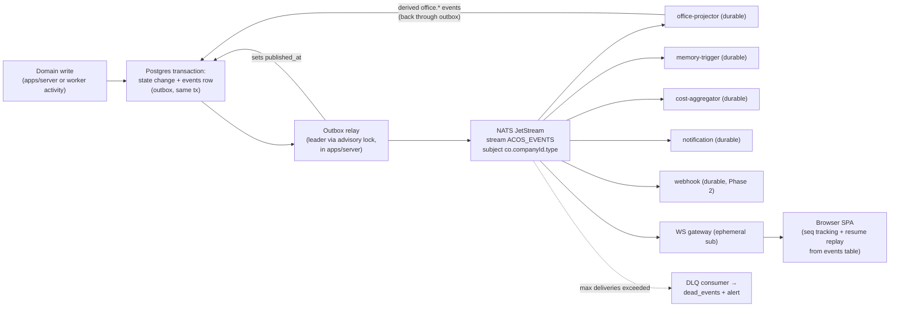

# 10 — EVENT ARCHITECTURE (Backbone & Formal Catalog)

Status: v1.0 — Implementation-ready

Everything significant that happens in a company is a persisted, versioned, schema'd event
(`_DECISIONS` §9). The append-only `events` table in Postgres is the **source of truth**; NATS
JetStream is the **distribution fabric**. The UI digital twin renders only these events; consumers
(office projector, memory trigger, cost aggregator, notifications) subscribe durably; replay is a
first-class operation. This document specifies the table, the gap-free sequence, the envelope, the
outbox relay, JetStream topology, idempotency, versioning, retention, and the formal catalog.

---

## 1. Flow overview



Terminal frames (`workspace.terminal.output`) bypass this entirely: NATS ephemeral subjects +
ring buffer + rolling files only (`_DECISIONS` §16) — never the events table.

## 2. `events` table (DDL-level spec)

```sql
CREATE TABLE events (
  id             uuid        NOT NULL,                  -- uuidv7, globally unique
  company_id     uuid        NOT NULL REFERENCES companies(id),
  seq            bigint      NOT NULL,                  -- per-company, gap-free (§3)
  type           text        NOT NULL,                  -- 'task.status.changed' (catalog §10)
  version        int         NOT NULL DEFAULT 1,
  occurred_at    timestamptz NOT NULL DEFAULT now(),
  actor_kind     text        NOT NULL,                  -- 'agent'|'founder'|'system'
  actor_id       uuid,                                  -- null for system/founder(virtual)
  task_id        uuid,                                  -- subject refs, all nullable
  project_id     uuid,
  agent_id       uuid,                                  -- subject agent (≠ actor sometimes)
  correlation_id uuid        NOT NULL,                  -- e.g. root objective/request chain
  causation_id   uuid,                                  -- id of causing event/step
  payload        jsonb       NOT NULL,
  published_at   timestamptz,                           -- null until relay published (§4)
  PRIMARY KEY (company_id, seq),
  UNIQUE (id)
) PARTITION BY RANGE (occurred_at);                     -- monthly partitions (§9)

CREATE INDEX events_unpublished ON events (company_id, seq) WHERE published_at IS NULL;
CREATE INDEX events_type   ON events (company_id, type, seq);
CREATE INDEX events_task   ON events (task_id)    WHERE task_id IS NOT NULL;
CREATE INDEX events_agent  ON events (agent_id)   WHERE agent_id IS NOT NULL;
CREATE INDEX events_corr   ON events (correlation_id);
```

Append-only is enforced: the app role has INSERT/SELECT only (no UPDATE/DELETE grants) except a
dedicated `events_relay` role allowed to set `published_at`. `[WRITER-DECISION]`

## 3. Per-company gap-free `seq`

Postgres sequences have gaps (rollback-safe but not gap-free), so `seq` comes from a counter row
locked in the same transaction as the domain write:

```sql
-- company_sequences (company_id, name, value) — 20-DATABASE-DESIGN.md §3.4; name = 'event_seq'

-- inside appendEvents(tx, companyId, events[]):
UPDATE company_sequences SET value = value + $n
  WHERE company_id = $1 AND name = 'event_seq'
  RETURNING value;                                      -- row lock serializes writers per company
-- events get seq = value - n + 1 .. value, inserted in the SAME tx as the state change
```

Properties: gap-free (rollback rolls back the counter too), strictly ordered per company,
contention scoped to one company (different companies never block each other). Throughput ceiling
(single-row lock ≈ low thousands of tx/s per company) far exceeds the 5–30 active agent scale.
The WS protocol's `after_seq` resume and consumer ordering both rely on this invariant.

## 4. Envelope schema and outbox relay

```ts
// packages/events/src/envelope.ts
export const EventEnvelope = z.object({
  id: z.string().uuid(),
  companyId: z.string().uuid(),
  seq: z.number().int().positive(),
  type: z.string().regex(/^[a-z]+(\.[a-z_]+){1,3}$/),   // domain.entity.action, past tense
  version: z.number().int().min(1),
  occurredAt: z.string().datetime(),
  actor: z.object({ kind: z.enum(['agent','founder','system']), id: z.string().uuid().nullable() }),
  subject: z.object({
    taskId: z.string().uuid().nullable(),
    projectId: z.string().uuid().nullable(),
    agentId: z.string().uuid().nullable(),
  }),
  correlationId: z.string().uuid(),
  causationId: z.string().uuid().nullable(),
  payload: z.unknown(),                                  // narrowed by per-type schema (catalog)
});
```

Per-type payload schemas live in `packages/events/src/catalog/<domain>.ts`; a registry maps
`(type, version) → ZodSchema`; `appendEvents` validates before insert (invalid event = bug, throw).

**Relay (transactional outbox, `_DECISIONS` §9):** runs inside `apps/server`; leader elected via
`pg_try_advisory_lock(hashtext('acos:outbox-relay'))` — exactly one instance relays, followers
retry the lock every 5s. Loop: `SELECT ... WHERE published_at IS NULL ORDER BY company_id, seq
LIMIT 500` → publish each to JetStream with `Nats-Msg-Id: <event.id>` (broker-side dedupe window
2m) → on publish ack, `UPDATE events SET published_at = now()`. Crash between publish and update ⇒
re-publish; `Nats-Msg-Id` + consumer idempotency make it harmless. Wake-up: `LISTEN acos_outbox`
(a `NOTIFY` fired by `appendEvents` after commit) with a 1s polling fallback — sub-100ms typical
publish latency, no busy loop. `[WRITER-DECISION]` (NOTIFY as wake-up; polling remains the
correctness mechanism).

## 5. NATS JetStream topology

| Setting | Value |
|---|---|
| Stream | `ACOS_EVENTS` |
| Subjects | `co.*.>` — every event published to `co.<companyId>.<type>` (e.g. `co.018f...ab.task.status.changed`) |
| Storage / replicas | file, 1 (single-node MVP) |
| Retention | limits-based: `max_age: 72h` working retention (§9 — replay beyond 72h uses the events table) |
| Discard | old |
| Duplicate window | 2m (`Nats-Msg-Id` = event id) |

Durable pull consumers (one per module; filter subjects listed; all `ack_wait: 30s`,
`max_deliver: 5`):

| Consumer | Filter | Responsibility |
|---|---|---|
| `office-projector` | `co.*.agent.>` , `co.*.task.>`, `co.*.approval.>` | Maps domain events → office instructions; emits `office.*` events back through the outbox (22-REALTIME-ARCHITECTURE.md, 23-VIRTUAL-OFFICE.md) |
| `memory-trigger` | `co.*.task.completed`, `co.*.task.failed`, `co.*.agent.escalated`, `co.*.review.completed`, significance counters on the rest | Starts `memoryConsolidationWorkflow` batches (12-MEMORY-ARCHITECTURE.md) |
| `cost-aggregator` | `co.*.task.>`, `co.*.budget.>`, plus reads `cost_entries` | Maintains rollup views, evaluates soft budget warnings |
| `notification` | `co.*.approval.>`, `co.*.agent.escalated`, `co.*.security.alert`, `co.*.budget.exceeded`, `co.*.task.deadline.missed` | Founder notification fan-out (in-app inbox; email/push adapters optional) |
| `webhook` (Phase 2) | configurable per endpoint | Signed outbound webhooks |
| `dlq-handler` | JetStream advisories `$JS.EVENT.ADVISORY.CONSUMER.MAX_DELIVERIES.>` | Copies poisoned event → `dead_events (id, consumer, event_id, error, payload, created_at)` + `security.alert`-grade operator alert; consumer skips past it |

The **WS gateway** subscribes ephemerally (ordered push consumer, no durable state): live fan-out
only; correctness comes from client-side `after_seq` resume against the events table
(`_DECISIONS` §16). A gateway restart loses nothing.

## 6. Consumer idempotency

Every durable consumer processes at-least-once; all are idempotent by one of:

1. **Event-id dedupe table** (default): `consumer_offsets (consumer, event_id PK-ish)` or, cheaper,
   per-consumer `last_seq` per company — events arrive in per-company order on one consumer, so
   `IF event.seq <= stored last_seq THEN skip` suffices for single-writer consumers.
   `[WRITER-DECISION]` (seq high-water-mark as the default mechanism).
2. **Natural idempotency**: office projector instructions are absolute (final positions), rollups
   recompute from `cost_entries`, workflow starts use deterministic IDs
   (`consolidation.<companyId>.<batchId>`) with `REJECT_DUPLICATE`.
3. Redelivery after crash mid-batch is therefore always safe.

## 7. Replay

- **UI**: reconnect → `{op:'resume', topic:'events:<companyId>', after_seq}` → gateway streams
  from the events table then switches to live (gap-free by §3). Older history views (timeline
  scroll-back) are plain REST queries over `events`.
- **Consumers**: JetStream consumer restarts resume from the durable cursor. Full rebuild of a
  projection (new consumer version, bug fix) beyond 72h: reset high-water-mark and stream straight
  from the events table via a backfill runner (same handler code, table iterator instead of NATS),
  then attach to JetStream at the recorded seq. `[WRITER-DECISION]` (table-backfill pattern).
- **New consumers** added later bootstrap the same way: table backfill → live.

## 8. Versioning policy

- `version` int per event row; Zod schemas per `(type, version)` in `packages/events`.
- Additive change (new optional payload field) → same version, schemas use `.passthrough()` is NOT
  used — additive fields are declared optional so old events still parse.
- Breaking change (rename/retype/remove) → `version: n+1`; producers emit the new version only;
  consumers declare `handledVersions: [1, 2]` and the dispatcher routes; unhandled version → DLQ
  path (visible, never silently dropped). Historical rows are never rewritten.
- Type renames are forbidden; introduce a new type and deprecate the old in the catalog.

### 8.1 Correlation & causation conventions

- `correlationId` is minted at the root intent (Founder objective, imported project, inbound
  webhook) and propagated unchanged through every task, workflow, message, and event it spawns —
  one id traces "objective → CEO → CTO → EM → dev → tests → review → report" end to end (and maps
  to the OTel trace, 09-WORKFLOW-ENGINE.md §9.1).
- `causationId` is the id of the direct cause: the previous event, or the `agent_steps.id` that
  produced the effect. UI "why did this happen" inspection walks the causation chain.

### 8.2 Example per-type payload schema (canonical pattern)

```ts
// packages/events/src/catalog/tasks.ts
export const TaskStatusChangedV1 = defineEvent({
  type: 'task.status.changed', version: 1,
  payload: z.object({
    from: TaskStatus, to: TaskStatus,
    byActor: z.object({ kind: z.enum(['agent','founder','system']), id: z.string().uuid().nullable() }),
    note: z.string().max(1000).optional(),
    guardFlag: z.enum(['budget','deadline','step_cap','loop','ping_pong','depth']).optional(),
  }),
});
// defineEvent registers into the (type, version) → schema registry used by appendEvents
// and by consumers' dispatchers; types are exported for compile-time payload safety.
```

## 9. Retention & partitioning

- `events` table: **forever**, partitioned by month (`PARTITION BY RANGE (occurred_at)`);
  partitions auto-created 3 months ahead by a maintenance job. Millions of events/year fit
  comfortably; old partitions can move to slow storage but are never dropped by default.
- JetStream `ACOS_EVENTS`: 72h `max_age` working retention — it is a distribution buffer, not the
  archive.
- `dead_events`: 90 days `[WRITER-DECISION]`.
- Terminal logs: `/data/terminals/*.log`, 7 days (`_DECISIONS` §16).

## 10. THE FORMAL EVENT CATALOG

Legend — Consumers: **OP** office-projector, **MT** memory-trigger, **CA** cost-aggregator,
**NF** notification, **WH** webhook (Phase 2), **WS** ws-gateway/UI (all durable events reach WS;
listed only where it is the primary consumer). Durability: **D** = events table + JetStream;
**E** = ephemeral NATS only. Idempotency: **id** = dedupe on event id/seq HWM (§6), plus notes.
Payload lists key fields beyond the envelope's subject refs. All events `v1` unless noted.

### 10.1 Company & organization

| Event | Producer | Consumers | Payload (key fields) | Dur | Idempotency |
|---|---|---|---|---|---|
| `company.created` | server:org module | WS, WH | name, currency, settings | D | id |
| `company.updated` | server:org | WS | changed fields diff | D | id |
| `department.created` | server:org | OP (office zone), WS | orgUnitId, name, parentUnitId | D | id; projector layout recompute is absolute |
| `team.created` | server:org | OP, WS | orgUnitId, name, departmentId | D | id; auto-provisions team channel (11-COMMUNICATION-SYSTEM.md §3) |
| `org.unit.updated` | server:org | OP, WS | orgUnitId, diff | D | id |
| `position.created` | server:org | WS | positionId, title, seniorityTrack, wipLimit | D | id |
| `org.edge.created` | server:org | OP, WS | edgeId, kind, fromAgentId, toAgentId/toUnitId | D | id |
| `org.edge.ended` | server:org | OP, WS | edgeId, endedAt, reason | D | id |
| `company.settings.updated` | server:org | OP (layout reload), WS | settings diff | D | id |
| `company.member.added` / `company.archived` | server:org | WS | userId, role / archive reason | D | id |
| `org.unit.created` / `org.unit.archived` | server:org | OP, WS | orgUnitId, kind, name / archivedAt | D | id |
| `org.reorg.applied` | server:org (re-org op) | OP, WS | operation, moved ids, initiator | D | id |
| `org.relationship.recomputed` | nightly recompute job | WS | counts created/updated/ended | D | one per run |
| `position.updated` | server:org | WS | positionId, diff | D | id |

### 10.2 Agents & careers

| Event | Producer | Consumers | Payload (key fields) | Dur | Idempotency |
|---|---|---|---|---|---|
| `agent.hired` | server:agents | OP (spawn avatar), NF, WS | agentId, employeeNumber, name, positionId, orgUnitId, seniority | D | id |
| `agent.updated` | server:agents | OP, WS | diff (persona, avatar, autonomyLevel) | D | id |
| `agent.started` | server:agents | OP, WS | agentId (draft→active activation) | D | id |
| `agent.paused` / `agent.resumed` | server:agents or policy engine | OP, NF, WS | reason (manual, budget breaker) | D | id |
| `agent.offboarded` | server:agents | OP, NF, WS | reason, memoryDisposition | D | id |
| `agent.status.changed` | agent-worker (presence derivation) | OP, WS | sessionId, from, to (IDLE..OFFLINE per `_DECISIONS` §6) | D | id; latest-wins by seq |
| `agent.session.started` | agent-worker | CA, WS | sessionId, workflowId, taskId, model | D | id |
| `agent.session.ended` | agent-worker | CA, WS | sessionId, status, steps, tokens, costCents | D | id |
| `agent.escalated` | agent-worker (escalate action, guards) | NF, MT, OP, WS | toAgentId (or founder), reason, attempted[], recommendation, guardFlag? | D | id |
| `agent.promotion.recommended` | agent-worker (manager agent) | NF, WS | agentId, fromSeniority, toSeniority, evidenceRefs[], reviewArtifactId | D | id |
| `agent.promoted` | server:agents (post-approval) | OP, NF, WS | agentId, toSeniority, approvalId | D | id |
| `agent.created` | server:agents | WS | agentId, name, positionId (status=draft) | D | id |
| `agent.model.binding.changed` | server:agents | WS | agentId, bindings diff | D | id |
| `agent.step.started` / `agent.step.recorded` | agent-worker | OP (badges), WS (Monitor) | sessionId, stepNo, action type | D | stepId natural key |
| `agent.session.stalled` | stuck-agent detector | NF (manager), WS | sessionId, lastStepAt | D | one per (sessionId, detection) |
| `agent.guard.triggered` | agent-worker guards | NF, MT, WS | guard (budget/deadline/step_cap/loop/ping_pong/depth), context | D | id |
| `agent.demotion.recommended` | agent-worker (manager agent) | NF, WS | agentId, fromSeniority, toSeniority, evidenceRefs[] | D | id |
| `escalation.resolved` | server:comms (resolution marked) | MT, WS | escalationRef, resolvedByAgentId | D | id |

### 10.3 Tasks

| Event | Producer | Consumers | Payload (key fields) | Dur | Idempotency |
|---|---|---|---|---|---|
| `task.created` | server:tasks / createTaskActivity | MT (counter), CA, WS | number, kind, parentTaskId, title, priority, risk, budgetCents, successCriteria, delegationDepth | D | id; task row upsert keyed by stepId (08-AGENT-RUNTIME.md §11) |
| `task.status.changed` | TaskStateService (ONLY writer) | OP, MT (counter), CA, WS | from, to, byActor, note, guardFlag? | D | id; transitions serialized by row lock |
| `agent.task.assigned` | delegateTaskActivity / scheduler | OP (walk to desk), NF (if P0), WS | taskId, agentId, byAgentId, reassignmentCount | D | id |
| `agent.task.started` | agentTaskWorkflow start | OP, CA, WS | taskId, agentId, sessionId, attempt | D | id (workflow REJECT_DUPLICATE) |
| `task.completed` | completeTaskActivity | MT (trigger), CA, NF (goal-level), WS | result summary, criteria[], artifactIds[], costCents | D | id |
| `task.failed` | TaskStateService (manager/founder) | MT (trigger), NF, WS | reason, decidedBy | D | id |
| `task.cancelled` | TaskStateService | OP, WS | reason, decidedBy | D | id |
| `task.reassigned` | server:tasks | OP, NF (count=3), WS | fromAgentId, toAgentId, reassignmentCount | D | id |
| `task.dependency.added` | server:tasks | WS | dependsOnTaskId | D | id; unique edge constraint |
| `task.dependency.resolved` | dependency resolver | WS | dependsOnTaskId, result | D | id; signal delivery deduped by signalId |
| `task.blocked` / `task.unblocked` | TaskStateService | OP, NF (SLA), WS | blockedReason {kind, ref, note} | D | id |
| `task.deadline.missed` | stuck-task-sweep schedule | NF, WS | deadline, status at miss | D | one per (taskId, deadline) natural key |
| `task.updated` | server:tasks | WS | field diff (non-status edits) | D | id |
| `task.wait_cycle.detected` | wait-cycle sweep | NF (manager task), WS | cycle task ids | D | one per detected cycle |

### 10.4 Communication

| Event | Producer | Consumers | Payload (key fields) | Dur | Idempotency |
|---|---|---|---|---|---|
| `channel.created` | server:comms (auto-provision or explicit) | WS | channelId, kind, name, refs (taskId/unitId) | D | id; provisioning keyed by natural ref (11-COMMUNICATION-SYSTEM.md §3) |
| `channel.member.added` | server:comms | WS | channelId, agentId/founder | D | id; unique membership |
| `agent.message.sent` | sendMessageActivity / Founder post | OP (animation), MT (counter), WS | messageId, channelId, senderAgentId?, kind, mentions[], refs[], pingPongCount | D | id; message upsert keyed by stepId |
| `agent.help.requested` | requestHelpActivity | OP, NF (if to founder-chain), MT, WS | messageId, topic, audience, targetAgentId? | D | id |
| `agent.help.resolved` | server:comms (resolution marked) | MT, WS | requestMessageId, resolvedByAgentId, resolutionMessageId | D | id |
| `channel.member.removed` | server:comms | WS | channelId, agentId | D | id |
| `channel.archived` | server:comms | WS | channelId | D | id |

### 10.5 Memory & skills

| Event | Producer | Consumers | Payload (key fields) | Dur | Idempotency |
|---|---|---|---|---|---|
| `memory.created` | memoryConsolidationWorkflow | WS (Observatory) | memoryId, scope, scopeRef, type, importance, confidence, sourceEventId | D | id; memory upsert by dedupe key |
| `memory.updated` | consolidation (merge) / verification | WS | memoryId, versionNo, diff | D | id |
| `memory.superseded` / `memory.archived` | consolidation / maintenance | WS | memoryId, byMemoryId?, reason | D | id |
| `memory.promoted` | promotion rules (nightly + approval) | NF (lead approval req), WS | fromMemoryId, toScope, newMemoryId, approvedByAgentId | D | id |
| `memory.contradiction.detected` | consolidation | NF (Observatory badge), WS | memoryIdA, memoryIdB, relationId | D | id |
| `memory.consolidation.completed` | memoryConsolidationWorkflow | WS | batchId, candidates, persisted, merged, discarded | D | workflow-id keyed |
| `skill.created` | server:skills | WS | skillId, name, category | D | id |
| `skill.evidence.recorded` | task/review/experiment hooks | WS | agentSkillId, kind, weight, ref | D | id; evidence row unique per (ref, kind) |
| `agent.skill.updated` | deterministic recompute (`_DECISIONS` §11) | NF (level-up), WS | agentId, skillId, fromLevel, toLevel, confidence, evidenceCount | D | recompute idempotent; id |
| `agent.skill.candidate.proposed` | server:skills emergent discovery (36 §10, U12) | WS | agentId, skillName, score, taskCount | D | first-sight per (agentId, skillName) |
| `memory.relation.created` | consolidation | WS (Observatory) | relationId, fromMemoryId, toMemoryId, kind | D | id |
| `memory.promotion.proposed` | promotion rules engine | NF (approver agent), WS | promotionId, sourceMemoryId, targetScope | D | id |
| `memory.evidence.added` | consolidation / evidence hooks | WS | memoryId, evidenceId, kind, weight | D | id |
| `memory.retrieved` | Working-Set builder (sampled, not 1:1) | WS (Observatory usage) | memoryIds[], lane | D | id |
| `memory.confidence.decayed` | nightly memory maintenance | WS | memoryId, from, to | D | id |
| `memory.embedding.failed` | consolidation embed activity | NF (operator), WS | memoryId, model, error | D | id |
| `development.objective.created` / `development.objective.met` | manager agent / level recompute | WS | objectiveId, agentId, skillId, targetLevel | D | id |
| `performance.snapshot.created` | weekly rollup job | WS | agentId, periodStart, periodEnd | D | one per (agent, period) |

### 10.6 Projects, engineering, workspaces

| Event | Producer | Consumers | Payload (key fields) | Dur | Idempotency |
|---|---|---|---|---|---|
| `project.created` | server:projects | OP (project area), WS | projectId, name, objective | D | id |
| `project.imported` | server:projects (import intake) | WS | projectId, sourceRef, repoPath | D | id; triggers `projectIntakeWorkflow` (deterministic wf id) |
| `project.intake.started` | projectIntakeWorkflow | WS | projectId, analysisPlan[] | D | wf-id keyed |
| `project.analysis.completed` | projectIntakeWorkflow | NF (intake report ready), MT, WS | intakeReportArtifactId, findings summary, routedTaskIds[] | D | wf-id keyed |
| `project.build.failed` | execution-worker (build activity) | MT (failure candidate), NF (repeat), WS | taskId, workspaceId, artifactId (log), exitCode, summary | D | id; keyed by invocation |
| `project.tests.failed` | execution-worker (test activity) | MT (learning candidate), WS | taskId, workspaceId, failed, passed, reportArtifactId | D | id |
| `project.tests.passed` | execution-worker | MT, WS | taskId, workspaceId, passed, coverage? | D | id |
| `project.deployment.started` / `project.deployment.completed` / `project.deployment.failed` | deployment adapter (Phase 3 full; MVP: local compose deploys) | NF, CA, WS | deploymentId, environment, ref, status detail | D | id; deploymentId natural key |
| `project.completed` / `project.archived` | server:projects | NF (CEO report), WS | outcome summary, reportArtifactId | D | id |
| `review.requested` | requestReviewActivity | OP, WS | reviewId, taskId, artifactId, reviewerAgentId | D | id; reviewWorkflow REJECT_DUPLICATE |
| `review.started` | reviewWorkflow | OP, WS | reviewId, reviewerAgentId | D | wf-id keyed |
| `review.completed` | reviewWorkflow | MT (accepted → skill evidence), WS | reviewId, verdict, notes, durationMs | D | id |
| `workspace.port.opened` | server (Tool Gateway, preview.ports) | WS (Preview), OP | workspaceId, port, previewUrl | D | (workspaceId, port) en-yeni |
| `workspace.provisioned` / `workspace.destroyed` | sandbox-manager (via server API) | WS (Terminals view), CA (compute) | workspaceId, taskId, image, isolationLevel | D | id; workspaceId natural key |
| `workspace.merged` / `workspace.failed` | merge flow (lead agent) / sandbox-manager | MT, WS | workspaceId, branch, mergeCommit?/reason | D | id |
| `workspace.terminal.output` | sandbox-manager PTY streamer | WS (xterm), rolling file | sessionId, frame (base64), ts | **E** | none needed — ephemeral, ring-buffer replay only |
| `project.status.changed` | server:projects | OP, WS | from, to, byActor (§19 project states) | D | id |
| `project.activated` / `project.paused` / `project.resumed` / `project.cancelled` | server:projects (transition-specific, alongside `project.status.changed`) | OP, NF (cancelled), WS | projectId, byActor | D | id |
| `project.repo.ingested` | projectIntakeWorkflow (ingest step) | WS | repoPath, sizeBytes, branches | D | wf-id keyed |
| `project.intake.step.completed` | projectIntakeWorkflow | WS (intake checklist) | step, artifactRef? | D | wf-id keyed |
| `project.member.added` / `project.member.removed` | server:projects | WS | agentId, role | D | id |
| `environment.configured` | server:projects | WS | name, baseUrl | D | id |
| `repo.sync.diverged` | git remote sync check | NF (lead task), WS | branch, ahead/behind | D | one per divergence |
| `artifact.created` | server/workers (artifact writes) | WS | artifactId, kind, taskId | D | id |
| `decision.recorded` / `decision.status.changed` | record_decision action / server:decisions | MT, WS | decisionId, number, status | D | id |
| `workspace.status.changed` | sandbox-manager | WS (Terminals), OP | workspaceId, from, to (§19 workspace states) | D | id |
| `workspace.lock.acquired` / `workspace.lock.conflict` / `workspace.lock.released` | server (workspace_locks) | WS, NF (conflict warn) | lockId, paths, taskIds | D | id |
| `workspace.build.started` | execution-worker (build activity) | OP (desk glyph), WS | taskId, workspaceId | D | id |
| `workspace.terminal.opened` / `workspace.terminal.closed` | sandbox-manager | WS (Terminals) | sessionId, workspaceId | D | id |
| `workspace.creation.deferred` | sandbox-manager (disk guard) | NF (operator), WS | reason, requestedTaskId | D | id |
| `workspace.egress.denied` | egress-proxy log scraper | NF (security), policy engine (S5 flag), WS | workspaceId, domain, count | D | id |
| `ci.run.started` / `ci.run.finished` / `ci.gate.failed` | execution-worker (CI activities) | MT (failure candidates), WS | runId, taskId, gates | D | id |
| `guardian.finding.created` / `guardian.task.filed` | Architecture Guardian | NF (lead), WS | findingId, fingerprint, severity / taskId | D | fingerprint dedupe |
| `report.published` | CEO report generation | NF (Founder), WS | artifactId, period | D | id |

### 10.7 Approvals, security, cost, policy

| Event | Producer | Consumers | Payload (key fields) | Dur | Idempotency |
|---|---|---|---|---|---|
| `approval.requested` | Approval Engine | NF (Founder inbox), OP, WS | approvalId, kind, title, brief fields, risk, costCents, urgency, deadline | D | id |
| `approval.approved` / `approval.rejected` | Approval Engine (Founder verdict) | NF, WS | approvalId, decisionNote, decidedBy | D | id; verdict signal deduped by signalId |
| `approval.needs_review` | Approval Engine (exec review requested) | NF (executive), WS | approvalId, executiveAgentId | D | id |
| `approval.expired` | Approval Engine (deadline sweep) | NF, WS | approvalId | D | one per approvalId (natural key) |
| `security.alert` | Tool Gateway, sandbox-manager, prompt-injection detector | NF (always Founder), WS | severity, category (injection/egress/permission), detail, refs | D | id |
| `budget.warning` | cost-aggregator (soft threshold 80%) | NF, WS | scope, budgetId, spentCents, limitCents | D | one per (budgetId, period, threshold) |
| `budget.exceeded` | budget-rollups schedule / CA (hard breach) | NF, policy engine (circuit breaker), WS | scope, budgetId, spentCents, limitCents, pausedAgentIds[] | D | one per (budgetId, period) |
| `policy.violation.detected` | policy engine | NF, WS | ruleId, agentId, attempted action digest | D | id |
| `tool.invocation.denied` | Tool Gateway | NF (R2+), WS | toolName, riskClass, reason (permission/policy/budget) | D | id; invocation row unique by idempotency key |
| `tool.invocation.completed` | Tool Gateway (R2+ only; R0/R1 stay in `tool_invocations` audit table without an event) | CA, WS | toolName, riskClass, costCents, resultDigest | D | id |
| `tool.invocation.requested` | Tool Gateway (R2+ only) | WS | invocationId, toolName, riskClass | D | invocation idempotency key |
| `tool.invocation.failed` | Tool Gateway (dispatch raised or output schema mismatch — an ALLOWED call that then broke) | NF (R2+), WS | toolName, riskClass, error | D | id; invocation row unique by idempotency key |
| `tool.permission.granted` / `tool.permission.revoked` | server:policies | NF, WS | subject (agent/position/unit), toolName, constraints | D | id |
| `tool.rate.throttled` | Tool Gateway rate limiter | NF (on repeat), WS | agentId, toolName, count | D | id |
| `tool.output.flagged` | Tool Gateway output scanner (S5 taint) | NF (security), policy engine, WS | invocationId, pattern, sourceDigest | D | id |
| `approval.endorsed` | Approval Engine (executive endorsement) | NF, WS | approvalId, executiveAgentId, verdict, note | D | id |
| `approval.reminder.sent` | Approval Engine (deadline sweep) | NF | approvalId | D | one per (approvalId, window) |
| `policy.created` / `policy.updated` / `policy.matched` | server:policies / policy engine (matched: sampled) | WS | policyId, kind / match digest | D | id |
| `policy.injection.flagged` | prompt-injection detector (S5) | NF (security), WS | source, contentDigest, triggeredAction? | D | id |
| `budget.created` / `budget.updated` | server:costs | WS | budgetId, scope, limitCents | D | id |
| `budget.forecast_breach` | cost forecaster (soft) | NF, WS | budgetId, projectedPct | D | one per (budgetId, period) |
| `budget.restored` | cost-aggregator (limit raised / new period) | policy engine (unpause), WS | budgetId | D | one per (budgetId, period) |
| `cost.entry.recorded` | cost ledger (sampled: entries ≥ 10¢) | CA, WS | kind, amountCents, refs | D | id |
| `llm.call.completed` | ModelRouter (sampled; full detail in `llm_calls`) | CA, WS | callId, purpose, tokens, costCents | D | id |
| `llm.provider.fallback` | ModelRouter (always) | NF (operator), WS | fromProvider, toProvider, reason | D | id |
| `event.dead_lettered` | dlq-handler (meta-event) | NF (operator) | eventId, consumer, error | D | one per (eventId, consumer) |
| `system.alert.raised` | alert mirror (25-OBSERVABILITY.md) | NF, WS | alertName, severity, detail | D | id |
| `system.llm.unavailable` / `system.execution.paused` / `system.clock.skew` | health monitors | NF (banner/operator), WS | component detail | D | one per incident window |
| `notification.read` | server:notifications | WS | notificationId | D | id |
| `incident.opened` / `incident.mitigated` / `incident.resolved` / `incident.postmortem.published` | incident module | NF, MT (postmortem), WS | incidentId, number, severity | D | id |

### 10.8 Office projection (derived; producers never the UI)

| Event | Producer | Consumers | Payload (key fields) | Dur | Idempotency |
|---|---|---|---|---|---|
| `office.avatar.moved` | office-projector | WS (PixiJS renderer) | agentId, fromZone, toZone, path[], reason (eventId) | D | id; positions absolute — replays converge |
| `office.interaction.started` | office-projector | WS | interactionId, agentIds[], kind (dm/help/review/meeting), zone | D | id |
| `office.interaction.ended` | office-projector | WS | interactionId, durationMs | D | id |
| `office.status.changed` | office-projector | WS (renderer badge) | agentId, badge (presence status), causeEventId | D | id; latest-wins |

### 10.9 Marketing & experiments (Phase 2 — schema ships in MVP)

| Event | Producer | Consumers | Payload (key fields) | Dur | Idempotency |
|---|---|---|---|---|---|
| `marketing.content.planned` | marketing agents | WS | contentId, platform, conceptRef | D | id |
| `marketing.content.drafted` | reelsPipelineWorkflow | WS | contentId, stage, artifactIds[] | D | wf-id keyed |
| `marketing.content.published` | publish adapter (R3, approval-gated) | CA, MT, WS | contentId, platform, externalRef | D | provider idempotency key + id |
| `marketing.analytics.received` | analytics ingestion adapter | MT (learning loop), CA, WS | contentId, metrics {views, ctr, ...}, window | D | one per (contentId, window) |
| `experiment.started` | experimentWorkflow | WS | experimentId, hypothesis, metrics, sampleSize | D | wf-id keyed |
| `experiment.completed` | experimentWorkflow | MT (learning memory), NF, WS | experimentId, result, confidence, decision | D | wf-id keyed |
| `marketing.content.status.changed` | marketing agents / pipeline | WS | contentId, from, to | D | id |
| `marketing.content.publish.scheduled` / `marketing.content.publish.failed` | publish dispatcher | NF (failure), WS | contentId, scheduledAt / error | D | id |
| `pipeline.stage.completed` / `pipeline.stage.failed` | reelsPipelineWorkflow | WS (pipeline Kanban) | pipelineRunId, stage | D | wf-id keyed |
| `analytics.metric.updated` | analytics ingestion (thresholds) | MT, WS (wakes analytics specialist) | contentId, metricKey, value, window | D | one per (contentId, metricKey, window) |
| `experiment.status.changed` | experimentWorkflow | WS | experimentId, from, to (§19 experiment states) | D | wf-id keyed |
| `experiment.result.recorded` | experimentWorkflow / metrics ingestion | WS | experimentId, metricKey, value | D | id |
| `experiment.adopted` | experiment verdict | MT (learning memory), WS | experimentId, decisionNote | D | id |
| `asset.created` / `asset.archived` | asset library | WS | assetId, kind / reason | D | id |
| `asset.rights.expired` | rights sweep | NF, WS | assetId, expiredAt | D | one per assetId |
| `campaign.spend.recorded` | ads adapter | CA, WS | campaignRef, amountCents | D | id |
| `integration.connected` / `integration.call.failed` | integration adapters | NF (blockers, on failure), WS | connectionId, platform / error | D | id |

Catalog count: 192 durable types + 1 ephemeral. Any new event type must land in
`packages/events/src/catalog/` with schema + a row in this table in the same PR (CI check compares
registry keys against this doc's table). `[WRITER-DECISION]` (doc-registry consistency check).

## 11. Cross-references

- Producers' write paths and idempotency keys: 08-AGENT-RUNTIME.md §11, 07-TASK-ENGINE.md §4.
- Relay leadership within the server process model: 09-WORKFLOW-ENGINE.md §8 failure matrix.
- Message events and animation pipeline: 11-COMMUNICATION-SYSTEM.md §5.
- Memory-trigger consumption semantics: 12-MEMORY-ARCHITECTURE.md.
