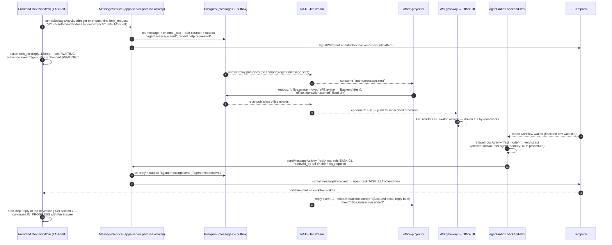

# 11 — COMMUNICATION SYSTEM (Persistent Inter-Agent Comms)

Status: v1.0 — Implementation-ready

Agents communicate the way employees do: persistent DMs, team/department/project channels, task
threads, review requests, and escalations — all stored in Postgres, fully independent of any LLM
context (`_DECISIONS` §14). A message exists whether or not any model is currently running.
**Communication is never "one shared LLM context":** each agent sees only its own Working Set
slice (08-AGENT-RUNTIME.md §8) — the last N thread messages plus its pending signal buffer.
Cross-agent knowledge moves only through messages and consolidated memory
(12-MEMORY-ARCHITECTURE.md). Delivery rides Temporal signals and the event backbone
(10-EVENT-ARCHITECTURE.md); the office digital twin animates every send.

---

## 0. Design invariants

1. **Persistence-first:** a message is a domain fact before it is a delivery; every send commits
   to Postgres before any signal, socket, or animation fires.
2. **One send path:** agents (activity) and Founder (REST) converge in `MessageService.send` —
   guards, counters, and events cannot be bypassed.
3. **No shared context:** recipients read their own bounded slice per step; there is no broadcast
   prompt, no global transcript fed to any model.
4. **Everything visible is real:** office animation for communication derives 1:1 from
   `agent.message.sent` / `office.*` events — never generated client-side.
5. **Communication is evidence:** transcripts feed consolidation and skill/relationship signals,
   but raw messages are never memory records themselves.

## 1. Schema

```sql
CREATE TABLE channels (
  id           uuid PRIMARY KEY,                       -- uuidv7
  company_id   uuid NOT NULL REFERENCES companies(id),
  kind         text NOT NULL CHECK (kind IN
               ('dm','team','department','project','task_thread','review','escalation')),
  name         text,                                   -- null for dm/task_thread (derived display)
  ref_task_id  uuid REFERENCES tasks(id),              -- task_thread/review anchor
  ref_unit_id  uuid REFERENCES org_units(id),          -- team/department anchor
  ref_project_id uuid REFERENCES projects(id),         -- project anchor
  ref_review_id  uuid,                                 -- review channels
  dm_pair_key  text,                                   -- sorted "minId:maxId" for dm uniqueness
  archived_at  timestamptz,
  created_at   timestamptz NOT NULL DEFAULT now()
);
-- exactly-one-anchor CHECK per kind; uniqueness of auto-provisioned channels:
CREATE UNIQUE INDEX channels_dm      ON channels (company_id, dm_pair_key) WHERE kind = 'dm';
CREATE UNIQUE INDEX channels_thread  ON channels (company_id, ref_task_id) WHERE kind = 'task_thread';
CREATE UNIQUE INDEX channels_unit    ON channels (company_id, kind, ref_unit_id)
       WHERE kind IN ('team','department');
CREATE UNIQUE INDEX channels_project ON channels (company_id, ref_project_id) WHERE kind = 'project';

CREATE TABLE channel_members (
  channel_id  uuid NOT NULL REFERENCES channels(id),
  member_kind text NOT NULL CHECK (member_kind IN ('agent','founder')),
  agent_id    uuid REFERENCES agents(id),              -- null when member_kind='founder'
  role        text NOT NULL DEFAULT 'member',          -- 'member'|'moderator' (lead/manager)
  joined_at   timestamptz NOT NULL DEFAULT now(),
  last_read_seq bigint NOT NULL DEFAULT 0,             -- per-channel message counter (unread badges)
  PRIMARY KEY (channel_id, member_kind, agent_id)
);

CREATE TABLE messages (
  id              uuid PRIMARY KEY,                    -- uuidv7 (= idempotency effect id, 08 §11)
  company_id      uuid NOT NULL REFERENCES companies(id),
  channel_id      uuid NOT NULL REFERENCES channels(id),
  channel_seq     bigint NOT NULL,                     -- per-channel counter (ordering, unread)
  sender_agent_id uuid REFERENCES agents(id),          -- NULL = Founder
  kind            text NOT NULL CHECK (kind IN
                  ('text','help_request','review_request','escalation','status','system')),
  body            text NOT NULL,                       -- markdown, ≤ 8000 chars (contract)
  refs            jsonb NOT NULL DEFAULT '[]',         -- [{kind:'task'|'artifact'|'review'|'approval'|'message', id}]
  mentions        uuid[] NOT NULL DEFAULT '{}',        -- agent ids (§7)
  reply_to_message_id uuid REFERENCES messages(id),    -- intra-channel threading (§6)
  resolved_by_message_id uuid REFERENCES messages(id), -- help_request resolution marker
  created_at      timestamptz NOT NULL DEFAULT now(),
  UNIQUE (channel_id, channel_seq)
);
CREATE INDEX messages_channel ON messages (channel_id, channel_seq DESC);
CREATE INDEX messages_sender  ON messages (company_id, sender_agent_id, created_at);
```

`channel_seq` comes from a per-channel counter row (same tx-lock pattern as the event seq,
10-EVENT-ARCHITECTURE.md §3) `[WRITER-DECISION]`.

## 2. Channel kinds & semantics

| Kind | Members | Purpose | Created |
|---|---|---|---|
| `dm` | exactly 2 (agent–agent or Founder–agent) | direct conversation | on first message (get-or-create by `dm_pair_key`) |
| `team` | team members + lead (+ Founder implicit) | team coordination, standup-style status | auto with `team.created` |
| `department` | department members + leadership | cross-team coordination | auto with `department.created` |
| `project` | project stakeholders (staffing module maintains membership) | project-wide announcements, decisions | auto with `project.created` |
| `task_thread` | task owner + creator + delegator chain; participants join on first message | ALL discussion about one task; the consolidation source (§8) | auto with `task.created` (kind `task`/`subtask`/`epic`) |
| `review` | review requester + reviewer (+ QA) | review conversation for one review entity | auto with `review.requested` |
| `escalation` | escalating agent + target manager/executive (+ Founder if reaching top) | structured escalation trail | auto on first `escalate` action per (task, level) |

**Auto-provisioning rules** run in the same transaction as the causing entity (team insert, task
insert, review insert) via the comms module — a task can never exist without its thread. The
unique partial indexes make provisioning race-free (`ON CONFLICT DO NOTHING` + re-select).
Membership sync: org module updates team/department membership on `org_edges` changes; the Founder
is an implicit member of every channel (§9 read model enforces no filtering for Founder).

## 3. Message kinds & semantics

| Kind | Sender intent | Machine semantics |
|---|---|---|
| `text` | ordinary communication | delivered, animated, counted for relationship strength |
| `help_request` | resolution-ladder step (brief rule 1) | must carry `refs:[{kind:'task'}]`; expects resolution — `resolved_by_message_id` set by the helper's answering message or by requester ack; feeds `agent.help.requested`/`agent.help.resolved`; unresolved past timeout escalates (08-AGENT-RUNTIME.md §6.1) |
| `review_request` | ask for independent review | posted into the `review` channel by `request_review`; carries artifact ref; reviewer's inbox/wf signalled |
| `escalation` | move a decision up one reporting level | body must be the structured brief shape (title, request, reason, attempted, options, recommendation, risk, cost, urgency) — validated by contract; Founder-level escalations additionally create an `approvals` row when a decision is required |
| `status` | progress note (visible in task thread + Agent Monitor) | no reply expected; never wakes recipients (no signal fan-out) |
| `system` | platform notices (guard trips, membership changes, merges) | sender null, actor system; never triggers inbox triage |

## 4. Delivery pipeline

One code path: `sendMessageActivity` (agent) and `POST /channels/:id/messages` (Founder) both call
`MessageService.send`:

1. **Validate**: sender is a channel member; body/kind contract; refs exist (same company).
2. **Persist** in one transaction: `messages` row (id = caller idempotency key) + `channel_seq` +
   outbox events `agent.message.sent` (+ `agent.help.requested` when kind=help_request).
3. **Anti-ping-pong bookkeeping** (§9) inside the same tx.
4. **Recipient resolution** (post-commit): members minus sender; mentions get priority flag.
   For each recipient agent: if an `agentTaskWorkflow` session is active → Temporal signal
   `messageReceived` to `agent-task.<taskId>.<agentId>` (all active sessions of that agent);
   else → `signalWithStart` `agent-inbox.<agentId>` with the inbox item (08-AGENT-RUNTIME.md §7).
   Founder recipients: WS push + notification consumer handles badge/inbox.
   Signal failures are retried by a short-lived delivery job; the message itself is already
   durable — delivery is at-least-once, dedup by signalId. `status`/`system` kinds skip signalling
   (pull-only via Working Set).
5. **Office animation**: office-projector consumes `agent.message.sent` → emits
   `office.avatar.moved` (sender walks to recipient's desk / team zone) and
   `office.interaction.started`; the PixiJS renderer replays exactly these
   (10-EVENT-ARCHITECTURE.md §10.8). No random animation exists.

### 4.1 Send contract (canonical Zod, shared by activity and REST)

```ts
// packages/contracts/src/comms.ts
export const SendMessageInput = z.object({
  channelId: z.string().uuid(),
  kind: z.enum(['text','help_request','review_request','escalation','status','system']),
  body: z.string().min(1).max(8000),
  refs: z.array(z.object({
    kind: z.enum(['task','artifact','review','approval','message']),
    id: z.string().uuid(),
  })).default([]),
  mentions: z.array(z.string().uuid()).default([]),
  replyToMessageId: z.string().uuid().optional(),
  idempotencyKey: z.string().uuid(),                 // stepId-derived for agents (08 §11)
});
// kind-specific refinements:
//  help_request  → refine: refs must contain ≥1 task ref
//  escalation    → body parsed against EscalationBrief (title, request, reason,
//                  attempted[], options[], recommendation, risk, cost, urgency)
//  system        → only actor kind 'system' may send (server-internal)
export const MessageView = SendMessageInput.omit({ idempotencyKey: true }).extend({
  id: z.string().uuid(), channelSeq: z.number().int(),
  senderAgentId: z.string().uuid().nullable(),        // null = Founder
  resolvedByMessageId: z.string().uuid().nullable(),
  createdAt: z.string().datetime(),
});
```

### 4.2 REST surface (Founder + SDK; agents use activities, same service underneath)

| Endpoint | Purpose |
|---|---|
| `GET /companies/:cid/channels?kind=&archived=` | list channels visible to caller |
| `GET /channels/:id/messages?before_seq=&limit=` | history pages (ordered by `channel_seq`) |
| `POST /channels/:id/messages` | Founder send (SendMessageInput minus idempotencyKey → server mints) |
| `POST /channels/:id/read` | advance `last_read_seq` (unread badges) |
| `POST /channels` | explicit channel creation (dm get-or-create; ad-hoc project channels) |
| `GET /channels/:id/members` / `POST .../members` | membership (moderator/Founder only for restricted kinds) |
| `GET /companies/:cid/messages/search?q=` | tsvector full-text search (§11) |

All routes company-scoped and permission-checked; agents have no HTTP path — their only entry is
`sendMessageActivity` → `MessageService`, keeping guard bookkeeping impossible to bypass.

### 4.3 Delivery guarantees summary

| Property | Mechanism |
|---|---|
| Message durability | Postgres row committed before any delivery attempt (step 2) |
| At-least-once delivery to agents | Temporal signal / signalWithStart, retried by delivery job on failure |
| No duplicate processing | signalId dedupe in workflow carried state (08-AGENT-RUNTIME.md §5); message id upsert |
| Ordering per channel | `channel_seq` (readers); signal order is best-effort — agents re-read the thread slice each step, so misordered wakes cannot corrupt state |
| Crash mid-delivery | message persisted; delivery job re-resolves recipients idempotently on restart (09-WORKFLOW-ENGINE.md §8) |
| UI liveness | `agent.message.sent` via outbox → NATS → WS; reconnect replays by event seq |

## 5. Threading model

- Channel = the thread for its anchor (task_thread, review, escalation): flat, ordered by
  `channel_seq`.
- Inside team/department/project channels, `reply_to_message_id` provides light sub-threading
  (one level; UI renders indented replies). Deep nesting rejected — agents handle linear context
  better and consolidation prefers linear transcripts. `[WRITER-DECISION]`
- Cross-references between channels use `refs` (e.g. a team-channel message referencing TASK-81
  links to its task_thread).

## 6. Working Set slice (what an agent actually reads)

`buildWorkingSetActivity` pulls, per step (token budget 1,200 — 08-AGENT-RUNTIME.md §8): the last
15 messages of the current task_thread `[WRITER-DECISION]`, any unread mentions/DMs surfaced by
the pending signal buffer, and — only when the agent chooses `use_tool: read_channel` (an R0
tool) — older history pages. Agents never receive other channels' content implicitly. This is the
architectural enforcement of "no shared context": the same `messages` table serves every agent a
different, minimal view.

## 7. Mention semantics

`@Name` in body is resolved at send time to `mentions: uuid[]` (server resolves display names →
agent ids within company; unresolvable mentions are rejected back to the sender as a structured
error). Effects: mentioned non-members of team/department/project channels are added as members
(task_thread/review/escalation membership stays restricted — mention there delivers a linked
notification instead `[WRITER-DECISION]`); mentions always signal the target (even for `status`
kind); mention of the Founder is allowed only in escalation channels — elsewhere it is rewritten
to a notification to the sender's manager (protects the "Founder is the last level" rule).

## 8. Conversations → memory consolidation

On `task.completed` / `task.failed`, the memory-trigger consumer includes the task's
`task_thread` (and linked review channel) transcript refs in the
`memoryConsolidationWorkflow` batch input. Candidate extraction runs over the transcript to mine:
decisions stated in-thread, resolved help_requests (procedural memory: "problem → solution"),
disagreements later proven right/wrong (evidence links to review/test events), and relationship
signals (helpfulness feeds nightly `collaborates_with` strength recompute, 09-WORKFLOW-ENGINE.md
§9). Messages themselves are never memory — only consolidated, scored, deduped records with
`memory_evidence` rows pointing back at message ids (12-MEMORY-ARCHITECTURE.md).

## 9. Anti-ping-pong guard (guard e enforcement point)

Enforced centrally in `MessageService.send`, not in agent prompts (`_DECISIONS` §8e):

```sql
CREATE TABLE channel_pair_counters (
  channel_id uuid NOT NULL, pair_key text NOT NULL,     -- sorted "agentA:agentB"
  consecutive_alternations int NOT NULL DEFAULT 0,
  last_sender uuid, last_task_status_seq bigint,        -- events.seq of last task.status.changed
  PRIMARY KEY (channel_id, pair_key)
);
```

- Within the send transaction: if the new message alternates sender within the same pair, and no
  `task.status.changed` for the anchored task occurred since the counter started, increment;
  otherwise reset to 1.
- At counter **> 8**: the message still persists (audit trail), but (1) a `system` message is
  injected into the channel stating the thread is paused pending manager input, (2) both agents'
  workflows receive `managerDirective` with `directive:'pause_thread'` context, (3) the common
  manager (lowest common ancestor on `reports_to`) gets a notification message with the transcript
  ref, (4) `agent.message.sent` carries `pingPongCount` so the office can render the "stuck
  conversation" indicator. Counter resets on any task-state change or manager post in the channel.

## 10. Founder participation

The Founder posts into any channel via the Communication view (`sender_agent_id = NULL`, actor
kind `founder` in the emitted event). A Founder message is delivered like any other (signals /
inbox wake) but carries an implicit priority flag: inbox triage treats Founder messages as
`act`-preferred, and an active workflow surfaces it at the top of Working Set section 7. Founder
posts in a task_thread do NOT change task state (state changes go through the task API/Approval
Engine only) — preventing accidental side-channel management. All Founder reads are unrestricted
(implicit membership everywhere).

### 10.1 Read models for the Communication view

The Communication view (see 24-FRONTEND-ARCHITECTURE.md) is a plain projection of these tables —
no LLM anywhere in the read path:

- Channel list: channels joined with last message preview + unread count
  (`max(channel_seq) − last_read_seq`).
- Live updates: the SPA applies `agent.message.sent` events from the WS stream to TanStack Query
  caches keyed by `channelId`; reconnect replay (22-REALTIME-ARCHITECTURE.md) makes the view
  converge without refetch.
- Help-request board: open `help_request` messages (`resolved_by_message_id IS NULL`) grouped by
  team — managers see unresolved help at a glance; feeds the stuck-task sweep
  (09-WORKFLOW-ENGINE.md §9).
- Escalation trail: escalation channels render the structured brief fields, not raw chat — the
  Founder never reads agent stream-of-consciousness (brief rule 3).

## 11. Retention & volume

Messages are domain history: retained **forever** (they are evidence for memory and skills), table
partitioned by month at ~1M+ messages scale `[WRITER-DECISION]` (same pattern as `events`).
Channels are archived (not deleted) when their anchor terminates: task_thread on task terminal
state + 7 days, review channels on review completion + 7 days; archived channels are read-only.
DM/team/department/project channels never auto-archive. Full-text search: Postgres `tsvector`
GIN index on `messages.body` `[WRITER-DECISION]`; semantic search over messages is deliberately
NOT provided (memory is the semantic layer).

### 11.1 Communication analytics & relationship strength

The nightly `relationship-strength-nightly` schedule (09-WORKFLOW-ENGINE.md §9) recomputes
`org_edges(kind='collaborates_with').strength` from the last 30 days of message and review
events: weighted count of (DM exchanges 1.0, resolved help_requests 3.0, completed reviews 2.0,
same-thread participation 0.5), exponentially decayed, normalized 0–1. `[WRITER-DECISION]`
(weights). Strength influences nothing authoritative — it renders the org graph edge thickness
and gives managers a signal for staffing (04-ORGANIZATION-ENGINE.md); it never gates delivery.

### 11.2 Testing the comms module

- Unit (Vitest): auto-provisioning uniqueness under concurrent creation (two tasks racing on the
  same channel index), ping-pong counter transitions incl. reset on `task.status.changed`,
  mention resolution and Founder-mention rewrite, escalation brief validation.
- Integration (Testcontainers PG + Temporal): send → signal delivery to a live stub workflow;
  idle-recipient path asserting `signalWithStart` of `agent-inbox.*`; crash injection between
  persist and signal, asserting the delivery job completes it exactly once.
- E2E (Playwright): Founder posts into a team channel → message visible, recipient agent inbox
  triage fires, office renders the interaction events.

## 12. Sequence: frontend dev DMs backend dev (help_request → answer, with office animation)



## 13. Cross-references

- Signal handling, inbox triage, wait/wake semantics: 08-AGENT-RUNTIME.md §5–7.
- `wait_for` timeout escalation ladder for unanswered help: 08-AGENT-RUNTIME.md §6.1.
- Event payloads for `agent.message.sent`, `agent.help.requested`, `office.*`:
  10-EVENT-ARCHITECTURE.md §10.4, §10.8.
- Task threads' role in blocker resolution and review flow: 07-TASK-ENGINE.md §8, §5.
- Transcript-driven candidate extraction: 12-MEMORY-ARCHITECTURE.md.
- Workflow delivery guarantees on crash/restart: 09-WORKFLOW-ENGINE.md §8.
