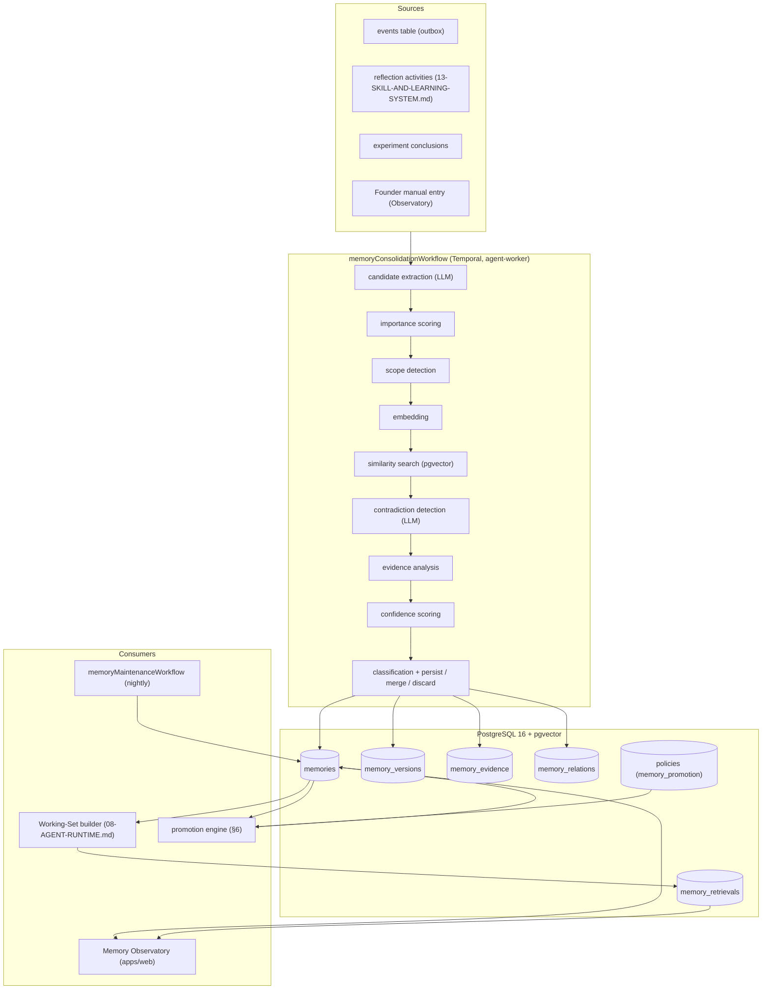
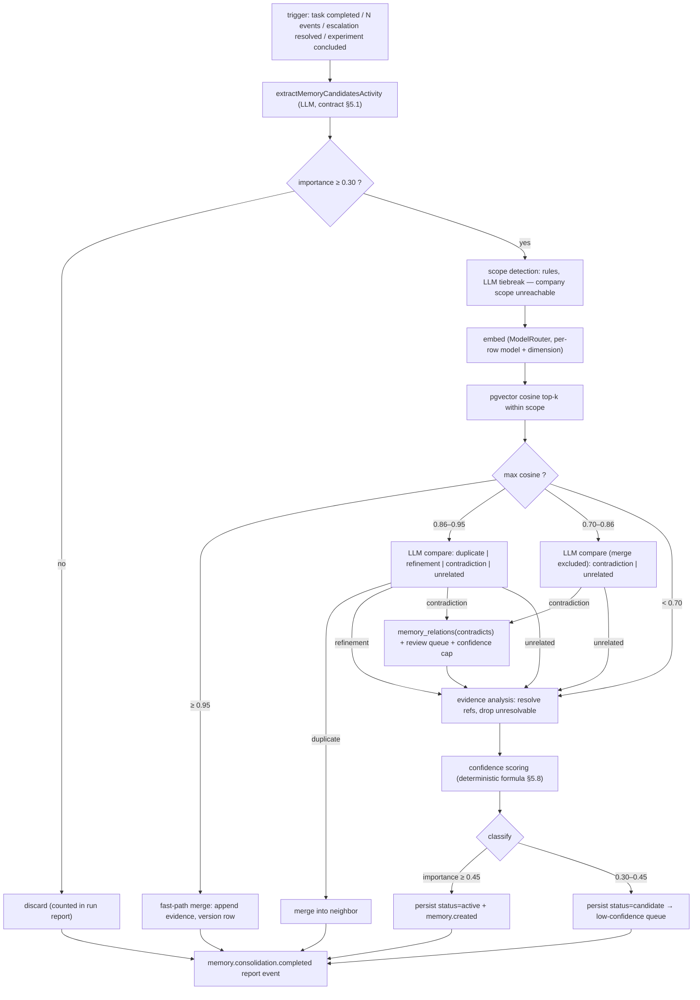

# 12 — Memory Architecture

Status: v1.0 — Implementation-ready

Memory is the flagship subsystem of AI AGENT COMPANY OS. It is what turns a pool of stateless LLM
calls into a company that *learns*: agents remember what worked, projects accumulate institutional
knowledge, and the company converges on procedures that survive any individual agent, task, or
model swap. This document specifies the storage model, the consolidation pipeline
(`memoryConsolidationWorkflow`), overlearning prevention and promotion, the retrieval path used by
the Working-Set builder (08-AGENT-RUNTIME.md §Working Set), and the Memory Observatory frontend.

Binding inputs: `_DECISIONS.md` §10 (tables, pipeline, promotion, retrieval scoring), §1 (Postgres 16
+ pgvector only, Temporal, embeddings strategy), §19 (memory state machine), ADR-003/005/007/020.
Sibling docs: 08-AGENT-RUNTIME.md (Working Set consumption), 09-WORKFLOW-ENGINE.md (workflow
catalog), 10-EVENT-ARCHITECTURE.md (`memory.*` events), 13-SKILL-AND-LEARNING-SYSTEM.md (learning
loop that feeds this pipeline), 20-DATABASE-DESIGN.md (full DDL), 24-FRONTEND-ARCHITECTURE.md
(Memory view shell), 25-OBSERVABILITY.md (retrieval telemetry).

---

## 1. Design principles

1. **Not everything is embeddings.** Decisions, ADRs, relationships, promotion lineage, evidence and
   contradictions are *relational rows first*. The vector embedding on a memory row is an **index,
   not the truth**: it accelerates semantic recall but is never the authoritative representation.
   Deleting and rebuilding every embedding must lose zero information (ADR-007).
2. **Hybrid storage, one database.** Postgres 16 + pgvector holds everything: structured columns for
   filtering and joins, `memory_relations` for the knowledge graph, HNSW indexes for semantic
   search. No separate vector store, no graph DB (ADR-003).
3. **Scope isolation is a hard rule, not a ranking preference.** Retrieval never crosses project
   scopes (§2). Cross-scope knowledge transfer happens only through the explicit promotion engine
   (§6), never through retrieval leakage.
4. **Every memory is auditable.** Source event, creator, evidence rows, version history, and
   relations make "why does this memory exist?" answerable in the Observatory for every row (§8.6).
5. **Consolidation is asynchronous and durable.** Agents never block on memory writes; candidates
   flow through a Temporal workflow that survives every crash class in `_BRIEF.md` §2.9.
6. **Overlearning is a first-class failure mode.** A single bad afternoon must never become company
   policy. Promotion requires repeated, independent evidence plus an approval gate (§6).

### 1.1 Architecture overview



---

## 2. The three scopes and hard isolation rules

Every memory row has `scope ∈ {company, project, agent}` and a `scope_ref`:

| scope | scope_ref | Meaning | Examples |
|---|---|---|---|
| `company` | `NULL` | Institutional knowledge valid across all projects and agents of this company | coding conventions promoted to procedure, vendor decisions, escalation norms |
| `project` | `project_id` | Knowledge about one project: its codebase, architecture, decisions, quirks | "OrderService ORM mapping causes N+1 on `orders → items`", ADR summaries, deploy runbook for this repo |
| `agent` | `agent_id` | One employee's personal experience and technique, portable across projects | "I diagnose N+1 by enabling query logging first", personal checklists, working-relationship observations |

`company_id` is additionally NOT NULL on every row — scopes exist *inside* a tenant; nothing ever
crosses companies (see `_DECISIONS.md` §4 and 20-DATABASE-DESIGN.md tenancy).

### 2.1 scope_ref discipline

- CHECK constraint: `(scope='company' AND scope_ref IS NULL) OR (scope IN ('project','agent') AND scope_ref IS NOT NULL)`.
- `scope_ref` is validated at the repository layer against the referenced table (`projects.id` /
  `agents.id`) belonging to the same `company_id`. [WRITER-DECISION] Enforced as a trigger-backed FK
  pattern (two nullable FK columns `scope_project_id`, `scope_agent_id` generated from scope_ref)
  rather than a polymorphic soft reference, so referential integrity is real. 20-DATABASE-DESIGN.md
  carries the DDL.
- Repository methods (`packages/db`) expose only scope-explicit query builders:
  `forAgent(agentId)`, `forProject(projectId)`, `forCompany()`. There is **no** "query all scopes"
  method; the Working-Set builder composes the three lanes explicitly (§7).

### 2.2 Hard isolation rules (binding)

1. **Retrieval NEVER crosses project scopes.** A Working Set built for a task in project P queries
   project-scope memories with `scope_ref = P` only. Memories of project Q are invisible — even to
   an agent who created them while staffed on Q.
2. **Agent memory follows the agent across projects, but project details stay project-scoped.**
   The consolidation pipeline's scope detector (§5.4) is responsible for splitting a raw experience
   into its portable part (agent scope) and its project-bound part (project scope).
3. **Company scope is write-protected.** No consolidation run may persist a company-scope memory
   directly — company scope is reachable only via the promotion engine (§6) or an explicit Founder
   action in the Observatory. (`_DECISIONS.md` §10: "A single event can never directly create
   company-scope memory.")
4. **Cross-scope links are relations, not copies of access.** A promoted project memory links to its
   agent-scope originals via `memory_relations(kind=derived_from)`; retrieval still only sees rows
   in its own lanes. Provenance is traversable in the Observatory, not in agent prompts.

### 2.3 Boundary worked example A — the N+1 incident

Agent **Alex** (backend developer) spends four hours on project **Phoenix** discovering that a
checkout slowdown is an N+1 query: the ORM lazy-loads `order.items` inside a loop in
`OrderService.listOrders`. Consolidation after `task.status.changed → DONE` produces **two**
memories, not one:

| Field | Project-scope memory | Agent-scope memory |
|---|---|---|
| scope / scope_ref | `project` / Phoenix | `agent` / Alex |
| type | `failure` | `procedural` |
| title | "N+1 query in OrderService.listOrders via lazy-loaded order.items" | "Diagnose suspected N+1: enable SQL logging, count queries per request first" |
| content | Repo-specific: file, ORM config flag, the fix (eager-load include), perf numbers before/after | Portable technique with no Phoenix identifiers |
| Who retrieves it | Any agent working a Phoenix task touching orders/perf | Alex, on any project, when a perf-debugging task matches semantically |

When Alex is later staffed on project **Atlas** and hits a similar slowdown, his Working Set
retrieves the portable procedural memory (agent lane) — but *not* the Phoenix failure row. If the
same N+1 pattern then occurs in ≥2 projects with independent evidence, the promotion engine may
propose a company-scope procedure ("always eager-load collection relations rendered in lists"),
carrying `derived_from` links to both project rows (§6).

### 2.4 Boundary worked example B — the build failure (from `_BRIEF.md` §11)

A developer agent's sandbox build fails (`project.build.failed`) because a dependency pin conflicts
with the project's Node version. After the fix, the reflection activity
(13-SKILL-AND-LEARNING-SYSTEM.md §7) submits a candidate. Scope detection yields:

- `project` scope, type `failure`: "Build breaks when `sharp` > 0.33 is installed; repo is pinned to
  Node 20 base image — keep `sharp@0.32.x` until workspace image upgrade" — bound to this repo's
  constraint set.
- **No** agent-scope memory: the LLM extraction judges the portable lesson ("read the build log's
  first error, not the last") already exists in Alex's agent memory — the similarity stage (§5.6)
  merges the duplicate instead of creating a near-copy, incrementing evidence on the existing row.

This asymmetry is the norm: most incidents produce a project row; agent rows appear when a genuinely
personal, reusable technique emerges; company rows appear only through promotion.

---

## 3. The eight memory types

`type ∈ {semantic, episodic, procedural, decision, failure, experiment, relationship, artifact}`.
Storage emphasis states which representation is primary: **relational** (structured columns +
relations are the truth; embedding is a convenience index) or **semantic** (free-text content is the
payload; embedding is the primary recall path). All types get embeddings; the emphasis governs which
retrieval lane (§7) is expected to find them.

| Type | Definition | Example | Typical source | Storage emphasis |
|---|---|---|---|---|
| `semantic` | Stable facts about the world, the company, a project domain | "Phoenix's payment provider settles in T+2 days" | intake reports, research tasks, Founder statements | semantic |
| `episodic` | A dated account of something that happened, with actors and outcome | "2026-08-03: deploy of Phoenix v1.4 rolled back after checkout errors spiked" | task completions, escalations, incident events | semantic (time-indexed) |
| `procedural` | How to do something: steps, checklists, technique | "Release checklist for Phoenix: migrate → smoke test → tag → deploy" | repeated successful task patterns, reflection | semantic, promoted rows relational-listed |
| `decision` | A choice made, with alternatives and rationale (ADR-grade) | "Chose Stripe over Adyen for Phoenix: faster integration, fee delta acceptable" | `record_decision` AgentAction (08-AGENT-RUNTIME.md), architecture reviews | **relational first** — structured `entities` fields (options, chosen, rationale, deciders); listed by SQL lane, never dependent on vector recall |
| `failure` | Root-caused account of something that went wrong and what prevents recurrence | The N+1 and build-failure examples in §2.3–2.4 | validation events, QA failures, reflection activities | balanced: structured root-cause fields + semantic content |
| `experiment` | Hypothesis, method, result, confidence from the Experiment Engine | "Reels hook variant B lifted retention 3.1pp, p<0.05 → adopt" | `experiment.completed` events (30-PHASE-2.md) | relational (links to experiment row) + semantic summary |
| `relationship` | Qualitative observation about how two employees work together | "QA agent Riley wants repro steps before stack traces" | communication/review event analysis, reflection | **relational first** — anchored to agent pairs, complements `org_edges` (§9) |
| `artifact` | Pointer + summary of a durable work product | "Intake Report for Atlas — key risks: no tests on billing module" | intake workflow, report generation, reviews | relational pointer (`entities.artifact_ref`) + semantic summary for recall |

**Explicit rule:** `decision` and `relationship` rows must be fully useful with embeddings disabled
(offline profile A3): the SQL lanes in §7.1 list them by scope/recency/entity match. If a doc or
implementation makes any of these types reachable *only* via vector search, that is a bug.

---

## 4. Schema

Canonical DDL lives in 20-DATABASE-DESIGN.md; this section is the column-level contract. All tables
snake_case, UUIDv7 ids, `company_id NOT NULL` FK.

### 4.1 `memories`

| Column | Type | Explanation |
|---|---|---|
| `id` | uuid PK | UUIDv7 (time-ordered; makes recency scans index-friendly) |
| `company_id` | uuid FK NOT NULL | Tenant owner; every query filters on it |
| `scope` | enum `company\|project\|agent` | §2 |
| `scope_ref` | uuid NULL | project_id or agent_id; CHECK per §2.1 |
| `type` | enum (8 values) | §3 |
| `title` | text NOT NULL | One-line human-readable label; shown in lists, prompts, graph nodes |
| `content` | text (markdown) | Full body injected into prompts when budget allows |
| `summary` | text | ≤ 320 chars, LLM-written at persist time; used for budget-constrained packing (§7.3) and list views |
| `entities` | jsonb | Typed extracted refs: `{agents:[], projects:[], tasks:[], files:[], components:[], external:[], decision:{options,chosen,rationale}?, artifact_ref?}` — powers structured filtering and the Observatory graph |
| `importance` | real 0–1 | Rubric §5.3; retrieval scoring input |
| `confidence` | real 0–1 | Rubric §5.8; degraded by staleness sweep (§6.4) |
| `status` | enum `candidate\|active\|superseded\|archived\|rejected` | State machine `_DECISIONS.md` §19; only `active` is retrievable by agents |
| `source_event_id` | uuid NULL FK → events | The triggering event; NULL only for Founder-manual rows |
| `created_by_agent_id` | uuid NULL FK → agents | NULL = Founder or system pipeline |
| `last_verified_at` | timestamptz | Bumped on merge-with-corroboration, evidence addition, or explicit re-verification; drives staleness sweep |
| `expires_at` | timestamptz NULL | Hard TTL (e.g. episodic default; §6.4) |
| `retrieval_count` | int default 0 | Usage counter, batch-flushed (§7.4); Observatory usage stats |
| `embedding` | vector | pgvector; dimension per row's model (ADR-020) |
| `embedding_model` | text | e.g. `openai:text-embedding-3-small:1536`, `ollama:nomic-embed-text:768` |
| `created_at` | timestamptz | |

Indexes: `(company_id, scope, scope_ref, status, type)` btree; `(company_id, status, created_at desc)`;
HNSW on `embedding` **partial per active dimension config** (`WHERE embedding_model = ...`,
one index per dimension in use, per ADR-020); GIN on `entities`.

### 4.2 `memory_versions`

Full history of every mutation. A version row is written on create and on every change to
`content`, `title`, `summary`, `entities`, `importance`, `confidence`, or `status`.

| Column | Type | Explanation |
|---|---|---|
| `id` | uuid PK | |
| `memory_id` | uuid FK NOT NULL | |
| `version` | int | Monotonic per memory, starting 1 |
| `snapshot` | jsonb | Full pre-image of the mutable fields |
| `changed_by` | jsonb | `{kind: agent\|founder\|system, id}` actor shape shared with events (10-EVENT-ARCHITECTURE.md) |
| `change_reason` | text | e.g. `consolidation_merge`, `contradiction_resolution`, `founder_edit`, `staleness_decay`, `promotion` |
| `created_at` | timestamptz | |

### 4.3 `memory_evidence`

Why we believe a memory. Evidence rows accumulate over the memory's life (merges append, promotion
counts them).

| Column | Type | Explanation |
|---|---|---|
| `id` | uuid PK | |
| `memory_id` | uuid FK NOT NULL | |
| `kind` | enum `event\|artifact\|review\|metric\|statement` | `event`: an events-table row; `artifact`: a produced file/report/PR; `review`: an accepted review verdict; `metric`: a measured production/analytics number; `statement`: an agent/Founder assertion (weakest) |
| `ref` | jsonb | Typed pointer: `{event_id}` \| `{artifact_id, task_id}` \| `{review_id}` \| `{metric, value, window, source}` \| `{message_id}` |
| `weight` | real 0–1 | Contribution to confidence and promotion counting; defaults per kind: metric 0.9, review 0.8, event 0.7, artifact 0.6, statement 0.3 [WRITER-DECISION] |
| `task_id` | uuid NULL | Denormalized for the promotion rule "distinct tasks" count [WRITER-DECISION] |
| `project_id` | uuid NULL | Denormalized for the "distinct projects" count [WRITER-DECISION] |
| `created_at` | timestamptz | |

### 4.4 `memory_relations`

The knowledge graph. Directed edges between memories.

| Column | Type | Explanation |
|---|---|---|
| `id` | uuid PK | |
| `company_id` | uuid FK NOT NULL | |
| `from_memory_id` / `to_memory_id` | uuid FK | Direction semantics below |
| `kind` | enum `supports\|contradicts\|supersedes\|derived_from\|related_to` | |
| `note` | text NULL | LLM/Founder explanation of the edge (shown in Observatory) [WRITER-DECISION] |
| `created_by` | jsonb | actor shape |
| `created_at` | timestamptz | |

Direction semantics: `A supports B` (A is corroborating context for B); `A contradicts B`
(symmetric in meaning, stored once, rendered bidirectionally); `A supersedes B` (B moves to
status=superseded); `A derived_from B` (A is the promoted/higher-scope copy, B an original);
`related_to` is symmetric-once. Unique index on `(from_memory_id, to_memory_id, kind)`.

### 4.5 Auxiliary tables

- **`policies` (kind=`memory_promotion`)** (§6.2) — the promotion rules from `_DECISIONS.md` §10,
  stored as policy rows (20-DATABASE-DESIGN.md §12.4).
- **`memory_retrievals`** [WRITER-DECISION] — UNLOGGED observability table (§7.5): per Working-Set
  build: id, company_id, agent_id, task_id, lane, query_ref, returned_ids uuid[], scores real[],
  budget_tokens_used int, empty boolean, duration_ms, created_at. Retention 14 days, swept nightly.
- **`memory_clusters` / `memory_cluster_members`** [WRITER-DECISION] — nightly precomputed
  communities for the Observatory cluster view (§8.4): cluster id, company_id, label (LLM-generated),
  size, computed_at; membership with modularity score.

---

## 5. The consolidation pipeline — `memoryConsolidationWorkflow`

Runs on `workers/agent-worker` (Temporal). One workflow execution per trigger occurrence, workflow
id `memory-consolidation-<company_id>-<trigger_ref>` for idempotent deduplication. Every stage is an
idempotent activity; LLM stages use the `fast` model purpose unless noted (17 §LLM routing in
`_DECISIONS.md`).

### 5.0 Triggers

| Trigger | Source | Input window |
|---|---|---|
| Task completion | `task.status.changed` → `DONE` or `FAILED` | all significant events + agent_steps of that task |
| N significant events | outbox consumer counts per agent; N = 25 [WRITER-DECISION] | the N events since last run for that agent |
| Escalation resolved | `escalation.resolved` (10-EVENT-ARCHITECTURE.md) | the escalation thread + resolution |
| Experiment concluded | `experiment.completed` | experiment row + result payload |
| Reflection submission | reflection activity output (13-SKILL-AND-LEARNING-SYSTEM.md §7) | the prepared candidate itself (skips stage 1) |
| Founder manual | Observatory "Add memory" | Founder-authored candidate (skips stages 1–3) |

"Significant events" = the event-catalog subset flagged `memory_significant: true` in
`packages/events` (task transitions, review verdicts, build/test results, escalations, decisions,
messages of kind `help_request`/`escalation`) — enumerated in 10-EVENT-ARCHITECTURE.md.

### 5.1 Stage: candidate extraction (LLM)

Activity `extractMemoryCandidatesActivity`. Input: the trigger window rendered as a compact
chronological digest (event type, actor, subject, payload summary — external content wrapped with
provenance markers per S5). Output: 0–8 candidates [WRITER-DECISION cap].

**Extraction prompt contract** (response validated by Zod; malformed → one repair retry → fail
activity):

```ts
// packages/domain/memory/candidate.ts
export const MemoryCandidate = z.object({
  type: z.enum(["semantic","episodic","procedural","decision","failure",
                "experiment","relationship","artifact"]),
  title: z.string().max(140),
  content: z.string().max(4000),        // markdown, self-contained, no "as discussed above"
  summary: z.string().max(320),
  entities: EntitiesSchema,             // agents/projects/tasks/files/components/external
  suggested_scope: z.enum(["agent","project"]),   // company NEVER suggestible (§2.2 rule 3)
  scope_rationale: z.string().max(300),
  importance: z.number().min(0).max(1),
  importance_rationale: z.string().max(300),
  confidence: z.number().min(0).max(1),
  confidence_rationale: z.string().max(300),
  evidence_refs: z.array(EvidenceRefSchema).min(1), // must cite events/artifacts from the window
  splits_from: z.string().optional(),   // marks agent/project split pairs (§2.3)
});
```

Prompt rules (full prompt template in `packages/llm/prompts/memory-extract.ts`): extract only
knowledge with *future* utility; prefer one strong candidate over three weak ones; always attempt
the portable-vs-project split; every candidate must cite at least one concrete evidence ref from the
window; never invent evidence; write `content` so it is comprehensible with zero surrounding
context.

### 5.2 Stage: importance scoring

Deterministic adjustment of the LLM's self-score, then clamp. `importance` anchors (rubric shown to
the LLM and used by reviewers in the Observatory):

| Score | Anchor |
|---|---|
| 0.1 | Transient detail; useless within days ("CI was slow this morning") |
| 0.3 | Routine, single-task usefulness; discard boundary lives here |
| 0.5 | Useful for weeks across a cluster of similar tasks (typical failure/procedural row) |
| 0.7 | Shapes many future tasks: architecture constraint, decision rationale, recurring pattern |
| 0.9 | Critical: incident root cause with broad blast radius, hard external constraint |
| 1.0 | Company-defining (essentially only via promotion or Founder assertion) |

Deterministic adjustments [WRITER-DECISION]: `+0.1` if trigger was an escalation or a `FAILED`
terminal task (costly signals), `+0.05` if ≥2 independent evidence refs, `−0.1` if type=`episodic`
with no referenced entities. **Discard threshold: adjusted importance < 0.30** → candidate is
dropped now (not persisted; counted in the run report event, §5.10).

### 5.3 Stage: scope detection (rules + LLM tiebreak)

Deterministic rules first; LLM only for ties:

1. If `entities.files`/`components` non-empty or content names a specific repo/deployment →
   `project` (scope_ref = the task's project).
2. If content is a personal technique/checklist with no project-specific identifiers → `agent`
   (scope_ref = the acting agent).
3. If type=`relationship` → `agent` scope of the observing agent (relationships are perspectives,
   not global facts — §9).
4. If the trigger task has no project (rare: org-level tasks) → `agent`.
5. Ambiguous (rules 1 and 2 both match, or neither) → LLM tiebreak activity with the two options
   and the §2.3 worked examples as few-shots; if still ambiguous → `project` (safer: contained
   blast radius) [WRITER-DECISION].

Company scope is unreachable here by construction (enum on `suggested_scope` + a hard assert in the
persist activity).

### 5.4 Stage: embedding

Activity `embedMemoryActivity` via ModelRouter purpose `embedding`. Input text:
`title + "\n" + summary + "\n" + content` truncated to the model's token limit. Stores vector +
`embedding_model` string. Offline profile (A3) uses `nomic-embed-text` (768d); mixed dimensions
coexist per ADR-020. Embedding failure is retryable; after retries exhausted the candidate persists
with `embedding = NULL` and a `memory.embedding.failed` event — SQL lanes still serve it, and the
nightly maintenance workflow re-embeds NULL rows [WRITER-DECISION].

### 5.5 Stage: duplicate / similarity search

pgvector cosine top-k **within the candidate's exact scope** (`company_id + scope + scope_ref`,
status IN (`active`,`candidate`), same embedding dimension), k = 8 [WRITER-DECISION].

- **cosine ≥ 0.95** [WRITER-DECISION]: near-duplicate fast path — merge without LLM (append
  evidence, bump `last_verified_at`, keep existing content, new version row, done for this
  candidate).
- **cosine ≥ 0.86**: merge-candidate — proceed to LLM compare (§5.6) with verdict options
  including merge.
- **0.70 ≤ cosine < 0.86** [WRITER-DECISION band]: not a duplicate, but close enough to check for
  contradiction — proceed to LLM compare with merge excluded.
- **< 0.70**: unrelated; skip compare.

### 5.6 Stage: contradiction detection (LLM compare)

Activity `compareMemoriesActivity` (purpose `reasoning` — this judgment matters). For each pair
(candidate, neighbor) from §5.5, the LLM returns one of:

| Verdict | Action |
|---|---|
| `duplicate` | Merge into neighbor: LLM produces merged content (union of facts, newest numbers win), evidence rows appended, `memory_versions` row with reason `consolidation_merge`, `last_verified_at = now()` |
| `refinement` | Candidate persists as new row + `memory_relations(candidate supports neighbor)`; if candidate strictly replaces neighbor, `supersedes` instead and neighbor → status `superseded` |
| `contradiction` | Both survive. Create `memory_relations(kind=contradicts)` with LLM `note` explaining the clash; candidate persists with confidence capped at 0.6 [WRITER-DECISION]; both rows enter the Observatory contradiction review queue (§8.7); event `memory.contradiction.detected` |
| `unrelated` | No action |

Contradictions are *never* auto-resolved by the pipeline — resolution is a human-or-lead decision
in the Observatory (§8.7) or via the staleness sweep when one side's evidence collapses.

### 5.7 Stage: evidence analysis

Deterministic activity: materialize `evidence_refs` into `memory_evidence` rows — resolve each ref
against the events/artifacts/reviews tables (dropping refs that don't resolve: anti-hallucination
check; a candidate whose *every* ref fails resolution is discarded and counted as
`hallucinated_evidence` in the run report [WRITER-DECISION]). Populate denormalized `task_id` /
`project_id` per row for promotion counting.

### 5.8 Stage: confidence scoring

Deterministic formula over the resolved evidence [WRITER-DECISION]:

```
confidence = clamp01( base(LLM self-score, cap 0.6)
             + 0.15 · count(kind=event ∨ review)   (max +0.30)
             + 0.25 · has(kind=metric)
             − 0.20 · if only statement evidence )
```

Anchors: single uncorroborated statement ≈ 0.3–0.4; one direct event/review ≈ 0.6–0.7; multiple
independent events ≈ 0.8; metric-backed ≈ 0.9+. Contradiction cap (§5.6) applies last.

### 5.9 Stage: classification & persist / merge / discard

Final activity, single transaction per candidate:

- **Persist**: insert `memories` (status = `active` for importance ≥ 0.45; status = `candidate` for
  0.30–0.45 — visible in Observatory low-confidence queue, retrievable only after review or
  corroborating merge [WRITER-DECISION]), insert version 1, evidence rows, relation rows; emit
  `memory.created` (and `memory.relation.created` per edge) via the outbox in the same transaction.
- **Merge**: as per §5.5–5.6; emits `memory.updated`.
- **Discard**: nothing persisted; counted in run report.

The workflow ends by emitting `memory.consolidation.completed` with counts
`{extracted, persisted, merged, contradictions, discarded, hallucinated_evidence}` — the
Observatory pipeline widget and 25-OBSERVABILITY.md metrics read this.

### 5.10 Consolidation flow diagram



---

## 6. Overlearning prevention & the promotion engine

### 6.1 The invariant

**A single failure never becomes company policy.** One bad deploy, one flaky test, one grumpy
review must stay a scoped observation until *independent repetition* proves it general. The
pipeline enforces this structurally (company scope unreachable in consolidation, §5.3) and the
promotion engine enforces it statistically (evidence thresholds below).

### 6.2 Promotion rules engine — `policies` (kind=`memory_promotion`)

Promotion rules are stored as `policies` rows with `kind='memory_promotion'`
(20-DATABASE-DESIGN.md §12.4); the fields below live in each row's `rule` JSONB.

| Field | Type | Explanation |
|---|---|---|
| `id`, `company_id` | uuid | Tenant-editable rows seeded at company creation |
| `from_scope` / `to_scope` | enum | `agent→project` or `project→company` only (no skipping) |
| `memory_type` | enum NULL | NULL = any type |
| `min_evidence` | int | Count of `memory_evidence` rows with weight ≥ 0.6 [WRITER-DECISION weight floor] |
| `min_distinct_tasks` | int | Distinct `memory_evidence.task_id` values |
| `min_distinct_projects` | int | Distinct `memory_evidence.project_id` values (project→company) |
| `min_confidence` | real | On the source memory |
| `approver` | enum `lead\|manager\|founder` | Who approves the promotion proposal |
| `enabled` | bool | |

**Seeded defaults (binding, from `_DECISIONS.md` §10):**

| from→to | type | min_evidence | distinct tasks | distinct projects | approver |
|---|---|---|---|---|---|
| agent→project | failure | 3 | 2 | — | owning lead agent |
| agent→project | any other | 3 | 2 | — | owning lead agent |
| project→company | any | 4 [WRITER-DECISION] | — | 2 | manager agent |

The `promotionEvaluationWorkflow` [WRITER-DECISION name] runs nightly per company (and immediately
after any consolidation merge that adds evidence): for each active memory matching an enabled rule's
thresholds it creates a **higher-scope copy with status = `candidate`**, links
`memory_relations(copy derived_from original)` (one edge per contributing original — for
project→company, edges to every qualifying project-scope row), generalizes the content via an LLM
rewrite activity (strip project identifiers, keep the rule), and sends an approval request message
(kind `review_request`, 14 §Communication) to the approver agent. Approve → status `active` at the
new scope + `memory.promoted` event; reject → status `rejected` with the verdict note in a version
row. Originals remain active at their scope — promotion copies, never moves.

### 6.3 Lineage

`derived_from` edges make the full ancestry traversable: company procedure → 2+ project rows → N
agent rows → source events. The Observatory provenance inspector (§8.6) renders this chain; the
promotion approval message includes it so the approving manager sees exactly which incidents the
proposed policy generalizes.

### 6.4 Demotion, archival, staleness

Nightly `memoryMaintenanceWorkflow` [WRITER-DECISION name] per company:

1. **Expiry**: `expires_at < now()` → status `archived`, version row reason `expired`. Defaults at
   creation [WRITER-DECISION]: episodic 180 days, relationship 365 days, others NULL.
2. **Contradiction resolution effects**: when a reviewer resolves a contradiction (§8.7), the losing
   row → `superseded` with a `supersedes` edge from the winner; its promoted descendants (via
   `derived_from`) are flagged into the review queue for cascade re-review — never auto-archived
   [WRITER-DECISION].
3. **Staleness sweep**: active rows with `last_verified_at` older than the per-type window
   [WRITER-DECISION: procedural 120d, semantic 180d, failure 240d, relationship 90d; decision =
   exempt (ADRs age but stay true as decisions)] get `confidence × 0.9` per sweep month (version
   row reason `staleness_decay`); below confidence 0.30 → proposed for archival in the
   low-confidence queue. Any retrieval that leads to successful task completion where the memory was
   cited in the result bumps `last_verified_at` (write-back from the agent runtime's completion
   activity, 08-AGENT-RUNTIME.md).
4. **Candidate garbage collection**: status `candidate` rows older than 30 days with no review and
   no corroborating merge → `rejected` [WRITER-DECISION].
5. **Re-embedding**: rows with NULL embedding, or whose `embedding_model` is no longer an active
   company config, are re-embedded (supports provider migration, ADR-020).

Demotion events: `memory.archived`, `memory.superseded`, `memory.confidence.decayed`.

---

## 7. Retrieval — the Working-Set builder

Called by `buildWorkingSetActivity` (08-AGENT-RUNTIME.md) on every agent step. Retrieval has two
kinds of lanes: **structured SQL lanes** (relational truth; deterministic) and a **semantic lane**
(pgvector). Only `status = 'active'` rows are ever retrievable.

### 7.1 Structured SQL lanes (run first, budget-reserved)

| Lane | Query (conceptual) | Why SQL not vector |
|---|---|---|
| Project decisions | last 10 `type='decision'` for `scope_ref = :projectId` ordered by `created_at desc`, plus any whose `entities.components` intersect the task's touched components | Decisions must never be missed because of embedding distance |
| Role procedures | `type='procedural'` company-scope + project-scope rows whose `entities` match the agent's position/role tags, ordered by importance | Procedures are policy; recall must be complete |
| Active failures | project-scope `type='failure'` rows whose `entities.files` ∩ task workspace paths ≠ ∅ | File-path match is exact, not semantic |
| Relationships | agent-scope `type='relationship'` rows where `entities.agents` contains the agents on the task's thread/channel | Pair-keyed lookup (§9) |

### 7.2 Semantic lane

For each of the three scopes (agent = acting agent, project = task's project, company), embed the
**query text** = task title + objective + current step intent + last tool error (if any), then:

```sql
SELECT id, title, summary, content, importance, confidence, created_at,
       1 - (embedding <=> :query_vec) AS cosine
FROM memories
WHERE company_id = :companyId AND status = 'active'
  AND scope = :scope AND (scope_ref = :scopeRef OR :scope = 'company')
  AND embedding_model = :activeModel
ORDER BY embedding <=> :query_vec
LIMIT 24;               -- k before re-ranking [WRITER-DECISION]
```

Re-rank with the **binding scoring formula** (`_DECISIONS.md` §10):

```
score = 0.55·cosine + 0.20·importance + 0.15·recency_decay + 0.10·confidence
```

`recency_decay = exp(−ln2 · age_days / half_life(type))` with per-type half-lives
[WRITER-DECISION]: episodic 14d, experiment 45d, relationship 60d, failure 90d, artifact 120d,
decision 180d, procedural 365d, semantic 365d. Rows already returned by an SQL lane are excluded
(dedupe by id).

### 7.3 Token budgets and packing

Per-scope budgets (binding defaults, company-configurable): **agent 1,500 / project 2,500 /
company 1,000 tokens**. Packing algorithm [WRITER-DECISION]: sort by score desc; add `title +
content` while it fits; when the next row's content would overflow, fall back to `title + summary`;
stop when even summaries don't fit. Token estimation: `ceil(chars / 4)` (cheap, model-agnostic;
exact tokenization not worth the dependency). SQL-lane rows are packed first within their scope's
budget (they are the "must know" set), semantic-lane rows fill the remainder. Each packed block is
labeled in the prompt with scope, type, confidence and memory id, so `record_decision` and task
results can cite memory ids (feeding `last_verified_at` write-back, §6.4).

### 7.4 `retrieval_count` tracking

Incrementing a counter on every agent step would write-amplify the hot table. Instead
[WRITER-DECISION]: the builder inserts one `memory_retrievals` row (UNLOGGED, §4.5) per build with
the returned id array; a per-minute batch job aggregates and applies
`UPDATE memories SET retrieval_count = retrieval_count + n WHERE id = ANY(...)`. Loss of an
UNLOGGED table on crash loses at most a minute of counters — acceptable for a usage statistic.

### 7.5 Retrieval failure observability

A retrieval is *observably degraded* when: (a) a lane returns zero rows, (b) budget starvation
truncated ≥ 50% of scored rows, (c) the semantic lane was skipped (no embedding model reachable —
offline degradation), or (d) latency > 1.5s [WRITER-DECISION thresholds]. Each condition sets flags
on the `memory_retrievals` row, logs a `pino` warn with company/agent/task ids, and increments OTel
metrics `memory_retrieval_empty_total{lane}`, `memory_retrieval_truncated_total`,
`memory_retrieval_latency_ms` (histogram) — dashboards and alerts in 25-OBSERVABILITY.md. The
Observatory surfaces per-project "retrieval health" from the same table (§8.8). This is how we
detect "the company is not learning" (memories exist but never get retrieved) and "the company
forgot" (repeated empty lanes for topics with archived rows).

---

## 8. Memory Observatory (frontend specification)

Route `/memory` in `apps/web` (24-FRONTEND-ARCHITECTURE.md view #Memory). Reads exclusively real
rows via the REST API (`/api/companies/:cid/memories...`, 21-API-DESIGN.md) and live
`memory.*` events over `/ws` for incremental updates. No simulated data anywhere.

### 8.1 Global filter bar (applies to every view)

Scope (company/project/agent + ref picker), type (8-way multi-select), importance range,
confidence range, status (default `active`; reviewers widen to `candidate`/`superseded`), time
range (created / last_verified), creator agent, free-text query. Filters serialize into the URL
(TanStack Router search params) for shareable views.

### 8.2 Graph view (Cytoscape.js, fcose layout)

- **Nodes**: memories (shape by type, size ∝ importance, opacity ∝ confidence, color by scope),
  plus context nodes: agents, projects, tasks (rendered when provenance expansion is toggled).
- **Edges**: `memory_relations` (styled per kind — `contradicts` red dashed, `derived_from` thick
  directional, `supports` green, `supersedes` gray arrow, `related_to` thin) and provenance edges
  (memory→source task/agent/project from `entities` + `created_by_agent_id`).
- Interactions: click → provenance inspector (§8.6); double-click → expand neighbors (server-side
  `GET /memories/:id/neighbors?depth=1`); box-select → bulk archive proposal (Founder only).
- Server caps graph responses at 500 nodes [WRITER-DECISION]; beyond that the UI forces a filter or
  drops to cluster view.

### 8.3 Timeline view

Horizontal time axis of memory creation/promotion/supersession events (from `memory_versions` +
events), lanes per scope, brush-zoom (Recharts brush), badges for contradictions. Clicking an entry
opens the inspector at that version.

### 8.4 Cluster view

Renders precomputed `memory_clusters` (§4.5): nightly server-side community detection over the
union of `memory_relations` edges and high-similarity pairs (cosine ≥ 0.80 sampled per scope)
[WRITER-DECISION: precomputed server-side, not client-side — client-side detection is offered only
as a fallback for filtered subgraphs ≤ 300 nodes using Cytoscape's builtin components]. Each
cluster card: LLM-generated label, size, dominant type/scope, staleness indicator. Click → graph
view scoped to the cluster.

### 8.5 List + search view

Virtualized table (title, type, scope, importance, confidence, retrieval_count, last_verified,
status). Search is **hybrid**: keyword (Postgres `websearch_to_tsquery` over title/content) and
semantic (embed the query, same formula as §7.2) executed in parallel; results interleaved by
normalized score with a "matched by: keyword | semantic | both" chip [WRITER-DECISION].

### 8.6 Provenance inspector panel

Opens for any memory. Sections:

1. **Why this exists** — source event (linked to the Events view), trigger kind, creating
   consolidation run.
2. **Creator** — agent card (or Founder/system badge).
3. **Evidence** — `memory_evidence` rows with kind, weight, resolved links (event / artifact /
   review / metric).
4. **Usage** — retrieval_count, sparkline of retrievals over time (from `memory_retrievals`
   aggregates), last tasks that cited it.
5. **Related** — relations grouped by kind; `derived_from` chain rendered as a lineage breadcrumb
   up to company scope.
6. **History** — `memory_versions` diff viewer.

### 8.7 Review queues

Two work queues, badge counts in the Memory nav item:

- **Contradictions**: every unresolved `contradicts` pair; side-by-side content + evidence
  comparison; actions: *keep A / keep B* (loser → superseded), *keep both* (relation annotated
  `accepted_tension` in `note`), *merge* (opens editor pre-filled with LLM merge suggestion).
  Resolution rights: lead agents may resolve within their project scope (acting through their own
  runtime), Founder anywhere.
- **Low confidence**: status=`candidate` rows (§5.9) + staleness-decayed rows below 0.45; actions:
  *activate*, *reject*, *request re-verification* (creates a small verification task assigned to
  the owning team, 07-TASK-ENGINE.md).

### 8.8 Founder powers & audit

Founder may edit content/title/importance, archive, force-promote, or delete-with-archive any
memory. Every such action writes a `memory_versions` row (`changed_by: {kind:'founder'}`), an
`audit_log` row (S7, 18-PERMISSIONS-AND-SECURITY.md), and emits `memory.updated` /
`memory.archived`. Hard delete does not exist in the UI; `rejected`/`archived` rows are purged only
by the retention job (Phase 3 configurable). A "Retrieval health" panel (per §7.5) shows empty-lane
rates and top never-retrieved memories per project.

---

## 9. Relationship memory and `org_edges`

Two complementary mechanisms, deliberately not merged:

| Mechanism | Nature | Written by | Read by |
|---|---|---|---|
| `org_edges` `collaborates_with.strength` | **Quantitative**, deterministic: recomputed nightly from communication/review event counts (04-ORGANIZATION-ENGINE.md §strength) | nightly org job — never by LLM output | Virtual office proximity/interaction rendering (23-VIRTUAL-OFFICE.md), org graph edge thickness, delegation-engine collaborator suggestions |
| `type='relationship'` memories (agent scope) | **Qualitative**, per-perspective: "Riley wants repro steps first", "pair well with Sam on API design" | consolidation pipeline from message/review analysis | Working-Set relationship lane (§7.1) when the counterpart appears on the task; agent profile "Working relationships" panel |

Rules: relationship memories never mutate `org_edges` (strength stays a pure function of events —
keeps the office digital twin honest per `_BRIEF.md` §2.8). The org/office UI reads `org_edges` for
geometry and overlays relationship-memory chips on hover (joined client-side from the memory API).
Each relationship memory's `entities.agents` must contain exactly the two agents; scope is the
*observer's* agent scope, so perspectives can differ and even contradict — such contradictions are
in-scope for the §8.7 queue only when both observations belong to the same agent.

---

## 10. Events emitted by this subsystem

Per 10-EVENT-ARCHITECTURE.md catalog: `memory.created`, `memory.updated`, `memory.archived`,
`memory.superseded`, `memory.promoted`, `memory.relation.created`,
`memory.contradiction.detected`, `memory.consolidation.completed`, `memory.embedding.failed`,
`memory.confidence.decayed`. All follow the outbox pattern; the Observatory subscribes via
`events:<companyId>` on `/ws`.

## 11. Failure modes & non-goals

- Consolidation LLM outage → Temporal retries/backoff; candidates are re-derivable from events, so
  no data loss (33-FAILURE-MODES.md).
- Embedding provider down → SQL lanes keep working; semantic lane skipped with degradation flags
  (§7.5). The system remains operational offline (A3).
- Non-goals: no "memory chat" free-form editing by agents (agents influence memory only through the
  pipeline), no cross-company knowledge sharing, no consciousness-flavored "reminiscence" features
  (`_BRIEF.md` §2.12).
