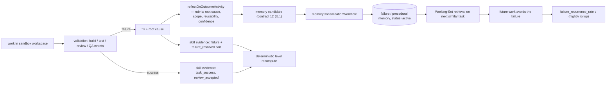
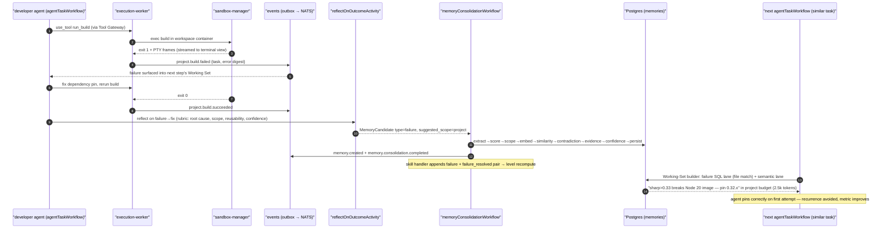

# 13 — Skill & Learning System

Status: v1.0 — Implementation-ready

Skills are how the OS answers "who is actually good at what, and how do we know?" with evidence
instead of vibes. Competency is a first-class, auditable domain concept: every level is the output
of a deterministic formula over concrete evidence rows, every career move is proposed by a manager
agent and gated appropriately, and the learning loop that produces the evidence is wired end-to-end
into the memory subsystem (12-MEMORY-ARCHITECTURE.md).

Binding inputs: `_DECISIONS.md` §11 (tables, evidence kinds, deterministic recompute,
promotion_review, `agent.promotion.recommended`), §6 (seniority enum, autonomy levels), §12
(autonomy matrix). Sibling docs: 04-ORGANIZATION-ENGINE.md (mentors edges, positions),
05-AGENT-LIFECYCLE.md (identity), 07-TASK-ENGINE.md (review/QA gates that generate evidence),
08-AGENT-RUNTIME.md (reflection step), 12-MEMORY-ARCHITECTURE.md (consolidation),
15-ENGINEERING-DEPARTMENT.md (validation gates), 16-MARKETING-DEPARTMENT.md (metrics-driven
evidence), 19-APPROVAL-ENGINE.md (Founder gate), 24-FRONTEND-ARCHITECTURE.md (Skills view).

---

## 1. Principles — and the anti-pattern we explicitly reject

1. **Evidence-based growth only. NO XP gamification.** There is no "+10 XP for completing a task",
   no streaks, no arbitrary point grants, no level-up animations driven by activity volume. That
   anti-pattern rewards *doing things* rather than *doing things well*, is trivially farmable by an
   agent loop, and destroys the signal managers and the delegation engine depend on. Levels here
   are a **pure function of weighted, time-decayed evidence rows** (§4), each of which points at a
   verifiable artifact: an accepted review, a production metric, an experiment result, a resolved
   failure. Delete the levels table and it can be recomputed exactly from evidence.
2. **Deterministic recompute, not LLM judgment.** The level formula (§4.2) is code in
   `packages/domain` (pure, unit-tested). LLMs *produce* evidence artifacts (evaluations, reviews);
   they never set a level.
3. **Negative evidence counts.** Failures subtract; resolved failures add back more than the
   failure subtracted (net learning, §5.5). Skill profiles can go down.
4. **Careers are organizational decisions, not formulas.** Skill levels feed promotion *proposals*;
   seniority changes go through manager recommendation and (for lead+) Founder approval (§6).
5. **Learning is closed-loop and measurable.** The engineering loop (§8) ends in a metric —
   failure recurrence rate — not in a feeling of progress.

---

## 2. Schema

Canonical DDL in 20-DATABASE-DESIGN.md; column-level contract here. All tables `company_id`-scoped,
UUIDv7 ids.

### 2.1 `skills` — company-scoped taxonomy

| Column | Type | Explanation |
|---|---|---|
| `id` | uuid PK | |
| `company_id` | uuid FK NOT NULL | Taxonomy is per-company (a design shop and a SaaS shop need different trees) |
| `name` | text NOT NULL | Unique per company, e.g. `typescript`, `code-review`, `seo-writing` |
| `category` | text NOT NULL | Materialized path into the category tree, e.g. `engineering/backend`, `marketing/content` [WRITER-DECISION: materialized path over parent_id — the tree is shallow (≤3 levels), read-heavy, and path LIKE queries power the matrix UI] |
| `description` | text | Shown in UI and in evaluation prompts |
| `seeded` | bool | True for platform seed rows; seeded rows are editable but not deletable while referenced |
| `created_at` | timestamptz | |

**Seeded defaults** (inserted at company creation; engineering active in MVP, marketing dark until
Phase 2 per A6) [WRITER-DECISION — seed list]:

```
engineering/backend:    typescript, node, api-design, sql-and-modeling, testing, debugging
engineering/frontend:   react, ui-implementation, state-management, accessibility
engineering/devops:     ci-cd, docker, observability, release-management
engineering/quality:    code-review, qa-test-design, security-review
engineering/architecture: system-design, adr-writing, refactoring
management:             delegation, planning, feedback, escalation-handling
communication:          technical-writing, requirements-analysis
marketing/content:      copywriting, seo-writing, script-writing        (Phase 2 activation)
marketing/growth:       experiment-design, funnel-analysis, audience-research
```

### 2.2 `agent_skills` — one row per (agent, skill)

| Column | Type | Explanation |
|---|---|---|
| `id` | uuid PK | Referenced by `skill_evidence.agent_skill_id` |
| `company_id` | uuid FK NOT NULL | |
| `agent_id` / `skill_id` | uuid FK, unique pair | |
| `level` | int 1–5 | Output of the deterministic recompute (§4.2); never written by any other path |
| `score` | real | The raw decayed evidence sum S the level was derived from — stored so UI and proposals can show distance-to-threshold [WRITER-DECISION: persist S alongside level] |
| `confidence` | real 0–1 | How sure we are the level is right: Laplace-smoothed ratio of positive to total evidence weight magnitude, `(pos + 1) / (pos + neg + 2)`, scaled by evidence volume `min(1, evidence_count / 12)` [WRITER-DECISION formula] |
| `last_used_at` | timestamptz | Bumped when a task tagged with this skill reaches DONE with this agent as owner |
| `evidence_count` | int | Denormalized count, maintained by the evidence-append repository method |
| `recomputed_at` | timestamptz | Last run of the level formula |
| `created_at` | timestamptz | Row created lazily on first evidence |

### 2.3 `skill_evidence` — the ground truth

Append-only. Rows are never edited; corrections are compensating rows.

| Column | Type | Explanation |
|---|---|---|
| `id` | uuid PK | |
| `agent_skill_id` | uuid FK NOT NULL | |
| `kind` | enum `task_success \| review_accepted \| production_result \| peer_eval \| manager_eval \| experiment \| failure \| failure_resolved` | Binding enum, `_DECISIONS.md` §11 |
| `weight` | real ∈ [−1, 1] | Signed strength of this evidence. Defaults per kind (§3); producers may deviate within the kind's band (e.g. a marginal review acceptance gets +0.3 instead of +0.5) |
| `ref` | jsonb | Typed pointer: `{task_id}` \| `{review_id}` \| `{event_id}` \| `{experiment_id}` \| `{artifact_id}` — must resolve; repository validates on insert |
| `note` | text | One-line human/LLM rationale, shown in the drill-down UI |
| `created_by` | jsonb | Actor shape `{kind: agent\|founder\|system, id}` |
| `created_at` | timestamptz | Decay clock starts here |

Insert path: only via `appendSkillEvidence` repository method, which (in one transaction) inserts
the row, bumps `evidence_count`, schedules a recompute, and emits `skill.evidence.recorded`
(10-EVENT-ARCHITECTURE.md). Every producer in §5 funnels through it — there is no other write path.

---

## 3. Evidence kinds and default weights

| Kind | Default weight | Band | Produced when |
|---|---|---|---|
| `task_success` | +0.30 | +0.1 … +0.4 | Task tagged with the skill reaches DONE (owner agent); scaled down for subtasks |
| `review_accepted` | +0.50 | +0.3 … +0.6 | An independent reviewer moves REVIEW → QA on the agent's work (07-TASK-ENGINE.md); reviewer's verdict note becomes `note` |
| `production_result` | ±0.70 | −0.9 … +0.9 | Post-deploy/publish measurement window closes: error-rate, perf, or campaign metric vs target; **signed by outcome** |
| `peer_eval` | ±0.40 | −0.5 … +0.5 | A peer evaluation artifact (§5.3) |
| `manager_eval` | ±0.60 | −0.7 … +0.7 | A manager/lead evaluation artifact, incl. `promotion_review` |
| `experiment` | ±0.50 | −0.6 … +0.6 | Experiment concluded (`adopted` positive, `rejected` hypothesis by its designer: small negative or zero — a clean negative result is not incompetence [WRITER-DECISION: rejected-but-well-run = +0.1]) |
| `failure` | −0.40 | −0.8 … −0.2 | Validation failure attributed to this agent+skill: build broken on main, QA_FAILED, prod incident root-caused to their change |
| `failure_resolved` | +0.60 | +0.4 … +0.8 | The same agent root-causes and fixes a failure AND the reflection produces an accepted memory candidate — net learning (§5.5) |

Default weights are constants in `packages/domain/skills/evidence-weights.ts` [WRITER-DECISION —
weights table above], company-overridable in settings (Phase 3).

---

## 4. The deterministic level formula

### 4.1 Decayed score

For agent-skill `as` at recompute time `t`:

```
S(as, t) = Σ over evidence e of as:   weight_e · 2^( − age_days(e, t) / H )
```

Half-life **H = 180 days** [WRITER-DECISION]. Old glory fades: evidence contributes half its weight
after six months, a quarter after a year. Negative evidence decays identically — an agent is not
haunted forever by an old failure, but only `failure_resolved` actively speeds recovery.

### 4.2 Level thresholds and gates

| Level | Meaning | Requires S ≥ | Additional deterministic gates |
|---|---|---|---|
| 1 | novice — has touched it | 0 (first evidence row creates the row at level 1) | — |
| 2 | working proficiency | 3.0 | ≥ 5 evidence rows |
| 3 | solid independent | 8.0 | ≥ 2 distinct positive kinds; ≥ 1 `review_accepted` or `production_result` |
| 4 | advanced | 16.0 | level-3 gates AND an accepted `promotion_review` manager artifact referencing this skill (§6.2) |
| 5 | authority | 28.0 | level-4 gates AND ≥ 1 positive `production_result` AND a second `promotion_review` |

[WRITER-DECISION — threshold values]. The `promotion_review` requirement for levels 4–5 implements
the binding rule "level-up also requires a manager-agent `promotion_review` artifact for senior+
levels" (`_DECISIONS.md` §11). **Downward moves are automatic**: if decay or negative evidence
drops S below the current level's threshold minus a hysteresis margin of 1.0 [WRITER-DECISION],
the recompute lowers the level (no artifact needed to go down) and emits `agent.skill.updated` with
direction `down` — surfaced to the manager for §7 development objectives.

Recompute triggers: every `appendSkillEvidence` (debounced 5 min per agent_skill) plus a nightly
sweep for pure-decay changes [WRITER-DECISION]. Implementation: pure function
`computeSkillLevel(evidence[], now, thresholds)` in `packages/domain`, exhaustively unit-tested,
called from a Temporal activity.

### 4.3 Worked example — Alex crosses into level 3 on `code-review`

Alex (mid backend dev) has these `skill_evidence` rows for `code-review` on 2026-08-10:

| # | kind | weight | age (days) | decay 2^(−age/180) | contribution |
|---|---|---|---|---|---|
| 1 | task_success | +0.30 | 300 | 0.315 | +0.094 |
| 2 | review_accepted | +0.50 | 200 | 0.463 | +0.232 |
| 3 | failure | −0.40 | 150 | 0.561 | −0.224 |
| 4 | failure_resolved | +0.60 | 145 | 0.572 | +0.343 |
| 5 | review_accepted | +0.50 | 90 | 0.707 | +0.354 |
| 6 | peer_eval | +0.40 | 60 | 0.794 | +0.318 |
| 7 | review_accepted | +0.50 | 30 | 0.891 | +0.445 |
| 8 | task_success | +0.30 | 20 | 0.926 | +0.278 |
| 9 | manager_eval | +0.60 | 5 | 0.981 | +0.589 |

Before row 9: S = 1.840. The recompute triggered by row 9 yields S = 2.429 → still level 2
(threshold 8.0 not met). This shows the anti-gamification property: nine mostly-positive evidence
rows over ten months yield a modest score; **volume alone cannot reach level 3**. Alex reaches
level 3 only after sustained *recent* high-value evidence — e.g. six more `review_accepted`
(+0.5 each, near-zero decay) plus two `production_result` (+0.7) over the next quarter pushes
S ≈ 2.4·(decayed) + 3.0 + 1.4 ≈ 8.3 ≥ 8.0, and the gates hold (distinct kinds ✓,
review_accepted ✓) → recompute sets `level = 3`, emits `skill.level.changed {from:2, to:3}`,
and the Skills UI growth timeline (§10) plots the crossing. Note rows 3–4: the failure cost
−0.224 but its resolution earned +0.343 — **net +0.119 for having failed and learned** (§5.5).

---

## 5. Assessment flows (evidence producers)

All producers call `appendSkillEvidence`; skill attribution comes from the task's `context.skills`
tags (set at decomposition by the delegating manager, 07-TASK-ENGINE.md) or the artifact's explicit
skill refs.

### 5.1 Review acceptance → evidence

When an independent reviewer's verdict moves a task REVIEW → QA (`reviewVerdict` signal,
07-TASK-ENGINE.md), the review-completion handler appends `review_accepted` (+band per verdict
quality: "approve" +0.5, "approve with nits" +0.3) for each skill tag on the task, `ref =
{review_id}`. CHANGES_REQUESTED appends nothing (not a failure — normal iteration); a *third*
consecutive CHANGES_REQUESTED on the same task appends `failure` −0.2 [WRITER-DECISION].

### 5.2 Production result → evidence

Deploy/publish creates a **measurement window** (default 72h [WRITER-DECISION]) tracked by a
Temporal timer in the deploy/publish workflow. Window close evaluates the tagged success metric
(error budget, perf target, campaign KPI): met → `production_result` positive for the implementing
agent's tagged skills; breached with root cause attributed (via incident/QA analysis) →
negative `production_result` + potentially a `failure` row from the incident flow (§5.5).

### 5.3 Peer / manager evaluation artifacts

Evaluations are **artifacts, not vibes**: a structured markdown artifact (template in
`packages/domain/skills/eval-template.ts`) produced by an evaluation task — sections: observed
work refs (≥2 required), strengths per skill, gaps per skill, recommended weight per skill within
the kind's band. The artifact is stored via the artifact system (07-TASK-ENGINE.md), then parsed
into `peer_eval`/`manager_eval` rows, `ref = {artifact_id}`. Managers run scheduled quarterly
evaluation tasks per report (delegation engine schedules them); peers evaluate on request
(mentoring, §7).

### 5.4 Experiment outcomes

`experiment.completed` handler maps the experiment's designer/executor agents to
`experiment-design` / domain skills: `adopted` → +0.5, `inconclusive` → 0 (no row),
`rejected` with clean methodology → +0.1 (§3). Marketing's primary lane (§9).

### 5.5 Failure and failure_resolved pairs — net learning

A validation failure attributed to agent+skill (build broken, QA_FAILED, incident) appends
`failure` (−0.4) with `ref = {event_id}`. When the *same agent* subsequently root-causes and fixes
it AND the reflection activity's memory candidate survives consolidation
(12-MEMORY-ARCHITECTURE.md §5 — i.e. the lesson was real enough to persist), the handler appends
`failure_resolved` (+0.6) referencing both the fix task and the memory id. Net effect **+0.2**:
the system values a failure-plus-genuine-lesson slightly above never having failed on nothing, and
strictly below a clean `review_accepted`. Unresolved failures stay net negative. This pairing is
the skill-side of the learning loop in §8.

---

## 6. Career ladder — junior → mid → senior → staff → lead → expert

Seniority (`agents.seniority`, `_DECISIONS.md` §6) is per-agent, not per-skill. It is a
*management judgment gated by evidence*, distinct from skill levels.

### 6.1 Promotion proposal flow

1. **Eligibility scan** (nightly, per manager's reports): a report is flagged eligible when their
   position's core skills (defined on `positions` rows, 04-ORGANIZATION-ENGINE.md) meet the target
   seniority's skill-level profile [WRITER-DECISION profile: mid = core skills ≥ 2; senior = core
   ≥ 3 with one ≥ 4; staff = two core ≥ 4; lead = staff profile + `delegation` ≥ 3 +
   `feedback` ≥ 3; expert = one core skill = 5 + two ≥ 4] AND tenure at current seniority ≥ 90
   days [WRITER-DECISION].
2. **Manager judgment**: the manager agent reviews the flag in its own runtime (it may decline —
   eligibility ≠ entitlement) and, if convinced, authors the **`promotion_review` artifact**:
   evidence summary per core skill (with `skill_evidence` refs), examples of work at the target
   level, risks, development plan. Required for senior and above; for junior→mid the
   recommendation alone suffices [WRITER-DECISION].
3. **Recommendation**: manager emits `agent.promotion.recommended` (binding event) with the
   artifact ref.
4. **Approval gate**: for target seniority **lead or expert** (configurable set, default lead+ per
   `_DECISIONS.md` §11) the recommendation becomes a structured Founder approval request in the
   Approval Center (19-APPROVAL-ENGINE.md), including the artifact and the skill matrix delta.
   Below lead: the manager's own manager (or the executive) approves via the normal review
   mechanism — Founder is not interrupted (`_BRIEF.md` §2.1).
5. **Effect**: on approval, `agents.seniority` updates, `agent.promoted` event, employment JSONB
   appends the promotion record, office UI badge updates.

Demotion follows the same path with `agent.demotion.recommended` [WRITER-DECISION event name],
manager-initiated, Founder-gated at the same boundary.

### 6.2 Seniority effects (what it actually changes)

| Effect | Mechanism |
|---|---|
| Autonomy defaults | Default `autonomy_level` per seniority: junior L1, mid L2, senior L3, staff L3, lead L4, expert L4 [WRITER-DECISION] — feeding the Tool Gateway matrix (`_DECISIONS.md` §12); per-agent overrides allowed |
| Reviewer eligibility | REVIEW→{CHANGES_REQUESTED, QA} transitions require reviewer capability = senior+ in a relevant skill at level ≥ 3, or lead+ (07-TASK-ENGINE.md permissions) |
| Capacity weight | Delegation engine's load balancing weighs assignments by seniority capacity units: junior 1.0, mid 1.4, senior 1.8, staff 2.0, lead 1.2 (leads reserve capacity for management), expert 2.2 [WRITER-DECISION] |
| Escalation targets | help_request routing prefers senior+ peers before leads (06-AUTONOMY-AND-ESCALATION.md resolution order) |
| Mentoring eligibility | `mentors` edges (§7) require mentor seniority ≥ senior and skill level ≥ mentee's target level + 1 |

---

## 7. Development objectives

Managers close skill gaps deliberately, not accidentally:

- **Weakness identification**: nightly analysis flags per-report weaknesses — (a) skill with ≥ 3
  `failure` rows in 90 days lacking matching `failure_resolved` (a *failure cluster*), (b) core
  position skill below the position's expected level, (c) `skill.level.changed direction=down`
  events. Flags land in the manager's inbox as a digest (14 §Communication).
- **Learning tasks**: the manager creates development tasks (normal `tasks` rows, `context.kind =
  'development'` [WRITER-DECISION tag]) — e.g. "add integration tests to module X" targeting the
  `testing` skill — real work chosen for growth. Their completion produces ordinary evidence; no
  special XP path (§1).
- **Mentoring**: manager creates an `org_edges(kind=mentors)` edge (04-ORGANIZATION-ENGINE.md).
  Effects: mentor is preferred reviewer for the mentee's tagged tasks; a recurring pairing task
  prompts mentor peer_evals; mentee's help_requests route to mentor first. Edge ends
  (`ended_at`) when the objective's target level is reached.
- **Objectives tracking**: `development_objectives` table [WRITER-DECISION]: id, company_id,
  agent_id, skill_id, target_level, due_date, created_by_agent_id, status
  (`open|met|missed|cancelled`), linked task ids. Rendered on the agent profile (§10) and in the
  manager's team view; `met` is set by the recompute when the target level is reached.

---

## 8. The engineering learning loop — end to end

The loop (`_BRIEF.md` §4): **work → validation → failure/success → reflection → memory candidate →
consolidation → future retrieval → measurably fewer repeat failures.**

### 8.1 Loop stages

1. **Work**: `agentTaskWorkflow` executes in a sandboxed workspace (08-AGENT-RUNTIME.md, §13
   sandboxing).
2. **Validation events**: builds/tests/reviews emit `project.build.failed`, `project.tests.failed`,
   `review.completed` (verdict `changes_requested`), `task.status.changed` (to `QA_FAILED`) — real events from real executions
   (15-ENGINEERING-DEPARTMENT.md gates).
3. **Reflection activity**: on failure-then-resolution (or terminal task states), the runtime runs
   `reflectOnOutcomeActivity` — an LLM root-cause analysis producing a memory candidate scored
   against a **reflection rubric**: *root cause* (identified mechanism, not symptom), *scope*
   (project-bound vs portable — feeds scope detection), *reusability* (would this prevent a future
   failure? cite the class of task), *confidence* (evidence-backed per the §12 doc's rubric).
   Output validates against the `MemoryCandidate` contract (12-MEMORY-ARCHITECTURE.md §5.1) with
   `type='failure'` or `'procedural'`.
4. **Consolidation**: candidate enters `memoryConsolidationWorkflow` (trigger: reflection
   submission) — dedupe/contradiction/evidence/confidence → persisted or merged.
5. **Skill evidence**: the same resolution appends the `failure`/`failure_resolved` pair (§5.5).
6. **Future retrieval**: the next similar task's Working Set surfaces the memory via the failure
   SQL lane (file match) or semantic lane (12-MEMORY-ARCHITECTURE.md §7).
7. **Measurable outcome**: metric `failure_recurrence_rate` = share of validation failures whose
   root-cause class (normalized signature: error class + component [WRITER-DECISION]) already had
   an active failure memory at failure time. Computed nightly into cost/quality rollups; dashboard
   in 25-OBSERVABILITY.md. A learning system that works drives this toward zero; a rising rate with
   healthy retrieval means memories aren't being written well — both cases are diagnosable from
   `memory_retrievals` (12 §7.5).



### 8.2 Sequence: build failure → learning memory (the `_BRIEF.md` §11 proof path)



---

## 9. Marketing learning parallels (Phase 2, schema in MVP)

The marketing org (16-MARKETING-DEPARTMENT.md) reuses this system unchanged — only the evidence
producers differ: `production_result` rows come from post-publish analytics windows (views,
retention, CTR vs target), `experiment` rows from the Experiment Engine (hypothesis→variant→
metrics→decision, 30-PHASE-2.md), and the reflection rubric analyzes content performance instead
of build logs ("hook style X underperforms for audience Y" → project-scope `experiment`/`semantic`
memories). Skill rows under `marketing/*` are seeded dark in MVP (§2.1, A6) so Phase 2 activation
is data-only. The loop's shape — publish → metrics → analysis → hypothesis → adjustment → next
content improves — maps stage-for-stage onto §8.1.

---

## 10. Skills UI (frontend specification)

Route `/skills` (24-FRONTEND-ARCHITECTURE.md view #Skills). Real rows only, live-updated via
`skill.evidence.recorded` / `agent.skill.updated` events on `/ws`.

1. **Skill matrix per team**: grid of agents (rows, grouped by org_unit) × skills (columns,
   grouped by category path); cells show level 1–5 as filled steps with confidence as opacity;
   column filters by category; gap highlighting against the position's expected profile (§6.1);
   click cell → drill-down.
2. **Agent skill profile page**: per-agent radar/bar of levels by category (Recharts), seniority
   badge with tenure, open development objectives with progress, mentors/mentees (org_edges),
   eligibility indicator ("2.1 points from senior profile" — uses stored `score`).
3. **Evidence drill-down**: for one agent_skill — the full `skill_evidence` list newest-first,
   each row with kind chip, signed weight, decayed contribution *today*, resolved ref link
   (review, task, event, artifact, experiment), note; a running-total column reproducing S so the
   level is visibly explainable — the anti-black-box view.
4. **Growth timeline**: per agent or agent_skill — S(t) line with level-threshold bands, markers
   for evidence rows (color by kind, negative below axis), level crossings and promotions
   annotated; the §4.3 worked example is literally this chart for Alex.
5. **Manager tools** (visible for Founder + rendered read-only summaries of manager-agent
   activity): weakness flags digest, eligibility scan results, pending `agent.promotion.recommended`
   items with links into the Approval Center for lead+ cases.

---

## 11. Events emitted by this subsystem

`skill.evidence.recorded`, `agent.skill.updated`, `agent.promotion.recommended`,
`agent.promoted`, `agent.demotion.recommended`, `development.objective.created`,
`development.objective.met` — catalog entries in 10-EVENT-ARCHITECTURE.md; all via the
transactional outbox.
