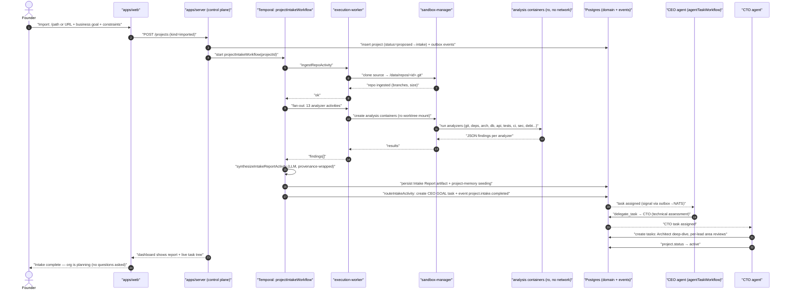
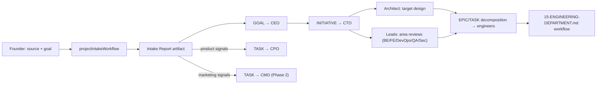
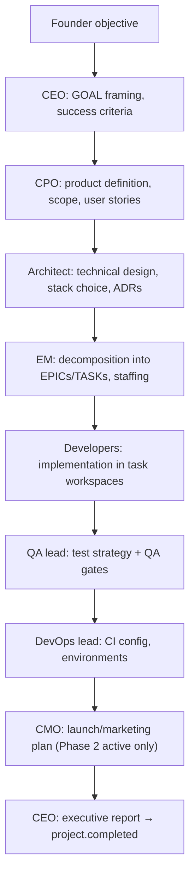

# 14 — Project Runtime

Status: v1.0 — Implementation-ready

Project is a first-class domain entity: the unit that binds a business objective to a repository,
a team, a memory namespace, environments, deployments, documentation, and a task tree. This document
specifies the project schema, the project state machine (per `_DECISIONS.md` §19), the **Project
Intake** subsystem (import of existing codebases — a critical Founder flow), the greenfield creation
flow, deployment tracking, and the Project Dashboard contract for `apps/web`.

Cross-references: task engine in 07-TASK-ENGINE.md, agent loop in 08-AGENT-RUNTIME.md, workflows in
09-WORKFLOW-ENGINE.md, memory scoping in 12-MEMORY-ARCHITECTURE.md, git/workspace mechanics in
15-ENGINEERING-DEPARTMENT.md, sandbox levels in 17-TOOL-GATEWAY.md and 18-PERMISSIONS-AND-SECURITY.md,
full DDL in 20-DATABASE-DESIGN.md.

---

## 1. Domain model

### 1.1 `projects` table

| Column | Type | Notes |
|---|---|---|
| `id` | uuidv7 PK | |
| `company_id` | uuid FK NOT NULL | tenant scope (`_DECISIONS.md` §4) |
| `number` | int | per-company sequence; rendered `PRJ-7` |
| `slug` | text | kebab-case, unique per company; used in paths and channel names |
| `name` | text | display name |
| `kind` | enum `greenfield \| imported` | immutable after creation |
| `status` | enum | state machine §1.2 |
| `business_objective` | text (markdown) | the Founder's goal — the ONLY mandatory Founder input |
| `desired_outcome` | text | measurable end state ("public beta with 100 signups") |
| `constraints` | jsonb | `{budget_cents, deadline, tech_constraints[], compliance[], out_of_scope[]}` |
| `owner_agent_id` | uuid FK nullable | executive owner (usually CEO or CTO agent) |
| `sponsor` | enum `founder \| agent` + ref | who commissioned it |
| `repository_id` | uuid FK nullable | §1.4; nullable until repo initialized during intake |
| `settings` | jsonb | §1.3 |
| `root_goal_task_id` | uuid FK nullable | the GOAL task anchoring the project's task tree |
| `intake_report_artifact_id` | uuid FK nullable | imported projects only |
| `health` | enum `green \| yellow \| red` | recomputed by `projectHealthWorkflow` (nightly + on key events) [WRITER-DECISION] |
| `created_at`, `activated_at`, `completed_at` | timestamptz | |

### 1.2 Project state machine (canonical, `_DECISIONS.md` §19)

`proposed → intake → active ⇄ paused → {completed, archived, cancelled}`

| Transition | Allowed actor | Emits |
|---|---|---|
| `proposed → intake` | Founder, or CEO agent (autonomy ≥ L3) | `project.intake.started` |
| `intake → active` | CTO agent after intake routing tasks created; greenfield: automatic when architecture task tree exists | `project.activated` |
| `active → paused` / `paused → active` | manager-or-above agent, or Founder | `project.paused` / `project.resumed` |
| `active → completed` | CEO agent, requires root GOAL task = DONE | `project.completed` |
| `active/paused → cancelled` | Founder only (destructive business decision → Approval Engine, 19-APPROVAL-ENGINE.md) | `project.cancelled` |
| `completed → archived` | automatic after 30 days idle, or Founder [WRITER-DECISION] | `project.archived` |

Guards enforced in `packages/domain` (pure state machine, same pattern as tasks in
07-TASK-ENGINE.md). `intake` is skipped structurally for greenfield only in the sense that its body
differs — greenfield projects still pass through `intake` while the planning chain (§5) runs, so the
state machine has exactly one shape. Every transition writes `project.status.changed` to the outbox.

### 1.3 `settings` JSONB (defaults shown)

```jsonc
{
  "default_branch": "main",
  "merge_strategy": "squash",              // see 15-ENGINEERING-DEPARTMENT.md §5.5
  "quality_gates": { /* per-project gate config, 15-ENGINEERING-DEPARTMENT.md §6.2 */ },
  "workspace_image": "acos/workspace-node", // default image; per-task override allowed
  "publish_requires_approval": true,        // marketing publish gate (16-MARKETING-DEPARTMENT.md)
  "deploy_requires_approval": true,
  "language": "en",                         // company-facing output language override
  "token_budget_daily_cents": null          // null = inherit company budget (26-COST-MANAGEMENT.md)
}
```

### 1.4 `repositories` table

One row per project repo. The platform is the git origin (ADR-010): a **bare repo** at
`/data/repos/<project_id>.git` on the shared data volume, owned by `sandbox-manager`.

| Column | Type | Notes |
|---|---|---|
| `id` | uuidv7 PK | |
| `company_id`, `project_id` | uuid FK | 1:1 with project in MVP; schema allows N:1 for Phase 3 monorepo-of-projects |
| `bare_path` | text | always `/data/repos/<project_id>.git` — derived, stored for audit |
| `default_branch` | text | `main` |
| `origin_kind` | enum `local_import \| git_url \| empty` | how it was seeded |
| `origin_ref` | text nullable | source URL/path (secret-stripped) |
| `remotes` | jsonb | optional sync remotes: `[{name:"github", url, direction:"push"\|"pull"\|"both", auth_secret_id}]` |
| `sync_status` | jsonb | last push/pull result per remote |
| `head_commit`, `size_bytes`, `stats` | | refreshed by `repoStatsActivity` after merges |

GitHub sync is **optional** (A7): a `git.remote.push` tool (risk R2 — leaves the machine) that leads
invoke post-merge; credentials injected server-side per S2. The bare repo remains the source of
truth even when a GitHub remote exists — remote divergence raises `repo.sync.diverged` and a lead
task, never silent force-push.

### 1.5 `project_members`

| Column | Notes |
|---|---|
| `project_id`, `agent_id` | composite PK |
| `role` | enum `owner \| lead \| contributor \| reviewer \| observer` |
| `allocation` | 0–1 fraction of capacity (delegation engine uses it for load balancing) |
| `added_by_agent_id`, `added_at`, `removed_at` | membership is historical, never deleted |

Membership gates access: the Tool Gateway (17-TOOL-GATEWAY.md) denies fs/git tools against a
project's repo/workspaces for non-members; project channels (11-COMMUNICATION-SYSTEM.md) auto-sync
membership; project-scope memory retrieval (12-MEMORY-ARCHITECTURE.md) requires membership.

### 1.6 `environments`

| Column | Notes |
|---|---|
| `id`, `company_id`, `project_id` | |
| `name` | `local`, `staging`, `production` (free-form; these three seeded) |
| `kind` | enum `sandbox \| external` — sandbox = testing-level service containers; external = real infra (Phase 3 deploy sandbox) |
| `base_url`, `config` jsonb | non-secret config; secrets via secret refs only |
| `protection` | enum `open \| approval_gated` — `production` seeds as `approval_gated` (A8, S6-adjacent) |
| `status` | enum `provisioning \| up \| down \| unknown` |

### 1.7 Memory namespace binding

Creating a project creates its memory namespace implicitly: project-scoped rows in `memories` use
`scope='project', scope_ref=<project_id>` (12-MEMORY-ARCHITECTURE.md). Binding rules:

- Intake seeds the namespace: every Intake Report section becomes an `artifact`-type memory plus
  extracted `semantic`/`decision` candidates through the normal consolidation pipeline.
- ADRs, conventions, and module boundaries maintained by the Architecture Guardian
  (15-ENGINEERING-DEPARTMENT.md §7) live here as `decision`/`procedural` memories.
- On `project.archived`, project memories move to `status='archived'` but remain retrievable for
  promotion evidence; on `cancelled` they are archived immediately. Nothing is deleted.

### 1.8 Documentation artifacts

`artifacts` table (shared with tasks; defined in 20-DATABASE-DESIGN.md): id, company_id, project_id,
task_id nullable, kind (`intake_report | adr | design_doc | runbook | report | media | other`),
title, format (`markdown | json | binary_ref`), content (markdown/json inline; binaries at
`/data/artifacts/<id>` [WRITER-DECISION]), version, created_by_agent_id, created_at. Artifacts are
immutable per version; new versions link `previous_version_id`. The Project Dashboard "Docs" tab
lists them; agents retrieve them via the `artifact.read` tool (R0).

---

## 2. Founder import UX (contract for `apps/web`)

One screen, three fields — nothing technical is asked:

1. **Source** — local path (`/home/founder/dev/shopapp`) or git URL. Local paths must be under
   directories allowlisted in platform config (`IMPORT_ALLOWED_PATHS`); URLs fetched via egress
   proxy. Private URL remotes accept a one-time credential stored as a secret.
2. **Business goal / desired outcome** — free text; becomes `business_objective` + `desired_outcome`.
3. **Constraints** (optional) — budget, deadline, "don't touch X", compliance notes.

The Founder never selects languages, frameworks, team members, or tasks — intake discovers and the
org decides. Submitting creates the project (`status=proposed`), immediately transitions to
`intake`, and starts `projectIntakeWorkflow` (Temporal, runs in `workers/agent-worker` with
sandboxed activities on `workers/execution-worker`).

Security note (S5): an imported repo is **untrusted content**. Analysis containers run at
`analysis` sandbox level (read-only mount, **no network**); intake LLM prompts wrap all repo-derived
text in provenance markers; no repo content can trigger tool calls above R0 during intake
(34-THREAT-MODEL.md, malicious-repo scenario).

---

## 3. `projectIntakeWorkflow` (existing project import)

### 3.1 Stages

| # | Stage | Activity / executor | Output |
|---|---|---|---|
| 1 | **Ingest** | `ingestRepoActivity` (execution-worker → sandbox-manager): clone source into bare repo `/data/repos/<id>.git`, verify integrity, record size/branches/tags | `repositories` row, `project.repo.ingested` |
| 2 | **Static analysis** | fan-out of analyzer activities, each in a fresh `analysis`-level container with the repo worktree mounted read-only, no network | per-analyzer JSON findings |
| 3 | **Synthesis** | `synthesizeIntakeReportActivity` (LLM, `reasoning` purpose): merge analyzer JSON into the Intake Report | artifact `kind=intake_report` |
| 4 | **Memory seeding** | `memoryConsolidationWorkflow` child run over report sections | project-scope memory candidates |
| 5 | **Routing** | `routeIntakeActivity`: create the routing task tree (§3.4) | tasks + `project.analysis.completed` |

Analyzer fan-out (stage 2) — each is a deterministic CLI toolchain inside the container producing
JSON, not an LLM (LLM interprets in stage 3): git history & branch topology; languages & frameworks
(linguist-style + manifest parsing); dependency graph & lockfile audit (known CVEs from an offline
DB snapshot [WRITER-DECISION]); folder structure & module map; architecture heuristics (entrypoints,
layering, cycles); database schema (migrations/ORM models); API surface (routes/OpenAPI/proto);
test inventory & coverage config; CI/CD config; env & config variables (names only — values never
extracted, S2); docs inventory; security smells (hardcoded secrets patterns, dangerous deps);
debt/quality metrics (complexity, duplication, TODO density, file size outliers).

Failure handling: individual analyzer failure marks its section "analysis unavailable" and
continues; ingest failure fails the workflow → project returns to `proposed` with a Founder-visible
error (this is a setup error, not an escalation). Timeout budget: 30 min wall clock, per-analyzer
5 min [WRITER-DECISION].

### 3.2 PROJECT INTAKE REPORT — canonical structure

Markdown artifact, sections fixed (consumers depend on headings):

1. **Executive summary** — what this codebase is, in business terms, ≤ 300 words.
2. **Repository profile** — size, age, commit cadence, contributors, branch/tag topology.
3. **Technology stack** — languages %, frameworks, runtimes, build tooling.
4. **Architecture assessment** — module map, layering, entrypoints, detected patterns, cycles.
5. **Dependency health** — direct/transitive counts, outdated, vulnerable (CVE list), license flags.
6. **Data layer** — DB engines, schema summary, migration state.
7. **API surface** — endpoints/contracts inventory.
8. **Test & CI status** — test count, frameworks, coverage config, CI pipelines found, gaps.
9. **Configuration & environments** — env var names, config files, deployment hints.
10. **Documentation state** — what exists, freshness, gaps.
11. **Security findings** — smells, secret-pattern hits (redacted), risky patterns.
12. **Technical debt register** — ranked list with effort estimates (S/M/L).
13. **Quality metrics** — complexity, duplication, hotspots (churn × complexity).
14. **Product/market signals** — landing pages, analytics SDKs, payment/social integrations found
    (drives CPO/CMO routing).
15. **Recommended plan** — proposed initiative breakdown mapped to the Founder's objective.
16. **Open questions for the organization** — resolved by agents through the hierarchy, not the Founder.

### 3.3 Sequence diagram — existing project import (REQUIRED)



### 3.4 Automatic routing (stage 5)

`routeIntakeActivity` creates a task tree — no Founder involvement:

- **GOAL task → CEO agent**: "Deliver: <business_objective>" with the report attached
  (`context.artifact_ids`). CEO's `agentTaskWorkflow` starts on assignment.
- CEO delegates an **INITIATIVE → CTO**: "Technical assessment & delivery plan".
- CTO decomposes (standard delegation engine, 07-TASK-ENGINE.md): **Architect** — architecture
  deep-dive & target design; **per-lead TASKs** (Backend/Frontend/DevOps/QA/Security leads per org
  graph) — area review from report sections 4–13, each producing a plan artifact.
- **Conditional routing on report signals** (deterministic rules in `routeIntakeActivity`, not LLM):
  section 14 shows product surface (user-facing app, analytics, funnels) → CPO agent TASK
  "Product assessment"; shows marketing surface (landing pages, social/ads SDKs, SEO artifacts) →
  CMO agent TASK "Marketing assessment" (dark until Phase 2 activation — task created only if a CMO
  agent exists and marketing dept is active, else a `decision` memory notes the deferral).
- If a role is unfilled (no Architect hired), the task routes to the nearest ancestor in the
  `reports_to` chain (CTO), who may hire (05-AGENT-LIFECYCLE.md) or absorb — never to the Founder.

### 3.5 Project Import Flow (routing view)



---

## 4. Greenfield creation flow

Founder input: name + business objective + desired outcome + constraints (same minimal contract; no
source). `repositories` row created with `origin_kind=empty`; bare repo initialized with an empty
`main` plus a seeded scaffold commit (README, .editorconfig, LICENSE placeholder)
[WRITER-DECISION]. Project enters `intake` while the planning chain runs, then `active`.

The chain is **tasks through the hierarchy**, not a hardcoded pipeline — each arrow is a
`delegate_task`/`create_task` by the upstream agent's own loop:



Unfilled roles collapse upward exactly as in §3.4. The Architect's design doc and stack ADRs become
project memory before the first coding task starts, so every developer Working Set retrieves them.

---

## 5. Deployments tracking

`deployments` table: id, company_id, project_id, environment_id, task_id (the deploy task),
triggered_by_agent_id, commit_sha, version_label, status
(`pending → running → {succeeded, failed, rolled_back}`) [WRITER-DECISION — state enum],
started_at, finished_at, logs_artifact_id, health_check jsonb.

MVP scope: deployments to `sandbox`-kind environments only (testing-level service containers used
for QA/preview); `deploy` sandbox level and external environments are Phase 3 (`_DECISIONS.md` §13).
Rows and events (`deployment.started/succeeded/failed`) exist from MVP so the dashboard and cost
attribution are stable. Any deployment to an `approval_gated` environment requires an Approval
Engine verdict regardless of autonomy level (destructive-prod category, S6).

---

## 6. Project Dashboard spec (frontend contract)

Route `/projects/:id` in `apps/web` (24-FRONTEND-ARCHITECTURE.md). Tabs and their data sources —
all read models are Postgres queries exposed via REST (21-API-DESIGN.md), live-updated by `/ws`
events (22-REALTIME-ARCHITECTURE.md):

| Tab | Contents | Source |
|---|---|---|
| **Overview** | objective, outcome, constraints, status, health, owner, members, key metrics (open tasks by state, burn vs budget, last deploy) | `projects`, rollups |
| **Intake Report** | rendered artifact (imported projects) with per-section deep links | `artifacts` |
| **Tasks** | task tree (GOAL→SUBTASK), Cytoscape DAG of dependencies, state filters | `tasks`, `task_dependencies` |
| **Repository** | branches, open PRs/reviews, recent merges, remotes sync status, workspace list with live states | `repositories`, `reviews`, `workspaces` (15-ENGINEERING-DEPARTMENT.md) |
| **Environments & Deploys** | env cards, deployment history, logs artifacts | `environments`, `deployments` |
| **Memory** | project-scope Memory Observatory filtered view | 12-MEMORY-ARCHITECTURE.md |
| **Docs** | artifact list (ADRs, designs, runbooks) with version history | `artifacts` |
| **Activity** | project-filtered event timeline | `events` (project_id subject ref) |
| **Costs** | spend by agent/task/kind vs project budget | `cost_entries`, `budgets` (26-COST-MANAGEMENT.md) |

Health computation [WRITER-DECISION]: `red` if any of — budget hard-breach, > 20% tasks BLOCKED,
deadline passed with GOAL not DONE; `yellow` if soft-budget breach, review queue age p50 > 24h, or
QA failure rate > 30% over 7 days; else `green`. Deterministic SQL, not LLM.

---

## 7. Events emitted by this module

`project.created`, `project.status.changed`, `project.intake.started`, `project.repo.ingested`,
`project.analysis.completed`, `project.member.added`, `project.member.removed`,
`repo.sync.diverged`, `project.deployment.started`, `project.deployment.completed`,
`project.deployment.failed`,
`artifact.created`. All follow `_DECISIONS.md` §9 (outbox, per-company seq, Zod schemas in
`packages/events`); full catalog in 10-EVENT-ARCHITECTURE.md.

---

## 8. Invariants

- P1. A project's bare repo path is derived from its id; never user-supplied.
- P2. Intake analysis containers are always `analysis` level: read-only, no network — no exceptions.
- P3. Repo-derived content is provenance-marked untrusted in every prompt (S5).
- P4. The Founder supplies only goal/outcome/constraints; any flow requiring more Founder input at
  import time is a design bug.
- P5. Project state transitions only via the domain state machine; `cancelled` only via Approval
  Engine with Founder verdict.
- P6. Every intake produces exactly one versioned Intake Report artifact, even for degraded
  (partial-analyzer-failure) runs.
