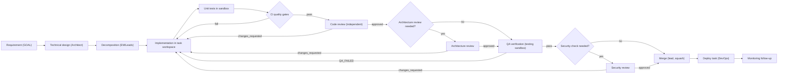
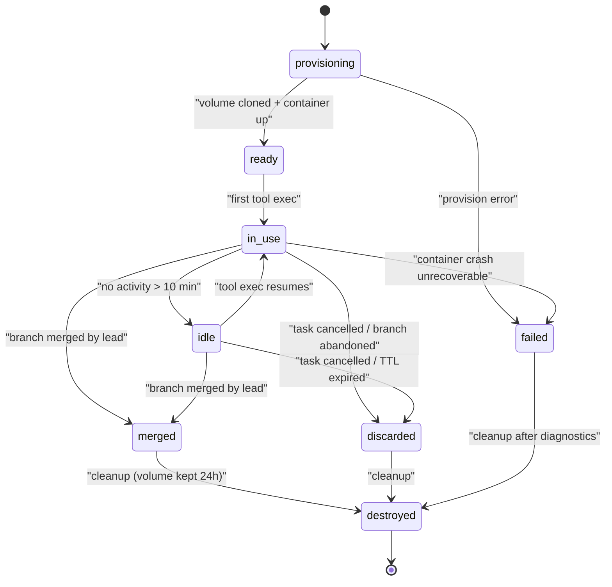
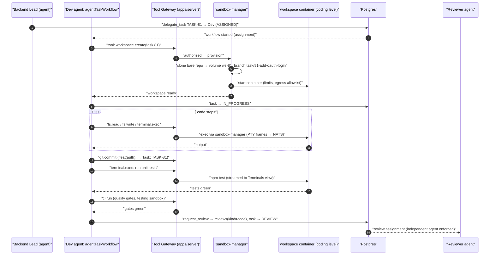
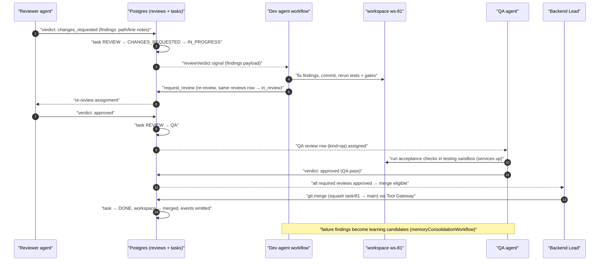

# 15 — Engineering Department

Status: v1.0 — Implementation-ready

Engineering is the MVP proof department (A6): a real team of persistent agent employees executing
the canonical software workflow inside sandboxed git workspaces, with independent review, QA and
security gates, CI quality gates, and an Architecture Guardian that keeps the codebase healthy
without ever bothering the Founder.

Cross-references: org graph 04-ORGANIZATION-ENGINE.md, task machine 07-TASK-ENGINE.md, agent loop
08-AGENT-RUNTIME.md, projects/repos 14-PROJECT-RUNTIME.md, tool gateway 17-TOOL-GATEWAY.md,
sandbox security 18-PERMISSIONS-AND-SECURITY.md, events 10-EVENT-ARCHITECTURE.md, skills
13-SKILL-AND-LEARNING-SYSTEM.md. Binding decisions: `_DECISIONS.md` §7 (task machine), §13
(git/sandbox), §19 (workspace state machine).

---

## 1. Default org template (template only — fully editable)

Hiring a "Software Engineering Department" from the template gallery seeds `org_units`, `positions`
and draft `agents` (Founder confirms/renames/removes before activation; the org graph stays fully
dynamic per `_DECISIONS.md` §5 — nothing below is hardcoded in behavior):

| Position | Unit | Seniority | Autonomy (default) | Reports to |
|---|---|---|---|---|
| CTO | Engineering (department) | expert | L4 | CEO |
| Engineering Manager (EM) | Engineering | lead | L3 | CTO |
| Software Architect | Engineering | staff | L3 | CTO |
| Backend Lead | Backend (team) | lead | L3 | EM |
| Frontend Lead | Frontend (team) | lead | L3 | EM |
| DevOps Lead | Platform (team) | lead | L3 | EM |
| QA Lead | Quality (team) | lead | L3 | EM |
| Security Lead | Security (team) | lead | L3 | CTO |
| Backend Engineer ×2 | Backend | mid/senior | L2 | Backend Lead |
| Frontend Engineer ×2 | Frontend | mid/senior | L2 | Frontend Lead |
| QA Engineer | Quality | mid | L2 | QA Lead |

The **Architecture Guardian** (§7) is a *role capability* attached by default to the Architect
position, not a separate hire. Template lives as seed data in `packages/db` migrations
(`org_templates` table) [WRITER-DECISION]; companies clone and edit freely.

## 2. Canonical software workflow → task states & entities

The brief's chain maps onto the canonical task machine (`_DECISIONS.md` §7) plus the `reviews`
entity — no new task states are invented:

| Workflow step | Representation |
|---|---|
| Requirement | GOAL/INITIATIVE task (CEO/CPO) with `success_criteria[]` |
| Technical design | Architect TASK producing `design_doc` artifact + `decision` memories (ADRs) |
| Decomposition | EM/lead `delegate_task` → EPIC → TASK → SUBTASK (DAG deps) |
| Implementation | owner task `IN_PROGRESS`, workspace container active |
| Unit test | part of implementation; gate G-tests must pass before REVIEW |
| Code review | `IN_PROGRESS → REVIEW`; `reviews` row kind=`code` |
| Architecture review | `reviews` row kind=`architecture` — required when task labels touch guarded modules (§7.3), else skipped |
| QA | `REVIEW → QA`; `reviews` row kind=`qa` executed by QA agent in testing sandbox |
| Security check | `reviews` row kind=`security` — required for auth/crypto/deps/input-surface labels [WRITER-DECISION: label-driven requirement matrix in project settings] |
| CI | quality gates (§6) — must be green before any review verdict can approve |
| Merge | lead merges via git tools after all required verdicts |
| Deploy | DevOps TASK; MVP: sandbox environments (14-PROJECT-RUNTIME.md §5) |
| Monitoring | `monitoring` follow-up TASK auto-created for deployed changes [WRITER-DECISION] |

### 2.1 `reviews` table (the PR entity, ADR-010)

id, company_id, project_id, task_id, workspace_id, kind (`code | architecture | qa | security`),
branch, base_branch, head_commit, reviewer_agent_id, requested_by_agent_id, status
(`pending → in_review → {approved, changes_requested, blocked}`), verdict_note (markdown),
findings jsonb (structured: `[{path, line?, severity, note}]`), created_at, decided_at.
A task may hold several review rows (one per required kind); **all required kinds must be
`approved`** before merge. Review verdicts signal the owner's `agentTaskWorkflow`
(`reviewVerdict` signal) and drive the task transitions `REVIEW → {CHANGES_REQUESTED, QA}` and
`QA → {QA_FAILED, APPROVAL|DONE}`.

### 2.2 Reviewer independence rule

Enforced twice, structurally: (1) the task-machine transition permission matrix
(`_DECISIONS.md` §7) — only an agent **different from the owner** holding reviewer capability may
execute `REVIEW → {CHANGES_REQUESTED, QA}`; (2) `reviews` INSERT is rejected in the domain layer if
`reviewer_agent_id ∈ {task.owner_agent_id, any commit author on the branch}`. Reviewer selection:
requesting agent proposes; the delegation engine picks the least-loaded eligible agent in the same
team, else the lead; leads' own work is reviewed by a peer lead or the EM. No self-approval path
exists in code.

### 2.3 Engineering workflow diagram



---

## 3. Git execution model (full detail, `_DECISIONS.md` §13)

### 3.1 Topology

- **Origin**: bare repo `/data/repos/<project_id>.git` on the shared data volume; only
  `sandbox-manager` and execution-worker git activities touch it. Never mounted into workspaces.
- **Workspace**: per coding task, sandbox-manager creates (a) a **worktree volume** — a fresh clone
  of the bare repo checked out to a new branch, stored as a named Docker volume
  `ws-<task_number>` [WRITER-DECISION: volume naming]; (b) a **workspace container** from the
  project's image (`acos/workspace-node`, `acos/workspace-php`, …) with that volume mounted rw at
  `/work`, `coding` isolation level (egress proxy allowlist: package registries only), CPU/mem/pids/
  disk limits, no docker socket, dropped capabilities (S8).
- **Branch naming**: `task/<task-number>-<slug>` — e.g. `task/81-add-oauth-login`. Slug derived
  from task title, kebab-case, ≤ 40 chars. One branch per task; subtasks share the parent task's
  workspace only if same owner, else get their own branch/workspace.

### 3.2 `workspaces` table

id, company_id, project_id, task_id, agent_id (owner), container_id, volume_name, image, branch,
base_commit, sandbox_level (`analysis|coding|testing`), status (state machine below),
last_activity_at, ttl_idle_minutes (default 120 [WRITER-DECISION]), created_at, destroyed_at.

### 3.3 Workspace state machine (canonical, `_DECISIONS.md` §19)



Lifecycle rules: `idle` containers are **stopped** (volume kept) to free RAM; resuming restarts the
container on the same volume. `merged/discarded → destroyed` runs via a reaper workflow
(`workspaceReaperWorkflow`, hourly); volumes persist 24h post-destroy for forensics
[WRITER-DECISION], then deleted. All transitions emit `workspace.status.changed`; terminal output
streams per `_DECISIONS.md` §16.

### 3.4 Commit conventions

- **Author**: `<Agent Name> <agent-<employee_number>@<company_slug>.acos>` — agent identity, never
  a model name. **Committer**: same. Founder-initiated commits (rare) use the Founder's platform
  identity.
- **Message**: conventional-commits style with mandatory task ref trailer:

  ```
  feat(auth): add OAuth2 login flow

  Implements Google + GitHub providers behind AuthProvider port.

  Task: TASK-81
  Reviewed-by: (added by merge tool)
  ```
  The `git.commit` tool (R1) injects/validates the `Task:` trailer against the workspace's task —
  a commit cannot reference a different task.
- Commits are small and frequent; the squash merge (§3.6) collapses them, so WIP commits are fine.

### 3.5 PR / review flow (entity, not GitHub)

`request_review` AgentAction → server creates `reviews` row(s) for required kinds + a `review`
channel thread; task → `REVIEW`. The reviewer agent's workflow receives the assignment, mounts a
**read-only** view: sandbox-manager provisions an `analysis`-level container on a snapshot of the
branch (or the reviewer uses `git.diff`/`repo.read` R0 tools without any container for small
diffs [WRITER-DECISION: diff < 400 lines skips container]). Verdict → `reviews.status` + signal to
owner. GitHub PR mirroring (when a `github` remote is configured) is a one-way projection handled
by the integration adapter — the domain `reviews` row remains the source of truth.

### 3.6 Merge strategies

Default **squash** into `main` (project `settings.merge_strategy`); alternatives per project:
`ff-only` (linear history for small repos), `merge-commit` (audit-heavy repos). Merge is executed
by a **lead agent** (or EM) via the `git.merge` tool (R2 — hard to reverse): tool verifies (a) all
required review kinds approved, (b) CI gates green on `head_commit`, (c) branch up to date with
`main` (else conflict procedure §3.7), then performs the squash in the bare repo server-side,
stamps `Reviewed-by:` trailers, emits `workspace.merged`, and the task proceeds `QA → DONE` (or
`→ APPROVAL` if the task carries an approval policy).

### 3.7 Conflict resolution procedure

1. Merge tool detects non-fast-forwardable branch → returns `conflict` with file list; task owner
   receives `dependencyResolved`-style signal with the conflict payload.
2. **Rebase in the owner's workspace**: owner runs `git.rebase` tool (fetch `main`, rebase branch,
   resolve conflicts in `/work`, rerun tests, force-push the task branch — force-push is allowed
   ONLY on `task/*` branches, never `main`).
3. Retry merge. **After 2 failed rebase attempts** (tracked on the workspace row,
   `rebase_failures` counter), the tool refuses a third and auto-escalates: `request_help` to the
   team lead, who either pair-resolves in the owner's workspace (lead gets temporary exec grant),
   re-scopes the task, or serializes the conflicting tasks via a new dependency edge.
4. Post-mortem: repeated conflicts on the same paths generate a `failure` memory candidate and a
   Guardian hint to split the module (§7).

### 3.8 Soft file locks — `workspace_locks`

id, company_id, project_id, workspace_id, task_id, agent_id, path_glob, reason, created_at,
released_at. Semantics: **advisory, warn-not-block.** When a workspace first modifies a path, the
`fs.write` tool upserts a lock on that path. When another task's workspace writes a path matching
a live lock, the tool call **succeeds** but returns a structured warning (`lock_conflicts[]`) that
the agent loop must surface: agents are prompted to coordinate via the task thread or ask the lead
to sequence the tasks. Locks release on workspace `merged/discarded`. The Guardian reviews chronic
lock-conflict pairs weekly. Rationale: hard locks deadlock autonomous swarms; conflicts are cheaper
resolved at rebase with the §3.7 ladder.

---

## 4. Sequence — coding task execution (REQUIRED)



## 5. Sequence — code review failure (REQUIRED)



---

## 6. CI & quality gates

### 6.1 Execution

`ci.run` tool executes the project's gate suite inside a **testing-level** sandbox (rw worktree +
egress allowlist + declared service containers, e.g. postgres for integration tests). Runs are
`ci_runs` rows (id, project_id, task_id, workspace_id, commit, status, gate_results jsonb,
duration, logs_artifact_id) and stream to the Terminals view. CI is invoked by the owner before
review and re-verified by the merge tool on `head_commit` (cached by commit SHA — no rerun if
unchanged).

### 6.2 Gate config (per project, `projects.settings.quality_gates`)

```jsonc
{
  "lint":        { "enabled": true, "command": "pnpm lint",        "required": true },
  "typecheck":   { "enabled": true, "command": "pnpm typecheck",   "required": true },
  "tests":       { "enabled": true, "command": "pnpm test",        "required": true },
  "coverage":    { "enabled": true, "floor_pct": 70, "scope": "changed_files", "required": true },
  "complexity":  { "enabled": true, "max_cyclomatic": 15, "budget_delta": 0, "required": false },
  "dependencies":{ "enabled": true, "rules": "eslint-boundaries",  "no_new_cycles": true,
                   "allowlist_registries": ["registry.npmjs.org"], "block_new_deps_without_task_label": true,
                   "required": true }
}
```

Defaults seeded at project creation (intake tunes them from report section 8 — e.g. coverage floor
starts at measured baseline, never below it [WRITER-DECISION]). `required:false` gates report but
do not block; failures still feed the Guardian. Gate changes are lead-approved settings edits,
audited.

---

## 7. Architecture Guardian

A **scheduled + event-triggered agent role** (default: the Architect agent wearing the
`architecture_guardian` capability), implemented as `architectureGuardianWorkflow` runs — nightly
cron per active project, plus triggers on `workspace.merged` (debounced 30 min) and on
`ci.gate.failed` for complexity/dependency gates [WRITER-DECISION: trigger set].

### 7.1 Tools (R0 analyzers, run in `analysis` sandbox)

- `arch.dependency_graph` — module import graph, cycle detection, layering violations vs declared
  boundaries.
- `arch.complexity_scan` — per-file/function cyclomatic + cognitive complexity, churn×complexity
  hotspots.
- `arch.duplication_detect` — token-based clone detection with location pairs.

### 7.2 Memory duties

Maintains in **project memory** (12-MEMORY-ARCHITECTURE.md): ADRs (`decision` type, one memory per
ADR, versioned), module boundary map (`procedural`), coding conventions (`procedural`), debt
register (`artifact` linked to the dashboard). Every Working Set for a coding task in the project
retrieves these (structured retrieval lane), so conventions reach developers without prompting.

### 7.3 Behavior

Per run: scan → diff against last snapshot → classify findings (new cycle, boundary breach,
complexity regression, duplication cluster, coverage erosion, dependency drift) → for each finding
above threshold, **file a refactor/debt TASK** (priority P2/P3, labeled `debt`, routed to the
owning team's lead) with evidence attached; merge duplicates against open Guardian tasks
(dedupe by finding fingerprint). Declares **guarded modules** (label matrix) that force
`architecture` review kind on touching tasks (§2). Escalation ceiling: the Guardian escalates at
most to the CTO (systemic drift, repeated ignored debt); it **never** creates Founder approvals or
escalations — routine architecture problems are by definition not Founder-level (brief §2.1).

---

## 8. Learning & skills wiring

Review verdicts, QA failures, CI failures, and merge successes emit events consumed by
`memoryConsolidationWorkflow` (failure/success candidates) and by the skill evidence pipeline
(13-SKILL-AND-LEARNING-SYSTEM.md): `review_accepted` (+), `qa_failed` (−, then `failure_resolved`
(+) on the fixing merge), `task_success` on DONE. This closes the engineering learning loop of the
brief (§4) with zero extra agent effort — evidence is a side effect of the workflow.

## 9. Events emitted by this module

`workspace.provisioned`, `workspace.status.changed`, `workspace.lock.conflict`, `review.requested`,
`review.completed`, `ci.run.started`, `ci.run.finished`, `ci.gate.failed`,
`workspace.merged`, `guardian.finding.created`, `guardian.task.filed` — schemas in
`packages/events`, catalog in 10-EVENT-ARCHITECTURE.md.

## 10. Invariants

- E1. No agent ever reviews or merges its own branch (enforced in domain layer + transition matrix).
- E2. All git writes reach the bare repo only through Tool Gateway → sandbox-manager (S1, S3).
- E3. Force-push is possible only on `task/*` branches.
- E4. Merge requires: required reviews approved + CI green on head commit — no override flag exists;
  exceptional bypass requires Founder approval via Approval Engine (never used routinely).
- E5. Workspace containers never see secrets, the docker socket, or other tasks' volumes (S2, S8).
- E6. The Guardian cannot touch code — it only files tasks and maintains memory; changes flow
  through the normal workflow.
