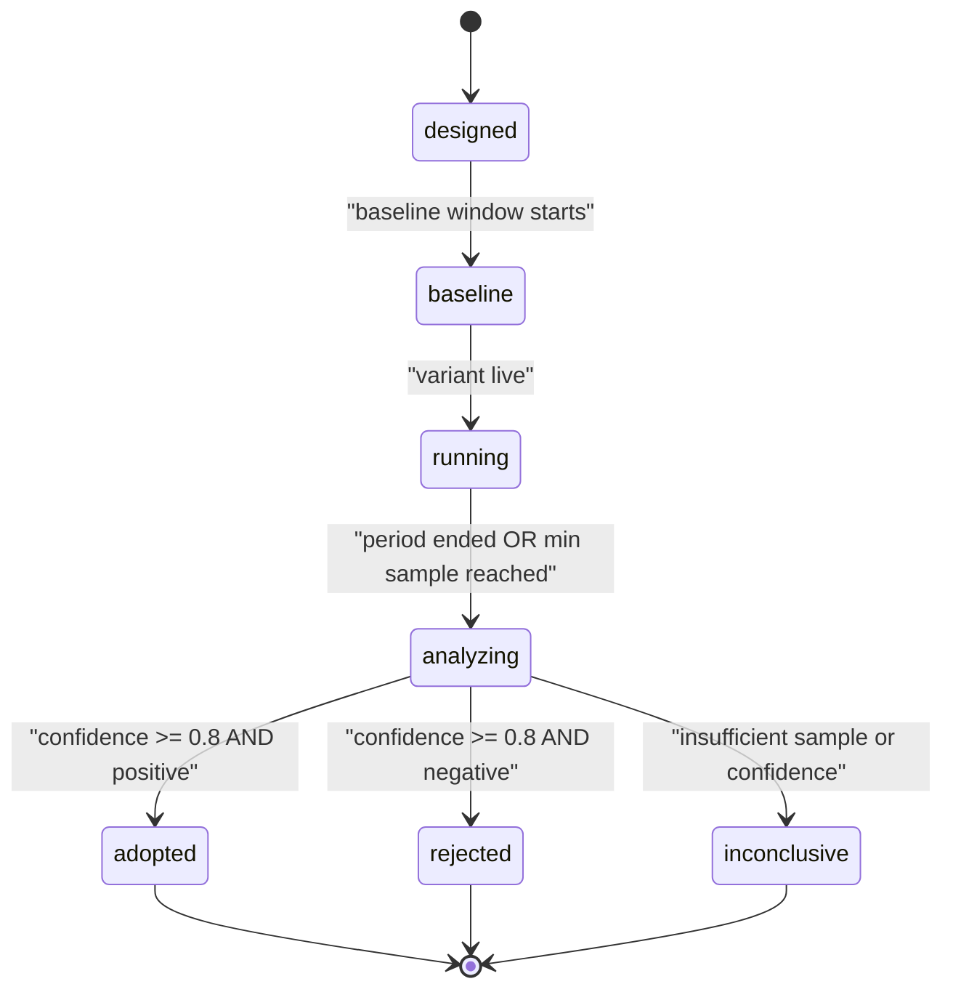
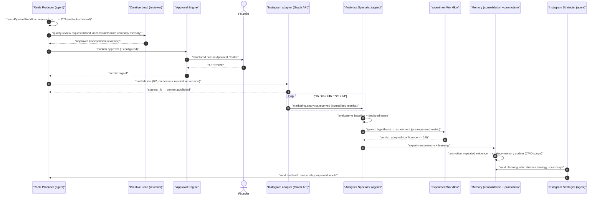

# 16 — Marketing Department

Status: v1.0 — Implementation-ready

Marketing is an autonomous organization inside the company: a full department template, platform-
specialized teams, a closed learning loop (publish → metrics → analysis → hypothesis → strategy →
better content), a generic company-wide Experiment Engine, and a Reels production pipeline.
**Activation is Phase 2** (A6/A7); the **entire domain schema ships in MVP** (`_DECISIONS.md` §23 —
tables exist, features dark). Everything here runs on the same primitives as engineering: tasks
(07-TASK-ENGINE.md), agent loop (08-AGENT-RUNTIME.md), events (10-EVENT-ARCHITECTURE.md), memory
(12-MEMORY-ARCHITECTURE.md), Tool Gateway risk classes (17-TOOL-GATEWAY.md), approvals
(19-APPROVAL-ENGINE.md). Phase-2 activation steps live in 30-PHASE-2.md.

---

## 1. Default org template (template only — fully editable)

| Position | Unit | Reports to | Focus |
|---|---|---|---|
| CMO | Marketing (department) | CEO | strategy, budget, brand authority |
| Strategy Lead | Strategy | CMO | positioning, quarterly plans |
| Growth Lead | Growth | CMO | funnels, activation, experiments |
| SEO Lead | SEO | CMO | organic search |
| Social Lead | Social | CMO | platform teams oversight |
| Content Lead | Content | CMO | editorial calendar, long-form |
| Creative Lead | Creative | CMO | visual identity, production quality |
| Performance Lead | Performance | CMO | paid acquisition (all spend R3 → §5) |
| CRM Lead | CRM | CMO | email/lifecycle |
| Brand Lead | Brand | CMO | brand kit, voice, guardrails |
| Analytics Lead | Analytics | CMO | metrics ingestion, evaluation |
| Competitor-Intel Lead | Intelligence | CMO | competitor monitoring |

### 1.1 Platform teams — specialists, not one universal agent

Each social platform gets a **team of specialists** under the Social Lead. Instagram template
(first platform per Founder-clarification default; others cloned from it):

| Position | Role in the loop |
|---|---|
| Instagram Strategist | platform strategy, content mix, posting cadence |
| Growth Specialist | hashtags/collabs/timing experiments |
| Reels Producer | owns reelsPipelineWorkflow runs (§4) |
| Copywriter | hooks, captions, CTAs, subtitles copy |
| Community Manager | comments/DM triage (Phase 2 adapter), engagement |
| Platform Analytics Specialist | metric evaluation, hypothesis drafting |

Rationale: specialist agents accumulate **specialist skills and memory** (13-SKILL-AND-LEARNING-
SYSTEM.md) — a universal "social agent" would flatten the evidence-based growth model. The template
seeds positions; companies edit freely (same mechanism as 15-ENGINEERING-DEPARTMENT.md §1).

---

## 2. Marketing Learning Loop

The department's core mechanic (brief §4): every published piece feeds measurable learning back
into strategy memory before the next piece is planned.

Pipeline: **publish** → `marketing.content.published` event → **metrics ingestion**: the platform integration
adapter (Instagram Graph API, Phase 2) polls per published item on a decaying schedule (1h, 6h,
24h, 72h, 7d [WRITER-DECISION]) and emits `marketing.analytics.received` with normalized metrics
(impressions, reach, plays, avg_watch_time, likes, comments, saves, shares, follows, link_clicks) →
**analytics agent evaluation**: Platform Analytics Specialist task compares against baselines and
the content's declared intent → **growth hypothesis**: findings become `experiment`-type memory
candidates and, where actionable, a drafted experiment (§3) → **CMO strategy memory update**:
adopted learnings are promoted into project/company-scope strategy memories via the standard
promotion rules (12-MEMORY-ARCHITECTURE.md — single results stay platform-scoped; repeated evidence
promotes) → **next-content improvement**: the Reels Producer's and Strategist's Working Sets
retrieve current strategy + recent learnings, so the next pipeline run starts smarter.

```mermaid
flowchart LR
    P["Publish (approval-gated if configured)"] --> E["content.published"]
    E --> M["Metrics ingestion adapter (Graph API polling)"]
    M --> A["marketing.analytics.received"]
    A --> AN["Analytics agent: evaluate vs baseline + intent"]
    AN --> H["Growth hypothesis (experiment draft)"]
    H --> X["Experiment Engine (section 3)"]
    X --> L["Learning → experiment memory"]
    L --> S["CMO strategy memory update (promotion rules)"]
    S --> N["Next content: Working Set retrieves strategy + learnings"]
    N --> P
```



`content_items` table (MVP schema, 20-DATABASE-DESIGN.md §15.3; publish scheduling/external refs
in `publish_jobs`, metric snapshots in `metric_snapshots`): id, company_id, project_id, task_id, platform
(`instagram | ...`), external_id, kind (`reel | post | story | article | email`), asset_ids,
caption, **intent** (`reach | engagement | conversion | follow_growth` — declared at planning time,
evaluation is always against intent, not vanity totals) [WRITER-DECISION], published_at,
publish_approval_id nullable, metrics jsonb (latest snapshot), metrics_history jsonb[] — plus
`marketing.analytics.received` events for the timeline.

### 2.1 Metric normalization contract

Adapters translate platform payloads into one canonical schema (Zod, `packages/events`), so
analytics agents and the Experiment Engine are platform-agnostic:

```jsonc
{
  "publication_id": "…", "platform": "instagram", "collected_at": "…",
  "window": "24h",                       // 1h|6h|24h|72h|7d|lifetime
  "metrics": {
    "impressions": 18230, "reach": 12400, "plays": 15100,
    "avg_watch_time_s": 8.4, "completion_rate": 0.31,
    "likes": 910, "comments": 44, "saves": 121, "shares": 63,
    "follows": 38, "profile_visits": 240, "link_clicks": 87
  },
  "derived": { "engagement_rate": 0.089, "save_rate": 0.0098, "ctr": 0.0070 }
}
```

Unknown platform fields land in a `raw` passthrough (kept for future analysis, never used by
decision logic). Baselines are rolling medians per platform × kind × intent over the trailing 20
publications [WRITER-DECISION], computed by SQL, stored on the analytics evaluation artifact.

### 2.2 Evaluation task contract

Each `marketing.analytics.received` for a terminal window (7d) creates an evaluation TASK for the
Platform Analytics Specialist with success criteria: (1) verdict vs baseline per intent metric,
(2) at least one falsifiable observation or explicit "no signal", (3) hypothesis draft OR
justification why none. Output artifact `kind=report`; strong signals (>25% deviation on the intent
metric [WRITER-DECISION]) require a drafted experiment. This keeps the loop honest: no publication
is ever published-and-forgotten.

---

## 3. Experiment Engine (generic, company-wide)

Marketing is the first heavy user, but the engine is domain-generic: engineering (perf experiments),
product (funnel changes), CRM (subject lines) all use the same tables and workflow
(`experimentWorkflow` in `workers/agent-worker`).

### 3.1 Tables

`experiments`: id, company_id, project_id nullable, owner_agent_id, title, **hypothesis** (text —
falsifiable statement), scope (`company | project | platform | campaign` + scope_ref), baseline
jsonb (metric values + window), variant jsonb (what changes), **primary_metric** (name +
direction + minimum detectable effect), secondary_metrics jsonb[], period (start/end),
min_sample_size int, status (state machine §3.2), created_at.

`experiment_results`: id, experiment_id, collected_at, sample_size, primary_value, baseline_value,
secondary_values jsonb, **confidence** numeric (0–1), effect_size, result
(`positive | negative | neutral`), decision (`adopt | reject | rerun | inconclusive`),
decided_by_agent_id, **learning** (markdown — the takeaway), memory_id (FK to the created
`experiment` memory).

### 3.2 State machine (canonical, `_DECISIONS.md` §19)



Transitions emit `experiment.status.changed`; `analyzing` verdicts are computed by a deterministic
activity (stats), then the owning agent writes the `learning` narrative.

### 3.3 Statistical honesty rules (enforced in code, not prompts)

- **Pre-registration**: `primary_metric`, `min_sample_size`, and period are frozen at
  `designed → baseline`; the analysis activity evaluates ONLY the pre-registered primary metric for
  the adopt/reject decision. Secondary metrics may generate new hypotheses, never verdicts
  (no p-hacking by metric shopping).
- **Minimum sample**: `analyzing` refuses a confident verdict below `min_sample_size` →
  `inconclusive` with a rerun recommendation.
- **Confidence threshold 0.8**: below it → `inconclusive`, regardless of effect direction.
  Method: two-proportion/means test as appropriate; implementation in a pure
  `packages/domain` stats module [WRITER-DECISION: Wilson/Welch defaults].
- One live experiment per scope+primary-metric pair (overlap guard on `baseline → running`).

### 3.4 Learning → memory

Every terminal experiment writes an `experiment`-type memory: scope = the experiment's scope
(platform-level learning stays project/platform-scoped; only ≥2 concordant experiments across
scopes are promoted to company scope — standard promotion rules, 12-MEMORY-ARCHITECTURE.md §
promotion). Evidence rows link the experiment + results; contradicting an existing strategy memory
creates `memory_relations(kind=contradicts)` surfaced in the Observatory.

---

## 4. Reels production pipeline

`reelsPipelineWorkflow` (Temporal, Phase 2 activation) — one run per reel, owned by the Reels
Producer, with stage tasks delegated to team specialists. Each stage consumes the previous stage's
artifact; a failed stage retries or routes back one stage (max 2 loops per stage, then producer
escalates to Social Lead [WRITER-DECISION]):

| # | Stage | Executor | Output artifact |
|---|---|---|---|
| 1 | Research | Strategist (web/search tools, competitor memory) | topic brief |
| 2 | Audience analysis | Analytics Specialist | audience note (segments, timing) |
| 3 | Opportunity | Strategist | opportunity statement + intent declaration |
| 4 | Concept | Producer | concept doc |
| 5 | Hook | Copywriter | 3–5 hook variants, ranked |
| 6 | Script | Copywriter | timed script |
| 7 | Storyboard | Producer | shot list |
| 8 | Asset selection | Producer (`asset.search`, §4.1) | asset manifest (rights-checked) |
| 9 | Generation | media API adapters (A9) in media sandbox | raw clips/frames |
| 10 | Editing | Producer (media tools) | rough cut |
| 11 | Voiceover | TTS adapter | VO track |
| 12 | Subtitles | Copywriter + forced alignment | subtitle track |
| 13 | Branding | Creative tools (brand kit assets) | branded cut |
| 14 | Music | licensed-library selection (rights-checked) | scored cut |
| 15 | CTA | Copywriter | final cut + caption + CTA |
| 16 | Quality review | **Creative Lead** (independent, reviewer ≠ producer) | review verdict |
| 17 | Publish | publish tool (R2; approval-gated if configured) | `marketing.content.published` |
| 18 | Analytics | ingestion loop (§2) | metric snapshots |
| 19 | Learning | analytics evaluation + Experiment Engine | experiment memory |

Media work (stages 9–15) runs at **media sandbox level** (`_DECISIONS.md` §13): rw scratch volume
for renders at `/scratch`, egress allowlist limited to configured media API hosts, no repo mounts,
disk quota 10 GB per run [WRITER-DECISION]; credentials injected server-side (S2). Intermediate
renders register as `assets` with `metadata.pipeline_run_id` so reuse is searchable.

### 4.1 Asset library

`assets` table (MVP schema): id, company_id, project_id nullable, kind
(`video | image | audio | font | logo | template | caption_style`), title, file_ref
(`/data/assets/<id>` + mime/size/dimensions/duration), metadata jsonb (tags, colors, people,
source), **rights** jsonb (license, source_url, expires_at, usage_restrictions — publish tool
refuses assets with expired/unknown rights), embedding vector + embedding_model (semantic search
via pgvector, same pattern as memories, ADR-020), usage_count, created_by_agent_id, created_at.
`asset.search` tool (R0) = hybrid metadata + cosine query.

### 4.2 Human-taste guardrail

Brand quality is enforced by **brand kit constraints in company memory**: the Brand Lead maintains
`procedural`/`artifact` memories (palette, fonts, logo rules, voice do/don'ts, banned patterns,
example-approved content). Every pipeline Working Set retrieves the brand kit (structured lane);
the quality-review stage checks against it explicitly; publish without a passed quality review is
structurally impossible (review row required, reviewer ≠ producer). Optionally
(`publish_requires_approval=true`, the shipped default) the Founder taste-checks in the Approval
Center before anything goes public.

### 4.3 Sequence — Instagram content learning loop (REQUIRED)



---

## 5. Budget & paid ads

**All paid spend is risk class R3** (external-world, irreversible money) — hard-coded platform
policy (`_DECISIONS.md` §12, A8): every campaign budget, boost, or ad-set change that commits spend
requires Founder approval via the Approval Engine, regardless of autonomy level or standing
budgets. The Performance Lead prepares the structured brief; executives may endorse in the chain
before it reaches the Founder inbox. Canonical example (format per brief §2.3):

> **Title:** Approve ₺15,000/mo Instagram ads budget for Reels amplification
> **Request:** Standing monthly budget, capped ₺15,000, auto-pause at cap.
> **Reason:** Organic reels avg 12k reach; top performers show 3.1% CTR to site. Paid amplification
> of proven winners is the cheapest tested growth lever.
> **What was attempted:** 6 weeks organic-only; A/B of posting times (+18% reach, adopted); hashtag
> experiment (inconclusive); collab outreach (2 pending).
> **Options considered:** (a) stay organic — slower, ~4 mo to goal; (b) ₺15k/mo amplification —
> projected ROAS 2.4 based on experiment EXP-31 confidence 0.86; (c) ₺40k/mo broad prospecting —
> higher risk, unproven audiences.
> **Recommendation:** Option (b).
> **Risk:** Medium — spend capped, pausable daily; creative fatigue mitigated by pipeline cadence.
> **Cost:** ₺15,000/month. **Impact:** projected +2,100 site visits/mo, +9% signup rate.
> **Urgency:** Medium. **Deadline:** decision by 2026-09-01 (campaign window).

On approval, a scoped standing grant is recorded (spend cap + platform + period); the ads tool
checks remaining grant per call and every spend lands in `cost_entries(kind=api)` against the
marketing unit budget (26-COST-MANAGEMENT.md). Cap breach → `budget.exceeded` → campaigns pause.

`campaigns` table (MVP schema): id, company_id, project_id, platform, title, objective, status
(`draft | pending_approval | active | paused | ended`) [WRITER-DECISION — campaign enum],
approval_id, budget_cents, spend_cents (rolled up from cost entries), period, targeting jsonb,
publication_ids, results jsonb, owner_agent_id. Campaign creation/edit tools verify status and
grant before any Graph API mutation; every mutation is audited (`tool_invocations`, S7).

## 6. Marketing work on the Task OS

Marketing runs on the same task machine as engineering — no parallel workflow system:

- Campaign/content plans are INITIATIVE/EPIC tasks under a marketing GOAL; individual reels,
  posts, and evaluation reports are TASK/SUBTASK rows with the standard state machine.
- The quality-review stage is a `reviews` row (kind=`code` is engineering-specific; marketing uses
  kind=`qa` semantics via a `creative` review kind added to the enum
  [WRITER-DECISION: `reviews.kind` gains `creative`]) — the same independence enforcement of
  15-ENGINEERING-DEPARTMENT.md §2.2 applies (reviewer ≠ producer, checked in domain layer).
- Publish-approval uses the generic Approval Engine; ad spend uses R3 approval (§5). Nothing in
  marketing bypasses the Tool Gateway.
- Skill evidence flows identically: accepted creative reviews, adopted experiments, and
  above-baseline publications create `skill_evidence` rows (`experiment`, `production_result`)
  for the specialists — marketing careers grow on measured outcomes (13-SKILL-AND-LEARNING-SYSTEM.md).

## 7. Marketing dashboard spec (frontend contract)

Route `/marketing` (department view) + per-platform boards (24-FRONTEND-ARCHITECTURE.md). Read
models over Postgres, live via `/ws`:

| Panel | Contents | Source |
|---|---|---|
| Calendar | planned/published content by platform and date | `content_items`, `publish_jobs`, tasks |
| Performance | intent-metric trends vs baseline, top/bottom content | metrics snapshots |
| Experiments | live experiment board with state, confidence, decisions | `experiments`, `experiment_results` |
| Learning feed | recent experiment memories + strategy updates with provenance | `memories` (type=experiment) |
| Campaigns & spend | grants, spend vs cap, ROAS per campaign | `campaigns`, `cost_entries` |
| Asset library | searchable grid with rights status | `assets` |
| Approvals | pending publish/spend items (deep link to Approval Center) | `approvals` |

## 8. MVP vs Phase 2 boundary

| In MVP (schema + dark features) | Phase 2 (activation) |
|---|---|
| All tables: `content_items`, `publish_jobs`, `experiments`, `experiment_results`, `assets`; org template seeds; event schemas | Instagram Graph adapter, publish/ads tools live |
| Experiment Engine workflow + stats module (usable by engineering in MVP) | Experiment UI views |
| Brand-kit memory conventions | Media sandbox image, media generation adapters |
| Approval flow for spend (generic engine) | reelsPipelineWorkflow, asset ingestion tooling, community/DM triage |

## 9. Events emitted by this module

`marketing.content.published`, `marketing.analytics.received`, `experiment.status.changed`,
`experiment.result.recorded`, `asset.created`, `asset.rights.expired`, `campaign.spend.recorded` —
schemas in `packages/events`; catalog in 10-EVENT-ARCHITECTURE.md.

## 10. Invariants

- M1. No publish without an independent quality review; no paid spend without Founder approval (R3).
- M2. Experiment verdicts use only the pre-registered primary metric, min sample, confidence ≥ 0.8.
- M3. Platform learnings enter company scope only via standard promotion rules — never directly.
- M4. Assets with unknown/expired rights are unpublishable (tool-level check).
- M5. External platform metrics/content are untrusted input (S5): provenance-wrapped, never able to
  trigger elevated tool calls directly.
- M6. Marketing agents follow the same resolution order as everyone (brief §2.1) — the CMO, not the
  Founder, is the ceiling for routine marketing judgment.
