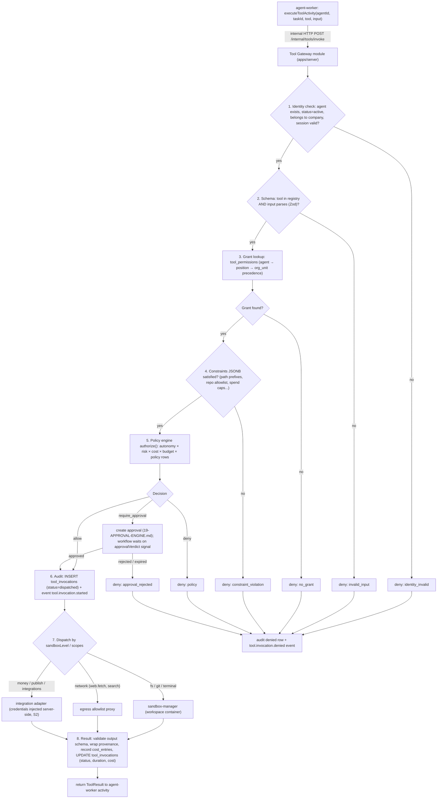

# 17 — Tool Gateway

Status: v1.0 — Implementation-ready

The Tool Gateway is the single choke point between agent intent and real-world effect. Security
invariant **S3** (_DECISIONS.md §20) requires that *all* tool executions pass through it — there is
no code path from an agent workflow to a sandbox, network call, or integration adapter that does not
traverse the gateway. This document specifies the tool definition contract in `packages/tools`, the
MVP/Phase-2/Phase-3 tool inventory, the authorization and execution path, constraint evaluation,
credential injection, rate limiting, failure semantics, and MCP adapter compatibility.

Related docs: 08-AGENT-RUNTIME.md (how `use_tool` actions arrive here), 18-PERMISSIONS-AND-SECURITY.md
(policy engine internals, autonomy matrix, secrets), 15-ENGINEERING-DEPARTMENT.md (sandbox level
usage in the coding workflow), 19-APPROVAL-ENGINE.md (what happens on `require_approval`),
26-COST-MANAGEMENT.md (cost entries written per invocation), 34-THREAT-MODEL.md (threats T1–T9
mitigated here).

---

## 1. Architecture position

- **Definition side:** `packages/tools` — pure, IO-free tool definitions (Zod schemas, risk class,
  scopes, cost estimator, sandbox level). Shared by the gateway (validation/authorization) and the
  agent runtime (tool list rendered into the Working Set).
- **Authorization side:** `tools` module inside `apps/server` (the Tool Gateway service module).
  Invoked by `workers/agent-worker` activities via **internal HTTP** (`POST /internal/tools/invoke`).
- **Execution side:** dispatch to `services/sandbox-manager` (fs/git/terminal), the egress allowlist
  proxy (network tools), or integration adapters in `apps/server` (github, email, social, ads).

[WRITER-DECISION] Internal HTTP between workers and `apps/server` is authenticated with a shared
service token (`INTERNAL_SERVICE_TOKEN` from `packages/config`, rotated with the compose stack) sent
as `Authorization: Bearer`, plus a network-level rule: the `/internal/*` route prefix is bound only
on the compose-internal network, never exposed by the reverse proxy. This is *transport* auth; the
acting agent identity is always carried explicitly in the request body and re-verified against the DB.

## 2. Tool definition contract (`packages/tools`)

```ts
// packages/tools/src/contract.ts
import { z } from "zod";

export type RiskClass = "R0" | "R1" | "R2" | "R3";
// R0 read-only • R1 reversible write • R2 costly or hard-to-reverse • R3 irreversible / external-world

export type ToolScope = "fs" | "git" | "network" | "db" | "money" | "publish";

export type SandboxLevel =
  | "none"        // executes in apps/server process (integration adapters) — no agent code runs
  | "analysis"    // ro mount, no network
  | "coding"      // rw worktree, egress: package registries only
  | "testing"     // coding + service containers
  | "browser"     // Phase 2
  | "media"       // Phase 2
  | "deploy";     // Phase 3

export interface ToolDefinition<In extends z.ZodTypeAny, Out extends z.ZodTypeAny> {
  name: string;                      // dot-namespaced: "fs.read", "github.pr.merge"
  version: number;                   // bump on breaking schema change
  description: string;               // shown to the LLM in the Working Set tool list
  input: In;                         // Zod — validated at gateway BEFORE authorization
  output: Out;                       // Zod — validated on result; mismatch = tool failure
  risk: RiskClass;                   // static base class; may be ELEVATED at runtime (see §7.4, S5)
  scopes: ToolScope[];               // what the tool touches; drives constraint lookup
  sandboxLevel: SandboxLevel;        // minimum isolation level required to execute
  sideEffectFree: boolean;           // true ⇒ safe to retry without idempotency key
  estimateCost(input: z.infer<In>): { amountCents: number; confidence: "exact" | "estimate" };
  timeoutMs: number;                 // hard execution timeout (gateway-enforced)
  rateLimit?: { perAgentPerMin: number; perCompanyPerMin: number }; // overrides defaults (§8)
  credentialRefs?: string[];         // secret names resolved SERVER-SIDE at dispatch (S2), e.g. ["github.token"]
}
```

Registration: `packages/tools/src/registry.ts` exports `toolRegistry: Map<string, ToolDefinition>`.
The gateway refuses any invocation whose `name@version` is not in the registry (fail-closed).
The Working-Set builder renders only the subset the agent has *any* grant for — agents never see
tools they cannot possibly use.

### 2.1 Example: `fs.read` (R0)

```ts
export const fsRead: ToolDefinition = {
  name: "fs.read",
  version: 1,
  description: "Read a file (or directory listing) inside the task workspace. Read-only.",
  input: z.object({
    path: z.string().min(1).max(1024),            // workspace-relative; ".." rejected by sandbox-manager
    encoding: z.enum(["utf8", "base64"]).default("utf8"),
    maxBytes: z.number().int().positive().max(2_000_000).default(262_144),
    range: z.object({ startLine: z.number().int().min(1), endLine: z.number().int().min(1) }).optional(),
  }),
  output: z.object({
    kind: z.enum(["file", "dir"]),
    content: z.string(),                           // file content or JSON dir listing
    truncated: z.boolean(),
    byteSize: z.number().int(),
    provenance: z.literal("workspace"),            // consumer wraps content with provenance markers (S5)
  }),
  risk: "R0",
  scopes: ["fs"],
  sandboxLevel: "analysis",                        // works in the most restricted level and above
  sideEffectFree: true,
  estimateCost: () => ({ amountCents: 0, confidence: "exact" }),
  timeoutMs: 10_000,
};
```

### 2.2 Example: `terminal.exec` (R1)

```ts
export const terminalExec: ToolDefinition = {
  name: "terminal.exec",
  version: 1,
  description: "Run a shell command in the task workspace container. Output streams to the task terminal.",
  input: z.object({
    command: z.string().min(1).max(8192),
    cwd: z.string().max(1024).default("."),
    timeoutSec: z.number().int().min(1).max(1800).default(300),
    env: z.record(z.string(), z.string()).default({}),   // gateway strips keys matching /TOKEN|KEY|SECRET|PASS/i (S2)
    stdin: z.string().max(65_536).optional(),
  }),
  output: z.object({
    exitCode: z.number().int(),
    stdoutTail: z.string(),                              // last 32KB; full stream on NATS terminal subject
    stderrTail: z.string(),
    durationMs: z.number(),
    terminalSessionId: z.string().uuid(),                // for xterm.js live view (16-REALTIME ref: 22-REALTIME-ARCHITECTURE.md)
    provenance: z.literal("workspace"),
  }),
  risk: "R1",                                            // writes confined to the git worktree = reversible
  scopes: ["fs", "git"],
  sandboxLevel: "coding",
  sideEffectFree: false,
  estimateCost: (i) => ({ amountCents: Math.ceil(i.timeoutSec / 60) /* compute pennies/min */, confidence: "estimate" }),
  timeoutMs: 1_830_000,                                  // input timeout + 30s grace
  rateLimit: { perAgentPerMin: 20, perCompanyPerMin: 200 },
};
```

### 2.3 Example: `github.pr.merge` (R2)

```ts
export const githubPrMerge: ToolDefinition = {
  name: "github.pr.merge",
  version: 1,
  description: "Merge an approved pull request on GitHub. Requires passed review + QA gates.",
  input: z.object({
    repo: z.string().regex(/^[\w.-]+\/[\w.-]+$/),        // "owner/name"
    prNumber: z.number().int().positive(),
    method: z.enum(["squash", "merge", "rebase"]).default("squash"),
    expectedHeadSha: z.string().length(40),              // optimistic concurrency: mismatch ⇒ abort, no retry
    deleteBranch: z.boolean().default(true),
  }),
  output: z.object({
    merged: z.boolean(),
    mergeCommitSha: z.string(),
    provenance: z.literal("integration:github"),
  }),
  risk: "R2",                                            // rewrites shared history state; reversible only with effort
  scopes: ["git", "network"],
  sandboxLevel: "none",                                  // runs in the GitHub integration adapter, not a sandbox
  sideEffectFree: false,
  estimateCost: () => ({ amountCents: 0, confidence: "exact" }),
  timeoutMs: 30_000,
  credentialRefs: ["github.token"],                      // injected server-side; agent NEVER sees it (S2)
  rateLimit: { perAgentPerMin: 3, perCompanyPerMin: 15 },
};
```

## 3. Tool inventory

### 3.1 MVP tools

| Tool | Risk | Scopes | Sandbox level | Notes |
|---|---|---|---|---|
| `fs.read` | R0 | fs | analysis | file/dir read, range reads |
| `fs.search` | R0 | fs | analysis | ripgrep over workspace |
| `fs.write` | R1 | fs | coding | create/overwrite file in worktree |
| `fs.patch` | R1 | fs | coding | unified-diff apply (preferred over full writes) |
| `terminal.exec` | R1 | fs, git | coding | streamed PTY output |
| `git.status` / `git.diff` / `git.log` | R0 | git | analysis | read-only plumbing |
| `git.commit` | R1 | git | coding | commits to task branch only (sandbox-manager enforces branch) |
| `git.branch.push` | R1 | git | coding | push task branch to server bare repo only |
| `git.merge.main` | R2 | git | none | lead-agent merge into `main` (server-side, PR-entity gated — see 15-ENGINEERING-DEPARTMENT.md) |
| `github.pr.open` (optional) | R1 | git, network | none | mirror PR to GitHub if configured |
| `github.pr.merge` (optional) | R2 | git, network | none | §2.3 |
| `db.inspect.query` | R0 | db | none | READ-ONLY SQL against project DBs; gateway rejects non-SELECT + enforces `statement_timeout` |
| `db.inspect.schema` | R0 | db | none | table/column/index introspection |
| `web.fetch` | R0 | network | none | via egress proxy; response wrapped with provenance markers (S5) |
| `web.search` | R0 | network | none | configured search API adapter |

### 3.2 Phase 2 tools (schema ships in MVP registry, grants dark)

| Tool | Risk | Scopes | Sandbox level |
|---|---|---|---|
| `browser.navigate` / `browser.act` / `browser.extract` | R1 | network | browser |
| `instagram.publish` | R3 | publish, network | none |
| `instagram.insights` | R0 | network | none |
| `email.send` | R2 | publish, network | none |
| `ads.campaign.create` / `ads.budget.set` | R3 | money, network | none |
| `media.image.generate` / `media.video.generate` | R2 (costly) | network | media |
| `analytics.query` | R0 | network, db | none |

### 3.3 Phase 3 tools

| Tool | Risk | Scopes | Sandbox level |
|---|---|---|---|
| `deploy.release` | R3 | git, network | deploy |
| `deploy.rollback` | R2 | git, network | deploy |
| `infra.provision` | R3 | money, network | deploy |

## 4. Execution path (normative, per _DECISIONS.md §12)



Ordering is strict and fail-closed: any step erroring (DB down, policy table unreadable) yields
`deny: gateway_error`, never a default-allow.

### 4.1 `tool_permissions` table

```sql
CREATE TABLE tool_permissions (
  id uuid PRIMARY KEY,                     -- uuidv7
  company_id uuid NOT NULL REFERENCES companies(id),
  subject_kind text NOT NULL CHECK (subject_kind IN ('agent','position','org_unit')),
  subject_id uuid NOT NULL,
  tool_name text NOT NULL,                 -- exact name or prefix glob: "git.*"
  constraints jsonb NOT NULL DEFAULT '{}',
  granted_by text NOT NULL,                -- 'founder' | agent uuid (managers grant within their scope)
  expires_at timestamptz,
  created_at timestamptz NOT NULL DEFAULT now()
);
CREATE INDEX tool_permissions_lookup ON tool_permissions (company_id, tool_name, subject_kind, subject_id);
```

Resolution precedence: **agent grant > position grant > org_unit grant** (most specific wins);
multiple applicable grants merge by *intersection of constraints* (never union — least privilege).

### 4.2 Constraints JSONB — canonical keys and evaluation examples

| Key | Type | Applies to scopes | Semantics |
|---|---|---|---|
| `pathPrefixes` | string[] | fs | every fs path in input must start with one prefix |
| `repoAllowlist` | string[] | git | repo/`owner/name` must be listed |
| `branchPattern` | string | git | regex the target branch must match (default `^task/`) |
| `domainAllowlist` | string[] | network | overrides/narrows egress proxy set for this grant |
| `spendCapCents` | number | money | per-invocation cap checked against `estimateCost` |
| `monthlySpendCapCents` | number | money | rolling 30-day sum from `cost_entries` for this agent+tool |
| `maxTimeoutSec` | number | (terminal) | clamps `input.timeoutSec` |
| `readOnly` | boolean | db | redundant guard; `db.inspect.*` always read-only |

**Example 1 — path prefix.** Grant to position `frontend-developer`:
`{"pathPrefixes": ["apps/web/", "packages/ui/"]}`. Invocation `fs.write` with
`path: "packages/db/schema.ts"` ⇒ `deny: constraint_violation`, detail
`path_not_in_prefixes`. The denial is returned to the agent as a structured tool error so the LLM
can route the change request to the owning team instead of retrying.

**Example 2 — spend cap.** Grant to agent CMO: `{"monthlySpendCapCents": 200000}` on `ads.*`.
`ads.budget.set` with estimate 50000¢ when 170000¢ already spent this cycle ⇒ estimate would exceed
cap ⇒ `require_approval` is substituted for plain deny when the grant carries
`"onCapExceeded": "escalate"` [WRITER-DECISION: default `onCapExceeded` = `"deny"`; `"escalate"`
opt-in per grant] — this is how standing budget delegation degrades gracefully into a Founder brief.

**Example 3 — repo allowlist + branch.** `git.branch.push` with grant
`{"repoAllowlist": ["proj_9f3.git"], "branchPattern": "^task/"}`: push to `main` ⇒ denied;
push `task/TASK-81-fix-login` to the project bare repo ⇒ allowed. The same rule is *re-enforced*
inside sandbox-manager (defense in depth — gateway compromise must not suffice, see 34-THREAT-MODEL.md T4).

### 4.3 `tool_invocations` audit table

```sql
CREATE TABLE tool_invocations (
  id uuid PRIMARY KEY, company_id uuid NOT NULL,
  agent_id uuid NOT NULL, task_id uuid, project_id uuid,
  tool_name text NOT NULL, tool_version int NOT NULL,
  input jsonb NOT NULL,                    -- secret-free by construction (S2); env vars scrubbed
  input_hash text NOT NULL,                -- sha256 for loop-detector correlation
  risk_class text NOT NULL,                -- EFFECTIVE class after elevation (§7.4)
  decision text NOT NULL CHECK (decision IN ('allow','deny','require_approval')),
  decision_detail jsonb NOT NULL,          -- matched grant id, policy id, constraint failures
  approval_id uuid,
  status text NOT NULL CHECK (status IN ('denied','dispatched','succeeded','failed','timeout','flagged')),
  est_cost_cents int NOT NULL, actual_cost_cents int,
  output_digest jsonb,                     -- truncated/typed summary, never raw bulk output
  duration_ms int, error jsonb,
  idempotency_key text UNIQUE,             -- from Temporal activity attempt (dedupe on retry)
  created_at timestamptz NOT NULL DEFAULT now()
);
```

Every R2+ row is mirrored into `audit_log` (S7, see 18-PERMISSIONS-AND-SECURITY.md §9).

## 5. Credential injection (S2 — normative)

- Secrets live in the `secrets` table (libsodium sealed boxes, 18-PERMISSIONS-AND-SECURITY.md §7).
- A tool declares `credentialRefs`. At **dispatch time only**, the gateway resolves and decrypts
  them and passes them to the adapter/proxy in process memory or over the internal network — never
  into: the LLM prompt, the `tool_invocations.input`, the workspace container environment, the
  events table, or logs (pino redaction paths cover `*.token`, `*.secret`, `*.password`, `*.apiKey`).
- Workspace containers get **scoped, short-lived** credentials only where unavoidable:
  git push auth uses a per-workspace ephemeral token minted by sandbox-manager, valid for that bare
  repo and branch pattern, TTL = workspace lifetime. Package-registry auth is handled by the egress
  proxy injecting the `Authorization` header, so the token never enters the container.
  [WRITER-DECISION] Ephemeral git tokens: HMAC-signed (`sha256`, key held by sandbox-manager),
  claims `{workspace_id, repo, branch_pattern, exp}`, verified by the git HTTP endpoint on the server.
- An agent asking for a secret via any tool gets a structured refusal naming the correct path:
  request the *action*, not the credential (Founder-held credentials are an approval category, §15).

## 6. Rate limits

Defaults (overridable per ToolDefinition, then per grant via `constraints.rateLimit`):

| Class | Per agent / min | Per company / min | Burst |
|---|---|---|---|
| R0 | 60 | 600 | 2× for 10s |
| R1 | 30 | 300 | 1.5× |
| R2 | 6 | 30 | none |
| R3 | 2 | 6 | none |

[WRITER-DECISION] Implementation: fixed-window counters in a Postgres `UNLOGGED` table
`tool_rate_counters (company_id, agent_id, tool_name, window_start, count)` with upsert-increment —
consistent with the "no Redis in MVP" rule. Exceeding a limit returns `deny: rate_limited` with
`retryAfterSec`; the agent loop treats it as `wait_for(timer)` rather than an error (no retry storm).
Repeated rate-limit hits (≥5 in 10 min) emit `tool.rate.throttled` and feed the runaway detector
(_DECISIONS.md §8).

## 7. Failure semantics

### 7.1 Timeout
Gateway enforces `timeoutMs` end-to-end. On expiry: dispatch target receives cancel (sandbox-manager
kills the exec PTY; adapters abort the HTTP call), invocation row → `status=timeout`, cost recorded
as estimated compute so far. Timeout is returned as a *typed* result — the agent decides
(retry smaller, split work, escalate); the Temporal activity itself does **not** auto-retry
non-side-effect-free tools.

### 7.2 Retry rules
- `sideEffectFree: true` (fs.read, web.fetch, db.inspect.*): Temporal activity retry policy applies
  (max 3, exponential backoff 1s→8s) using the same `idempotency_key`; gateway dedupes and replays
  the cached result if the first attempt actually succeeded.
- Side-effecting R1: retried only with a fresh agent decision; the gateway rejects a duplicate
  `idempotency_key` with the original result (exactly-once effect per key).
- R2/R3: **never auto-retried.** Ambiguous outcomes (e.g. merge timeout after the API call was sent)
  return `status: "unknown"` with a follow-up verification hint (`github.pr.get`) — the runtime
  forces a read-verify step before any re-attempt.

### 7.3 Partial failure
Tools that batch (fs.patch across files, future `ads.campaign.create` with multiple ad sets) must
return `output.partial: { applied: [...], failed: [...] }` rather than throwing; the gateway marks
`status=failed` only when nothing was applied. Adapters wrap multi-step external mutations so each
step is individually reported — no silent half-writes.

### 7.4 Poisoned-output flagging (S5)
All outputs whose content originates outside the platform (`provenance` ∈ `workspace` file content,
`web`, `integration:*`) pass the instruction-detection heuristic (18-PERMISSIONS-AND-SECURITY.md
§11.2). On a hit: invocation row `status=flagged`, event `tool.output.flagged`, and the content
enters the Working Set only inside provenance fences with the taint bit set. **Taint propagation
rule:** if an agent's next `use_tool` action has arguments string-derived from tainted content, the
gateway elevates the effective risk class by one (R1→R2, R2→R3) before policy evaluation — recorded
in `decision_detail.elevated_from`. This is the platform's core prompt-injection cutoff: injected
instructions can at most cause a *more*-reviewed action, never a less-reviewed one.

## 8. MCP compatibility (ADR-017)

External MCP servers are integrated as **tool adapters behind the same gateway**, never as a bypass:
an `McpToolAdapter` in the integrations module connects to a configured MCP server (stdio in a
dedicated container, or HTTP), introspects its tools, and registers each as a `ToolDefinition` with
`name: "mcp.<server>.<tool>"`, translated Zod schemas, and a **mandatory manual risk classification**
step: imported tools default to `risk: "R3", sandboxLevel: "none"` and are unusable until the
Founder (or an admin, Phase 3) assigns a reviewed risk class and scopes in Settings. MCP tool
outputs are treated as external content (`provenance: "integration:mcp:<server>"`) and are subject
to §7.4 flagging. MCP servers never receive platform secrets except credentials explicitly bound to
that adapter. Full authorization, audit, rate-limit, and approval semantics apply unchanged (S3).

## 9. Observability & invariant tests

- OTel span per invocation: `tool.invoke` with attributes `tool.name`, `risk`, `decision`,
  `elevated`, `duration_ms`, `cost_cents` (25-OBSERVABILITY.md).
- Metrics: invocation count/latency/denial-rate per tool, approval-conversion rate, flag rate.
- **S3 enforcement test** (32-TESTING-STRATEGY.md): a CI static check asserts that
  `services/sandbox-manager` HTTP routes and integration adapters are imported *only* from the
  gateway module (eslint boundaries rule), plus an integration test proving a direct
  sandbox-manager call without a gateway-issued dispatch token is refused.
  [WRITER-DECISION] sandbox-manager accepts exec requests only with a single-use dispatch token
  minted by the gateway per allowed invocation (HMAC over invocation id + expiry ≤ 60s), closing
  the "compromised worker talks to sandbox-manager directly" path (34-THREAT-MODEL.md T4).
