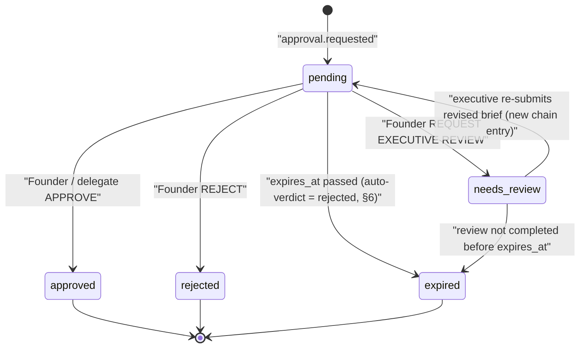
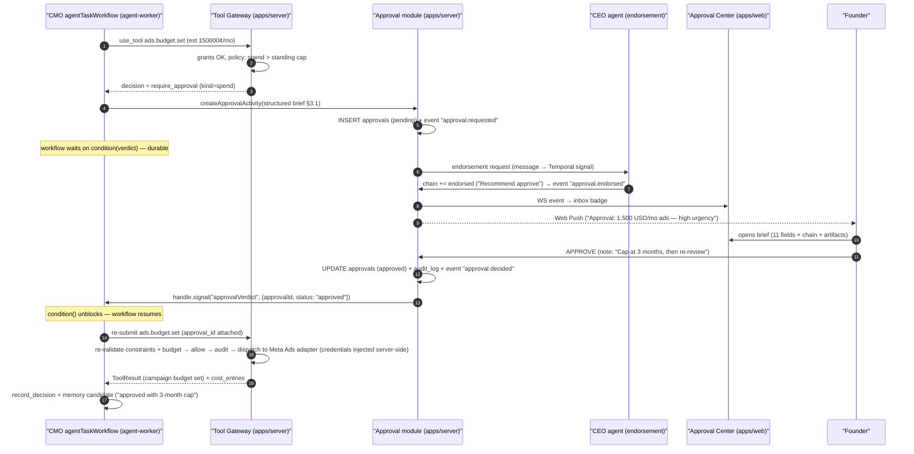

# 19 — Approval Engine

Status: v1.0 — Implementation-ready

The Approval Engine is the single mechanism by which any workflow obtains Founder (or delegated)
authority. It implements _DECISIONS.md §15 (approvals table, states) and §12 (Founder-only
categories, S6), and is the target of every `require_approval` decision from the Tool Gateway
(17-TOOL-GATEWAY.md §4) and every `escalate` AgentAction that reaches the Founder level
(06-AUTONOMY-AND-ESCALATION.md). Non-negotiable rule 3 of _BRIEF.md applies: **Founder escalations
are structured briefs — never raw agent chat.**

---

## 1. Data model

`approvals` (per _DECISIONS.md §15):

```sql
CREATE TABLE approvals (
  id uuid PRIMARY KEY, company_id uuid NOT NULL,
  kind text NOT NULL CHECK (kind IN
    ('spend','vendor','legal','pricing','destructive_prod','credentials','publish','promotion','custom')),
  title text NOT NULL,
  request_md jsonb NOT NULL,          -- the structured brief (§3) — typed fields, NOT freeform markdown blob
  requested_by uuid NOT NULL,         -- agent id (nullable in schema for system-originated, e.g. budget breach)
  task_id uuid, project_id uuid,      -- subject refs
  tool_invocation_id uuid,            -- set when originating from a gateway require_approval
  chain jsonb NOT NULL DEFAULT '[]',  -- executive endorsement chain (§5)
  status text NOT NULL DEFAULT 'pending'
    CHECK (status IN ('pending','approved','rejected','needs_review','expired')),
  risk text NOT NULL, cost_cents int NOT NULL DEFAULT 0,
  urgency text NOT NULL CHECK (urgency IN ('low','normal','high','critical')),
  deadline timestamptz,               -- business deadline stated in the brief
  expires_at timestamptz NOT NULL,    -- engine expiry (§6), independent of business deadline
  decided_by uuid,                    -- users.id (or agent id for delegated verdicts, §8)
  decided_at timestamptz, decision_note text,
  workflow_id text NOT NULL,          -- Temporal workflow waiting on the verdict
  created_at timestamptz NOT NULL DEFAULT now()
);
CREATE INDEX approvals_inbox ON approvals (company_id, status, urgency, created_at);
```

Events: `approval.requested`, `approval.endorsed`, `approval.approved`, `approval.rejected`, `approval.expired`,
`approval.reminder.sent` — all in the event catalog (10-EVENT-ARCHITECTURE.md). Every row mutation
is mirrored to `audit_log(category='approval')` (S7).

## 2. Approval kinds

| Kind | Typical origin | Founder-only (S6)? |
|---|---|---|
| `spend` | tool gateway (money scope over cap), budget increase requests | over standing-policy caps: yes |
| `vendor` | agent proposes new paid service | always |
| `legal` | terms acceptance, licensing, contracts | always |
| `pricing` | major pricing changes on company products | always |
| `destructive_prod` | prod data deletion, force-push main, infra teardown | always |
| `credentials` | actions needing credentials only the Founder holds | always |
| `publish` | external publication (Phase 2: instagram.publish, email campaigns) | until standing policy grants |
| `promotion` | lead+ seniority changes (_DECISIONS.md §11) | configurable, default yes |
| `custom` | anything an executive judges Founder-worthy | judgment call |

## 3. Structured brief contract (all 11 fields — normative)

`request_md` is a typed object validated by `packages/contracts` (`ApprovalBriefSchema`); the
renderer refuses anything else (§10). Fields (all required; `deadline` nullable):

1. `title` — one line, ≤120 chars
2. `request` — the exact decision being asked for (one paragraph)
3. `reason` — why this is needed now
4. `attempted` — what the org already tried autonomously (list)
5. `options` — considered alternatives: `[{option, pros, cons, cost_cents}]`, ≥2 entries
6. `recommendation` — which option the requester recommends and why
7. `risk` — risk level + concrete downside description
8. `cost` — `{amount_cents, currency, period?, budget_line?, remaining_budget_cents?}`
9. `impact` — expected business outcome if approved / consequence if rejected
10. `urgency` — `low|normal|high|critical` + justification
11. `deadline` — date after which the decision is moot, or null

### 3.1 Fully rendered example — CMO ad-budget request (the _BRIEF ad-budget case)

```json
{
  "title": "Approve 1,500 USD/month Instagram ads budget for Q4 launch campaign",
  "request": "Authorize a recurring monthly ad spend of 1,500 USD on Instagram (Meta Ads) for the 'Atlas' product launch campaign, starting 2026-10-01, reviewed monthly.",
  "reason": "Organic reach has plateaued at ~2.1% while the Q4 launch goal requires 40k qualified visitors. Paid amplification is the only channel projected to close the gap in time.",
  "attempted": [
    "6 weeks of organic Reels optimization: reach +18%, insufficient trajectory for the Q4 target",
    "Cross-posting partnerships with 3 accounts: +4k followers, CAC-equivalent too high to scale",
    "SEO content sprint: compounding but 4-6 months to material traffic — misses the launch window"
  ],
  "options": [
    { "option": "1,500 USD/mo Instagram ads (recommended)", "pros": "reaches target with 20% margin per media plan; platform where our audience is", "cons": "recurring commitment; creative fatigue risk", "cost_cents": 150000 },
    { "option": "800 USD/mo reduced budget", "pros": "lower commitment", "cons": "projects only ~60% of required visitors; likely a second escalation in November", "cost_cents": 80000 },
    { "option": "No paid spend, extend organic", "pros": "zero cost", "cons": "Q4 launch traffic goal missed with ~90% probability per trend analysis", "cost_cents": 0 }
  ],
  "recommendation": "Option 1. The media plan (artifact ref below) shows 1,500 USD/mo achieving the visitor target with margin; performance team reviews weekly and will recommend cuts if CAC exceeds 3.20 USD.",
  "risk": "medium — spend is capped monthly and cancellable within 24h; downside bounded at one month of budget (1,500 USD) if the campaign underperforms.",
  "cost": { "amount_cents": 150000, "currency": "USD", "period": "monthly", "budget_line": "marketing/paid-social", "remaining_budget_cents": 0 },
  "impact": "Approved: projected 42k qualified visitors for Q4 launch, est. 850 signups. Rejected: launch proceeds organic-only, projected 15k visitors; Q4 revenue goal at risk.",
  "urgency": "high — creative production needs a 2-week lead; decision needed by 2026-09-15 to hit the 10-01 start.",
  "deadline": "2026-09-15T17:00:00Z"
}
```

Artifacts (media plan, trend analysis) are attached as refs (`task_id`, artifact ids) rendered as
links — never inlined agent conversation (§10).

## 4. Request lifecycle



`needs_review` routes the request back to the top endorsing executive (or the requester's chain if
none) with the Founder's note; the executive revises the brief, appends a chain entry, and the
status returns to `pending` (same approval id — full history preserved in chain + audit log).

## 5. Executive endorsement chains

Requests from non-C-level agents do not reach the Founder raw: the escalation walk
(_DECISIONS.md §5) routes them upward, and each executive either resolves the matter autonomously
or **endorses** it. Example: CMO's ad-budget request is endorsed by the CEO before the Founder sees
it. `chain` JSONB, append-only:

```json
[
  { "agent_id": "…CMO…", "role": "CMO", "action": "requested", "note": "Media plan attached", "at": "2026-09-08T09:12:00Z" },
  { "agent_id": "…CEO…", "role": "CEO", "action": "endorsed",
    "note": "Consistent with Q4 plan; I verified budget line has no remaining allocation. Recommend approve.",
    "at": "2026-09-08T11:40:00Z" }
]
```

Chain actions: `requested | endorsed | revised | objected`. An `objected` entry does not block —
it surfaces the dissent to the Founder (better decisions, not gatekeeping). Which kinds require
endorsement before Founder visibility is a company setting; default: everything originating below
C-level requires endorsement by the requester's executive [WRITER-DECISION].

## 6. Expiry, reminders, escalation of stale approvals

- `expires_at` default: `created_at + 72h` (urgency `critical`: 24h, `high`: 48h, `low`: 7d)
  [WRITER-DECISION], never later than the business `deadline` when one is set.
- Reminder schedule (Temporal timer inside `approvalWorkflow`): at 50% and 85% of the expiry
  window → `approval.reminder.sent` → in-app + push notification (§9). `critical` also re-notifies
  every 6h.
- **Auto-expire safe default = `rejected` semantics:** on expiry the status becomes `expired` and
  the waiting workflow receives verdict `expired`, which every consumer MUST treat exactly like
  `rejected` (the action does not happen). The requesting agent is signaled and decides: re-submit
  (deadline pressure), adjust plan, or record a decision memory. Nothing irreversible ever proceeds
  on silence.
- Repeated expiry of the same underlying request (≥2) notifies the endorsing executive to
  re-evaluate necessity rather than re-spamming the Founder.

## 7. How workflows wait — Temporal integration

The requesting side is always a Temporal workflow (`agentTaskWorkflow`, or a dedicated
pipeline workflow). Pattern:

```ts
// inside agentTaskWorkflow, after gateway returned require_approval
const approvalId = await createApprovalActivity(briefInput);        // idempotent (task+tool+hash key)
setHandler(approvalVerdictSignal, (v) => { verdict = v; });         // signal name: "approvalVerdict"
await condition(() => verdict !== undefined, until(expiresAt));     // durable wait — survives restarts
```

The Approval module (`apps/server`) delivers the verdict by signaling `workflow_id` stored on the
row: `handle.signal("approvalVerdict", { approvalId, status, decidedBy, note })`. Signal delivery is
retried; a workflow already completed/cancelled logs a warning (verdict remains authoritative in the
DB). If the tool invocation proceeds after `approved`, the gateway re-validates constraints and
budget at execution time — an approval is authority to *attempt*, not a bypass of the checks
(17-TOOL-GATEWAY.md §4).

## 8. Delegation of approval authority (standing approvals)

The Founder can delegate bounded authority as **policy rows** (18-PERMISSIONS-AND-SECURITY.md §4.2)
— e.g. "CMO may spend ≤ 2,000 USD/mo on ads without me":

```json
{
  "name": "standing: CMO ads budget",
  "subject_scope": { "kind": "agent", "id": "…CMO…" },
  "action_pattern": "ads.*",
  "effect": "allow",
  "condition": { "monthlyCapCents": 200000, "kinds": ["spend"], "requiresTaint": false },
  "expires_at": "2026-12-31T23:59:59Z"
}
```

Semantics: within the cap, gateway decisions that would have been `require_approval(spend)` become
`allow` (the "explicit standing policy grant" clause of the autonomy matrix); the cap counts actual
`cost_entries`; exceeding it falls back to a normal Founder approval carrying the standing-policy
context in the brief. Standing approvals: are Founder-creatable only, always have `expires_at`
(max 12 months), never apply to hard-coded Founder-only categories other than the delegated `spend`
band (S6 — `legal`, `credentials`, `destructive_prod` etc. are non-delegable), and appear in a
dedicated "Delegations" panel of the Approval Center with one-click revoke. Creation/revocation is
audited. Delegated verdicts by a human `admin` role are Phase 3; agent delegates are never
`decided_by` for Founder-only kinds.

## 9. Notifications

[WRITER-DECISION] Channels in MVP: **in-app** (Approval Center badge + WS event on
`events:<companyId>`) and **Web Push** (VAPID, service worker in `apps/web`) — chosen because Web
Push is fully self-hosted (no vendor dependency, consistent with local-first). Email (SMTP config)
is optional-if-configured; Telegram/Slack adapters are Phase 2 integration adapters. Notification
policy per urgency: `critical` → push immediately + repeat per §6; `high` → push; `normal`/`low` →
in-app only, daily digest. All notifications carry only the title + kind + cost — never brief
contents (push payloads traverse third-party push services).

## 10. Anti-pattern guard: no raw conversation, ever

- `ApprovalBriefSchema` is the ONLY accepted shape for `request_md`; the API rejects unknown keys
  (`.strict()`), oversize fields (per-field length caps: `request` ≤ 1,200 chars, list items ≤ 500),
  and any field containing message-transcript markers (heuristic: ≥3 lines matching
  `^\s*(\w[\w\s]{0,24}):` speaker patterns or `agent.message` refs) — such submissions bounce back
  to the requester with a validation error explaining the brief contract.
- The Approval Center renderer consumes ONLY the typed fields — there is no "raw markdown"
  passthrough component. Attached artifacts open in their own viewers (task, diff, document) with
  provenance fencing where content is external (18-PERMISSIONS-AND-SECURITY.md §11.1).
- The agent runtime enforces the same at the source: the `escalate` AgentAction schema requires the
  brief fields; an LLM output that tries to escalate with freeform text fails Zod parsing and the
  step is retried with the schema error in context (08-AGENT-RUNTIME.md).

## 11. Approval Center UI spec (view: Approvals)

- **Inbox:** default filter `status=pending`, sorted `urgency desc, created_at asc`; cards show
  title, kind badge, requester + endorsement avatars, cost, urgency, time-to-expiry bar.
- **Filters:** status, kind, urgency, company (platform owner), project, requester, cost range,
  date; saved filter sets; global search over titles.
- **Brief rendering:** the 11 fields in fixed order; options as a comparison table with
  recommended option highlighted; cost vs `remaining_budget_cents` visual; chain rendered as a
  vertical timeline with endorsement notes; linked artifacts panel.
- **One-click verdicts:** APPROVE / REJECT / REQUEST EXECUTIVE REVIEW buttons; REJECT and
  REQUEST EXECUTIVE REVIEW require a `decision_note`; APPROVE offers optional note + (for `spend`)
  an inline "convert to standing approval" affordance pre-filled from the request (§8). Verdicts on
  Founder-only kinds require an interactive session; if TOTP is enabled, a step-up prompt guards
  `destructive_prod` and `credentials` [WRITER-DECISION].
- **Decision audit:** every card links to its full audit trail (requested → endorsed → reminded →
  decided) rendered from `audit_log`; past decisions searchable under a "History" tab — the
  Founder's own precedents surface when a similar kind+requester approval is open ("you approved a
  similar request on …").

## 12. API surface (`apps/server` approvals module — schemas in `packages/contracts`)

| Method & path | Caller | Notes |
|---|---|---|
| `POST /internal/approvals` | agent-worker activity | body: kind, brief, refs, workflow_id; idempotency key = `sha256(task_id + tool_name + brief hash)` — duplicate request returns the existing row |
| `GET /api/companies/:companyId/approvals` | UI | filterable inbox query (§11); paginated, sorted by urgency/created_at |
| `GET /api/companies/:companyId/approvals/:id` | UI | full brief + chain + linked audit trail |
| `POST /api/companies/:companyId/approvals/:id/verdict` | UI (Founder session only) | body: `{status: approved\|rejected\|needs_review, note?}`; CSRF-protected; TOTP step-up for `destructive_prod`/`credentials`; rejected via PAT (§18-PERMISSIONS-AND-SECURITY.md §2) |
| `POST /internal/approvals/:id/endorse` | agent-worker (executive agents) | appends chain entry; server verifies the endorsing agent actually sits on the requester's `reports_to` chain (04-ORGANIZATION-ENGINE.md) — forged endorsements are impossible via API (34-THREAT-MODEL.md T7) |
| `GET /api/companies/:companyId/delegations` | UI | standing-approval policy rows (§8) with usage-vs-cap meters |

### 12.1 Concurrency and edge cases

- **Concurrent verdicts:** `UPDATE … WHERE status='pending'` with row lock; second verdict receives
  `409 already_decided` and the UI refreshes the card. Verdict-vs-expiry races resolve in favor of
  whichever transaction commits first; an expiry that loses simply never fires (timer checks status).
- **Requester cancelled mid-wait:** task cancellation signals the approval module; a pending
  approval whose workflow died is marked `expired` with note `requester_cancelled` so the inbox
  never shows undecidable items.
- **Company paused (circuit breaker):** pending approvals survive; verdicts still deliverable —
  approving a spend request while paused does not resume agents (separate concern, 26-COST-MANAGEMENT.md).

### 12.2 Metrics (25-OBSERVABILITY.md)

`approvals_open_total{urgency}`, `approval_time_to_verdict_seconds` (histogram),
`approval_expiry_rate`, `approvals_per_requester_weekly` (feeds the fatigue guard,
34-THREAT-MODEL.md T27), `standing_delegation_utilization_ratio`.

## 13. End-to-end sequence — Founder approval request (CMO ad-budget)


