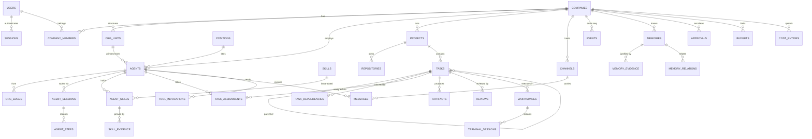

# 20-DATABASE-DESIGN.md — Full Normalized Schema

Status: v1.0 — Implementation-ready

PostgreSQL 16 + pgvector is the ONLY database (ADR-003). This document is the authoritative schema:
every table, column, constraint, and index that `packages/db` (Drizzle) must implement. Event names
per table reference 10-EVENT-ARCHITECTURE.md; memory semantics 12-MEMORY-ARCHITECTURE.md; API
surface over these tables 21-API-DESIGN.md; runtime writers 08-AGENT-RUNTIME.md.

---

## 1. Global conventions

- **IDs.** `id uuid PRIMARY KEY`, **UUIDv7**, generated **application-side** in Drizzle
  (`$defaultFn(uuidv7)`); no DB default. [WRITER-DECISION] App-side generation (PG16 has no native
  `uuidv7()`; app generation keeps IDs available pre-insert for outbox correlation).
- **Std columns.** Unless a table's spec says otherwise, every table has:
  `id uuid PK`, `created_at timestamptz NOT NULL DEFAULT now()`. Tenant tables additionally have
  `company_id uuid NOT NULL REFERENCES companies(id) ON DELETE RESTRICT` **as the second column**,
  plus index `(company_id)` implied by the composite indexes listed. Column tables below omit these
  three ("Std" row) and list only the rest.
- **Enums.** Stored as `text` + `CHECK (col IN (...))`, not PG enum types. [WRITER-DECISION]
  text+CHECK: additive value changes are a plain `ALTER ... DROP/ADD CONSTRAINT` migration; PG enums
  complicate removal/reorder and Drizzle diffing.
- **FK delete policy.** `ON DELETE RESTRICT` everywhere by default; `CASCADE` only where noted
  (pure child rows). Domain "deletion" is archival via status columns — hard deletes are for
  retention pruning only.
- **Money** in `bigint` minor units (`*_cents`), currency per company (A4). **Scores**
  (importance, confidence, strength, weight) `real` with CHECK bounds. **Timestamps** always
  `timestamptz`.
- **Naming.** snake_case; join tables plural; partial-index names `<table>_<cols>_<cond>_pidx`.
- **Extensions** (migration 0001): `vector`, `pg_trgm`, `btree_gin`.
- **Soft references to partitioned tables.** Columns referencing `events`, `agent_steps`,
  `cost_entries` rows (e.g. `memories.source_event_id`) are plain `uuid` **without FK**
  [WRITER-DECISION]: FKs to partitioned tables would need the partition key in every reference;
  integrity is app-enforced, and event ids are immutable/append-only.

### 1.1 Tenancy discipline (binding, from _DECISIONS §4)

- Every tenant-owned table: `company_id NOT NULL`. Platform-only tables (marked **[platform]**):
  `users`, `sessions`, `personal_access_tokens`, `model_providers`, `tools`, `rate_limits`.
- All repository methods take `CompanyContext`; a Drizzle wrapper (`packages/db/src/tenant.ts`)
  refuses any query on a tenant table lacking a `company_id` predicate (guard: table list is
  generated from schema metadata; CI test asserts every non-platform table is covered).
- **RLS-ready (Phase 3):** `company_id` is uniformly named and first FK on every tenant table, so
  RLS is a templated migration:
  `CREATE POLICY tenant_iso ON <t> USING (company_id = current_setting('app.company_id')::uuid);`
  Connections will `SET app.company_id` per request. No schema change will be required — that is
  the design constraint honored throughout this document.

---

## 2. Bounded context: Identity & Platform

### 2.1 `users` [platform]
Human accounts (Founder in MVP; multi-human Phase 3, A1). Std: id, created_at.

| column | type | null | default | notes |
|---|---|---|---|---|
| email | text | no | — | citext-like: UNIQUE on `lower(email)` |
| password_hash | text | no | — | Argon2id (ADR-013) |
| display_name | text | no | — | |
| totp_secret_enc | bytea | yes | — | sealed-box encrypted; null = 2FA off |
| totp_enabled | boolean | no | false | |
| platform_role | text | no | 'owner' | CHECK in ('owner','admin','member') |
| status | text | no | 'active' | CHECK in ('active','disabled') |
| last_login_at | timestamptz | yes | — | |

Unique: `users_email_lower_uq` on `(lower(email))`. Events: `user.created`, `user.login.succeeded`,
`user.login.failed` (audit_log mirror).

### 2.2 `sessions` [platform]
Cookie sessions. Std: id, created_at.

| column | type | null | default | notes |
|---|---|---|---|---|
| user_id | uuid FK users | no | — |
| token_hash | text | no | — |
| expires_at | timestamptz | no | — |
| last_seen_at | timestamptz | no | now() |
| ip | inet | yes | — |
| user_agent | text | yes | — |
| revoked_at | timestamptz | yes | — |

Unique: `(token_hash)`. Indexes: `(user_id)`, partial `(expires_at) WHERE revoked_at IS NULL`
(sweep job). Events: none (audit_log only).

### 2.3 `personal_access_tokens` [platform]
PATs for API/CLI (bearer). Std: id, created_at.

| column | type | null | default | notes |
|---|---|---|---|---|
| user_id | uuid FK users | no | — |
| name | text | no | — |
| token_hash | text | no | — |
| token_prefix | text | no | — |
| scopes | text[] | no | '{}' |
| expires_at | timestamptz | yes | — |
| last_used_at | timestamptz | yes | — |
| revoked_at | timestamptz | yes | — |

Unique: `(token_hash)`; `(user_id, name)`. Scope grammar in 21-API-DESIGN.md §3.2.
Events: none (audit_log).

### 2.4 `model_providers` [platform]
LLM provider registrations with encrypted keys (_DECISIONS §17). Std: id, created_at.

| column | type | null | default | notes |
|---|---|---|---|---|
| kind | text | no | — | CHECK in ('anthropic','openai','openrouter','ollama','vllm') |
| name | text | no | — |
| base_url | text | yes | — |
| api_key_enc | bytea | yes | — |
| enabled | boolean | no | true |

Unique: `(name)`. Events: `provider.registered`, `provider.updated`.

### 2.5 `model_profiles`
Company-level purpose→model routing (_DECISIONS §17). Std + company_id.

| column | type | null | default | notes |
|---|---|---|---|---|
| purpose | text | no | — | CHECK in ('reasoning','coding','fast','embedding','vision') |
| provider_id | uuid FK model_providers | no | — |
| model | text | no | — |
| params | jsonb | no | '{}' |
| max_tokens_per_call | int | yes | — |
| cost_cap_cents_per_call | int | yes | — |
| priority | smallint | no | 0 | fallback chain order, 0 = first |
| enabled | boolean | no | true |

Unique: `(company_id, purpose, priority)`. Events: `model_profile.updated`.

### 2.6 `rate_limits` [platform, UNLOGGED]
Token buckets for API rate limiting (no Redis, _DECISIONS §1). Columns: `key text PK`
(session/PAT/ip + route class), `tokens real NOT NULL`, `refilled_at timestamptz NOT NULL`.
No events; ephemeral (unlogged = lost on crash, acceptable).

### 2.7 `idempotency_keys`
Stores POST idempotency results (21-API-DESIGN.md §3.6). Std + company_id (nullable for
platform-level endpoints — the one tenant table where company_id is nullable, guarded by the
wrapper's platform-route allowlist).

| column | type | null | default | notes |
|---|---|---|---|---|
| key | text | no | — |
| endpoint | text | no | — |
| request_hash | text | no | — |
| response_status | smallint | yes | — |
| response_body | jsonb | yes | — |
| locked_at | timestamptz | yes | — |
| expires_at | timestamptz | no | now() + interval '24 hours' |

Unique: `(company_id, key, endpoint)` (nulls not distinct). Index: `(expires_at)` for sweep.

---

## 3. Bounded context: Companies & Tenancy

### 3.1 `companies`
Tenant root. Std: id, created_at (no company_id — it IS the company).

| column | type | null | default | notes |
|---|---|---|---|---|
| name | text | no | — |
| slug | text | no | — |
| currency | text | no | 'USD' | CHECK char_length = 3 |
| status | text | no | 'active' | CHECK in ('active','archived') |
| created_by_user_id | uuid FK users | no | — |

Unique: `(slug)`. Events: `company.created`, `company.archived`.

### 3.2 `company_members` [WRITER-DECISION — new table]
User↔company membership; required to validate `X-Company-Id` (21-API-DESIGN.md §3.3) even with a
single human. Std + company_id.

| column | type | null | default | notes |
|---|---|---|---|---|
| user_id | uuid FK users | no | — |
| role | text | no | 'founder' | CHECK in ('founder','admin','viewer') |
| removed_at | timestamptz | yes | — |

Unique: partial `(company_id, user_id) WHERE removed_at IS NULL`. Events: `company.member.added`.

### 3.3 `company_settings`
One typed row per company (wide row, not KV — domain must not hide in JSON). PK = `company_id`
(FK companies, no separate id). `created_at`, `updated_at timestamptz NOT NULL DEFAULT now()`.

| column | type | null | default | notes |
|---|---|---|---|---|
| output_language | text | no | 'en' |
| timezone | text | no | 'UTC' |
| default_autonomy_level | smallint | no | 2 | CHECK 0–5 |
| daily_spend_limit_cents | bigint | yes | — | company circuit breaker (_DECISIONS §8f) |
| consolidation_event_threshold | int | no | 25 | "every N significant events" |
| memory_token_budget_agent | int | no | 1500 |
| memory_token_budget_project | int | no | 2500 |
| memory_token_budget_company | int | no | 1000 |
| embedding_purpose_override | text | yes | — | rarely used; profiles are the norm |
| terminal_log_retention_days | smallint | no | 7 |
| extra | jsonb | no | '{}' | escape hatch for UI prefs only, never domain logic |

Events: `company.settings.updated`.

### 3.4 `company_sequences`
Per-company named counters (UUIDv7 stays the PK; humans get numbers — _DECISIONS §4). PK
`(company_id, name)`; columns `company_id uuid FK`, `name text`
CHECK in ('event_seq','task_number','employee_number','decision_number','incident_number',
'approval_number'), `value bigint NOT NULL DEFAULT 0`. Incremented with
`SELECT ... FOR UPDATE` **inside the same transaction** as the row consuming the number — this row
lock is what makes `events.seq` gap-free per company. No events.

### 3.5 `secrets`
Envelope-encrypted secrets (libsodium sealed boxes, _DECISIONS §1). Std + company_id.

| column | type | null | default | notes |
|---|---|---|---|---|
| name | text | no | — |
| scope | text | no | 'company' | CHECK in ('company','project','integration') |
| project_id | uuid FK projects | yes | — |
| ciphertext | bytea | no | — |
| created_by_user_id | uuid FK users | no | — |
| rotated_at | timestamptz | yes | — |

Unique: `(company_id, scope, coalesce(project_id, uuid_nil), name)` via expression unique index.
Agents never read this table (invariant S2 — tools inject server-side). Events: none; audit_log rows
`secret.created/rotated/deleted`.

---

## 4. Bounded context: Organization

### 4.1 `org_units`
Self-referencing units (_DECISIONS §5). Std + company_id.

| column | type | null | default | notes |
|---|---|---|---|---|
| parent_id | uuid FK org_units | yes | — |
| kind | text | no | — | CHECK in ('department','team','office','division') |
| name | text | no | — |
| slug | text | no | — |
| archived_at | timestamptz | yes | — |

Unique: `(company_id, slug)`. Index: `(company_id, parent_id)`. CHECK `parent_id <> id`.
Events: `org.unit.created`, `org.unit.updated`, `org.unit.archived` (catalog 10.1).

### 4.2 `positions`
Role templates (_DECISIONS §5). Std + company_id.

| column | type | null | default | notes |
|---|---|---|---|---|
| title | text | no | — |
| seniority_track | text[] | no | — | e.g. '{junior,mid,senior,staff,lead,expert}' |
| default_role | text | no | — | policy-engine role key (18-PERMISSIONS-AND-SECURITY.md) |
| description | text | yes | — |
| archived_at | timestamptz | yes | — |

Unique: `(company_id, title)`. Events: `position.created`, `position.updated`.

### 4.3 `agents`
The persistent employee — identity decoupled from model (_DECISIONS §6). Std + company_id.

| column | type | null | default | notes |
|---|---|---|---|---|
| employee_number | int | no | — | from company_sequences('employee_number') |
| name | text | no | — |
| avatar_url | text | yes | — |
| status | text | no | 'draft' | CHECK in ('draft','active','paused','offboarded') |
| position_id | uuid FK positions | no | — |
| org_unit_id | uuid FK org_units | no | — | primary team |
| seniority | text | no | 'junior' | CHECK in ('junior','mid','senior','staff','lead','expert') |
| autonomy_level | smallint | no | 2 | CHECK 0–5 |
| persona | text | no | — | short professional bio used in prompts |
| employment | jsonb | no | '{}' | hired_at, offboarded_at, hire_approval_id (§10 JSONB policy) |

Unique: `(company_id, employee_number)`; partial `(company_id, lower(name)) WHERE status <> 'offboarded'`.
Indexes: `(company_id, status)`, `(company_id, org_unit_id)`.
Runtime presence is NOT here — it lives in `agent_sessions.current_activity` (derived, _DECISIONS §6).
Events: `agent.hired`, `agent.updated`, `agent.paused`, `agent.resumed`, `agent.offboarded`,
`agent.promotion.recommended`.

### 4.4 `agent_model_bindings`
Per-agent model preference; identity never references a model elsewhere. Std + company_id.

| column | type | null | default | notes |
|---|---|---|---|---|
| agent_id | uuid FK agents CASCADE | no | — |
| purpose | text | no | — | CHECK in ('primary','fast','embedding') |
| provider_id | uuid FK model_providers | no | — | [WRITER-DECISION] FK instead of free-text provider name, for integrity |
| model | text | no | — |
| params | jsonb | no | '{}' |
| priority | smallint | no | 0 |

Unique: `(agent_id, purpose, priority)`. Events: `agent.model.binding.changed`.

### 4.5 `agent_sessions`
One row per Temporal `agentTaskWorkflow` execution; powers the Agent Monitor. Std + company_id.

| column | type | null | default | notes |
|---|---|---|---|---|
| agent_id | uuid FK agents | no | — |
| task_id | uuid FK tasks | yes | — | null for inbox/consolidation sessions |
| workflow_id | text | no | — |
| run_id | text | no | — |
| status | text | no | 'starting' | CHECK in ('starting','running','waiting','completed','failed','cancelled') |
| current_activity | text | no | 'IDLE' | CHECK in ('IDLE','THINKING','WORKING','WAITING','COMMUNICATING','REVIEWING','TESTING','LEARNING','BLOCKED','ESCALATING','OFFLINE') |
| started_at | timestamptz | no | now() |
| ended_at | timestamptz | yes | — |
| steps_count | int | no | 0 |
| tokens_in | bigint | no | 0 |
| tokens_out | bigint | no | 0 |
| cost_cents | bigint | no | 0 |

Unique: `(workflow_id, run_id)`. Indexes: partial `(company_id, agent_id) WHERE status IN
('starting','running','waiting')` (live monitor); `(agent_id, started_at DESC)`.
Events: `agent.session.started`, `agent.session.ended` (status carries completed/failed/cancelled),
`agent.status.changed`.

### 4.6 `agent_steps` — PARTITIONED (monthly, RANGE on created_at)
Every loop step (_DECISIONS §8). PK `(id, created_at)`. Std + company_id.

| column | type | null | default | notes |
|---|---|---|---|---|
| agent_session_id | uuid | no | — | soft ref (parent may outlive pruned partitions) |
| agent_id | uuid | no | — |
| task_id | uuid | yes | — |
| step_no | int | no | — |
| action_kind | text | no | — | CHECK in ('use_tool','send_message','create_task','delegate_task','request_review','request_help','escalate','update_task_status','record_decision','complete_task','wait_for','abandon') |
| action | jsonb | no | — | parsed AgentAction args (§10) |
| observation | jsonb | yes | — | truncated result summary (§10) |
| tokens_in | int | no | 0 |
| tokens_out | int | no | 0 |
| cost_cents | int | no | 0 |
| duration_ms | int | yes | — |

Per-partition indexes: `(agent_session_id, step_no)`, `(company_id, created_at)`,
`(task_id, created_at)`. `(agent_session_id, step_no)` uniqueness is app-guaranteed (workflow is
single writer); cross-partition unique constraints are not enforceable. Events: `agent.step.recorded`
(low-significance, not consolidated).

### 4.7 `org_edges`
Typed organization graph (_DECISIONS §5). Std + company_id.

| column | type | null | default | notes |
|---|---|---|---|---|
| from_agent_id | uuid FK agents | no | — |
| to_agent_id | uuid FK agents | yes | — |
| to_unit_id | uuid FK org_units | yes | — |
| kind | text | no | — | CHECK in ('reports_to','manages','member_of','leads','mentors','collaborates_with') |
| strength | real | yes | — | CHECK 0–1; only collaborates_with, recomputed nightly |
| ended_at | timestamptz | yes | — |

CHECKs: `(to_agent_id IS NULL) <> (to_unit_id IS NULL)` (exactly one);
`kind IN ('member_of','leads') = (to_unit_id IS NOT NULL)` (unit-edges use to_unit_id).
Partial uniques: `(from_agent_id) WHERE kind='reports_to' AND ended_at IS NULL` (one active
manager); `(from_agent_id, to_agent_id, kind) WHERE ended_at IS NULL`;
`(from_agent_id, to_unit_id, kind) WHERE ended_at IS NULL`.
Indexes: `(company_id, kind)`, `(to_agent_id)`, `(to_unit_id)`. `reports_to` cycle check: recursive
CTE inside the insert transaction (04-ORGANIZATION-ENGINE.md).
Events: `org.edge.created`, `org.edge.ended`, `org.relationship.recomputed`.

---

## 5. Bounded context: Skills & Performance

### 5.1 `skills`
Company-scoped taxonomy (_DECISIONS §11). Std + company_id. Columns: `name text NOT NULL`,
`category text NOT NULL` (e.g. 'engineering','marketing','communication'), `description text`,
`archived_at timestamptz`. Unique `(company_id, name)`. Events: `skill.created`.

### 5.2 `agent_skills`
Per-agent skill state. Std + company_id.

| column | type | null | default | notes |
|---|---|---|---|---|
| agent_id | uuid FK agents CASCADE | no | — |
| skill_id | uuid FK skills | no | — |
| level | smallint | no | 1 | CHECK 1–5 |
| confidence | real | no | 0.3 | CHECK 0–1 |
| evidence_count | int | no | 0 |
| last_used_at | timestamptz | yes | — |
| level_updated_at | timestamptz | yes | — |

Unique: `(agent_id, skill_id)`. Index: `(company_id, skill_id, level DESC)` ("who can do X").
Level recomputed deterministically from evidence (weighted sum + time decay, _DECISIONS §11) —
never LLM-set. Events: `skill.evidence.recorded`, `agent.skill.updated`.

### 5.3 `skill_evidence`
Append-only evidence trail. Std + company_id.

| column | type | null | default | notes |
|---|---|---|---|---|
| agent_skill_id | uuid FK agent_skills CASCADE | no | — |
| kind | text | no | — | CHECK in ('task_success','review_accepted','production_result','peer_eval','manager_eval','experiment','failure','failure_resolved') |
| weight | real | no | — | CHECK weight >= -1 AND weight <= 1 |
| ref | text | no | — | typed URN: 'task:<id>', 'review:<id>', 'event:<id>' |
| note | text | yes | — |

Index: `(agent_skill_id, created_at DESC)`. Events: `skill.evidence.recorded`.

### 5.4 `performance_snapshots`
Periodic (weekly) per-agent rollups for reports/promotions. Std + company_id.

| column | type | null | default | notes |
|---|---|---|---|---|
| agent_id | uuid FK agents | no | — |
| period_start | date | no | — |
| period_end | date | no | — |
| tasks_completed | int | no | 0 |
| tasks_failed | int | no | 0 |
| reviews_given | int | no | 0 |
| reviews_received_approved | int | no | 0 |
| reviews_received_changes | int | no | 0 |
| escalations | int | no | 0 |
| messages_sent | int | no | 0 |
| tokens_total | bigint | no | 0 |
| cost_cents | bigint | no | 0 |
| extra | jsonb | no | '{}' | extensible metrics only (§10) |

Unique: `(agent_id, period_start)`. Events: `performance.snapshot.created`.

Auxiliary: `development_objectives` (13-SKILL-AND-LEARNING-SYSTEM.md §7 [WRITER-DECISION]) —
per-agent growth objectives: agent_id, skill_id, target_level, due_date, created_by_agent_id,
status (`open|met|missed|cancelled`), linked task ids. Std + company_id.

---

## 6. Bounded context: Projects & Engineering

### 6.1 `projects`
First-class project (_BRIEF §6; state machine _DECISIONS §19). Std + company_id.

| column | type | null | default | notes |
|---|---|---|---|---|
| slug | text | no | — |
| name | text | no | — |
| objective_md | text | no | — | business goal from Founder |
| constraints_md | text | yes | — |
| status | text | no | 'proposed' | CHECK in ('proposed','intake','active','paused','completed','archived','cancelled') |
| lead_agent_id | uuid FK agents | yes | — |
| created_by_user_id | uuid FK users | no | — |
| intake_report_artifact_id | uuid FK artifacts | yes | — |
| archived_at | timestamptz | yes | — |

Unique: `(company_id, slug)`. Index: `(company_id, status)`. Memory namespace = memories rows with
`scope='project', scope_ref=projects.id`. Events: `project.created`, `project.imported`,
`project.analysis.completed`, `project.status.changed`, `project.completed`.

### 6.2 `project_members`
Agent staffing. Std + company_id. Columns: `project_id uuid FK projects CASCADE`,
`agent_id uuid FK agents`, `role text` CHECK in
('owner','architect','lead','engineer','qa','devops','marketer','stakeholder'),
`added_at timestamptz DEFAULT now()`, `removed_at timestamptz`.
Partial unique `(project_id, agent_id, role) WHERE removed_at IS NULL`. Index `(agent_id)`.
Events: `project.member.added`, `project.member.removed`.

### 6.3 `repositories`
Server-side bare repos (_DECISIONS §13). Std + company_id.

| column | type | null | default | notes |
|---|---|---|---|---|
| project_id | uuid FK projects | no | — |
| name | text | no | — |
| bare_path | text | no | — | '/data/repos/<project_id>.git' |
| default_branch | text | no | 'main' |
| origin_url | text | yes | — | import source (path or URL) |
| github_remote | text | yes | — | optional mirror (A7) |
| imported_at | timestamptz | yes | — |
| languages | jsonb | no | '{}' | intake analysis: {"ts": 0.8, ...} (§10) |

Unique: `(project_id, name)`, `(bare_path)`. Events: `project.imported`, `project.repo.ingested`,
`workspace.merged` (per merged review).

### 6.4 `environments`
Project environments (local/staging/prod; deploy execution Phase 3). Std + company_id.
Columns: `project_id uuid FK projects CASCADE`, `name text` CHECK in ('local','staging','production'),
`base_url text`, `config jsonb NOT NULL DEFAULT '{}'` (non-secret config, §10; secrets live in
`secrets` with scope='project'), `archived_at timestamptz`. Unique `(project_id, name)`.
Events: `environment.configured`.

### 6.5 `deployments`
Deployment records (dark in MVP, schema present). Std + company_id.

| column | type | null | default | notes |
|---|---|---|---|---|
| project_id | uuid FK projects | no | — |
| environment_id | uuid FK environments | no | — |
| task_id | uuid FK tasks | yes | — |
| git_ref | text | no | — |
| status | text | no | 'pending' | CHECK in ('pending','running','succeeded','failed','rolled_back') |
| started_at | timestamptz | yes | — |
| finished_at | timestamptz | yes | — |
| logs_uri | text | yes | — |

Index: `(project_id, created_at DESC)`. Events: `project.deployment.started`, `project.deployment.completed`,
`project.deployment.failed`.

---

## 7. Bounded context: Tasks & Work

### 7.1 `tasks`
Single-table hierarchy GOAL→SUBTASK (_DECISIONS §7). Std + company_id.

| column | type | null | default | notes |
|---|---|---|---|---|
| project_id | uuid FK projects | yes | — | null: company-level goals |
| parent_id | uuid FK tasks | yes | — |
| number | int | no | — | company_sequences('task_number') → "TASK-81" |
| kind | text | no | — | CHECK in ('goal','initiative','epic','task','subtask') |
| title | text | no | — |
| objective | text | no | — |
| context | jsonb | no | '{}' | free-form working context (§10) |
| creator_agent_id | uuid FK agents | yes | — | null → Founder |
| owner_agent_id | uuid FK agents | yes | — | current owner (history in task_assignments) |
| org_unit_id | uuid FK org_units | yes | — |
| priority | text | no | 'P2' | CHECK in ('P0','P1','P2','P3') |
| status | text | no | 'DRAFT' | CHECK in ('DRAFT','BACKLOG','PLANNED','ASSIGNED','IN_PROGRESS','WAITING','BLOCKED','REVIEW','CHANGES_REQUESTED','QA','QA_FAILED','APPROVAL','REJECTED','DONE','FAILED','CANCELLED') |
| success_criteria | text[] | no | '{}' |
| risk | text | no | 'low' | CHECK in ('low','medium','high','critical') |
| budget_cents | bigint | yes | — |
| spent_cents | bigint | no | 0 | denormalized from cost_entries for guard checks |
| deadline | timestamptz | yes | — |
| approval_policy_id | uuid FK policies | yes | — |
| delegation_depth | smallint | no | 0 | CHECK <= 5 (_DECISIONS §7) |
| reassignment_count | smallint | no | 0 | CHECK <= 3 |
| result | jsonb | yes | — | outcome summary on terminal states (§10) |
| closed_at | timestamptz | yes | — |

Unique: `(company_id, number)`. CHECK: `parent_id <> id`. Transition legality + per-role permission
is enforced in `packages/domain` (state machine, _DECISIONS §7), not by CHECK.
Indexes: `(company_id, status)`, `(company_id, project_id, status)`,
partial `(owner_agent_id) WHERE status IN ('ASSIGNED','IN_PROGRESS','WAITING','BLOCKED','REVIEW','CHANGES_REQUESTED','QA','QA_FAILED','APPROVAL')`
(agent workload), `(parent_id)`, `(company_id, deadline) WHERE deadline IS NOT NULL AND closed_at IS NULL`.
Events: `task.created`, `task.updated`, `task.status.changed`, `agent.task.assigned`,
`task.completed`, `task.failed`, `task.cancelled`.

### 7.2 `task_dependencies`
Blocking DAG. Std + company_id. Columns: `task_id uuid FK tasks CASCADE`,
`depends_on_task_id uuid FK tasks`, `kind text DEFAULT 'blocks'` CHECK in ('blocks'),
`resolved_at timestamptz`. Unique `(task_id, depends_on_task_id)`. CHECK
`task_id <> depends_on_task_id`. Cycle check via recursive CTE in insert tx. Index
`(depends_on_task_id) WHERE resolved_at IS NULL` (fan-out `dependencyResolved` signals).
Events: `task.dependency.added`, `task.dependency.resolved`.

### 7.3 `task_assignments`
Full assignment HISTORY (current owner denormalized on tasks). Std + company_id.

| column | type | null | default | notes |
|---|---|---|---|---|
| task_id | uuid FK tasks CASCADE | no | — |
| agent_id | uuid FK agents | no | — |
| role | text | no | 'owner' | CHECK in ('owner','reviewer','qa','collaborator') |
| assigned_by_agent_id | uuid FK agents | yes | — | null → Founder/system |
| reason | text | yes | — |
| assigned_at | timestamptz | no | now() |
| unassigned_at | timestamptz | yes | — |

Partial unique: `(task_id, role) WHERE role='owner' AND unassigned_at IS NULL`. Indexes:
`(task_id, assigned_at)`, `(agent_id) WHERE unassigned_at IS NULL`. Events: `agent.task.assigned`,
`task.reassigned`, `review.requested`.

### 7.4 `artifacts`
Work products (docs, reports, diffs, intake reports, executive reports). Std + company_id.

| column | type | null | default | notes |
|---|---|---|---|---|
| task_id | uuid FK tasks | yes | — |
| project_id | uuid FK projects | yes | — |
| kind | text | no | — | CHECK in ('code_diff','document','report','intake_report','executive_report','design','test_report','promotion_review','media','other') |
| title | text | no | — |
| content_md | text | yes | — | inline markdown, ≤256KB |
| uri | text | yes | — | file/object path when not inline |
| git_ref | text | yes | — | commit/branch for code artifacts |
| meta | jsonb | no | '{}' | kind-specific extras (§10) |
| created_by_agent_id | uuid FK agents | yes | — | null → system/Founder |

CHECK: `content_md IS NOT NULL OR uri IS NOT NULL OR git_ref IS NOT NULL`.
Indexes: `(task_id)`, `(project_id, kind)`, `(company_id, kind, created_at DESC)`.
Events: `artifact.created`.

### 7.5 `reviews`
The PR entity (_DECISIONS §13): branch review + QA + architecture/security gates. Std + company_id.

| column | type | null | default | notes |
|---|---|---|---|---|
| task_id | uuid FK tasks | no | — |
| project_id | uuid FK projects | no | — |
| repository_id | uuid FK repositories | no | — |
| workspace_id | uuid FK workspaces | yes | — |
| branch | text | no | — | 'task/<number>-<slug>' |
| kind | text | no | 'code' | CHECK in ('code','architecture','qa','security') |
| author_agent_id | uuid FK agents | no | — |
| reviewer_agent_id | uuid FK agents | yes | — | assigned reviewer; CHECK <> author_agent_id |
| status | text | no | 'pending' | CHECK in ('pending','in_review','changes_requested','approved','merged','abandoned') |
| verdict_md | text | yes | — |
| diff_stat | jsonb | yes | — | {files, additions, deletions} (§10) |
| merged_commit | text | yes | — |
| decided_at | timestamptz | yes | — |

Indexes: `(task_id)`, partial `(company_id, reviewer_agent_id) WHERE status IN ('pending','in_review')`
(reviewer inbox), `(project_id, created_at DESC)`. "No developer approves their own work" =
CHECK `reviewer_agent_id IS NULL OR reviewer_agent_id <> author_agent_id` + domain rule.
Events: `review.requested`, `review.started`, `review.completed`, `workspace.merged` (merge by lead).

---

## 8. Bounded context: Communication

### 8.1 `channels`
Persistent channels (_DECISIONS §14). Std + company_id.

| column | type | null | default | notes |
|---|---|---|---|---|
| kind | text | no | — | CHECK in ('dm','team','department','project','task_thread','review','escalation') |
| name | text | yes | — | null for dm/task_thread |
| org_unit_id | uuid FK org_units | yes | — |
| project_id | uuid FK projects | yes | — |
| task_id | uuid FK tasks | yes | — |
| review_id | uuid FK reviews | yes | — |
| dm_key | text | yes | — | sorted participant ids hash [WRITER-DECISION] enforces one DM channel per pair |
| archived_at | timestamptz | yes | — |

Partial uniques: `(company_id, dm_key) WHERE kind='dm'`; `(task_id) WHERE kind='task_thread'`;
`(review_id) WHERE kind='review'`. CHECK kind↔ref consistency (e.g. `kind='task_thread' →
task_id IS NOT NULL`). Events: `channel.created`, `channel.archived`.

### 8.2 `channel_members`
Membership incl. Founder. Std + company_id. Columns: `channel_id uuid FK channels CASCADE`,
`agent_id uuid FK agents` **nullable — NULL = the Founder** (consistent with messages.sender),
`joined_at timestamptz DEFAULT now()`, `left_at timestamptz`, `last_read_at timestamptz`.
Partial unique `(channel_id, coalesce(agent_id, uuid_nil)) WHERE left_at IS NULL` (expression
index). Index `(agent_id)`. Events: `channel.member.added`, `channel.member.removed`.

### 8.3 `messages`
All communication, persisted independently of any LLM context. Std + company_id.

| column | type | null | default | notes |
|---|---|---|---|---|
| channel_id | uuid FK channels | no | — |
| sender_agent_id | uuid FK agents | yes | — | null → Founder |
| kind | text | no | 'text' | CHECK in ('text','help_request','review_request','escalation','status','system') |
| body | text | no | — | markdown |
| refs | jsonb | no | '{}' | typed refs {task_id, review_id, approval_id,...} (§10) |
| reply_to_message_id | uuid FK messages | yes | — |

Indexes: `(channel_id, created_at)` (thread pagination), `(company_id, created_at DESC)`,
GIN `gin_trgm_ops` on `body` (comms search), GIN on `refs jsonb_path_ops` (find messages about a
task). Delivery: active agent → Temporal signal; idle → `agentInboxWorkflow` (_DECISIONS §14).
Events: `agent.message.sent` (every insert; drives office animation).

---

## 9. Bounded context: Events (source of truth)

### 9.1 `events` — PARTITIONED (monthly, RANGE on occurred_at)
Append-only transactional outbox = event store (_DECISIONS §9). PK `(id, occurred_at)`.

| column | type | null | default | notes |
|---|---|---|---|---|
| id | uuid | no | — | UUIDv7 |
| company_id | uuid | no | — | FK companies (FK allowed: companies not partitioned) |
| seq | bigint | no | — | per-company gap-free via company_sequences('event_seq') row lock |
| type | text | no | — | 'domain.entity.action', past tense |
| version | smallint | no | 1 |
| occurred_at | timestamptz | no | now() | partition key |
| actor | jsonb | no | — | {kind: 'agent'\|'founder'\|'system', id} (§10) |
| task_id | uuid | yes | — | subject refs — first-class columns, NOT buried in payload |
| project_id | uuid | yes | — |
| agent_id | uuid | yes | — |
| correlation_id | uuid | yes | — |
| causation_id | uuid | yes | — |
| payload | jsonb | no | — | Zod-validated per type/version (packages/events) (§10) |
| published_at | timestamptz | yes | — | set by outbox relay after NATS publish |

Constraints & indexes (per partition):
- Unique `(company_id, seq, occurred_at)`. True `(company_id, seq)` uniqueness is guaranteed by the
  serialized `company_sequences` increment in the writing transaction; the index is belt-and-braces
  within a partition.
- `(company_id, seq)` btree — replay/`resume` queries (22-REALTIME-ARCHITECTURE.md).
- `(company_id, type, occurred_at)` — timeline filters.
- Partials: `(occurred_at) WHERE published_at IS NULL` (outbox relay scan — stays tiny);
  `(task_id, occurred_at) WHERE task_id IS NOT NULL`; `(agent_id, occurred_at) WHERE agent_id IS NOT NULL`.
- GIN `payload jsonb_path_ops` — ad-hoc timeline drill-downs only; all routine queries use the
  first-class columns.

Written in the SAME transaction as the state change. Terminal frames NEVER enter this table
(_DECISIONS §9 — NATS ephemeral + files only). Events touching it: all (~180, 10-EVENT-ARCHITECTURE.md).

### 9.2 `dead_events`
JetStream DLQ landing zone. Std + company_id.

| column | type | null | default | notes |
|---|---|---|---|---|
| event_id | uuid | no | — | soft ref |
| event_type | text | no | — |
| consumer | text | no | — | durable consumer name |
| deliveries | int | no | 0 |
| error | text | no | — |
| payload | jsonb | no | — | copy for offline inspection |
| status | text | no | 'dead' | CHECK in ('dead','replayed','discarded') |
| first_failed_at | timestamptz | no | now() |
| resolved_at | timestamptz | yes | — |

Unique: `(event_id, consumer)`. Index: partial `(company_id) WHERE status='dead'` (alerting).
Events: `event.dead_lettered` (meta-event, alerts only).

Auxiliary: `consumer_offsets` (10-EVENT-ARCHITECTURE.md §6 [WRITER-DECISION]) — optional
per-consumer event-id dedupe table; the default idempotency mechanism is a per-consumer
`last_seq` high-water-mark per company.

---

## 10. Bounded context: Memory

### 10.1 `memories`
Core memory record (_DECISIONS §10; semantics in 12-MEMORY-ARCHITECTURE.md). Std + company_id.

| column | type | null | default | notes |
|---|---|---|---|---|
| scope | text | no | — | CHECK in ('company','project','agent') |
| scope_ref | uuid | yes | — | project_id or agent_id; CHECK `(scope='company') = (scope_ref IS NULL)` |
| type | text | no | — | CHECK in ('semantic','episodic','procedural','decision','failure','experiment','relationship','artifact') |
| title | text | no | — |
| content | text | no | — | markdown |
| summary | text | no | — | one-paragraph, used in Working Set |
| entities | jsonb | no | '{}' | extracted entity mentions (§10 policy) |
| importance | real | no | — | CHECK 0–1 |
| confidence | real | no | — | CHECK 0–1 |
| status | text | no | 'candidate' | CHECK in ('candidate','active','superseded','archived','rejected') |
| source_event_id | uuid | yes | — | soft ref |
| created_by_agent_id | uuid FK agents | yes | — | null → consolidation system |
| last_verified_at | timestamptz | yes | — |
| expires_at | timestamptz | yes | — |
| retrieval_count | int | no | 0 |
| embedding | vector | yes | — | no typmod — dimension varies per model |
| embedding_model | text | yes | — |
| embedding_dim | smallint | yes | — |
| version | int | no | 1 |
| updated_at | timestamptz | no | now() |

Indexes:
- **HNSW per active dimension** (ADR-020) — partial expression indexes:
  `CREATE INDEX memories_emb_1536_hnsw ON memories USING hnsw ((embedding::vector(1536)) vector_cosine_ops) WHERE embedding_dim = 1536;`
  `CREATE INDEX memories_emb_768_hnsw ON memories USING hnsw ((embedding::vector(768)) vector_cosine_ops) WHERE embedding_dim = 768;`
  (m=16, ef_construction=64 defaults; queries filter `embedding_dim = $dim` to hit the right index).
- `(company_id, scope, scope_ref, status)` — scope-window for retrieval;
  `(company_id, type, status)`; partial `(company_id, created_at) WHERE status='candidate'`
  (consolidation review queue); GIN on `entities jsonb_path_ops`; GIN `gin_trgm_ops` on `title`
  (Observatory keyword search leg of hybrid search).

Events: `memory.created`, `memory.updated`, `memory.superseded`, `memory.archived`,
`memory.contradiction.detected`, `memory.retrieved` (sampled, not 1:1).

### 10.2 `memory_versions`
Full version history. Std + company_id. Columns: `memory_id uuid FK memories CASCADE`,
`version int`, `title text`, `content text`, `summary text`, `importance real`, `confidence real`,
`status text`, `changed_by text` CHECK in ('system','agent','founder'), `changed_by_ref uuid`,
`change_reason text`. Unique `(memory_id, version)`. Events: `memory.updated` carries version.

### 10.3 `memory_evidence`
Why a memory exists. Std + company_id.

| column | type | null | default | notes |
|---|---|---|---|---|
| memory_id | uuid FK memories CASCADE | no | — |
| kind | text | no | — | CHECK in ('event','artifact','review','metric','statement','incident') — 'incident' added [WRITER-DECISION], additive to the _DECISIONS minimum set |
| ref | text | no | — | typed URN: 'event:<id>', 'artifact:<id>', 'incident:<id>'… |
| weight | real | no | 1.0 | CHECK 0–1 |

Indexes: `(memory_id)`, `(company_id, ref)` (reverse lookup: "which memories cite this incident").
Events: `memory.evidence.added`.

### 10.4 `memory_relations`
Typed memory graph. Std + company_id. Columns: `from_memory_id uuid FK memories CASCADE`,
`to_memory_id uuid FK memories CASCADE`, `kind text` CHECK in
('supports','contradicts','supersedes','derived_from','related_to'), `created_by text`
CHECK in ('system','agent','founder'). Unique `(from_memory_id, to_memory_id, kind)`; CHECK
`from_memory_id <> to_memory_id`. Index `(to_memory_id)`. Events:
`memory.contradiction.detected`, `memory.relation.created`.

### 10.5 `memory_promotions`
Promotion pipeline records (agent→project→company, _DECISIONS §10). Std + company_id.

| column | type | null | default | notes |
|---|---|---|---|---|
| source_memory_id | uuid FK memories | no | — |
| target_scope | text | no | — | CHECK in ('project','company') |
| target_ref | uuid | yes | — | project_id when target_scope='project' |
| target_memory_id | uuid FK memories | yes | — | the created copy (linked derived_from) |
| evidence_count | int | no | 0 |
| distinct_task_count | int | no | 0 |
| status | text | no | 'proposed' | CHECK in ('proposed','approved','rejected') |
| approver_agent_id | uuid FK agents | yes | — | owning lead (→project) / manager (→company) |
| rule_policy_id | uuid FK policies | yes | — | promotion rules live in `policies` (kind='memory_promotion') [WRITER-DECISION] |
| decided_at | timestamptz | yes | — |

Index: partial `(company_id) WHERE status='proposed'`. Events: `memory.promotion.proposed`,
`memory.promoted`.

Auxiliary (12-MEMORY-ARCHITECTURE.md [WRITER-DECISION]): `memory_retrievals` — UNLOGGED
observability table (per Working-Set build: lane, returned_ids, scores, budget_tokens_used,
duration_ms; 14-day retention); `memory_clusters` / `memory_cluster_members` — nightly precomputed
Observatory communities. Std + company_id.

---

## 11. Bounded context: Decisions, Experiments, Incidents

### 11.1 `decisions`
ADRs and business/technical decisions of record. Std + company_id.

| column | type | null | default | notes |
|---|---|---|---|---|
| project_id | uuid FK projects | yes | — | null → company-wide |
| number | int | no | — | company_sequences('decision_number') → "ADR-12" |
| title | text | no | — |
| status | text | no | 'proposed' | CHECK in ('proposed','accepted','superseded','deprecated','rejected') |
| context_md | text | no | — |
| decision_md | text | no | — |
| consequences_md | text | yes | — |
| decided_by_agent_id | uuid FK agents | yes | — | null → Founder |
| task_id | uuid FK tasks | yes | — | originating task |
| supersedes_decision_id | uuid FK decisions | yes | — |
| decided_at | timestamptz | yes | — |

Unique: `(company_id, number)`. Indexes: `(project_id, status)`. Retrieval: decisions feed the
structured leg of the Working Set (_DECISIONS §10 retrieval) and Architecture Guardian rules
(15-ENGINEERING-DEPARTMENT.md). Events: `decision.recorded`, `decision.status.changed`.

### 11.2 `experiments`
Generic Experiment Engine (_BRIEF §7; UI Phase 2, schema MVP). Std + company_id.

| column | type | null | default | notes |
|---|---|---|---|---|
| project_id | uuid FK projects | yes | — |
| owner_agent_id | uuid FK agents | no | — |
| name | text | no | — |
| hypothesis_md | text | no | — |
| baseline_md | text | yes | — |
| variant_md | text | yes | — |
| metric_defs | jsonb | no | '[]' | [{key, description, direction, target}] (§10) |
| sample_size | int | yes | — |
| status | text | no | 'designed' | CHECK in ('designed','baseline','running','analyzing','adopted','rejected','inconclusive') |
| decision_md | text | yes | — |
| learning_memory_id | uuid FK memories | yes | — | the memory the learning became |
| started_at | timestamptz | yes | — |
| ended_at | timestamptz | yes | — |

Index: `(company_id, status)`. Events: `experiment.started`, `experiment.status.changed`,
`experiment.completed`.

### 11.3 `experiment_results`
Measured datapoints. Std + company_id. Columns: `experiment_id uuid FK experiments CASCADE`,
`arm text` CHECK in ('baseline','variant'), `metric_key text`, `value numeric NOT NULL`,
`sample int`, `confidence real` CHECK 0–1, `measured_at timestamptz NOT NULL`.
Index `(experiment_id, metric_key, measured_at)`. Events: `experiment.result.recorded`.

### 11.4 `incidents`
Failures/incidents/postmortems designed as ONE entity + linked memories (per brief instruction):
the postmortem is columns here; learnings are `memories(type='failure')` rows citing the incident
via `memory_evidence(kind='incident')`. Std + company_id.

| column | type | null | default | notes |
|---|---|---|---|---|
| number | int | no | — | company_sequences('incident_number') → "INC-7" |
| severity | text | no | — | CHECK in ('sev1','sev2','sev3','sev4') |
| status | text | no | 'open' | CHECK in ('open','mitigated','resolved','closed') |
| title | text | no | — |
| summary_md | text | no | — |
| project_id | uuid FK projects | yes | — |
| task_id | uuid FK tasks | yes | — |
| detected_by_agent_id | uuid FK agents | yes | — | null → system/monitoring |
| started_at | timestamptz | no | now() |
| mitigated_at | timestamptz | yes | — |
| resolved_at | timestamptz | yes | — |
| postmortem_md | text | yes | — |
| postmortem_status | text | no | 'pending' | CHECK in ('pending','drafted','reviewed','published') |

Unique: `(company_id, number)`. Index: partial `(company_id, severity) WHERE status IN
('open','mitigated')`. Sev1/sev2 (= security incidents, destructive-prod class) auto-create an
`approvals`-routed Founder brief (_BRIEF §2.3). Events: `incident.opened`, `incident.mitigated`,
`incident.resolved`, `incident.postmortem.published`.

---

## 12. Bounded context: Tools, Policies, Approvals, Audit

### 12.1 `tools` [platform]
Registry CACHE — source of truth is code in `packages/tools` (_DECISIONS §12); this table mirrors
it at server boot for UI/joins. [WRITER-DECISION] platform-level (tools are code, not tenant data);
tenant scoping happens in `tool_permissions`. Std: id, created_at.

| column | type | null | default | notes |
|---|---|---|---|---|
| name | text | no | — |
| version | text | no | — |
| description | text | no | — |
| risk_class | text | no | — | CHECK in ('R0','R1','R2','R3') |
| scopes | text[] | no | — | subset of {fs,git,network,db,money,publish,terminal} |
| input_schema | jsonb | no | — | JSON Schema derived from Zod (§10) |
| enabled | boolean | no | true |
| synced_at | timestamptz | no | now() |

Unique: `(name, version)`; partial `(name) WHERE enabled`. Events: `tool.registered`.

### 12.2 `tool_permissions`
Grants: agent/position/unit scoped (_DECISIONS §12). Std + company_id.

| column | type | null | default | notes |
|---|---|---|---|---|
| tool_name | text | no | — | references tools.name (soft — survives tool re-versioning) |
| subject_kind | text | no | — | CHECK in ('agent','position','org_unit') |
| subject_id | uuid | no | — | agent/position/unit id (validated app-side per kind) |
| constraints | jsonb | no | '{}' | path prefixes, repo allowlist, spend cap, domains (§10) |
| granted_by_user_id | uuid FK users | yes | — |
| granted_by_agent_id | uuid FK agents | yes | — | managers may grant within their scope |
| expires_at | timestamptz | yes | — |
| revoked_at | timestamptz | yes | — |

Partial unique: `(company_id, tool_name, subject_kind, subject_id) WHERE revoked_at IS NULL`.
Index: `(subject_kind, subject_id)`. Events: `tool.permission.granted`, `tool.permission.revoked`.

### 12.3 `tool_invocations`
Audit row for EVERY gateway decision (_DECISIONS §12; invariant S3). Std + company_id.

| column | type | null | default | notes |
|---|---|---|---|---|
| agent_id | uuid FK agents | no | — |
| task_id | uuid FK tasks | yes | — |
| agent_session_id | uuid | yes | — | soft ref |
| tool_name | text | no | — |
| risk_class | text | no | — | snapshot at decision time |
| input | jsonb | no | — | secret-redacted (§10) |
| decision | text | no | — | CHECK in ('allow','deny','require_approval') |
| decision_reason | text | no | — | matched rule / matrix cell |
| approval_id | uuid FK approvals | yes | — |
| status | text | no | — | CHECK in ('denied','awaiting_approval','dispatched','succeeded','failed') |
| workspace_id | uuid FK workspaces | yes | — |
| result_summary | text | yes | — | truncated |
| error | text | yes | — |
| cost_cents | int | no | 0 |
| duration_ms | int | yes | — |
| finished_at | timestamptz | yes | — |

Indexes: `(company_id, created_at DESC)`, `(agent_id, created_at DESC)`, partial
`(company_id) WHERE status='awaiting_approval'`, `(tool_name, created_at)`.
Events: `tool.invocation.requested`, `tool.invocation.completed`, `tool.invocation.denied`.

### 12.4 `policies`
DB-backed policy engine rules (ADR-014). Founder-only categories are hard-coded in
`packages/domain` and NOT rows here (invariant S6). Std + company_id.

| column | type | null | default | notes |
|---|---|---|---|---|
| name | text | no | — |
| kind | text | no | — | CHECK in ('tool','budget','escalation','standing_approval','memory_promotion','approval_routing') |
| effect | text | no | — | CHECK in ('allow','deny','require_approval') |
| priority | int | no | 100 | lower wins |
| rule | jsonb | no | — | typed condition tree, Zod-validated (§10) |
| enabled | boolean | no | true |
| created_by_user_id | uuid FK users | yes | — |
| updated_at | timestamptz | no | now() |

Unique: `(company_id, name)`. Index: partial `(company_id, kind) WHERE enabled`.
Events: `policy.created`, `policy.updated`, `policy.matched` (sampled).

### 12.5 `approvals`
Structured Founder briefs (_DECISIONS §15). Std + company_id.

| column | type | null | default | notes |
|---|---|---|---|---|
| number | int | no | — | company_sequences('approval_number') |
| kind | text | no | — | CHECK in ('tool_execution','budget_increase','hire','promotion','deployment','vendor','legal_financial','other') |
| title | text | no | — |
| request_md | text | no | — | structured brief: request/reason/attempted/options/recommendation (template in 19-APPROVAL-ENGINE.md) |
| requested_by_agent_id | uuid FK agents | no | — |
| chain | jsonb | no | '[]' | executive endorsements [{agent_id, verdict, note, at}] (§10) |
| status | text | no | 'pending' | CHECK in ('pending','approved','rejected','needs_review','expired') |
| risk | text | no | — | CHECK in ('low','medium','high','critical') |
| cost_cents | bigint | yes | — |
| urgency | text | no | 'normal' | CHECK in ('low','normal','high','critical') |
| deadline | timestamptz | yes | — |
| task_id | uuid FK tasks | yes | — |
| workflow_id | text | yes | — | waiting Temporal workflow to signal |
| decided_by_user_id | uuid FK users | yes | — |
| decided_at | timestamptz | yes | — |
| decision_note | text | yes | — |

Unique: `(company_id, number)`. Index: partial `(company_id, urgency) WHERE status='pending'`
(inbox), `(requested_by_agent_id, created_at DESC)`. Events: `approval.requested`,
`approval.endorsed`, `approval.approved`, `approval.rejected`, `approval.expired`.

### 12.6 `audit_log`
Append-only security audit (invariant S7): auth, permission changes, approvals, R2+ tool calls,
secret access. Std: id, created_at; `company_id uuid NULL` (platform actions have none).

| column | type | null | default | notes |
|---|---|---|---|---|
| actor_kind | text | no | — | CHECK in ('user','agent','system') |
| actor_id | uuid | yes | — |
| action | text | no | — | dotted verb, e.g. 'auth.login', 'secret.rotated', 'tool.exec.r2' |
| target_kind | text | yes | — |
| target_id | uuid | yes | — |
| ip | inet | yes | — |
| meta | jsonb | no | '{}' | (§10) |

Indexes: `(company_id, created_at DESC)`, `(action, created_at DESC)`. No UPDATE/DELETE grants for
the app role. Events: none (it is the sink).

---

## 13. Bounded context: Costs & Budgets

### 13.1 `budgets`
Limits at any scope (_DECISIONS §18). Std + company_id.

| column | type | null | default | notes |
|---|---|---|---|---|
| scope_kind | text | no | — | CHECK in ('company','org_unit','project','task','agent') |
| scope_ref | uuid | yes | — | null only when scope_kind='company' (CHECK) |
| period | text | no | — | CHECK in ('daily','weekly','monthly','total') |
| limit_cents | bigint | no | — | CHECK > 0 |
| kind | text | no | 'soft' | CHECK in ('hard','soft') |
| enabled | boolean | no | true |
| updated_at | timestamptz | no | now() |

Unique: `(company_id, scope_kind, coalesce(scope_ref, uuid_nil), period)` expression index.
Hard breach → `budget.exceeded` → circuit breaker pauses affected agents (26-COST-MANAGEMENT.md).
Events: `budget.created`, `budget.updated`, `budget.exceeded`, `budget.warning` (soft, 80%).

### 13.2 `cost_entries` — PARTITIONED (monthly, RANGE on occurred_at)
Every cost datapoint (_DECISIONS §18). PK `(id, occurred_at)`. Std + company_id.

| column | type | null | default | notes |
|---|---|---|---|---|
| kind | text | no | — | CHECK in ('llm','tool','compute','media','api') |
| ref | text | no | — | URN: 'llm_call:<id>', 'tool_invocation:<id>', 'workspace:<id>' |
| agent_id | uuid | yes | — |
| task_id | uuid | yes | — |
| project_id | uuid | yes | — |
| org_unit_id | uuid | yes | — |
| amount_cents | bigint | no | — | CHECK >= 0 |
| quantity | numeric | yes | — | tokens, seconds, calls |
| occurred_at | timestamptz | no | now() |

Per-partition indexes: `(company_id, occurred_at)`, `(task_id, occurred_at)`,
`(agent_id, occurred_at)`, `(project_id, occurred_at)`. Rolled up by matview §16.
Events: `cost.entry.recorded` (sampled/batched), `budget.exceeded` (via rollup check).

### 13.3 `llm_calls`
Every model call (_DECISIONS §17). Std + company_id.

| column | type | null | default | notes |
|---|---|---|---|---|
| agent_id | uuid FK agents | yes | — | null: system calls (consolidation) |
| task_id | uuid FK tasks | yes | — |
| agent_session_id | uuid | yes | — | soft ref |
| purpose | text | no | — | CHECK in ('reasoning','coding','fast','embedding','vision') |
| provider_id | uuid FK model_providers | no | — |
| model | text | no | — |
| tokens_in | int | no | 0 |
| tokens_out | int | no | 0 |
| tokens_cached | int | no | 0 |
| cost_cents | int | no | 0 |
| latency_ms | int | yes | — |
| status | text | no | — | CHECK in ('ok','error','timeout','rate_limited') |
| error | text | yes | — |
| fallback_rank | smallint | no | 0 | 0 = primary provider served it |
| correlation_id | uuid | yes | — |

Indexes: `(company_id, created_at DESC)`, `(agent_id, created_at DESC)`,
partial `(provider_id, created_at) WHERE status <> 'ok'` (provider health). Not partitioned in MVP
(pruned at 12 months, §17); revisit if row count > 20M. Events: `llm.call.completed` (sampled),
`llm.provider.fallback` (always).

---

## 14. Bounded context: Workspaces & Terminals (execution plane state)

Domain state ABOUT execution lives here; execution itself never holds domain state (_BRIEF §2.7).

### 14.1 `workspaces`
Sandbox workspace containers (_DECISIONS §13, state machine §19). Std + company_id.

| column | type | null | default | notes |
|---|---|---|---|---|
| project_id | uuid FK projects | no | — |
| task_id | uuid FK tasks | yes | — |
| repository_id | uuid FK repositories | yes | — |
| agent_id | uuid FK agents | yes | — | owning agent |
| isolation_level | text | no | — | CHECK in ('analysis','coding','testing','deploy','browser','media') |
| image | text | no | — | 'acos/workspace-node' … |
| container_id | text | yes | — | Docker id once provisioned |
| branch | text | yes | — | 'task/<number>-<slug>' |
| volume_path | text | yes | — |
| status | text | no | 'provisioning' | CHECK in ('provisioning','ready','in_use','idle','merged','discarded','failed','destroyed') |
| limits | jsonb | no | '{}' | cpu/mem/pids/disk snapshot from level matrix (§10) |
| destroyed_at | timestamptz | yes | — |

Indexes: partial `(company_id, status) WHERE status NOT IN ('destroyed')`;
partial unique `(task_id, isolation_level) WHERE status NOT IN ('merged','discarded','failed','destroyed')`
(one live workspace per task per level); `(project_id)`. Events: `workspace.provisioned`,
`workspace.status.changed`, `workspace.destroyed`.

### 14.2 `workspace_locks`
File-level SOFT locks — warn, don't block (_DECISIONS §13). Std + company_id. Columns:
`workspace_id uuid FK workspaces CASCADE`, `repository_id uuid FK repositories`,
`path_prefix text NOT NULL`, `task_id uuid FK tasks`, `acquired_at timestamptz DEFAULT now()`,
`released_at timestamptz`. Index `(repository_id, path_prefix) WHERE released_at IS NULL` (overlap
warning lookup). Events: `workspace.lock.acquired`, `workspace.lock.conflict`,
`workspace.lock.released`.

### 14.3 `terminal_sessions`
PTY sessions streamed to the UI (_DECISIONS §16). Std + company_id.

| column | type | null | default | notes |
|---|---|---|---|---|
| workspace_id | uuid FK workspaces | no | — |
| agent_id | uuid FK agents | yes | — |
| title | text | no | — | e.g. 'npm test — TASK-81' |
| status | text | no | 'active' | CHECK in ('active','closed') |
| cols | smallint | no | 120 |
| rows | smallint | no | 32 |
| log_path | text | no | — | '/data/terminals/<id>.log', 7-day retention |
| closed_at | timestamptz | yes | — |

Index: partial `(company_id) WHERE status='active'` (Terminals view). Frames go to NATS ephemeral
subjects + ring buffer — never to `events` (_DECISIONS §9). Events: `workspace.terminal.opened`,
`workspace.terminal.closed` (frames themselves are not events).

---

## 15. Bounded context: Notifications & Phase-2 Marketing (schema in MVP, features dark)

### 15.1 `notifications`
Founder-facing notification feed (approvals, escalations, budget warnings, reports). Std +
company_id. Columns: `user_id uuid FK users NOT NULL`, `kind text NOT NULL` (dotted, mirrors event
type), `title text NOT NULL`, `body_md text`, `refs jsonb NOT NULL DEFAULT '{}'` (§10),
`read_at timestamptz`. Index: partial `(user_id, created_at DESC) WHERE read_at IS NULL`.
Events: consumed from event stream (projection); emits `notification.read`.

### 15.2 `assets` (Phase 2)
Media/copy asset library with semantic search (_BRIEF §7). Std + company_id.

| column | type | null | default | notes |
|---|---|---|---|---|
| project_id | uuid FK projects | yes | — |
| kind | text | no | — | CHECK in ('image','video','audio','copy','template','brand') |
| title | text | no | — |
| uri | text | no | — |
| mime | text | no | — |
| size_bytes | bigint | yes | — |
| tags | text[] | no | '{}' |
| meta | jsonb | no | '{}' | dimensions, duration, brand-kit refs (§10) |
| embedding | vector | yes | — | same per-dim pattern as memories |
| embedding_model | text | yes | — |
| embedding_dim | smallint | yes | — |
| created_by_agent_id | uuid FK agents | yes | — |
| archived_at | timestamptz | yes | — |

Indexes: GIN on `tags`; HNSW partial per dim (as §10.1); `(company_id, kind)`.
Events: `asset.created`, `asset.archived`.

### 15.3 `content_items` (Phase 2)
Marketing content through the production pipeline. Std + company_id.

| column | type | null | default | notes |
|---|---|---|---|---|
| project_id | uuid FK projects | yes | — |
| platform | text | no | — | CHECK in ('instagram','tiktok','youtube','x','linkedin','blog','other') |
| kind | text | no | — | CHECK in ('reel','post','story','article','ad','carousel') |
| status | text | no | 'idea' | CHECK in ('idea','concept','script','production','qa','scheduled','published','archived') |
| title | text | no | — |
| brief_md | text | yes | — |
| script_md | text | yes | — |
| asset_ids | uuid[] | no | '{}' | refs to assets (GIN-indexed; join table deferred until Phase 2 needs per-asset roles) |
| owner_agent_id | uuid FK agents | yes | — |
| experiment_id | uuid FK experiments | yes | — |
| updated_at | timestamptz | no | now() |

Indexes: `(company_id, platform, status)`, GIN on `asset_ids`. Events: `marketing.content.planned`,
`marketing.content.status.changed`.

### 15.4 `publish_jobs` (Phase 2)
Scheduled publications via integration adapters. Std + company_id. Columns:
`content_item_id uuid FK content_items NOT NULL`, `platform text NOT NULL`,
`scheduled_at timestamptz NOT NULL`, `status text DEFAULT 'scheduled'` CHECK in
('scheduled','publishing','published','failed','cancelled'), `attempts smallint DEFAULT 0`,
`external_id text`, `error text`, `published_at timestamptz`. Index: partial
`(scheduled_at) WHERE status='scheduled'` (dispatcher scan). Events: `marketing.content.publish.scheduled`,
`marketing.content.published`, `marketing.content.publish.failed`.

### 15.5 `metric_snapshots` (Phase 2)
Per-content analytics pulled from platforms; feeds the marketing learning loop. Std + company_id.
Columns: `content_item_id uuid FK content_items NOT NULL`, `platform text NOT NULL`,
`captured_at timestamptz NOT NULL`, `views bigint`, `likes int`, `comments int`, `shares int`,
`saves int`, `ctr real`, `watch_time_s bigint`, `followers_delta int`,
`raw jsonb NOT NULL DEFAULT '{}'` (verbatim API payload, §10). Unique
`(content_item_id, platform, captured_at)`. Index `(company_id, captured_at)`.
Events: `marketing.analytics.received`.

---

## 16. Materialized views

- **`cost_rollup_daily`** — `SELECT company_id, occurred_at::date AS day, kind, agent_id, task_id,
  project_id, org_unit_id, sum(amount_cents) amount_cents, sum(quantity) quantity FROM cost_entries
  GROUP BY 1..7`. Unique index `(company_id, day, kind, coalesce-dims…)`; refreshed CONCURRENTLY
  every 10 min by a Temporal cron workflow. Serves Costs view + budget checks (26-COST-MANAGEMENT.md).
- **`agent_workload_current`** — plain VIEW (not materialized): open tasks + live sessions per
  agent; used by the delegation engine for capacity balancing.

## 17. Data volumes, partitioning, retention

Scale target (_BRIEF §10): ≤10 companies, ≤100 agents/company, ≤30 concurrently active, thousands
of tasks, millions of events.

| Table | Est. rows/yr (busy install) | Partitioning | Retention |
|---|---|---|---|
| events | 5–20M | monthly RANGE(occurred_at) | Source of truth: never deleted; partitions >12 months detached + dumped to `/data/archive` (restorable) [WRITER-DECISION] |
| agent_steps | 5–15M | monthly RANGE(created_at) | 6 months hot, then partitions dropped (learnings already consolidated into memories; sessions keep aggregates) |
| cost_entries | 5–15M | monthly RANGE(occurred_at) | 24 months, then dropped (rollups retained forever) |
| llm_calls | 2–10M | none (MVP) | pruned >12 months by batch delete; partition if >20M |
| tool_invocations | 1–5M | none | R0/R1 pruned >12 months; R2/R3 never (mirrored in audit_log anyway) |
| messages | 0.5–2M | none | kept (product value); revisit at 10M |
| memories | 50–500K | none | status lifecycle handles decay; archived rows kept |
| metric_snapshots | 0.1–1M (P2) | none | raw >12 months pruned; aggregates kept |

Partition management: a `db-maintenance` Temporal cron workflow creates next-month partitions on
the 25th and applies retention on the 1st; migration 0005 creates the current + next 2 partitions
so a fresh install works without the cron having run. Default partition (`events_default` etc.)
exists as a safety net and alerts if it ever receives rows.

## 18. JSONB policy — every JSONB column, justified

Rule: JSONB is allowed only for (a) genuinely polymorphic payloads validated by Zod in code,
(b) verbatim external payloads, (c) open-ended metadata never used in domain logic. Anything
filtered, joined, or state-machined gets a real column. Columns queried through JSONB carry GIN.

| Column | Class | Justification |
|---|---|---|
| events.payload | a | Per-type schema in packages/events (Zod, versioned); subject refs are REAL columns beside it. GIN jsonb_path_ops |
| events.actor | a | 3-field tagged union, envelope-fixed by _DECISIONS §9; never joined |
| agents.employment | c | hired_at/offboard metadata; lifecycle STATUS is a real column |
| agent_model_bindings.params / model_profiles.params | a | provider-specific sampling params, opaque to domain |
| agent_steps.action / .observation | a | AgentAction union already Zod-strict in code; step_no/action_kind/costs are real columns |
| tasks.context | c | scratch working context assembled for prompts; all queryable task fields are real columns |
| tasks.result | a | terminal-state outcome summary, shape per kind |
| messages.refs | a | sparse typed refs; GIN for reverse lookup |
| channels — none | — | all refs are real FK columns |
| approvals.chain | a | ordered endorsement list; status/decided_* are real columns |
| tool_permissions.constraints | a | per-tool constraint schema (path prefixes, caps) defined in packages/tools |
| tool_invocations.input | b | redacted tool args, schema per tool |
| tools.input_schema | b | derived JSON Schema artifact |
| policies.rule | a | condition tree = the policy engine's AST, Zod-validated |
| memories.entities | a | extracted entity mentions, open set; GIN |
| repositories.languages | b | intake analyzer output |
| environments.config | c | non-secret env config, opaque |
| reviews.diff_stat | c | display-only stats |
| artifacts.meta | c | kind-specific extras; kind/title/refs are real columns |
| experiments.metric_defs | a | metric definition list; results are REAL rows in experiment_results |
| workspaces.limits | b | snapshot of level matrix at creation |
| performance_snapshots.extra | c | extensible metrics; the reported core is real columns |
| audit_log.meta | b | heterogeneous forensic detail |
| notifications.refs | a | sparse typed refs |
| company_settings.extra | c | UI prefs only — explicitly barred from domain logic |
| assets.meta / metric_snapshots.raw / content items' none | b | external/media metadata verbatim |
| idempotency_keys.response_body | b | replayed HTTP response |
| dead_events.payload | b | copy of failed event |

Anti-list (deliberately NOT JSON): task status/priority/risk, org edges, skills/evidence, memory
scores/scopes/relations, budgets, approval status, review verdicts — all first-class columns.

## 19. Migration strategy (drizzle-kit)

- Migrations live in `packages/db/migrations`, generated by `drizzle-kit generate` from
  `packages/db/src/schema/*.ts`, then hand-audited (partitions, expression/HNSW/partial indexes and
  `CHECK`s are appended as custom SQL in the same migration file — drizzle-kit cannot emit all of
  them). Applied by `drizzle-orm/migrator` at server boot, guarded by a Postgres advisory lock
  (single-runner).
- Numbering: `NNNN_snake_description.sql`, monotonically increasing, no gaps, squashing forbidden
  after first release. Every migration is forward-only; rollback = restore from backup
  (27-INFRASTRUCTURE.md).
- CI: Testcontainers boots empty PG16, applies all migrations, runs schema-drift check
  (`drizzle-kit check`), then runs repository tests.

**The first ten migrations (exact order):**

| # | Name | Creates |
|---|---|---|
| 0001 | `0001_extensions_identity_companies` | Extensions `vector`,`pg_trgm`,`btree_gin`; users, sessions, personal_access_tokens, model_providers, rate_limits; companies, company_members, company_settings, company_sequences, secrets, model_profiles, idempotency_keys |
| 0002 | `0002_org_structure` | org_units, positions |
| 0003 | `0003_agents` | agents, agent_model_bindings, agent_sessions, agent_steps (partitioned parent + 3 partitions), org_edges — org_edges lands here, not 0002, because it FKs agents [WRITER-DECISION] |
| 0004 | `0004_projects_tasks` | projects, project_members, repositories, environments, deployments; tasks, task_dependencies, task_assignments, artifacts, reviews — projects precede tasks inside this migration because tasks.project_id FKs projects [WRITER-DECISION] |
| 0005 | `0005_events` | events (partitioned parent + 3 partitions + default), dead_events; outbox partial index |
| 0006 | `0006_communication` | channels, channel_members, messages, notifications |
| 0007 | `0007_memory_knowledge` | memories (+ HNSW partials), memory_versions, memory_evidence, memory_relations, memory_promotions; decisions, experiments, experiment_results, incidents (knowledge context grouped here [WRITER-DECISION]) |
| 0008 | `0008_skills` | skills, agent_skills, skill_evidence, performance_snapshots |
| 0009 | `0009_governance` | tools, tool_permissions, tool_invocations, policies, approvals, audit_log |
| 0010 | `0010_workspaces_costs` | workspaces, workspace_locks, terminal_sessions; budgets, cost_entries (partitioned parent + 3 partitions), llm_calls; cost_rollup_daily matview |

Migration 0011 (`0011_phase2_marketing`) ships in MVP too (schema-in-MVP rule, _DECISIONS §23):
assets, content_items, publish_jobs, metric_snapshots. Cross-migration FKs added late (e.g.
`projects.intake_report_artifact_id` → artifacts, `tasks.approval_policy_id` → policies,
`experiments.learning_memory_id`) are appended as `ALTER TABLE ... ADD CONSTRAINT` at the end of
0004/0007/0009 respectively once both tables exist.

## 20. Conceptual ER diagram (principal tables)

Grouping (left→right): Platform → Organization → Skills → Projects/Tasks → Communication/Events →
Memory/Governance/Execution. Full FK detail is in the per-table specs above; this diagram is the
25-table conceptual core.

## 21. Event ↔ table touch map (summary)

| Event family (10-EVENT-ARCHITECTURE.md) | Tables written |
|---|---|
| agent.* lifecycle | agents, agent_model_bindings, org_edges, events, audit_log |
| agent.session/step.* | agent_sessions, agent_steps, llm_calls, cost_entries, events |
| task.* | tasks, task_dependencies, task_assignments, events |
| review.* | reviews, artifacts, skill_evidence, events |
| agent.message.sent / channel.* | channels, channel_members, messages, events |
| memory.* | memories, memory_versions, memory_evidence, memory_relations, memory_promotions, events |
| approval.* | approvals, notifications, events, audit_log |
| tool.* | tool_invocations, cost_entries, events, audit_log (R2+) |
| workspace.* | workspaces, workspace_locks, terminal_sessions, events |
| budget.* / cost.* | budgets, cost_entries, events, notifications |
| project.* (incl. project.deployment.*) | projects, repositories, environments, deployments, artifacts, events |
| incident.* / decision.* / experiment.* | incidents, decisions, experiments, experiment_results, memories, events |
| marketing.content.* / asset.* (P2) | content_items, publish_jobs, metric_snapshots, assets, events |
