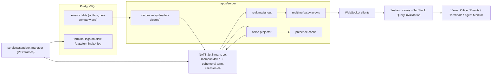
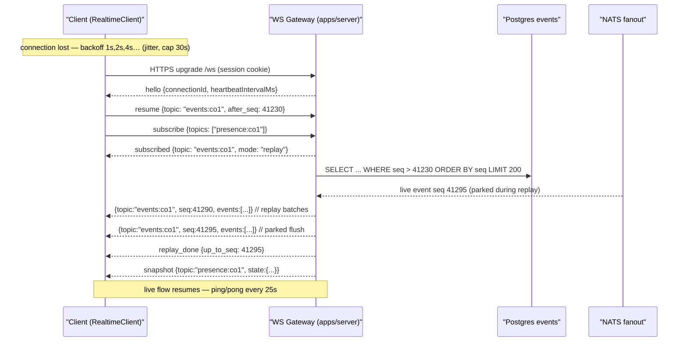

# 22 — Realtime Architecture

Status: v1.0 — Implementation-ready

Defines the WebSocket realtime layer per `_DECISIONS.md` §16 (ADR-008): one gateway endpoint,
cookie-session auth, topic subscriptions with per-topic monotonic sequences, replay on resume, and
strict per-topic backpressure semantics. Consumers: the SPA described in
`24-FRONTEND-ARCHITECTURE.md` and the Virtual Office client in `23-VIRTUAL-OFFICE.md`.

---

## 1. Placement & process model

The WS gateway is a **module inside `apps/server`** (Fastify modular monolith), registered with
`@fastify/websocket` (fastify-websocket) on route **`GET /ws`**. It is not a separate deployable.
It shares the Fastify instance, the session plugin, the Drizzle repositories, and the NATS
connection already owned by the server process.

Internal modules involved:

| Module (in `apps/server`) | Responsibility |
|---|---|
| `realtime/gateway` | WS upgrade, auth, connection registry, frame encode/decode, heartbeat |
| `realtime/subscriptions` | topic parse/authorize, per-connection subscription table, resume/replay |
| `realtime/fanout` | NATS JetStream + ephemeral consumers → topic buses → connection send queues |
| `realtime/presence` | presence snapshot cache per company (fed by office projector + session events) |
| `office/projector` | see `23-VIRTUAL-OFFICE.md` §4 — produces `office.*` instruction events consumed by fanout |



Note: the office projector consumes domain events from NATS and re-emits `office.*` instruction
events onto NATS (subject `co.<companyId>.office.*`, ephemeral — not persisted to the events
table; they are deterministically re-derivable). Fanout treats them as part of the presence topic.

## 2. Authentication & connection lifecycle

1. Browser opens `wss://<host>/ws`. The HTTP upgrade request carries the **HttpOnly session
   cookie** (`_DECISIONS.md` §1 AuthN). The gateway validates the session exactly like a REST
   route (same Fastify session plugin); no token in the URL, no separate WS auth handshake.
2. Unauthenticated upgrade → HTTP 401, socket never opens. Session revocation → gateway closes
   the socket with close code `4401` on the next heartbeat sweep (revocation check piggybacks on
   the ping cycle; the connection registry stores `sessionId` per connection).
3. After upgrade the server immediately sends a `hello` frame (see §4) containing
   `connectionId`, `heartbeatIntervalMs`, and protocol `version: 1`.
4. Limits [WRITER-DECISION]: max **8 concurrent WS connections per session** and **64 topic
   subscriptions per connection**; exceeding either → error frame `LIMIT_EXCEEDED` and the
   offending op is rejected (connection stays open).

## 3. Topic model

| Topic pattern | Content | Seq source | Replay source |
|---|---|---|---|
| `events:<companyId>` | all persisted domain events for the company | `events.seq` (per-company, gap-free) | `events` table by `seq` |
| `terminal:<sessionId>` | raw PTY output frames for one terminal session | per-session frame counter (from sandbox-manager) | 64 KB ring buffer, then file tail of `/data/terminals/<session_id>.log` |
| `presence:<companyId>` | office/presence stream: agent activity statuses + `office.*` instruction events | gateway-assigned per-topic counter | **snapshot-then-delta** (no historical replay) |

Design rules:

- `events:<companyId>` is the single firehose; clients filter locally (event ticker, query
  invalidation, cost updates all ride this one topic). No server-side per-event-type topics in
  MVP — at ≤30 active agents the firehose is low-rate and filtering client-side is simpler.
- `terminal:*` is high-frequency, loss-tolerant, ordered-per-session.
- `presence:*` is derived state: correctness = "latest wins", not "every delta delivered".

## 4. Wire protocol

Text frames, JSON, one protocol object per WS message. All schemas live in
`packages/contracts/src/realtime.ts` as Zod (shared by server and client).

### 4.1 Client → server ops

```jsonc
{ "op": "subscribe",   "topics": ["events:018f...", "presence:018f..."] }
{ "op": "resume",      "topic": "events:018f...", "after_seq": 41230 }
{ "op": "unsubscribe", "topics": ["terminal:018f..."] }
{ "op": "pong",        "ts": 1723300000000 }
```

`subscribe` with no cursor = "from now". `resume` = subscribe + replay everything after
`after_seq`, then continue live. `resume` with `after_seq: 0` on the events topic is refused
above a replay cap (§6.1) with error `REPLAY_TOO_LARGE` — the client must bootstrap via REST.

### 4.2 Server → client frames

```jsonc
// canonical data frame — identical shape for every topic
{ "topic": "events:018f...", "seq": 41231, "events": [ { /* event envelope */ }, ... ] }

// control frames
{ "op": "hello",  "connectionId": "c_...", "heartbeatIntervalMs": 25000, "version": 1 }
{ "op": "subscribed", "topic": "events:018f...", "mode": "live" | "replay", "from_seq": 41231 }
{ "op": "replay_done", "topic": "events:018f...", "up_to_seq": 41290 }
{ "op": "snapshot", "topic": "presence:018f...", "seq": 17, "state": { /* full presence/office state */ } }
{ "op": "ping",   "ts": 1723300000000 }
{ "op": "error",  "code": "UNAUTHORIZED_TOPIC" | "LIMIT_EXCEEDED" | "REPLAY_TOO_LARGE" | "BAD_OP", "topic": "...", "message": "..." }
{ "op": "dropped", "topic": "terminal:018f...", "from_seq": 900, "to_seq": 1187 }   // gap notice (terminal only)
```

- `seq` on a data frame = the seq of the **last** event in the batch; events inside the batch
  each carry their own seq in their envelope, strictly ascending.
- Event envelope on `events:*` = the persisted event row (id, seq, type, version, occurred_at,
  actor, subject refs, correlation/causation ids, payload) exactly as in `_DECISIONS.md` §9;
  the schema authority is `packages/events`.
- Terminal envelope: `{ seq, ts, stream: "stdout"|"stderr", data: "<base64>" }`.

## 5. Per-topic semantics

### 5.1 `events:<companyId>` — durable, never dropped

- Fanout runs one **durable JetStream consumer per server instance** on `co.<companyId>.>`
  (wildcard, filtered), acks after successful enqueue to all subscribed connections' send queues.
- Ordering guarantee: events are delivered to each client in **strictly ascending per-company
  `seq` order, no gaps, no duplicates** (gateway checks `lastSentSeq` per connection-topic and
  suppresses out-of-order/duplicate deliveries; a gap detected server-side triggers an internal
  catch-up read from the `events` table before resuming NATS flow).
- Backpressure: **never dropped**. If a connection's send queue exceeds the high-water mark
  [WRITER-DECISION: 1,000 events or 1 MB buffered], the gateway stops pushing live events for
  that topic, marks the connection-topic `catching_up`, and switches it to DB-paged replay
  (batches of 200) until it re-reaches the live head — i.e. slow consumers degrade to replay
  mode rather than ballooning memory or dropping events. Batching: live events are coalesced
  into one frame per topic per **25 ms flush tick** [WRITER-DECISION].

### 5.2 `terminal:<sessionId>` — lossy ring, drop-oldest

- Source: sandbox-manager publishes PTY frames to NATS **ephemeral** subjects
  `term.<sessionId>` and appends to the session log file (`_DECISIONS.md` §16).
- Gateway keeps the per-session **64 KB ring buffer**; a subscribing client gets ring content
  first (as replayed frames), then live flow. `resume after_seq` older than the ring → the
  gateway serves a **file tail** (last N bytes [WRITER-DECISION: 256 KB] of
  `/data/terminals/<session_id>.log`) as one synthetic frame with `seq` rebased, then ring, then
  live, and emits a `dropped` gap notice for anything older. Full scrollback beyond that is a
  REST download, not WS.
- Backpressure: **drop-oldest**. Slow consumer → oldest queued frames discarded, `dropped`
  frame tells the client to render a `--- output truncated ---` marker (xterm.js integration in
  `24-FRONTEND-ARCHITECTURE.md` §6.9).
- Ordering: per-session frames are ordered by the sandbox-manager's counter; drops create
  acknowledged gaps, never reordering.

### 5.3 `presence:<companyId>` — snapshot-then-delta, coalesced

- On subscribe (or resume — cursor is ignored for presence), the server sends one `snapshot`
  frame: every active agent's presence status (derived from `agent_sessions.current_activity`)
  plus the office projector's current per-company office state (avatar positions, active
  interactions). Then deltas: `agent.status.changed` and `office.*` instruction events.
- Backpressure: **coalesce by key**. The send queue is a map keyed by
  `(agentId, eventFamily)`; a newer status/position for the same agent overwrites an unsent
  older one. `office.interaction.started/ended` pairs that would cancel out within one flush
  tick are elided. Ordering guarantee is therefore per-agent latest-state, not full history —
  acceptable because the topic is derived state (choreography fidelity rules are in
  `23-VIRTUAL-OFFICE.md` §6, which bounds coalescing so causality stays visible).

## 6. Replay & resume

### 6.1 Events topic

`{op:"resume", topic:"events:<companyId>", after_seq:N}` →

1. Gateway reads `events WHERE company_id=? AND seq > N ORDER BY seq` in pages of 200,
   streaming data frames with `mode:"replay"`.
2. Live events arriving during replay are parked per connection-topic; after the DB read reaches
   the head, parked events with `seq > lastReplayedSeq` are flushed, then `replay_done` is sent
   and the topic goes live. Duplicate suppression by seq makes the splice exact.
3. Replay cap [WRITER-DECISION]: max **5,000 events or 7 days** per resume; beyond that →
   `REPLAY_TOO_LARGE`, and the client rebuilds state from REST (paged `/companies/:id/events`)
   before resubscribing "from now". This keeps the WS path for tail-catch-up, not bulk history.

### 6.2 Terminal / presence

Terminal: ring + file tail per §5.2. Presence: always snapshot-then-delta; there is no historical
presence replay by design (the Office renders only live causality; history lives in the Events view).

## 7. Heartbeat, reconnection, client cursors

- Server sends `ping` every **25 s** [WRITER-DECISION]; client replies `pong`. Two missed pongs
  (≈50 s) → server closes `4408`. Client-side, a missing server ping for 60 s → client closes
  and reconnects (catches half-open TCP).
- Client reconnect: exponential backoff `1s → 2s → 4s → … cap 30s`, full jitter (`delay =
  random(0, min(cap, base·2^attempt))`), immediate retry once on `navigator.onLine` /
  `visibilitychange→visible`. Close codes `4401` (auth) stop retries and route to login.
- **Resume cursors persist in the client store**: the realtime slice (Zustand, §9) writes
  `lastSeqByTopic` to `sessionStorage` (per-tab) on every frame (throttled 1 s). On reconnect the
  client issues `resume` for events topics with the stored cursor, plain `subscribe` for
  presence, and terminal `resume` with the last rendered frame seq.



## 8. Security & authorization

- **Topic authorization on every subscribe/resume**, evaluated server-side against the session's
  memberships (platform RBAC, `_DECISIONS.md` §1 AuthZ):
  - `events:<companyId>` and `presence:<companyId>` → session user must be a member of the
    company (MVP: the Founder; Phase 3 multi-human uses the same check).
  - `terminal:<sessionId>` → resolve the terminal session → its workspace → project → company;
    require membership **and role `founder` or `admin`** — terminal output can contain
    repository contents and tool output, so it is the most privileged stream.
- Authorization result is cached per connection-topic and **re-checked on a 60 s sweep** (same
  sweep as session revocation): membership/role revocation force-unsubscribes with an `error`
  frame `UNAUTHORIZED_TOPIC`.
- The WS layer is **read-only**: no domain mutation ops exist on the socket (all writes go
  through REST + Tool Gateway paths). This keeps the realtime attack surface to subscribe
  authorization only.
- Cross-tenant leakage is structurally prevented: fanout keys queues by full topic string
  containing `companyId`, and topic parse re-derives `companyId` server-side — the client never
  supplies a company it isn't authorized for without hitting the membership check.
- Origin check on upgrade (same-origin + configured allowed origins) to block cross-site WS
  hijacking; payload size limit 128 KB per client message.

## 9. Client library (`packages/contracts/src/realtime/`)

Shipped in `packages/contracts` (the only workspace package `apps/web` may depend on besides
`packages/ui`). Exports:

```ts
// typed topic map — compile-time pairing of topic pattern → payload type (template-literal keys)
type TopicMap =
  & { [K in `events:${string}`]:   DomainEvent }   // discriminated union from packages/events (re-exported via contracts)
  & { [K in `terminal:${string}`]: TerminalFrame }
  & { [K in `presence:${string}`]: PresenceDelta | PresenceSnapshot };

class RealtimeClient {
  constructor(opts: { url: string; cursorStore: CursorStore });   // CursorStore = sessionStorage impl in web
  subscribe<T extends keyof TopicMap>(topic: T, handler: (batch: TopicMap[T][], meta: FrameMeta) => void): Unsubscribe;
  status$: Readable<"connecting"|"open"|"replaying"|"backoff"|"closed_auth">;
}
```

Behavior baked into the library (not app code): auto-connect, heartbeat, backoff with jitter,
**auto-resume** from `CursorStore`, replay/live splice (handlers never see duplicates or
regressions in seq), `dropped`-gap surfacing for terminal handlers, and multiplexing (N UI
subscribers to one topic → one server subscription, refcounted).

**Dispatcher (in `apps/web`)**: a single `RealtimeDispatcher` subscribes to the active company's
`events:` and `presence:` topics and routes into Zustand stores — `eventTickerStore` (bounded
1,000-entry ring), `presenceStore`, `officeStore` (instruction queue for Pixi,
`23-VIRTUAL-OFFICE.md` §7), `terminalStore` (per-session buffers) — and into the TanStack Query
invalidation map (`24-FRONTEND-ARCHITECTURE.md` §5.2). Stores are the only WS consumers; React
components read stores/queries, never the socket.

## 10. Scaling path

- **MVP: single gateway.** One `apps/server` instance owns all connections; fanout state
  (rings, presence cache, connection registry) is in-process memory. Fits the scale envelope
  (`_BRIEF.md` §10: ≤10 companies, ≤30 concurrently active agents — hundreds of msgs/min, one
  browser per Founder).
- **Phase 3: NATS-backed multi-instance.** Multiple `apps/server` replicas behind a
  cookie-affinity LB; each replica runs its own JetStream consumers (already the design — NATS is
  the inter-process bus today, so no protocol change), the presence cache moves to a projector
  singleton (leader-elected via Postgres advisory lock, like the outbox relay) that publishes
  snapshots on `co.<companyId>.office.snapshot`, and terminal rings stay per-replica (any replica
  can rebuild from the log file tail). Client protocol is unchanged — seq semantics come from the
  events table and per-session counters, not from gateway memory.

## 11. Ordering & delivery guarantees (summary table)

| Topic | Delivery | Ordering | Duplicates | Loss |
|---|---|---|---|---|
| `events:*` | at-least-once internally, **exactly-once to client** (seq-dedup at gateway and library) | total order by per-company seq | suppressed | never (degrade to replay mode) |
| `terminal:*` | best-effort | per-session frame order | none | drop-oldest with explicit `dropped` gap frames |
| `presence:*` | best-effort latest-state | per-agent latest wins | harmless (idempotent state) | coalesced by design; snapshot heals all |

Failure-mode notes: gateway crash → clients reconnect and resume from persisted cursors (events
gap-free from DB; terminal shows a gap marker; presence re-snapshots). NATS outage → outbox relay
retries (events remain durable in Postgres); gateway serves replay-from-DB, so the events topic
survives a bus outage with elevated latency only. Postgres outage → total outage by design
(single source of truth, ADR-003).

## 12. Gateway internals (implementation blueprint)

Data structures inside `realtime/` (all in-process, MVP single instance per §10):

```ts
// realtime/gateway
interface Connection {
  id: string;                  // c_<uuidv7>
  socket: WebSocket;           // from @fastify/websocket
  sessionId: string;           // for revocation sweep
  userId: string;
  subs: Map<TopicKey, TopicSub>;
  lastPongAt: number;
  sendQueue: FrameQueue;       // per-connection bounded writer (ws backpressure via bufferedAmount)
}

interface TopicSub {
  topic: TopicKey;             // parsed {kind, companyId | sessionId}
  mode: "live" | "replay" | "catching_up";
  lastSentSeq: number;         // duplicate/ordering guard
  parked: EventEnvelope[];     // live events held during replay (bounded; overflow → restart replay)
  authorizedAt: number;        // for the 60s re-check sweep
}

// realtime/fanout — one per process
interface TopicBus {
  topic: TopicKey;
  subscribers: Set<ConnectionId>;
  source: JetStreamConsumer | EphemeralSub | PresenceCache;
  flushTimer: Timer;           // 25ms coalescing tick (events), per-key map (presence)
}
```

Rules of thumb encoded in code review checklists: (1) the gateway never `await`s a DB call on
the hot NATS→socket path — replay reads run on a separate lane per connection-topic; (2) frame
serialization happens once per topic per flush tick, shared across subscribers of that topic
(same company ⇒ same bytes); (3) `socket.bufferedAmount` above 4 MB forces the connection into
`catching_up` for events topics and drop-oldest for terminal topics regardless of queue counts —
the OS socket buffer is the final backstop.

Presence snapshot payload (schema in `packages/contracts`, produced by `realtime/presence` from
projector state — see `23-VIRTUAL-OFFICE.md` §4 for field semantics):

```jsonc
{
  "layoutVersion": 7,
  "agents": [ { "agentId": "018f...", "cell": {"x":6,"y":6}, "badge": "WORKING",
                "deskId": "d1", "sessionId": "018f..." } ],
  "interactions": [ { "id": "i_...", "kind": "dm", "agentIds": ["...","..."],
                      "atCell": {"x":12,"y":9}, "causeEventId": "evt_..." } ]
}
```

## 13. Observability & operational limits

- Metrics (OTel, exported per `_DECISIONS.md` §1/ADR-016): `ws_connections`,
  `ws_subscriptions{topic_kind}`, `ws_frames_sent_total{topic_kind}`,
  `ws_events_replayed_total`, `ws_send_queue_depth` (histogram),
  `ws_dropped_frames_total{topic_kind="terminal"}`, `ws_catching_up_connections`,
  `office_instructions_emitted_total` (from the projector). Alert thresholds ship in the
  optional Grafana profile: sustained `catching_up > 0` for 5 min, drop rate > 5%/min.
- Structured logs (pino): one line per connection open/close (with close code), per
  authorization denial, per replay request (topic, after_seq, rows served, duration). No
  per-frame logging.
- Close-code registry: `1000` normal, `4401` unauthenticated/revoked, `4408` heartbeat timeout,
  `4413` message too large, `4429` connection limit. The client library maps these to
  `status$` transitions and retry policy (only `4401` is non-retryable).
- Config surface (via `packages/config`, env-driven): heartbeat interval, flush tick, replay
  caps, ring size, per-session log retention days, connection/subscription limits — all the
  [WRITER-DECISION] constants above are defaults, not hard-coded.

## 14. Testing hooks

- Protocol conformance: Vitest suite in `packages/contracts` running `RealtimeClient` against an
  in-memory gateway double (frame fixtures generated from the Zod schemas).
- Integration: Testcontainers (Postgres + NATS) test in `apps/server` — write events through the
  outbox, assert byte-exact frames, kill/reconnect mid-stream, assert gap-free resume.
- E2E: Playwright scenario "kill server mid-run" asserting the Events view shows no gap and the
  Office re-snapshots (see `32-TESTING-STRATEGY.md`).
