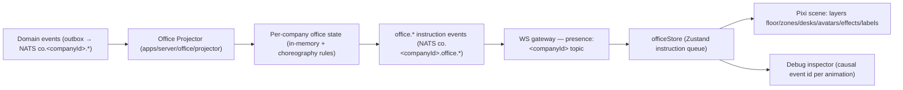
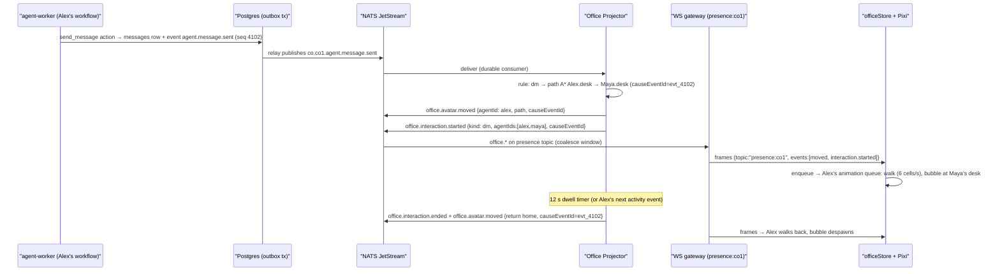

# 23 — Virtual Office (Digital Twin)

Status: v1.0 — Implementation-ready

The Virtual Office is the digital twin of the company: a 2D top-down office rendered with
**PixiJS v8** in which every avatar, movement, and interaction is caused 1:1 by a persisted
domain event (`_BRIEF.md` §8). It is explicitly not a game and not decoration: **no random
movement, no idle wandering, no simulated life**. Transport and topics per
`22-REALTIME-ARCHITECTURE.md`; view shell per `24-FRONTEND-ARCHITECTURE.md` §6.1.

---

## 1. Renderer choice (ADR-012 recap)

**PixiJS v8** (WebGL/WebGPU 2D scene graph):

- vs **Phaser** — Phaser brings a game runtime (physics, input systems, scene lifecycle, asset
  pipeline) we would fight rather than use; we need a fast sprite scene graph driven by an
  external event stream, nothing more.
- vs **DOM/Canvas2D** — 100 animated avatars + effects + labels at 60 fps exceeds comfortable
  DOM/2D-canvas budgets, especially with per-frame position interpolation; Pixi batches sprites
  into few draw calls.
- vs **Three.js** — 3D is unneeded; a 2D office reads faster and costs far less art effort.

Pixi v8 specifics we rely on: `Application` with `preference: 'webgpu'` and WebGL fallback,
`Container` layers, `Sprite`/`AnimatedSprite`, `Graphics` for zones, `BitmapText` for labels,
shared `Ticker` with our own scheduler discipline (§9).

## 2. Office model & floor plan

The floor plan is **company-configurable zones bound to org structure**, stored in
`company_settings.office_layout` (JSONB):

```jsonc
{
  "version": 1,
  "grid": { "cellSize": 32, "cols": 80, "rows": 50 },        // world = 2560×1600 px
  "zones": [
    { "id": "z_eng", "orgUnitId": "018f...", "kind": "department", "rect": {"x":2,"y":2,"w":30,"h":22},
      "label": "Engineering", "color": "#1e293b" },
    { "id": "z_fe",  "orgUnitId": "018f...", "kind": "team", "parentZoneId": "z_eng",
      "rect": {"x":4,"y":4,"w":12,"h":9}, "desks": [{"id":"d1","cell":{"x":6,"y":6}}, ...] },
    { "id": "z_exec", "kind": "executive", "rect": {...}, "offices": [{"agentPositionKey":"cto","cell":{...}}] },
    { "id": "z_meet_1", "kind": "meeting", "rect": {...}, "spots": 6 }
  ],
  "walls": [ {"x":34,"y":2,"w":1,"h":22}, ... ]               // blocked cells beyond zone borders
}
```

- **Default auto-layout** (computed server-side when a company has no saved layout, and re-run
  on org changes until the Founder edits). **The room unit is the TEAM** (revised — the first
  cut made the room unit the department, and on screen that produced one enormous "Engineering"
  hall in which Backend / Frontend / DevOps / QA were indistinguishable; teams were desk
  clusters with no visual boundary, so the org structure the office is meant to be a twin of
  was invisible). Each team (`org_units.kind=team`) with members becomes its own room, sized by
  headcount (one desk per member, +25% spare, min 2); members attached directly to a department
  get that department's **"&lt;Department&gt; Genel"** room; the department itself is not drawn as a
  room — it is the **band** that keeps its team rooms adjacent and gives them a shared accent
  colour. Rooms flow left-to-right and wrap to a new band when the row would exceed the grid
  width; executives get an executive room; one central meeting area. Room height follows
  headcount rather than a fixed value (a fixed 22-cell height gave a two-person team a mostly
  empty hall). The grid grows with the plan instead of a fixed 80×50. Auto-layout is
  deterministic (seeded by org_unit UUIDs) so it is stable across reloads.
- **Home desk assignment**: an agent's home desk = first free desk in the room of its **own**
  unit, then any room of the same department, then anywhere. The three tiers matter now that the
  room is the team: ranking by department alone could seat an agent in a sibling team's room.
  Persisted in the layout JSONB (`desks[].agentId`) so desks don't shuffle; freed on offboarding.
- **Editor UI** (Settings → Office, `24-FRONTEND-ARCHITECTURE.md` §6.14): drag/resize zone
  rects on the same Pixi canvas in edit mode, snap to grid, validation (zones within bounds,
  desks inside their zone, min 1 desk per member), save → `PUT
  /companies/:id/settings/office-layout` → emits `company.settings.updated` → projector reloads
  layout and re-emits a presence snapshot.

## 3. Event flow overview



## 4. Office Projector (server-side module in `apps/server`)

The projector keeps the renderer dumb: **all choreography decisions are server-side and
deterministic**, so any client (or a reconnecting client) converges to the same office state.

- **Input**: durable JetStream consumer on `co.<companyId>.>` (domain events only; it ignores
  `office.*` to avoid feedback).
- **State per company** (in-memory, rebuildable): layout (from settings), per-agent
  `{ homeDesk, currentPos, activity, currentInteraction?, statusBadge }`, seeded at startup from
  `agent_sessions.current_activity` + org membership; a full snapshot is served to the presence
  topic on subscribe (`22-REALTIME-ARCHITECTURE.md` §5.3).
- **Output**: instruction events on `co.<companyId>.office.*` — ephemeral (never written to the
  events table; re-derivable). Every instruction carries `causeEventId` (the domain event id)
  and `causeSeq`:

| Instruction | Payload (beyond ids) |
|---|---|
| `office.avatar.moved` | agentId, path: cell[], fromCell, toCell, reason, causeEventId |
| `office.interaction.started` | interactionId, kind (`dm|review|escalation|meeting`), agentIds, atCell, causeEventId |
| `office.interaction.ended` | interactionId, causeEventId (or `timeout` with the originating causeEventId) |
| `office.status.changed` | agentId, badge (one of the 11 presence statuses), causeEventId |

### 4.1 Choreography mapping table (exact, canonical)

| Domain event (condition) | Choreography emitted |
|---|---|
| `agent.message.sent` (channel kind `dm`) | sender `office.avatar.moved` → recipient's desk; `office.interaction.started(kind=dm)` at that desk with speech bubble; `office.interaction.ended` + return `office.avatar.moved` to home desk after **12 s** dwell [WRITER-DECISION] or immediately when the sender's next non-message activity event arrives |
| `agent.message.sent` (channel kind `task_thread|team|department|project`) | no walk; `office.interaction.started(kind=dm)` speech indicator at sender's desk for 4 s (auto-ended by projector timer) |
| `agent.task.started` / `task.status.changed → IN_PROGRESS` for owner | `office.status.changed(badge=WORKING)` at desk |
| `agent.message.sent` (kind `review_request`) or `review.requested` | requester walks to reviewer's desk, `office.interaction.started(kind=review)`, return per dwell rule; reviewer gets `office.status.changed(badge=REVIEWING)` when they start the review |
| `agent.escalated` / message kind `escalation` | escalating agent walks to its `reports_to` manager's desk/office, `office.interaction.started(kind=escalation)` (distinct red bubble); Founder-level escalations target the Approval Center — no walk, badge `ESCALATING` |
| `workspace.build.started` / test-run tool invocation events | terminal glyph effect above the agent's desk until the matching `*.finished` event |
| agent session activity events → `THINKING/TESTING/LEARNING/WAITING/BLOCKED/COMMUNICATING` | `office.status.changed` with that badge at current position |
| agent idle (session completed, no new assignment) | `office.status.changed(badge=IDLE)`; avatar seated at home desk |
| agent offline (`agents.status=paused|offboarded`, or no session and company quiet hours) | avatar absent — removed from scene (desk remains, nameplate dimmed) |
| `approval.requested` (Founder-level) | pulse effect on the Approvals wall panel object near the executive zone |

**Invariant (hard):** the projector never emits movement without a `causeEventId`. There is no
timer-driven wandering; the only timer-driven emissions are interaction dwell endings and the
speech-indicator auto-end, and both carry the originating event id. The client enforces the same
invariant: `officeStore` rejects instructions without `causeEventId` in dev builds (throws) and
drops them in prod (with console warning). Clicking any avatar mid-animation shows the causal
event id in the debug inspector (§8).

### 4.2 Determinism & ordering

Instructions per company are emitted in the order of the domain-event `seq` that caused them and
carry a per-company monotonically increasing `choreoSeq`. The projector is single-writer per
company (one in-process actor per company; Phase 3 leader-elected singleton per
`22-REALTIME-ARCHITECTURE.md` §10). Timer-driven emissions are sequenced through the same actor.

## 5. Client scene graph

Layer containers (bottom→top), all children sorted once, `sortableChildren` off except avatars:

1. **floor** — static tiling sprite (cached as texture).
2. **zones** — `Graphics` rects + zone tint; rebuilt only on layout change.
3. **desks** — desk sprites + equipment glyphs; static per layout.

**Pixel tiles (revised).** Floors, walls, desks and props were `Graphics.rect` calls: flat
rectangles with no edge light, no shadow, no texture — the office was drawn *with* code rather
than *as* pixel art, and only the avatars (PixelLab, U15) actually looked the part. They are now
hand-authored tiles in `apps/web/src/features/office/tiles.ts`, written as character maps
(one letter per palette entry, one line per pixel row) so every pixel is a deliberate choice and
stays reviewable in a diff. The bridge bakes each map **once** into a texture with
`scaleMode: "nearest"` (smoothing would defeat the whole point) and repeats it via
`TilingSprite` for floors/walls and `Sprite` for desks/props: one texture per art, one draw batch
per layer, zero per-frame work. `tiles.ts` imports no Pixi — the office lint rule keeps rendering
APIs in the bridge, so the tiles stay pure data plus a run-length emitter.
4. **avatars** — one `AvatarActor` container per agent: body sprite (4-direction walk frames),
   status badge sprite, name `BitmapText` (toggleable), selection ring.
5. **effects** — speech bubbles, interaction indicators, terminal glyphs, escalation pulses
   (object-pooled).
6. **labels** — zone labels, meeting-spot labels (culled below zoom 0.5).

Camera: one root `Container` with pan/zoom (wheel + drag), clamped to world bounds; zoom range
0.25–2.0.

### 5.1 Avatar pipeline

- **MVP: preset avatars** — a bundled sprite-sheet family (12 bodies × 4 palettes, 4-direction
  walk cycles, 64×64 px frames) selected at hire time and referenced by `agents.avatar_url`
  (`preset:eng-03` scheme).
- **Uploaded images**: the upload is masked to a circle and composited onto a neutral preset
  body as the "face"; stored via the standard artifact upload path.
- **Generated avatars**: Phase 2 (external image API per `_DECISIONS.md` A9), same masking path.

## 6. Movement, animation queue, time compression

- **Pathfinding: A\* on the walkable grid.** [WRITER-DECISION] Grid granularity = the layout
  `cellSize` of **32 px** (80×50 = 4,000 cells for the default world): coarse enough that A\* on
  a 4k-cell grid is sub-millisecond, fine enough for believable desk-to-desk routes. Walkable =
  not wall, not zone border (except doorway cells auto-punched per zone edge), not a desk cell.
  The **server** computes paths (projector includes `path` in `office.avatar.moved`) so all
  clients render identical routes; the client only interpolates.
- **Animation queue per avatar**: instructions arrive ordered (`choreoSeq`); each `AvatarActor`
  owns a FIFO of animation commands (walk path, face direction, sit, badge change, bubble).
  The client interpolates walking at **6 cells/s** [WRITER-DECISION] with the ticker; badge and
  bubble commands apply instantly when dequeued.
- **Time compression (coalescing rule)**: if an avatar's queue exceeds **3 pending walks or
  10 s of predicted playback** [WRITER-DECISION], the client collapses the queue: intermediate
  walks are skipped (avatar teleport-fades to the penultimate state), only the latest walk plays
  fully, and skipped interactions render as a brief stacked-bubbles effect with a counter
  ("+3"). Causality remains inspectable — collapsed instructions stay in the debug ring buffer
  with their `causeEventId`s. The same rule handles resume-after-reconnect: the presence
  snapshot replaces queues outright (snapshot-then-delta, no replayed choreography).

## 7. Client state: `officeStore` (Zustand)

```ts
interface OfficeStore {
  layout: OfficeLayout | null;
  agents: Record<AgentId, { pos: Cell; activity: PresenceBadge; deskId: string }>;
  interactions: Record<InteractionId, ActiveInteraction>;
  pendingInstructions: OfficeInstruction[];      // drained by the Pixi bridge each ticker frame
  debugRing: OfficeInstruction[];                // last 200, for inspector
  applySnapshot(s: PresenceSnapshot): void;
  enqueue(i: OfficeInstruction): void;           // validates causeEventId invariant
}
```

The Pixi app is mounted by a thin `OfficeCanvas` React component; a non-React bridge object
drains `pendingInstructions` into avatar queues. React never renders per-frame state; it renders
only the popover/inspector overlays (positioned via Pixi→DOM coordinate projection).

## 8. Interaction: agent card popover & debug inspector

Clicking an avatar (Pixi hit-test on the avatar layer) opens a DOM popover anchored at the
projected screen position:

- **Agent card**: name, employee number, position/seniority, live presence badge, current task
  (number + title, link), bound model (primary purpose), session runtime, tokens & cost today
  (from `agent_sessions` via TanStack Query), skills top-3; button **"Open in Agent Monitor"**
  → route `/agents/$agentId` (`24-FRONTEND-ARCHITECTURE.md` §6.2).
- **Debug inspector tab** (dev toggle, also Shift+click): the avatar's last 20 applied
  instructions with `causeEventId`, `causeSeq`, timestamps, and a "view event" link into the
  Events view filtered to that id — the concrete enforcement of "every animation has a causal
  event id".

## 9. Performance budget

Target: **100 avatars @ 60 fps** on an integrated-GPU laptop; degrade gracefully to 30 fps.

- **Sprite batching**: all avatar frames in ≤2 texture atlases; effects pooled and atlased;
  target ≤20 draw calls for the full scene.
- **Culling**: avatars/effects/labels outside the camera rect ×1.2 are `visible=false` (cheap
  AABB check per ticker tick, throttled to every 4th frame).
- **Ticker discipline**: one Pixi ticker; per-frame work = drain instruction queue (bounded 50
  instructions/frame), advance interpolations, culling check. No per-frame allocation (pooled
  vectors), no React state writes from the ticker. When the document is hidden, the ticker stops
  and instructions accumulate → time-compression collapses them on return.
- **Idle floor**: when no animations are pending, `ticker.maxFPS` drops to 10 (positions
  static); any enqueue restores 60.
- Zone/desk layers are rendered once into cached textures (`cacheAsTexture`) and only
  invalidated on layout edit.

## 10. Accessibility: reduced-motion mode

If `prefers-reduced-motion` is set (or the in-app toggle is on), the Office view swaps the canvas
for the **list fallback**: a live table of agents (name, zone, presence badge, current activity
sentence derived from the same instruction stream — "Alex is discussing TASK-81 with Maya"),
grouped by department, updating from the identical `officeStore` data. Interactions render as
rows in a "happening now" panel. The canvas is also keyboard-accessible in normal mode: Tab
cycles agents (selection ring + popover), arrow keys pan, +/- zoom; the canvas element carries an
`aria-live="polite"` region announcing interaction starts.

## 11. Choreography sequence (brief's message example)

`agent.message.sent` DM: Alex (Frontend Dev) messages Maya (Frontend Lead).



## 12. Instruction schemas (contracts)

Zod schemas live in `packages/contracts/src/realtime/office.ts` (shared by projector, gateway,
and client; the presence topic's payload union references them):

```ts
const Cell = z.object({ x: z.number().int().min(0), y: z.number().int().min(0) });

const OfficeInstructionBase = z.object({
  choreoSeq: z.number().int().positive(),     // per-company monotonic (projector-assigned)
  causeEventId: z.string().uuid(),            // HARD invariant — no optional, no null
  causeSeq: z.number().int().positive(),
  emittedAt: z.string().datetime(),
});

const AvatarMoved = OfficeInstructionBase.extend({
  type: z.literal("office.avatar.moved"),
  agentId: z.string().uuid(),
  fromCell: Cell, toCell: Cell,
  path: z.array(Cell).min(1).max(200),
  reason: z.enum(["dm", "review", "escalation", "return_home", "desk_assign"]),
});

const InteractionStarted = OfficeInstructionBase.extend({
  type: z.literal("office.interaction.started"),
  interactionId: z.string(),
  kind: z.enum(["dm", "review", "escalation", "meeting", "speech"]),
  agentIds: z.array(z.string().uuid()).min(1).max(8),
  atCell: Cell,
});

const InteractionEnded = OfficeInstructionBase.extend({
  type: z.literal("office.interaction.ended"),
  interactionId: z.string(),
  endedBy: z.enum(["event", "dwell_timeout", "speech_timeout", "snapshot_reset"]),
});

const StatusChanged = OfficeInstructionBase.extend({
  type: z.literal("office.status.changed"),
  agentId: z.string().uuid(),
  badge: z.enum(["IDLE","THINKING","WORKING","WAITING","COMMUNICATING","REVIEWING",
                 "TESTING","LEARNING","BLOCKED","ESCALATING","OFFLINE"]),
});

export const OfficeInstruction = z.discriminatedUnion("type",
  [AvatarMoved, InteractionStarted, InteractionEnded, StatusChanged]);
```

## 13. Projector recovery & reconciliation

- **Restart**: projector state is rebuildable — on `apps/server` boot it loads the layout,
  seeds per-agent state from `agent_sessions.current_activity` + org membership (SQL), sets all
  avatars to their home desks with derived badges, bumps a `snapshotEpoch`, and pushes a fresh
  snapshot to all presence subscribers. In-flight walks at crash time are simply lost — correct,
  since the snapshot represents current truth and choreography is presentation, not state.
- **Consumer lag**: if the projector's JetStream consumer falls behind by more than
  **500 events or 30 s** [WRITER-DECISION], it skips choreography for the backlog (processing
  only status-affecting events to keep badges truthful), emits one snapshot at the head, and
  resumes normal choreography — the office never replays a burst of stale walking.
- **Org changes**: `agent.hired` → desk assignment + avatar spawn at desk;
  `agent.offboarded` → interaction cleanup + avatar despawn + desk free;
  `org_edges` membership changes → desk reassignment walk (`reason: desk_assign`) emitted with
  the causing event id. Layout edits (`company.settings.updated`) → `layoutVersion` bump +
  snapshot (clients rebuild zone/desk layers; avatars lerp to new desk positions).
- **Nightly reconciliation** (same scheduled job that recomputes `collaborates_with` strength,
  `_DECISIONS.md` §5): verifies every active agent has a desk, prunes orphaned interactions
  older than 10 min, and re-emits a snapshot if anything was fixed.

## 14. Verification plan (performance & fidelity)

- **Fidelity tests** (Vitest, projector module): golden-file tests feeding recorded domain-event
  sequences and asserting the exact instruction stream (deterministic by design §4.2) — one
  fixture per mapping-table row, plus the coalescing-lag case and the dwell-timer case (fake
  timers).
- **Invariant test**: property test generating random event sequences and asserting every
  emitted instruction validates against `OfficeInstruction` (causeEventId present) and that
  zero instructions are emitted from timer ticks without an originating event.
- **Client perf harness**: a dev-only route `/office-bench` spawns 100 synthetic avatars and
  replays a captured instruction stream at 1×/10×/100×; CI (Playwright, chromium headed with
  GPU) asserts p95 frame time < 16.6 ms at 1× and < 33 ms at 10× on the reference container.
- **E2E** (per `32-TESTING-STRATEGY.md`): the MVP proof scenario asserts that a DM between two
  agents produces exactly one walk + one interaction bubble in the scene, and that the debug
  inspector shows the `agent.message.sent` event id.

## 15. Degraded modes summary

| Condition | Behavior |
|---|---|
| WS in backoff | Office freezes with "reconnecting" veil; on reopen: snapshot replaces all state (no ghost animation) |
| Projector lagging | Badges stay truthful; walks skipped for backlog; snapshot at head (§13) |
| Tab hidden | Ticker stopped; on return: time-compression collapse (§6) |
| `prefers-reduced-motion` | List fallback (§10) fed by the same store |
| WebGL & canvas both unavailable | List fallback + notice |
| >100 avatars | Culling + label suppression below zoom 0.75; hard cap warning at 250 with density view (Phase 3 concern per `_BRIEF.md` §10 scale envelope) |

## 16. Empty/edge states

- Company with no layout → auto-layout generated server-side on first presence subscribe.
- Zero hired agents → office renders with an inline "Hire your first agents" CTA routed to
  Organization view.
- Agent with no desk (org edit race) → projector parks the avatar at its department zone
  centroid and emits a `office.status.changed` with badge unchanged; nightly reconciliation
  assigns a desk.
- WebGL unavailable → Pixi canvas fallback renderer; if that fails, the reduced-motion list view
  is shown with a notice.

Cross-references: transport & presence semantics `22-REALTIME-ARCHITECTURE.md`; view shell,
routing and popover queries `24-FRONTEND-ARCHITECTURE.md`; event catalog doc 10; agent presence
derivation `_DECISIONS.md` §6.
