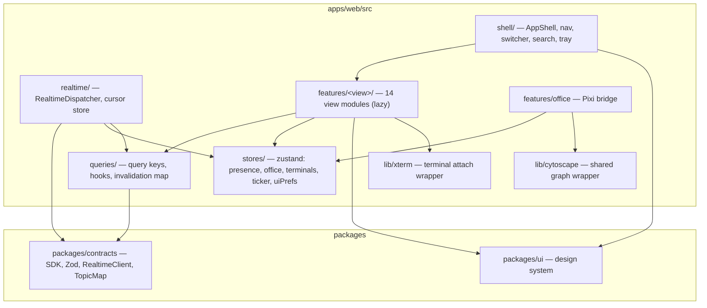
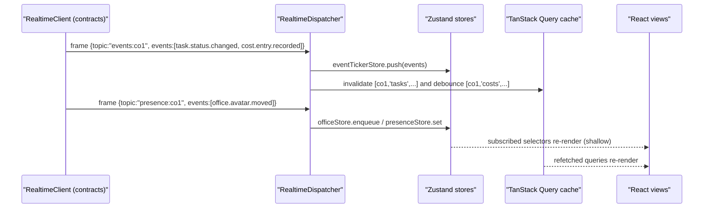

# 24 — Frontend Architecture

Status: v1.0 — Implementation-ready

`apps/web`: a desktop-like SPA that feels like a **company command center** (`_BRIEF.md` §8).
Stack per `_DECISIONS.md` §1 / ADR-011: **React 19 + Vite + TanStack Router + TanStack Query +
Zustand + Tailwind CSS**, with PixiJS v8 (`23-VIRTUAL-OFFICE.md`), Cytoscape.js, xterm.js and
Recharts embedded per view. Realtime per `22-REALTIME-ARCHITECTURE.md`. `apps/web` depends only
on `packages/contracts` (typed SDK + realtime client) and `packages/ui` (design system) —
enforced by the eslint boundary rule (`_DECISIONS.md` §3).

---

## 1. App shell (command-center layout)

```
┌────────────────────────────────────────────────────────────────────┐
│ TopBar: CompanySwitcher ▾ │ GlobalSearch (⌘K) │ WS status │ 🔔 Tray │
├──────────┬─────────────────────────────────────────────────────────┤
│ LeftNav  │  <Outlet/> (active view)                                │
│ 14 views │                                                        │
│ + badge  │                                                        │
├──────────┴─────────────────────────────────────────────────────────┤
│ StatusBar: live event ticker (last event, click → Events view)     │
└────────────────────────────────────────────────────────────────────┘
```

- **LeftNav** (icon+label, collapsible to icons): OFFICE, TASKS, AGENTS, PROJECTS, MEMORY,
  ORGANIZATION, SKILLS, COMMUNICATION, TERMINALS, APPROVALS (live count badge), EVENTS, REPORTS,
  COSTS, SETTINGS.
- **CompanySwitcher**: active `companyId` lives in the URL prefix (source of truth); switching
  navigates, tears down the company's WS topics, resubscribes for the new company.
- **GlobalSearch (⌘K)**: command palette — navigates views, finds agents/tasks/projects/memories
  via `GET /companies/:id/search?q=` (server-side cross-entity search endpoint in contracts).
- **Notification tray**: feeds on `approval.requested`, `agent.escalated`,
  `budget.exceeded`, `task.status.changed→DONE` for goal-kind tasks; unread state persisted in
  `localStorage` keyed by event id.

## 2. Routing map (TanStack Router, file-based)

All company-scoped routes nest under `/c/$companyId` (layout route mounts the
`RealtimeDispatcher` and company context).

| Path | View |
|---|---|
| `/login`, `/setup` | auth, first-run wizard |
| `/c/$companyId` | Dashboard (command center) |
| `/c/$companyId/office` | Virtual Office (`23-VIRTUAL-OFFICE.md`) |
| `/c/$companyId/tasks` · `/tasks/$taskId` | Tasks (tree/kanban/DAG tabs) · task detail |
| `/c/$companyId/agents` · `/agents/$agentId` | Agent Monitor grid · agent detail |
| `/c/$companyId/projects` · `/projects/$projectId` · `/projects/$projectId/intake` | Projects · detail · intake report |
| `/c/$companyId/memory` · `/memory/$memoryId` | Memory Observatory · memory detail |
| `/c/$companyId/organization` | Org chart + editor |
| `/c/$companyId/skills` | Skills matrix |
| `/c/$companyId/communication` · `/communication/$channelId` | channels · channel with thread pane |
| `/c/$companyId/terminals` · `/terminals/$sessionId` | session list · attached terminal |
| `/c/$companyId/approvals` · `/approvals/$approvalId` | Approval Center · brief |
| `/c/$companyId/events` | Event timeline (search params: `type`, `agent`, `task`, `from`, `to`) |
| `/c/$companyId/reports` · `/reports/$reportId` | executive reports |
| `/c/$companyId/costs` | cost dashboards |
| `/c/$companyId/settings/{providers,models,policies,office,company}` | settings sections |

Route conventions: search-param schemas via Zod (`validateSearch`), every list view's filters are
URL-encoded (shareable, restorable), detail routes use loaders that seed the Query cache.

## 3. Module & dependency structure



Rule: `features/*` never import each other; cross-view navigation goes through router links,
cross-view data through queries/stores.

## 4. State architecture

Two planes, never mixed:

1. **Server state — TanStack Query** (canonical cache of REST reads via the generated typed SDK
   in `packages/contracts`).
2. **Realtime/ephemeral state — Zustand** (WS-fed, in-memory, bounded): `presenceStore`,
   `officeStore` (`23-VIRTUAL-OFFICE.md` §7), `terminalStore` (per-session xterm buffers + drop
   markers), `eventTickerStore` (1,000-entry ring), `uiPrefsStore` (persisted: nav collapse,
   reduced motion, theme).

### 4.1 Query key conventions

`[companyId, entity, scope?, id?, params?]` — always company-first so a company switch can
`removeQueries({ queryKey: [oldCompanyId] })` wholesale.

```
[cid, 'tasks', 'list', {status, unit}]     [cid, 'tasks', 'detail', taskId]
[cid, 'agents', 'list']                    [cid, 'agents', 'detail', agentId]
[cid, 'agents', 'sessions', agentId]       [cid, 'approvals', 'list', {status:'pending'}]
[cid, 'memory', 'search', params]          [cid, 'costs', 'rollup', {period, dim}]
[cid, 'org', 'graph']                      [cid, 'events', 'page', cursor]  …
```

Defaults: `staleTime: 30s` (WS invalidation is the primary freshness mechanism),
`refetchOnWindowFocus: false` (WS covers it), `retry: 2`.

### 4.2 WS event → query invalidation map

`RealtimeDispatcher` consumes the `events:<companyId>` topic and translates event types to
`invalidateQueries` calls (map lives in `apps/web/src/realtime/invalidation.ts`; exhaustive over
the doc-10 catalog via a `satisfies Record<EventType, InvalidationRule>` check):

| Event type | Invalidated keys |
|---|---|
| `task.created` / `task.status.changed` / `agent.task.assigned` | `[cid,'tasks','list']`, `[cid,'tasks','detail',taskId]`, `[cid,'tasks','dag',rootId]` |
| `agent.hired` / `agent.status.changed` | `[cid,'agents','list']`, `[cid,'agents','detail',agentId]`, `[cid,'org','graph']` |
| `agent.session.*` | `[cid,'agents','sessions',agentId]`, `[cid,'agents','detail',agentId]` |
| `agent.message.sent` | `[cid,'channels','messages',channelId]` (targeted `setQueryData` append when page is live, else invalidate) |
| `approval.requested/decided` | `[cid,'approvals','list',*]`, tray badge recompute |
| `memory.created/updated/promoted` | `[cid,'memory','search',*]`, `[cid,'memory','detail',memoryId]` |
| `skill.evidence.recorded` / `agent.skill.updated` | `[cid,'skills','matrix']`, `[cid,'agents','detail',agentId]` |
| `project.*` | `[cid,'projects','list']`, `[cid,'projects','detail',projectId]` |
| `cost.entry.recorded` / `budget.exceeded` | `[cid,'costs','rollup',*]` (debounced 5 s — high frequency) |
| `review.*` | `[cid,'tasks','detail',taskId]`, `[cid,'reviews','list',*]` |
| `company.settings.updated` | `[cid,'settings',*]`, office layout reload |

Invalidations are batched per animation frame; high-frequency families (`cost.*`,
`agent.step.*`) are debounced per key.

### 4.3 Optimistic updates policy

**Founder actions only** — the sole human writer in MVP: approval verdicts, task
create/cancel/priority, org edits, settings, message sends. Pattern: `onMutate` snapshot →
`setQueryData` → rollback `onError` → reconcile on the resulting WS event (the event, not the
mutation response, is the settle signal; a 10 s reconcile timeout refetches). Agent-driven
changes are **never** optimistic — they arrive exclusively via events.

## 5. Realtime wiring



One dispatcher instance per active company, mounted by the `/c/$companyId` layout route; it owns
topic subscriptions (events + presence always; terminal topics on demand from the terminal view).

## 6. Per-view specifications

Format — **Purpose / Layout / Key components / Data (REST + WS) / Empty & loading**.

### 6.1 Dashboard (command center) — `/c/$companyId`
- Purpose: 10-second company health read.
- Layout: KPI tile row (active agents, tasks in progress, pending approvals, today's spend vs
  budget, open escalations) → 2-col: live event ticker (left, virtualized) + active-agents strip
  and "needs you" panel (approvals/escalations) (right).
- Components: `KpiTile`, `EventTickerList`, `AgentMiniCard`, `NeedsYouPanel`.
- Data: REST `dashboard/summary` aggregate; WS ticker from `eventTickerStore`; approvals badge query.
- Empty/loading: skeleton tiles; empty state = onboarding checklist (create org → hire → first objective).

### 6.2 Agent Monitor — `/agents`, `/agents/$agentId`
- Purpose: `_BRIEF.md` §8 card grid — live presence of the workforce.
- Layout: filter bar (unit, status, seniority) → responsive card grid; detail page: header
  (identity, position, model bindings), tabs **Sessions** (agent_sessions list), **Steps**
  (agent_steps timeline of chosen session, virtualized), **Cost** (Recharts daily), **Skills**,
  **Memory** (agent-scope link into Observatory).
- Components: `AgentCard` (avatar, presence badge from `presenceStore`, current task, model,
  runtime, tokens/cost), `SessionTable`, `StepTimeline`.
- Data: REST agents/sessions/steps + costs; WS presence for badges (no polling), session events
  invalidate.
- Empty: "No agents yet — hire from Organization." Loading: card skeletons ×8.

### 6.3 Tasks — `/tasks`, `/tasks/$taskId`
- Purpose: the Task OS surface.
- Layout: three tabs sharing the filter bar — **Tree** (GOAL→…→SUBTASK, expandable, virtualized),
  **Kanban** (columns = canonical states §7 of `_DECISIONS.md`, grouped drag disabled except
  Founder-permitted transitions), **DAG** (Cytoscape + dagre; dependency edges, critical path
  highlight). Detail: metadata panel, thread (task_thread channel embed), artifacts, reviews,
  state-machine history, cost.
- Data: REST list/detail/dag; WS `task.*` invalidation; kanban uses optimistic move for Founder.
- Empty: "No tasks — give the CEO an objective" CTA (opens objective composer). Loading: column skeletons.

### 6.4 Projects — `/projects`, `/projects/$projectId`
- Purpose: project lifecycle & engineering surface.
- Layout: list (status, repo, team, activity spark); detail tabs: Overview (objective, state
  `proposed→intake→active…`), **Intake report** (rendered markdown artifact + routing outcomes),
  Tasks (filtered task list), Deployments, Decisions/ADRs, Memory (project scope link).
- Data: REST projects/intake artifact; WS `project.*`; intake progress streams as events
  (`project.intake.step.completed` rendered as checklist).
- Empty: import CTA ("Import existing project" wizard → path/URL per `_DECISIONS.md` §13).

### 6.5 Memory Observatory — `/memory`
- Purpose: inspect real stored memories; detail spec **defers to `12-MEMORY-ARCHITECTURE.md`**.
- Embed contract here: view offers graph (Cytoscape fcose over `memory_relations`), timeline,
  list, cluster tabs; filter object `{scope, agentId, projectId, type, importance≥, confidence≥,
  time}` maps 1:1 to `GET /companies/:id/memories/search`; provenance panel renders
  `memory_evidence` + version history; contradiction pairs badge red.
- Data: REST search; WS `memory.*` invalidation. Empty: "No consolidated memories yet" with
  consolidation-pipeline explainer.

### 6.6 Organization — `/organization`
- Purpose: org graph view + editor.
- Layout: Cytoscape (dagre top-down for `reports_to` forest; toggle overlays: member_of, leads,
  mentors, collaborates_with with strength-weighted edges) + side panel for selected node; edit
  mode: hire agent (position, unit, avatar preset), draw/retire edges (cycle check errors
  surfaced from API), create units.
- Data: REST org graph + mutations (Founder-optimistic); WS `agent.*`/org events.
- Empty: templates gallery ("Software company starter org").

### 6.7 Skills — `/skills`
- Purpose: competency heatmap.
- Layout: matrix (rows agents, cols skills, cell = level 1–5 heat + confidence ring); cell click
  → evidence drawer (`skill_evidence` rows with links to tasks/reviews).
- Data: REST matrix + evidence; WS `skill.*` invalidation. Empty: seeded taxonomy notice.

### 6.8 Communication — `/communication`, `/$channelId`
- Purpose: read (and, as Founder, write into) persistent org communication.
- Layout: 3-pane — channel list (kinds: dm/team/department/project/task_thread/review/
  escalation, unread dots), message list (virtualized, day dividers), thread/side pane for
  task_thread + review context (linked task card).
- Data: REST paged messages (cursor); WS `agent.message.sent` live-append via `setQueryData`;
  Founder send = optimistic.
- Empty per channel: "No messages yet." Loading: bubble skeletons.

### 6.9 Terminals — `/terminals`, `/$sessionId`
- Purpose: real sandbox terminal observability — never simulated (`_BRIEF.md` §8).
- Layout: session list (workspace, task, agent, isolation level, status) → attach view: xterm.js
  full-pane, read-only, with toolbar (download full log via REST, follow-tail toggle, search).
- Data: WS `terminal:<sessionId>` (subscribe on mount, unsubscribe on leave); replay = ring +
  file tail per `22-REALTIME-ARCHITECTURE.md` §5.2; `dropped` frames render
  `--- output truncated (seq 900–1187) ---`. Requires founder/admin (route guard mirrors topic
  authz).
- Empty: "No active sessions." Loading: session table skeleton; xterm shows connecting banner.

### 6.10 Approvals — `/approvals`, `/$approvalId`
- Purpose: the Founder's decision inbox — the only place the org interrupts them.
- Layout: inbox list (urgency-sorted, status filter) → **brief renderer**: structured sections
  (title, request, reason, attempted, options considered, recommendation, risk, cost, impact,
  urgency, deadline — `_BRIEF.md` §2.3) + endorsement chain; action bar **APPROVE / REJECT /
  REQUEST EXECUTIVE REVIEW** with decision note.
- Data: REST approvals; verdict mutation optimistic; WS `approval.*` invalidates + tray.
- Empty: "Inbox zero — your company is running autonomously." (the product's success state).

### 6.11 Events — `/events`
- Purpose: global company timeline from persisted events (`_BRIEF.md` §8 example).
- Layout: filter bar (type multiselect, agent, task, project, time range — all URL search
  params) → virtualized reverse-chronological timeline; each row: seq, time, actor chip, typed
  summary line (per-type formatter registry), expandable raw payload JSON; "live" toggle pins to
  head via `eventTickerStore`, off = paged REST browsing.
- Data: REST `events/page` (seq-cursor); WS head. Deep-linkable by `?focusSeq=` (used by the
  office debug inspector).
- Empty: only for brand-new companies ("Events will appear as your company acts").

### 6.12 Reports — `/reports`, `/$reportId`
- Purpose: executive reports (e.g. CEO project completion report, `_BRIEF.md` §11).
- Layout: list by period/kind → markdown renderer (same renderer as briefs/intake: sanitized,
  heading anchors, embedded metric tables) + provenance footer (generated by, source events).
- Data: REST report artifacts; WS `report.published` invalidation. Empty: "No reports yet."

### 6.13 Costs — `/costs`
- Purpose: spend visibility & budget control.
- Layout: period selector → Recharts: stacked area (daily spend by kind llm/tool/compute),
  bar-by-dimension switcher (department/team/agent/project/task), budget bars (spent vs
  limit_cents, soft/hard markers, breach badges), top-10 expensive tasks table.
- Data: REST rollup materialized views (`_DECISIONS.md` §18); WS `cost.*` debounced invalidation.
- Empty: zero-state chart with axis placeholders.

### 6.14 Settings — `/settings/*`
- Sections: **Providers** (platform model_providers, masked keys), **Models** (company
  model_profiles per purpose + fallback chains), **Policies** (autonomy matrix view — read-only
  hard-coded rows flagged, tenant rules editable; budgets), **Office** (layout editor embed,
  `23-VIRTUAL-OFFICE.md` §2), **Company** (name, currency, language, quiet hours).
- Data: REST settings CRUD (Founder-optimistic); WS `company.settings.updated`.

## 7. Design system (`packages/ui`)

- **Tokens** (Tailwind theme + CSS variables): dark-mode-default "command center" palette —
  near-black surface scale (`surface-0…3`), high-chroma accent per semantic (status colors map
  1:1 to the 11 presence badges and 4 risk classes so every view colors them identically),
  8px spacing grid, `Inter` UI font + `JetBrains Mono` for seq/ids/terminal, 4 elevation levels.
  Light theme ships but dark is default [WRITER-DECISION].
- **Primitives**: Button, Input, Select, Dialog, Popover, Tabs, Table, Toast, Badge, Tooltip
  built on **Radix UI primitives** styled with Tailwind [WRITER-DECISION] (accessible focus/aria
  behavior for free; no full component framework).
- **Domain components**: `PresenceBadge`, `RiskChip`, `AgentAvatar`, `TaskStateChip`,
  `SeqStamp`, `MarkdownView` (sanitized), `MoneyCell` (minor units + company currency),
  `EventSummaryLine` (formatter registry).
- **Standards**: every async surface implements the triad — skeleton (layout-matching, no
  spinners for structured content), empty state (icon + one sentence + primary CTA), error state
  (retry + correlation id). Provided as `<AsyncBoundary>` wrapper combining Suspense + Query
  error boundary.

## 8. Cross-cutting concerns

- **i18n readiness**: all copy in message catalogs (ICU MessageFormat) via **react-intl**
  [WRITER-DECISION]; EN is the only shipped locale in MVP (`_DECISIONS.md` A5); no hard-coded
  strings rule enforced by eslint (`formatjs/no-literal-string-in-jsx`). Dates/numbers via
  `Intl` with company locale setting.
- **Accessibility baseline**: WCAG 2.1 AA targets — full keyboard operability (palette, lists,
  kanban via move-mode keys), visible focus rings, `prefers-reduced-motion` respected globally
  (disables ticker animations, office falls back per `23-VIRTUAL-OFFICE.md` §10), color never
  the sole status carrier (badges carry text/icon), aria-live for tray + ticker (polite,
  throttled).
- **Performance**: route-level code splitting (each of the 14 feature modules is a lazy chunk;
  Pixi, Cytoscape, xterm, Recharts land only in their chunks — target initial JS < 250 KB gz);
  virtualized lists everywhere unbounded data appears (events, messages, steps, task tree) via
  **TanStack Virtual** [WRITER-DECISION]; memoized selectors on Zustand (shallow compare);
  images/avatars lazy; WS frames never trigger renders outside subscribed selectors.
- **Error handling**: router-level error boundaries per route; API errors normalized by the SDK
  (`{code, message, correlationId}`); global toast for mutation failures; WS status chip in the
  TopBar (`open/replaying/backoff`) with a degraded-mode banner when in backoff >10 s
  ("Live updates reconnecting — data may be stale").
- **Security**: session cookie auth only (no tokens in JS), markdown sanitized (rehype-sanitize
  schema — agent/external content is untrusted per `_DECISIONS.md` S5), CSP set by
  `apps/server` static hosting (no inline scripts), all outbound links `rel="noopener"`.

## 9. Testing hooks

- `data-testid` convention: `<view>.<component>.<element>` kebab-case, e.g.
  `tasks.kanban.column-in-progress`, `approvals.brief.approve-button`,
  `office.canvas`, `agents.card.presence-badge`. Applied via a `testId()` helper so IDs are
  greppable and stable; stripped in production builds is **not** done (Playwright runs against
  prod builds).
- Stores expose `window.__acos.stores` in dev/test builds for Playwright state assertions
  (office instruction queue, cursor map).
- Component tests: Vitest + Testing Library in `packages/ui` and `features/*`; E2E flows and the
  full test pyramid are defined in `32-TESTING-STRATEGY.md`.

## 10. Boot sequence

1. Load session (`GET /me`) → redirect `/login` or `/setup` if needed.
2. Load companies → resolve `companyId` from URL (or last-used from `localStorage`).
3. Mount `/c/$companyId` layout: create QueryClient scope, start `RealtimeClient`
   (subscribe events + presence, resume from `sessionStorage` cursors), mount dispatcher.
4. Render the routed view; loaders seed queries; skeletons per §7 until settled.

Cross-references: realtime protocol & client library `22-REALTIME-ARCHITECTURE.md`; office
renderer `23-VIRTUAL-OFFICE.md`; memory view detail `12-MEMORY-ARCHITECTURE.md`; event catalog
doc 10; testing `32-TESTING-STRATEGY.md`.
