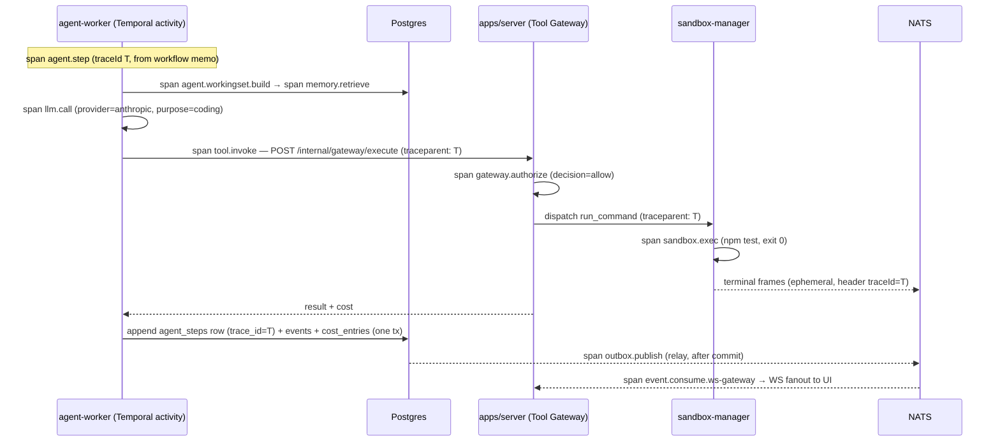

# 25 — Observability

Status: v1.0 — Implementation-ready

Observability for AI AGENT COMPANY OS is delivered in **three layers**, per _DECISIONS.md §1
(ADR-016): (a) **product observability** — in-app dashboards reading domain data directly from
Postgres; (b) **operational telemetry** — pino structured logs + OpenTelemetry traces/metrics in
every process; (c) an **optional compose profile** shipping otel-collector, Prometheus, Grafana,
Loki and Tempo for operators who want a full ops cockpit. Layer (a) always works with zero extra
containers; layers (b)+(c) are for the Founder-as-operator and for us during development.

---

## 1. Layer A — Product observability (in-app, from Postgres)

The product's own dashboards are **domain features, not telemetry**. They read committed rows —
never Prometheus — so they work on the minimal compose topology.

| Surface | Source tables | Doc |
|---|---|---|
| Agent Monitor cards (status, current task, model, runtime, tokens, tools) | `agent_sessions`, `agent_steps`, `agent_model_bindings` | 24-FRONTEND-ARCHITECTURE.md §Agents |
| Global event timeline (live + replay) | `events` (per-company `seq`), WS resume protocol | 22-REALTIME-ARCHITECTURE.md, 10-EVENT-ARCHITECTURE.md |
| Virtual office digital twin | Office Projector over `events` | 23-VIRTUAL-OFFICE.md |
| Costs view (company/unit/project/task/agent) | `cost_entries`, rollup MVs | 26-COST-MANAGEMENT.md |
| Memory Observatory provenance | `memories`, `memory_evidence`, `memory_relations` | 12-MEMORY-ARCHITECTURE.md |
| Terminal streams | NATS ephemeral frames + `/data/terminals/*.log` | 22-REALTIME-ARCHITECTURE.md §16 |
| Approval Center | `approvals` | 19-APPROVAL-ENGINE.md |

Rule: **if a number is shown to the Founder inside the product, it must come from Postgres domain
tables**. Prometheus metrics are operator-facing only and may be lossy/reset; domain data may not.

---

## 2. Layer B — Operational telemetry

### 2.1 Structured logging standard (pino)

Every process (`server`, `agent-worker`, `execution-worker`, `sandbox-manager`, `web` dev server)
logs **newline-delimited JSON via pino to stdout** — no log files, Docker captures stdout
(json-file driver locally, Loki via the observability profile).

Canonical log schema (`packages/config` exports the typed logger factory):

```jsonc
{
  "ts": "2026-08-10T14:03:22.918Z", // ISO-8601, pino timestamp
  "level": "info",                  // trace|debug|info|warn|error|fatal
  "svc": "agent-worker",            // process name, from APP_NAME env
  "companyId": "0198f2...",         // uuidv7, present on all tenant-scoped work
  "agentId": "0198f3...",           // nullable
  "taskId": "0198f4...",            // nullable
  "workflowId": "agent-task-0198f4...", // Temporal workflow id, nullable
  "traceId": "4bf92f3577b34da6a3ce929d0e0e4736", // W3C trace id, injected by OTel-pino mixin
  "msg": "step completed",
  "ctx": { "stepNo": 14, "action": "use_tool", "tool": "run_command" } // free-form, small
}
```

Rules:
- The six correlation keys (`companyId, agentId, taskId, workflowId, traceId` + `svc`) are set via
  child loggers at context boundaries (Fastify request hook, Temporal activity interceptor,
  sandbox-manager session handler) — **never manually per call site**.
- `ctx` payloads are capped at 4 KB per line (pino serializer truncates with `"…"` marker); no
  prompts, no secrets, no tool outputs in logs — those live in `llm_calls` / `tool_invocations`.
- Secret redaction: pino `redact` paths for `*.authorization`, `*.apiKey`, `*.token`, `*.password`,
  plus the shared `redactSecrets()` scrubber from `packages/config` (same one used for LLM payload
  storage, §5.2).
- Levels: `debug` off by default in production compose (`LOG_LEVEL=info`), `trace` never in prod.

### 2.2 OpenTelemetry setup

Every Node process initializes the OTel Node SDK at boot (`packages/config/otel.ts`):
`NodeSDK` with OTLP/HTTP exporter → `OTEL_EXPORTER_OTLP_ENDPOINT` (the collector when the
observability profile is up; otherwise the SDK is constructed with a no-op exporter — near-zero
overhead, spans still create ids for log correlation).

**[WRITER-DECISION]** Sampling: `ParentBased(AlwaysOn)` in MVP (trace volume at ≤30 active agents
is trivial: ~1–5 traces/sec). Tail sampling is deferred to Phase 3; the collector config carries a
commented `tail_sampling` block ready to enable.

**Context propagation (W3C tracecontext end-to-end):**

1. **Fastify (`apps/server`)** — `@opentelemetry/instrumentation-http` + `-fastify` extract/inject
   `traceparent`/`tracestate` headers automatically; the WS gateway attaches `traceId` to outbound
   frames' metadata for debug tooling.
2. **Fastify → Temporal** — when the server starts a workflow, a client interceptor writes
   `{traceparent, tracestate}` into the workflow **memo** (survives `continueAsNew`, visible in
   Temporal UI) and into headers. Signals carry it in signal headers.
3. **Inside Temporal** — workflow code is deterministic, so no live spans in workflow context;
   instead **activity interceptors** on both workers restore the context from headers and open an
   activity span parented to the originating trace. Each agent step opens a fresh **step span**
   (see naming below) whose `traceId` is stored on `agent_steps.trace_id`.
4. **agent-worker → server (Tool Gateway)** — plain HTTP, headers propagate automatically.
5. **server / execution-worker → sandbox-manager** — plain HTTP + `traceparent`; sandbox-manager
   opens child spans per exec and stamps `traceId` on emitted `workspace.*` events' payload meta.
6. **Outbox relay → NATS** — relay copies `traceId` into NATS message headers so downstream
   consumers (WS gateway, Office Projector, consolidation trigger) parent their consumer spans to
   the producing trace, giving true produce→consume traces in Tempo.

**Span naming conventions** (`lowercase.dot`, mirrors event naming):

| Span | Kind | Key attributes |
|---|---|---|
| `http.request` (auto) | server | route, method, status |
| `agent.step` | internal (root of a step) | company_id, agent_id, task_id, step_no, action_type |
| `agent.workingset.build` | internal | memory_tokens, message_count |
| `memory.retrieve` | internal | scope, top_k, latency, returned_ids_count |
| `llm.call` | client | provider, model, purpose, input_tokens, output_tokens, cached, cost_cents |
| `tool.invoke` | client | tool, risk_class, decision(allow/deny/require_approval) |
| `gateway.authorize` | server | policy_rule_hit, decision |
| `sandbox.exec` | server | workspace_id, level, exit_code, duration |
| `outbox.publish` | producer | event_type, seq, lag_ms |
| `event.consume.<consumer>` | consumer | event_type, redelivery_count |
| `workflow.signal.<name>` | internal | workflow_id |

### 2.3 The trace of one agent step, end-to-end



One `traceId` covers working-set build, LLM call, gateway authorization, sandbox execution, the
outbox publish and every consumer — pasteable from any `agent_steps` row into Tempo.

### 2.4 Metrics inventory (canonical names)

OTel metrics, exported via collector → Prometheus. Prefix `acos_`. Base labels on all:
`svc`; `company_id` where tenant-scoped (cardinality safe: ≤10 companies).

| Metric | Type | Labels | Meaning |
|---|---|---|---|
| `acos_agent_steps_total` | counter | company_id, action_type | Agent loop steps executed |
| `acos_llm_tokens_total` | counter | company_id, purpose, provider, model, direction(in/out) | Token throughput |
| `acos_llm_latency_seconds` | histogram | provider, purpose | LLM call latency (buckets 0.25–120s) |
| `acos_llm_errors_total` | counter | provider, kind(timeout/429/5xx/parse) | Provider failures |
| `acos_tool_invocations_total` | counter | company_id, tool, decision | Gateway decisions |
| `acos_task_transitions_total` | counter | company_id, from, to | Task state machine flow |
| `acos_event_lag_seconds` | histogram | consumer | occurred_at → consumed delta |
| `acos_outbox_lag_seconds` | gauge | — | Oldest unpublished event age (relay heartbeat) |
| `acos_outbox_pending` | gauge | — | Unpublished event count |
| `acos_dead_events_total` | counter | company_id, event_type | DLQ arrivals |
| `acos_ws_clients` | gauge | company_id | Connected WebSocket clients |
| `acos_workspace_count` | gauge | company_id, level, state | Live workspace containers |
| `acos_workspace_resource_usage` | gauge | workspace_id→**no** (aggregate by level), resource(cpu/mem/disk) | Sandbox pressure |
| `acos_consolidation_runs_total` | counter | company_id, outcome(persisted/merged/discarded/failed) | Memory pipeline |
| `acos_memory_retrieval_latency_seconds` | histogram | scope | Working-set retrieval latency |
| `acos_cost_cents_total` | counter | company_id, kind | Spend counter (mirror of cost_entries) |
| `acos_agent_sessions_active` | gauge | company_id | Running agent workflows |
| `acos_approvals_pending` | gauge | company_id | Founder inbox depth |
| `acos_heartbeat_timestamp` | gauge | svc | Liveness per process |

Temporal server exposes its own Prometheus endpoint (schedule-to-start latency, task queue
backlog, workflow failures) — scraped as-is; dashboard "Temporal Health" builds on it.

---

## 3. Layer C — Optional observability compose profile

`docker compose --profile observability up` adds: `otel-collector` (OTLP in; Prometheus exporter,
Loki exporter for logs via the collector's filelog/docker receiver, Tempo exporter for traces),
`prometheus`, `grafana`, `loki`, `tempo`. Provisioning lives in `infrastructure/grafana/`
(datasources + dashboards as JSON, mounted read-only — no click-ops).

**Provisioned dashboards (canonical list):**

1. **Agent Fleet** — active sessions, steps/min, action-type mix, stuck-agent watchdog panel,
   per-agent token burn top-10.
2. **LLM Spend** — cost_cents rate by provider/purpose/company, token throughput, latency
   heatmap, error/429 rate, fallback activations.
3. **Event Pipeline** — outbox lag & pending, publish rate, per-consumer event lag, redeliveries,
   dead_events, WS clients & fanout rate.
4. **Temporal Health** — task-queue backlog & schedule-to-start per queue (`agent-tasks`,
   `execution`), workflow failures/terminations, sticky cache hit rate, continueAsNew rate.
5. **Sandbox Resources** — workspace count by level/state, host CPU/mem (node-exporter optional),
   per-level cgroup usage, disk free on `/data/*`, workspace GC activity.

**Alert rules** (Prometheus rules file, alerts surface in Grafana; also mirrored as in-app
`system.alert.raised` events so the Founder sees them without Grafana):

| Alert | Expression (sketch) | Severity |
|---|---|---|
| OutboxLagHigh | `acos_outbox_lag_seconds > 30` for 1m | critical |
| DeadLetterEvents | `increase(acos_dead_events_total[5m]) > 0` | critical |
| BudgetBreach | `budget.exceeded` event → gauge `acos_budget_breached > 0` | critical |
| StuckAgents | stuck-agent watchdog gauge `acos_agent_sessions_stuck > 0` for 5m (33-FAILURE-MODES.md §2.16) | warning |
| DiskLow | `/data/*` free < 15% (10% critical) | warning/critical |
| LLMProviderDown | `rate(acos_llm_errors_total{kind=~"timeout|5xx"}[5m])` > 50% of calls | warning |
| TemporalBacklog | schedule_to_start p95 > 30s for 5m | warning |
| ProcessDown | `time() - acos_heartbeat_timestamp > 60` | critical |

---

## 4. LLM-call observability (detail)

Every ModelRouter call writes one `llm_calls` row (schema per _DECISIONS §17) in the same
transaction as its `cost_entries` row (26-COST-MANAGEMENT.md §3) and carries the `llm.call` span:

- Row: id, company_id, agent_id, task_id, step_id, purpose, provider, model, input_tokens,
  output_tokens, cached_tokens, latency_ms, cost_cents, status (`ok|timeout|rate_limited|error|
  parse_failed`), fallback_from (nullable provider), trace_id, prompt_ref, response_ref,
  created_at.
- **Prompt/response storage policy [WRITER-DECISION on specifics]:**
  - **Store by default.** Full prompt and raw response stored in `llm_call_payloads`
    (llm_call_id, prompt_text, response_text) — separate table so `llm_calls` stays scan-cheap.
  - **Redaction before write:** the shared `redactSecrets()` scrubber removes anything matching
    secret patterns (keys, tokens, connection strings) and any value known to the secrets vault
    (exact-match scan against decrypted secret values held only in server memory — S2 means
    prompts should never contain them, this is defense in depth).
  - **Size cap:** 256 KB per field; overflow truncated head+tail with `[[truncated N bytes]]`.
  - **Retention:** payloads deleted after **30 days** (nightly retention job); `llm_calls`
    metadata rows kept indefinitely (they are the cost/audit record).
  - **Per-company opt-out:** `companies.settings.store_llm_payloads = false` → payloads not
    written at all (metadata always written). Surfaced in Settings UI.
- Debug UX: the Agent Monitor step inspector (24-FRONTEND-ARCHITECTURE.md) links step →
  `llm_calls` → payload viewer with redaction badge, and deep-links the `trace_id` to Tempo when
  the observability profile is enabled.

## 5. Memory-retrieval observability

The Working-Set builder records exactly which memories informed each step:
`agent_steps.retrieved_memory_ids uuid[]` plus per-retrieval scores in
`agent_steps.retrieval_meta JSONB` (`[{memoryId, score, scope}]`). On read, `memories.
retrieval_count` increments (batched). This powers: (a) Memory Observatory "usage" provenance
("used in 14 steps across 3 tasks"), (b) the `memory.retrieve` span attributes, (c) offline
evaluation of retrieval quality (32-TESTING-STRATEGY.md §8). No separate telemetry store —
Postgres is the record, per Layer A rule.

---

## 6. Debugging playbooks

### 6.1 "Agent seems stuck"

1. Product first: Agent Monitor card → session status, last step timestamp, current activity.
2. `agent_sessions` row → `workflow_id` → Temporal UI: is the workflow running, waiting on a
   timer/signal, or retrying an activity? Pending-activity pane shows the retry ladder and last
   failure.
3. If waiting: check `wait_for` reason in last `agent_steps` row — unresolved dependency
   (dependency-cycle detector, 33-FAILURE-MODES.md §2.15), pending approval, or unanswered
   message.
4. If retrying `llm.call`: LLM Spend dashboard error panel / `acos_llm_errors_total` → provider
   incident → ModelRouter fallback status.
5. If genuinely looping: loop detector should have fired (`agent.guard.triggered` event, guard d);
   if it hasn't, pull the step trace in Tempo via `agent_steps.trace_id` and inspect action args.
6. Remedy ladder: send `managerDirective` signal (manager UI action) → pause session → cancel
   workflow (task returns to ASSIGNED). Never edit rows by hand.

### 6.2 "Event not reaching UI"

1. Is the event in Postgres? `select * from events where id = …` — if absent, the producing
   transaction rolled back: check producer logs by `traceId`.
2. `published_at` null? → outbox relay problem: check `acos_outbox_lag_seconds`, relay leadership
   (advisory lock holder logged at `info` on acquire), NATS availability (33-FAILURE-MODES.md
   §2.11).
3. Published but not consumed? → JetStream consumer lag per consumer (Event Pipeline dashboard);
   check `dead_events` for the id.
4. Consumed but UI stale? → WS: client's `last seq` vs event `seq`; force resume; check
   `acos_ws_clients` and gateway logs for the connection. Verify the client subscribed to
   `events:<companyId>`.
5. Office-specific: event reached timeline but no animation → Office Projector mapping gap
   (23-VIRTUAL-OFFICE.md §mapping table) — projector logs the unmapped type at `debug`.

### 6.3 "Spend spike"

1. LLM Spend dashboard → which company/provider/purpose spiked; in-app Costs view for the same
   window (authoritative numbers).
2. `cost_entries` grouped by agent_id/task_id for the window → usually one task.
3. That task's `agent_steps`: step rate and token sizes — classic causes: loop detector near-miss
   (large repeated tool outputs re-entering context), oversized working set (memory token caps
   misconfigured), fallback to a pricier provider (`llm_calls.fallback_from` not null).
4. Immediate control: tighten the task/agent budget row (hard) → next pre-step guard pauses it;
   or pause the agent. Circuit-breaker semantics: 26-COST-MANAGEMENT.md §6.
5. Follow-up: file a failure memory candidate (this is exactly the learning loop's job) and, if a
   pricing-table drift caused wrong cost estimates, update `model_providers.pricing`.

---

## 7. Cross-references

- Event system & replay: 10-EVENT-ARCHITECTURE.md, 22-REALTIME-ARCHITECTURE.md
- Agent loop, steps, guards: 08-AGENT-RUNTIME.md, 09-WORKFLOW-ENGINE.md
- Cost tables & budgets: 26-COST-MANAGEMENT.md
- Failure detection signals consumed by alerts: 33-FAILURE-MODES.md
- Compose profile wiring & resource sizing: 27-INFRASTRUCTURE.md
- Frontend dashboard surfaces: 24-FRONTEND-ARCHITECTURE.md, 23-VIRTUAL-OFFICE.md
