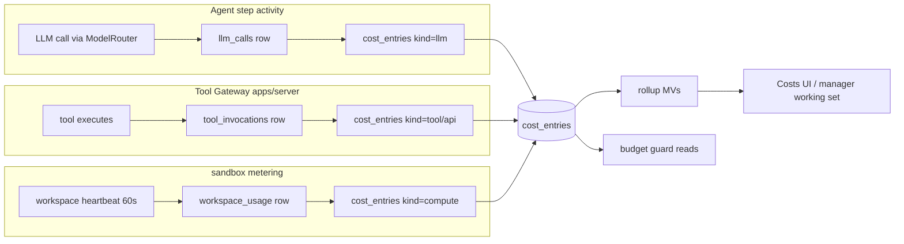

# 26 — Cost Management

Status: v1.0 — Implementation-ready

Implements _DECISIONS.md §18 (cost model), §8 (spend circuit breaker), §17 (routing/cost caps).
Costs are **first-class domain data in Postgres** — the Costs view, budgets, guards and manager
awareness all read the same rows. Currency-agnostic minor units (`amount_cents`), per-company
currency setting (_DECISIONS §0 A4).

---

## 1. Data model

### 1.1 `cost_entries` (the ledger)

Per _DECISIONS §18: `id, company_id, kind ('llm'|'tool'|'compute'|'media'|'api'), ref (uuid of
llm_calls / tool_invocations / workspace_sessions / integration call), agent_id, task_id,
project_id, org_unit_id, amount_cents (bigint), quantity (numeric — tokens, minutes, calls),
occurred_at`. Append-only; corrections are compensating entries (negative amount, `ref` pointing
at the corrected entry) — never updates.

### 1.2 `llm_calls` (detail behind kind='llm')

Full schema in 25-OBSERVABILITY.md §4. `cost_entries.ref = llm_calls.id`; `quantity` = total
tokens. Cached tokens priced at the provider's cached rate from the pricing table.

### 1.3 Supporting tables

- `model_providers.pricing JSONB` — pricing table (§4).
- `budgets` — §5.
- `cost_rollup_daily` materialized view — §8.

## 2. Cost attribution flow

Every billable action already executes inside a context that knows agent/task/project/unit
(the agent step, the gateway invocation, the workspace session). The invariant:

> **The cost entry is written in the same Postgres transaction as the invocation record it
> prices.** `llm_calls` + its `cost_entries` row commit together; `tool_invocations` + cost
> entry together; workspace metering rows + compute entries together. No async billing pipeline,
> no drift, no lost attribution on crash.



Attribution context propagation: `CostContext {companyId, agentId, taskId, projectId, orgUnitId}`
is assembled once per step in the agent-worker and passed explicitly to ModelRouter and the
gateway request body — never inferred later. Non-task work (consolidation, intake, inbox triage)
attributes to the triggering entity: consolidation → project/company scope with `task_id` null
and a synthetic `kind` tag in `ref`-ed record; inbox LLM calls → agent only.

## 3. Pricing tables

### 3.1 LLM pricing — `model_providers.pricing`

```jsonc
// model_providers.pricing (JSONB), platform-level, editable in Settings → Providers
{
  "models": {
    "claude-sonnet-4-5": { "in_per_mtok_cents": 300, "out_per_mtok_cents": 1500,
                           "cached_in_per_mtok_cents": 30 },
    "gpt-4o-mini":       { "in_per_mtok_cents": 15,  "out_per_mtok_cents": 60 },
    "text-embedding-3-small": { "in_per_mtok_cents": 2, "out_per_mtok_cents": 0 }
  },
  "updated_at": "2026-08-01", "source": "manual"
}
```

- Updatable at runtime (admin UI + seed defaults shipped in `packages/llm/pricing-defaults.ts`);
  price used is the one current at call time and denormalized onto `llm_calls.cost_cents` —
  historical entries never re-price.
- Ollama/vLLM models: zero API price; their cost appears as **compute** (they burn host CPU) —
  see §3.2. This keeps "offline mode is not free" visible.

### 3.2 Compute pricing heuristic (sandbox minutes)

**[WRITER-DECISION]** Compute is priced by a simple configurable heuristic so budgets can compare
LLM vs sandbox spend: `company.settings.compute_cent_per_cpu_minute` (default **1 cent per
cpu-core-minute**, i.e. a 2-CPU coding workspace ≈ 2¢/min ≈ $1.20/hour). Sandbox-manager emits a
usage heartbeat per workspace every 60s (`workspace_usage`: workspace_id, cpu_core_seconds,
mem_gb_seconds); the execution-worker's metering activity converts to `cost_entries
kind=compute`. Founders self-hosting on owned hardware may set it to 0 — budgets then govern LLM
spend only. Media/API kinds (Phase 2) price via their adapters' cost estimators.

## 4. Budgets

`budgets`: `id, company_id, scope ('company'|'unit'|'project'|'task'|'agent'), scope_ref (uuid,
null for company), period ('daily'|'weekly'|'monthly'|'total'), limit_cents, mode ('hard'|'soft'),
created_at, updated_at`. Consumption = sum of `cost_entries` matching the scope within the
current period window (computed from the fast rollups + today's live tail; §8).

- **Hierarchy & inheritance:** company → unit → project → task → agent. A task without an
  explicit budget row inherits **pro-rata from its parent task's remaining budget at delegation
  time** (_DECISIONS §7): the delegating manager's `delegate_task` action allocates a slice
  (default = parent remaining ÷ open subtasks, manager can override); the allocation is
  materialized as a `budgets(scope=task, period=total, mode=hard)` row so guards never walk the
  tree at check time. Agent budgets are caps across all their work; unit/company budgets are
  umbrella checks evaluated in addition (a step must pass **every** applicable scope).
- **Hard vs soft:** hard breach ⇒ enforcement (§6). Soft breach ⇒ `budget.warning` event →
  owning manager notified + Founder Costs view badge; work continues.
- **Period reset:** period windows computed in the company's timezone setting; no row mutation on
  reset — consumption is always a windowed query, so "reset" is free and retroactively auditable.
  `period=total` (used for task budgets) never resets.

## 5. Enforcement points

Three independent layers (defense in depth, all reading the same tables):

1. **Pre-step guard (agent runtime, 08-AGENT-RUNTIME.md guard a):** before building the working
   set, the step activity computes remaining budget for task/agent/project/unit/company. If any
   hard scope is exhausted → the workflow takes the `budget_exhausted` branch: task → BLOCKED,
   `escalate`-to-manager action synthesized, `budget.exceeded` event emitted. If remaining <
   estimated step cost (recent-average step cost × 1.5) → same branch (don't start a step you
   can't pay for).
2. **Gateway pre-execution check (17-TOOL-GATEWAY.md):** the policy decision includes
   `est_cost ≤ remaining budget` (autonomy matrix, _DECISIONS §12). Catches expensive tools even
   mid-step and non-agent invocations. Deny reason `budget` is distinct in `tool_invocations`.
3. **Company circuit breaker:** a daily company-level hard budget breach emits `budget.exceeded
   {scope: company}`; the policy engine consumer then **pauses all non-critical agents**
   (sessions signalled `managerDirective(pause)`, agents → paused, new workflow starts refused).

**[WRITER-DECISION] Critical-agent semantics for the circuit breaker:** an agent is *critical*
iff any of: (a) it holds an executive position (`positions.seniority_track ∈ {lead, executive}`
— CEO/CTO/EM/leads must stay up to reorganize under the freeze), (b) it owns a task currently in
`REVIEW`, `QA` or `APPROVAL` (finishing governance costs little and unblocks others), or (c) it
is flagged `agents.employment.critical = true` (Founder override). Critical agents continue under
a reduced per-step token cap (fast-model routing forced, §10) and may not start new R2 tools.
Everything else pauses until the period resets or the Founder raises the budget. Resume is
automatic on `budget.restored` (limit raised or new period).

## 6. Manager cost awareness

- **Working set:** every step's working set for agents with `manages`/`leads` edges includes a
  cost block: remaining budget of the current task, and for managers additionally the team
  rollup (yesterday + period-to-date per direct report, top 3 spending tasks). Assembled from the
  rollup MVs — one indexed query, ~free tokens (≤150).
- Every agent (not only managers) sees its **own current task's remaining budget** in the working
  set — cost-awareness is a first-class prompt input, enabling `escalate`-before-broke behavior.
- **Team cost dashboards:** manager-visible Costs view scoped to their unit (same UI as Founder's,
  filtered by org subtree) — see 24-FRONTEND-ARCHITECTURE.md.
- **Performance metrics:** cost-efficiency feeds skill/performance evidence
  (13-SKILL-AND-LEARNING-SYSTEM.md): task completion under budget adds positive
  `skill_evidence(kind=task_success, weight boost)`; chronic overruns produce manager-eval
  evidence and a coaching objective. Deterministic rule: efficiency ratio = actual/budget,
  recorded in `tasks.result.cost_efficiency` at completion.

## 7. Rollups & refresh

Materialized views (Postgres, refreshed `CONCURRENTLY`):

| MV | Grain | Refresh |
|---|---|---|
| `cost_rollup_daily` | day × company × kind × agent × task × project × org_unit | every 5 min (pg_cron-style scheduler activity on agent-worker Temporal cron) |
| `cost_rollup_monthly` | month × company × dimension | hourly |

"Live" numbers = MV + `select … from cost_entries where occurred_at > mv_high_watermark` (the
tail is minutes of data — cheap). Budget guards use exactly this composite so enforcement lag is
≤ seconds, not the MV refresh interval.

## 8. Forecasting (burn rate)

Simple, deterministic, no ML: for each active budget scope,
`projected = spent_so_far + burn_rate_per_hour × hours_remaining_in_period`, where burn rate =
trailing-24h spend ÷ 24 (fallback: period-to-date average when <24h of data). Surfaced as: a
projection line on Costs charts, a `budget.forecast_breach` soft event when projection > 100% of
a hard limit **and** > 12h before period end (gives managers time to act), and a working-set hint
for the owning manager. Computed by a 15-min Temporal cron activity; no persistence beyond the
event — always recomputable.

## 9. Founder cost UX

Costs view (24-FRONTEND-ARCHITECTURE.md §Costs):
- **Dashboard:** period selector; spend by company/department/team/agent/project/task; kind split
  (llm/tool/compute); provider/model split; burn-rate projection; top movers.
- **Budget editor:** CRUD on `budgets` with the scope tree, hard/soft toggle, period; shows
  current consumption + projection inline; guard rails (child hard budgets cannot exceed parent
  remaining at creation time — advisory warning, not a hard DB constraint, since parents change).
- **Alerts:** soft/hard breach and forecast events land in the Founder notification tray and the
  Approval Center never blocks on them (budgets are informational-or-enforcing, never approvals).
- **Drill-down:** any number clicks through to the underlying `cost_entries` → `llm_calls`
  payload viewer (respecting the storage policy in 25-OBSERVABILITY.md §4).

## 10. Cost-optimizing model routing tie-in

Per _DECISIONS §17 the ModelRouter resolves purpose → provider chain. Cost enters routing in
three ways:
1. **Risk-aware downgrade:** for tasks with `risk=low` and purposes `fast`/`coding`, the router
   prefers the cheapest profile entry whose capability tag satisfies the purpose; `reasoning`
   purpose is never downgraded below the company profile's floor model.
2. **Budget-pressure mode:** when remaining task budget < 20% or the company is in circuit-breaker
   critical-only mode (§5), the router forces the `fast` profile for all non-review steps and
   halves the per-call token cap.
3. **Cap enforcement:** `model_profiles.cost_caps` (max cents/call, max tokens/call) are hard
   router-level rejections → surfaced to the loop as a guard event, not an exception storm.

Routing decisions record `llm_calls.model` + `fallback_from`, so the Costs view can show
"savings from routing" (delta vs primary-model price for the same tokens).

## 11. Worked example — one coding task's full ledger

Task `TASK-81 "Add CSV export"` (project Phoenix, unit Engineering/Backend, owner agent Deniz,
budget: 800¢ hard/total, delegated by EM from epic remaining 4,000¢).

| # | occurred_at | kind | ref → detail | qty | amount |
|---|---|---|---|---|---|
| 1 | 09:00:12 | llm | llm_calls: reasoning, claude-sonnet-4-5, 3.1k in/0.9k out — plan step | 4,000 tok | 23¢ |
| 2 | 09:01:05 | compute | workspace ws-81 coding level (2 CPU) minute 1 | 2 cpu-min | 2¢ |
| 3 | 09:02:40 | llm | coding purpose, 6.2k in/2.1k out — write code | 8,300 tok | 50¢ |
| 4 | 09:03:10 | tool | tool_invocations: run_command `npm test` (R1) — flat tool fee 0 + compute below | 1 call | 0¢ |
| 5 | 09:00–09:20 | compute | ws-81 heartbeats, 20 min × 2 CPU | 40 cpu-min | 40¢ |
| 6 | 09:08:33 | llm | coding, fix failing test, 7.0k in/1.8k out | 8,800 tok | 53¢ |
| 7 | 09:15:02 | llm | fast (gpt-4o-mini via routing downgrade), commit message + status update | 1,900 tok | 1¢ |
| 8 | 09:16:20 | llm | embedding, memory candidate embed | 1,200 tok | 1¢ |
| 9 | 09:18:44 | llm | **reviewer agent** Kaan, reasoning review pass — attributed to same task_id, agent_id=Kaan | 9,400 tok | 61¢ |
| 10 | 09:20:01 | compute | reviewer analysis workspace (1 CPU, ro) 4 min | 4 cpu-min | 4¢ |

Total: **235¢ of 800¢** → `tasks.result.cost_efficiency = 0.29`; positive evidence recorded;
epic remaining decremented in the rollup view (no double counting: epic consumption is the sum
over descendant tasks' entries via `project_id`+task tree, not separate rows). Every row joins to
its detail record and its `trace_id` — the Founder can click from the ledger to the exact prompt
that cost 61¢.

## 12. Storage & API surface

### 12.1 Indexes (performance-critical; full DDL in 20-DATABASE-DESIGN.md)

```sql
-- cost_entries: the two hot access paths are budget-window sums and drill-downs
CREATE INDEX cost_entries_budget_idx  ON cost_entries (company_id, occurred_at DESC);
CREATE INDEX cost_entries_task_idx    ON cost_entries (company_id, task_id, occurred_at);
CREATE INDEX cost_entries_agent_idx   ON cost_entries (company_id, agent_id, occurred_at);
CREATE INDEX cost_entries_project_idx ON cost_entries (company_id, project_id, occurred_at);
-- monthly partitioning by occurred_at from day one (cheap; events table sets the pattern)
```

Budget-window sums for the pre-step guard hit `cost_rollup_daily` + the tail index above — the
guard's budget check is required to stay **<10 ms p95** (asserted in the performance suite,
32-TESTING-STRATEGY.md §8), because it runs before every agent step.

### 12.2 REST endpoints (contracts in `packages/contracts`; full API in 21-API-DESIGN.md)

| Endpoint | Purpose |
|---|---|
| `GET /api/companies/:id/costs?group_by=&from=&to=&kind=` | Dashboard aggregates (MV+tail) |
| `GET /api/companies/:id/costs/entries?task_id=…` | Ledger drill-down, paginated |
| `GET/POST/PATCH/DELETE /api/companies/:id/budgets` | Budget editor CRUD |
| `GET /api/companies/:id/costs/forecast` | Burn-rate projections per active budget |
| `GET /api/llm-calls/:id` (+ `/payload`) | Call detail; payload honors storage policy |

### 12.3 Events emitted (canonical names, catalog in 10-EVENT-ARCHITECTURE.md)

`cost.entry.recorded` (sampled: only for entries ≥ 10¢ to avoid event spam; the ledger itself is
the complete record), `budget.warning`, `budget.exceeded`, `budget.forecast_breach`,
`budget.restored`, `budget.updated`. The office/timeline shows breach events; entry-level events
exist for automation hooks, not UI animation.

## 13. Edge cases & rules

- **Shared/system work attribution:** consolidation, intake, nightly relationship recompute and
  other non-task LLM work carry `task_id NULL` and attribute to project or company scope with
  `kind='llm'` and a `ref` into their own record tables; the Costs UI shows them under a
  "Platform work" bucket so they are never invisible overhead.
- **Reviewer costs** are attributed to the reviewed task (they are part of its delivery cost) but
  to the reviewer's `agent_id` — both dimensions stay truthful (worked example row 9).
- **Compensating entries:** the only mutation path; UI shows net amounts with an adjustment
  marker. Used for: provider-side billing corrections, mispriced entries after a pricing bug.
- **Currency:** all entries in company currency minor units; provider prices are configured in
  the platform currency and converted at entry time using `companies.settings.fx_rate`
  (manual setting; A4 — no live FX integration in MVP).
- **Failed calls still cost:** timeouts/429s that consumed tokens (partial streams) record their
  actual token usage; `status` on `llm_calls` distinguishes them for the "waste" panel.
- **Budget deletion** with recorded consumption is forbidden (soft-archive instead) — historical
  efficiency metrics must stay computable.

## 14. Testing hooks

Unit: budget arithmetic, inheritance slicing, period windows (timezone edges), forecast math,
critical-agent predicate (§5) — all pure functions in `packages/domain`. Integration: same-tx
invariant (kill between invocation insert and commit ⇒ neither row exists); circuit-breaker
consumer pauses exactly the non-critical set; MV+tail composite equals full scan on fixtures.
E2E: scenario 06 asserts the worked-example-shaped ledger appears for the demo task
(32-TESTING-STRATEGY.md §5).

## 15. Cross-references

- Guards in the step loop: 08-AGENT-RUNTIME.md; workflow branches: 09-WORKFLOW-ENGINE.md
- Gateway cost check: 17-TOOL-GATEWAY.md; autonomy matrix: 06-AUTONOMY-AND-ESCALATION.md
- llm_calls & spend debugging: 25-OBSERVABILITY.md §4, §6.3
- Budget breach failure handling: 33-FAILURE-MODES.md
- Schema DDL: 20-DATABASE-DESIGN.md
