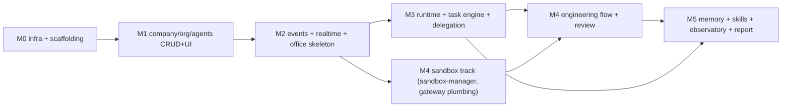

# 29 — MVP Plan

Status: v1.0 — Implementation-ready

## 1. MVP philosophy

The MVP does **not** minimize features — it minimizes *surface* while proving the core operating
model on **correct foundations**. Two principles govern every scoping call:

1. **Correct foundations.** Everything that is structurally expensive to retrofit ships in MVP even
   if dark: multi-company tenancy (rule 11), the transactional outbox and event catalog, the
   Temporal-based agent loop, the Tool Gateway with the full decision pipeline, the control/
   execution plane split, and the complete database schema including Phase-2/3 tables
   (`_DECISIONS.md` §23: "MVP includes ALL schema for these where cheap — tables exist, features
   dark"). We never build a throwaway "simple version" of the runtime, events, or tenancy.
2. **Prove the core operating model.** The MVP's single obligation is the demo in §3: a real
   organization autonomously decomposing a Founder objective through a management hierarchy into
   sandboxed engineering work, with real communication, real terminals, independent review,
   learning, and an executive report — with zero routine questions to the Founder. Anything not
   needed to make that demo true and durable is out (§4).

Corollaries: no speculative optimization (no Redis, no K8s, no read replicas — ADR-006/018), no
polish that fakes progress (no simulated office animation, no mocked terminals), and every
milestone ends in a *live demo*, not a report.

## 2. MVP definition of success

The Playwright suite `apps/web/e2e/mvp-demo.spec.ts` executes §3 end-to-end against a
freshly-composed stack, plus the two resilience checks from 01-PRODUCT-SCOPE.md §6: mid-run
worker kill with full resumption, and two-company isolation. CI green on that suite = MVP done.

## 3. The MVP demo script (acceptance test)

The flow below is `_BRIEF.md` §11 verbatim, numbered into 25 executable steps
[WRITER-DECISION: the brief's arrow-chain is segmented into 25 numbered steps without changing its
wording; segment titles quote the brief]. Each step lists its observable proof.

| # | Brief step (verbatim) | Observable proof (assertion) |
|---|---|---|
| 1 | Local start | `git clone && cp .env.example .env && docker compose up` → all services healthy; first-run wizard reachable |
| 2 | create company | `company.created` event; company visible in switcher |
| 3 | build org | departments/teams/positions created; org chart (Cytoscape) renders `reports_to` forest |
| 4 | hire agents (avatars…) | 8 agents hired (CEO, CTO, Engineering Manager, Backend Lead, 2 Backend Engineers, 1 Frontend Engineer, 1 QA/Reviewer); `agent.hired` events; avatars in office |
| 5 | hire agents (…reporting lines) | escalation chain Dev→EM→CTO→CEO resolvable via API `GET /api/v1/org/escalation-chain/:agentId` |
| 6 | create/import project | import of a local Node repo → bare repo at `/data/repos/<project_id>.git` |
| 7 | (intake completes) | `projectIntakeWorkflow` produces Intake Report artifact; routed tasks appear for CTO/leads |
| 8 | Founder objective "Analyze this project and implement feature X" | `tasks` row kind=goal, owner=CEO; `task.created` event |
| 9 | CEO | CEO `agentTaskWorkflow` starts; decomposition into initiative(s); delegation to CTO |
| 10 | CTO | CTO produces technical design + epic(s); delegates to EM |
| 11 | EM | EM decomposes into tasks with dependencies DAG, assigns owners |
| 12 | tasks | tasks board shows PLANNED→ASSIGNED transitions with per-role permissions enforced |
| 13 | developers in isolated workspaces | workspace containers created per task; branch `task/<n>-<slug>`; `workspace.*` events |
| 14 | real inter-agent communication | messages persisted in task threads/channels; `agent.message.sent` events |
| 15 | (visible in office) | office avatars move/interact driven only by projector instructions derived from those events |
| 16 | real terminals | xterm.js streams live PTY frames (`npm install`, editor output) from NATS; reconnect replays ring buffer |
| 17 | code implemented | commits on task branch in bare repo; diff visible in review UI |
| 18 | tests run | `npm test` executed in workspace; real exit codes; `tool.invocation.completed` events |
| 19 | independent review | reviewer ≠ author; REVIEW→CHANGES_REQUESTED at least once; then approval path |
| 20 | failures become learning candidates | a failing test produces `memory` rows status=candidate type=failure with evidence refs |
| 21 | consolidation stores memory | `memoryConsolidationWorkflow` runs; candidate → active with importance/confidence; visible in Observatory with provenance |
| 22 | skill evidence updates | `skill_evidence` rows (task_success/review_accepted); recomputed `agent_skills.level/confidence` |
| 23 | project completes | merge to main by lead; tasks DONE; project status transitions per §19 state machine |
| 24 | CEO executive report | report artifact + message to Founder summarizing outcome, cost, learnings |
| 25 | zero routine technical questions to Founder | assertion: Approval Center contains ZERO items of routine/technical category for the whole run |

Resilience addenda (same suite): (R1) `docker kill agent-worker` during step 13–18 → all workflows
resume, no lost state; (R2) create a second company, rerun steps 2–8, assert zero cross-company
rows/events/memories via isolation probes.

## 4. MVP scope table

Per `_DECISIONS.md` §23. "Schema only" = tables exist and are migrated, feature dark.

| Subsystem | In MVP | Out (Phase 2/3) |
|---|---|---|
| Tenancy/companies | Full multi-company, app-level isolation | Postgres RLS (P3) |
| Org engine | Full graph, typed edges, escalation chains, nightly `collaborates_with` recompute | — |
| Agents/lifecycle | Full (draft→active⇄paused→offboarded), model bindings, sessions, monitor | — |
| Task engine | Full hierarchy, state machine, DAG, delegation limits | — |
| Agent runtime | Full `agentTaskWorkflow`, AgentAction union, guards, inbox workflow | — |
| Events/realtime | Outbox, JetStream, `/ws` seq replay, office projector | — |
| Communication | Channels, DMs, task threads, review/escalation kinds | — |
| Memory | Full scopes/types, consolidation, promotion, retrieval, Observatory | — |
| Skills/careers | Evidence-based levels, recompute rule, promotion recommendations | — |
| Projects | Create + import intake, bare repos, environments metadata | deployments (P3) |
| Engineering dept | Full workflow incl. review/QA gates, Architecture Guardian | — |
| Marketing dept | **Schema only** (org templates, asset/experiment tables) | Activation, social adapters, Reels pipeline (P2) |
| Experiment engine | **Schema only** | Engine + UI (P2) |
| Tool gateway | Full pipeline, MVP toolset (git, fs, terminal, db inspector, web fetch/search, GitHub optional) | social/media/money tools (P2+) |
| Sandboxing | `analysis`/`coding`/`testing` levels, egress allowlist | `browser`/`media` (P2), `deploy` + gVisor (P3) |
| Approvals | Full engine + Approval Center | — |
| Auth | Founder user, sessions, Argon2id, TOTP, PATs (multi-user-shaped) | Multi-human + OIDC (P3) |
| Costs/budgets | Full tracking, rollups, circuit breakers | — |
| Observability | pino+OTel, in-app dashboards; compose profile optional | — |
| Deployment | Single-host compose | Multi-VM, K8s option (P3) |
| Frontend | All MVP views: Office, Tasks, Agents, Projects, Memory, Organization, Skills, Communication, Terminals, Approvals, Events, Reports, Costs, Settings | Marketing/asset/experiment views (P2), admin plane (P3) |

## 5. Milestones

Six milestones, each ending with a Definition of Done (DoD) and a live demo. Ordering follows the
dependency spine: infra → domain CRUD → events/realtime → runtime → execution → learning.

### M0 — Infrastructure & scaffolding
Monorepo per 28-REPOSITORY-STRUCTURE.md; compose stack boots (postgres, nats, temporal,
temporal-ui, server, web, agent-worker, execution-worker, sandbox-manager, egress-proxy); CI
(lint/typecheck/test/build) green; `packages/config` env validation; skeleton healthchecks;
Drizzle migration harness; auth (Founder user, sessions).
**DoD:** `docker compose up` from clean clone reaches healthy state; CI enforces dependency rule
(eslint-plugin-boundaries); Testcontainers harness runs one Postgres and one Temporal test.
**Demo:** clean-machine boot; login; empty dashboard.

### M1 — Company, org, agents (CRUD + UI)
Companies, org units, positions, typed `org_edges` with forest/cycle checks; agent CRUD with
model bindings; tenancy wrapper enforced; REST + generated SDK for these resources; org chart and
agent list/detail views; hire wizard.
**DoD:** demo steps 2–5 pass via UI; escalation-chain endpoint returns correct chains; isolation
probe (two companies) passes at repository layer.
**Demo:** create company → build org → hire 8 agents → chart shows reporting lines.

### M2 — Events, realtime, office skeleton
Outbox table + relay (advisory-lock leader), JetStream streams, `/ws` gateway with seq replay,
event timeline view; Office Projector v1 + PixiJS office rendering presence/placement from real
events; agent monitor cards on derived presence.
**DoD:** every M1 mutation emits catalogued events; killing the relay mid-stream loses nothing
(replay from `events`); office shows hire/placement live with no fake animation; reconnect resumes
gap-free from `after_seq`.
**Demo:** hire an agent while office is open in two browsers; pull network cable (dev tools) and
watch replay catch up.

### M3 — Agent runtime, task engine, delegation
Full task engine (state machine, permissions, DAG, numbers); `agentTaskWorkflow` with Working-Set
builder, ModelRouter, AgentAction union, guards (budget/deadline/loop/ping-pong/depth);
communication system (channels/messages/inbox workflow); approvals engine + Approval Center;
delegation CEO→CTO→EM→devs on a *toolless* task (planning/writing only).
**DoD:** demo steps 8–12, 14–15 pass with real LLM calls; worker-kill resumption proven; runaway
protections demonstrably trip in tests (forced loop → `request_help`).
**Demo:** Founder objective decomposed live through the hierarchy; office shows the conversations;
Founder inbox stays empty.

### M4 — Sandbox, git, engineering flow, review
sandbox-manager (workspaces, worktrees, PTY, limits, egress proxy); execution-worker activities;
Tool Gateway full pipeline + MVP toolset; terminal streaming to xterm.js; project create/import +
`projectIntakeWorkflow` + Intake Report; engineering workflow with independent review, QA gate,
merge by lead; workspace locks.
**DoD:** demo steps 6–7, 13, 16–19, 23 pass; S1/S2/S3/S8 invariant tests pass (no docker socket in
workspaces, no raw secrets in prompts, no gateway bypass path); review rejects author==reviewer.
**Demo:** import a real repo → intake report → feature implemented → tests fail then pass → merged
via review, all watched live in terminals and office.

### M5 — Memory, skills, observatory, executive report
`memoryConsolidationWorkflow` (extract→score→scope→embed→dedupe→contradict→persist), promotion
rules, retrieval in Working-Set builder with re-ranking; skill evidence + deterministic recompute;
Memory Observatory (graph/timeline/list/search + provenance inspection); CEO executive-report
generation; cost dashboards; the full §3 suite wired as Playwright.
**DoD:** demo steps 20–25 pass; §3 suite + R1/R2 addenda green in CI; retrieval token budgets
respected (agent 1.5k/project 2.5k/company 1k).
**Demo:** the complete 25-step run, uncut, on a clean machine.

### Milestone dependency spine

After M2, the runtime track (M3) and the sandbox track (early M4 plumbing) proceed in parallel;
M4's engineering flow needs both. M5 depends on M3 (runtime hooks for candidates) and M4 (real
failures to learn from).

### Traceability: demo steps × milestones

| Milestone | Proves demo steps | Resilience |
|---|---|---|
| M0 | 1 | — |
| M1 | 2–5 | R2 (repository-layer probe) |
| M2 | 15 (skeleton), event substrate for all | replay/gap-free checks |
| M3 | 8–12, 14–15, 25 (guard behavior) | R1 (worker kill on toolless run) |
| M4 | 6–7, 13, 16–19, 23 | R1 (worker kill during tool run), S1–S8 probes |
| M5 | 20–22, 24, 25 (full assertion) | full §3 + R1 + R2 in CI |

Every demo step has exactly one owning milestone; a step failing in CI blocks that milestone's
exit, not a later catch-all hardening phase.

## 6. Out-of-scope guards (things MVP must actively refuse)

To keep §1's philosophy honest, these are lint/CI-enforced refusals, not intentions:

1. No package may import a third-party agent framework (`crewai`, `langchain`, `langgraph`,
   `@langchain/*` are in eslint `no-restricted-imports` at root) — ADR-004.
2. No Redis client dependency anywhere (ADR-006); `scripts/check-deps.ts` blacklists it.
3. `apps/web` office module cannot call animation APIs outside the projector-instruction handler
   (custom lint rule, 23-VIRTUAL-OFFICE.md) — no fake motion.
4. No workspace image may be started by any process other than sandbox-manager — compose grants
   the socket only there; an integration test asserts server/workers fail to reach dockerd.
5. Dark Phase-2/3 tables receive migrations and row-level tests only; any route/UI referencing
   them fails a scope lint (route allowlist in `apps/server/test/scope.test.ts`)
   [WRITER-DECISION: scope-allowlist test as the "features dark" enforcement].

## 7. Risks & mitigation

| Risk | Impact | Mitigation |
|---|---|---|
| LLM output nondeterminism breaks structured decomposition | Flaky delegation, broken demo | Strict Zod `AgentAction` parsing with bounded auto-repair reprompt (max 2), then `request_help`; golden-transcript fixtures for CI (recorded LLM responses) so the pipeline is testable deterministically; live-LLM suite runs nightly, not per-PR |
| Temporal learning curve / workflow determinism bugs | Stuck or non-resumable work | Workflow code isolated from IO from day one; `TestWorkflowEnvironment` replay tests in M3 DoD; `continueAsNew` thresholds tested with synthetic 100-step runs |
| Sandbox escape or gateway bypass creeps in | Security invariant violation | Invariant tests in CI (S1–S8 probes, M4 DoD); code review checklist item; only sandbox-manager image ever mounts the socket (compose-level guarantee) |
| Cost blowup during autonomous runs | Budget burn in dev and demos | Budgets + circuit breaker land in M3 (before real tools); `fast` model profile for dev; per-task token caps; company daily cap default `DEFAULT_COMPANY_DAILY_BUDGET_CENTS` |
| Event/replay bugs corrupt the digital-twin promise | UI distrust, hard debugging | Gap-free per-company `seq` tested under concurrency in M2; office renders exclusively projector instructions — a lint rule bans direct animation triggers in `apps/web` office module |
| Scope creep from Phase-2 schema presence | Schedule slip | Scope table §4 is binding; dark tables get migrations + row-level tests only, no UI/logic |
| Import intake on messy real-world repos | Intake stalls | `analysis` sandbox has hard CPU/time caps; intake degrades to partial report with explicit gaps routed as tasks, never blocks project creation |
| Model provider outages during demo | Demo failure | ModelRouter fallback chain (429/5xx → next provider) is in scope M3; offline Ollama profile smoke-tested in CI weekly |

Milestone sequencing risk is absorbed by the rule that M3 runs on a toolless task: the runtime is
proven before the sandbox exists, so M3 and M4 can be built by parallel tracks after M2.

## 8. Exit criteria

MVP is declared complete when, on a clean Linux machine matching A2:

1. `apps/web/e2e/mvp-demo.spec.ts` (all 25 steps + R1 + R2) passes against `docker compose up`.
2. The out-of-scope guards in §6 are green in CI.
3. The nightly live-LLM run of the same suite has passed 3 consecutive times (flake tolerance for
   provider weather, not for our code).
4. 35-CLAUDE-CODE-HANDOFF.md's per-milestone definition-of-done checklists are all checked.

