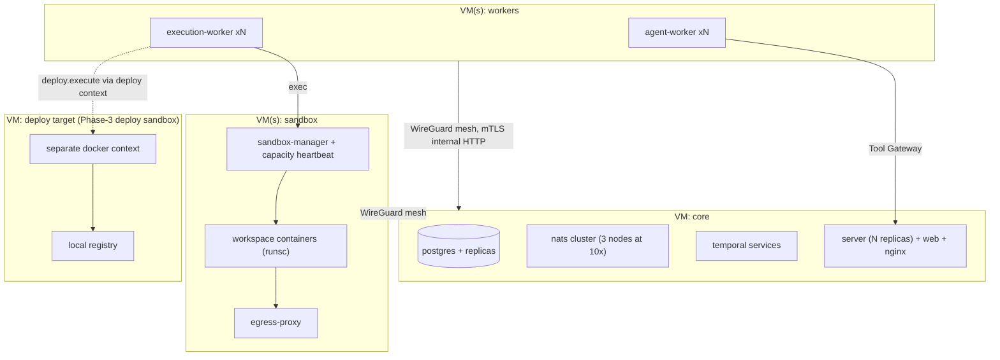

# 31 — Phase 3: Multi-Human, Hardening, Scale

Status: v1.0 — Implementation-ready

Phase 3 turns a single-operator installation into a hardened, optionally distributed platform:
multiple human users, defense-in-depth isolation (RLS, gVisor), deployment tooling for agent-built
products, the product/UX department, a platform admin plane, and the 10× scaling path. Boundary
per `_DECISIONS.md` §23; nothing here changes MVP-era domain semantics — Phase 3 adds enforcement
layers and horizontal capacity around them.

## 1. Multi-human users + OIDC

MVP auth was deliberately multi-user-shaped (A1: "auth still designed multi-user from the start"),
so this is activation, not redesign.

- **Human users** (`users` platform table, no company_id) gain per-company membership:
  `company_members (company_id, user_id, human_role)` with
  `human_role ∈ {founder, executive_viewer, department_viewer, operator, auditor}`
  [WRITER-DECISION: human-role enumeration]. Exactly one `founder` per company remains the
  terminal escalation node; additional humans can be granted approval authority for specific
  approval kinds via policy rules (e.g. a human CFO handles payment approvals), but Founder-only
  hard-coded categories (S6) stay with the founder role.
- **Human org placement:** humans may appear in the org graph as virtual nodes (like the Founder)
  via `org_edges` with `to_user_id` [WRITER-DECISION: extend the existing exactly-one-target CHECK
  to `to_agent_id | to_unit_id | to_user_id`] — enabling "human employee manages agent team"
  without ever making a human an `agents` row. Escalation-chain walks treat human nodes as
  approval-inbox stops (notification + Approval-Center-style item) rather than workflow signals.
- **OIDC (optional, per ADR-013):** `openid-client`-based Authorization Code + PKCE against any
  standard IdP; `users.identity` gains `(issuer, subject)`; local password auth remains the
  default and the fallback (self-hosted installs must never hard-depend on an external IdP).
  Session model, PATs, and TOTP are unchanged; OIDC only adds an authentication method.
- **Audit:** every human action already lands in `audit_log` (S7); Phase 3 adds per-user
  attribution in event `actor` (`{kind:"founder"|"user", id}` — `user` added as actor kind,
  versioned event change per 10-EVENT-ARCHITECTURE.md rules).

## 2. Postgres Row-Level Security (defense in depth)

App-level tenancy (repository `CompanyContext` wrapper) has been mandatory since day one
(`_DECISIONS.md` §4); Phase 3 adds RLS beneath it so a repository-layer bug cannot leak tenants.

- Every tenant-owned table gets `ENABLE ROW LEVEL SECURITY` + `FORCE` and one policy:
  `USING (company_id = current_setting('acos.company_id')::uuid)`.
- The Drizzle wrapper sets `SET LOCAL acos.company_id = $1` at transaction start from
  `CompanyContext`; platform-level code paths use a separate `acos_platform` role with `BYPASSRLS`
  restricted to enumerated modules (outbox relay, migrations, admin plane).
- Rollout: migration adds policies table-by-table behind a feature flag; CI runs the full
  integration suite twice (RLS off/on) during the transition; the two-company isolation probes
  from 29-MVP-PLAN.md become RLS-level tests (attempt cross-tenant read with a deliberately
  broken repository stub → must return zero rows).

## 3. gVisor hardening of the execution plane

ADR-009 kept plain Docker isolation for MVP; Phase 3 offers **gVisor (runsc)** as the workspace
runtime class.

- sandbox-manager gains `SANDBOX_RUNTIME=runc|runsc` (per-install) and a per-isolation-level
  override: `analysis`/`coding`/`testing`/`browser` default to `runsc` when available;
  `media` may stay `runc` for throughput (config).
- Compatibility gate: image smoke tests (`node`, `git`, package managers, Playwright) run under
  runsc in CI; incompatible tools are listed per-image and fall back with an explicit
  `workspace.runtime.downgraded` event — never silently.
- Existing S8 guarantees (no socket, dropped capabilities, allowlist egress, resource limits)
  remain; gVisor adds syscall-surface reduction against container-escape classes documented in
  34-THREAT-MODEL.md.

## 4. Distributed deployment

Path per ADR-018: single-host compose → **multi-VM compose** → optional K8s. Multi-VM is the
Phase 3 default:

- **VM roles:** `core` (postgres, nats, temporal, server, web, egress-proxy), `workers` (N×
  agent-worker, N× execution-worker), `sandbox` (sandbox-manager + workspace containers +
  egress-proxy replica). Compose files split per role
  (`infrastructure/docker/compose.core.yml`, `compose.workers.yml`, `compose.sandbox.yml`)
  sharing one `.env`; private network via WireGuard mesh [WRITER-DECISION: WireGuard for
  cross-VM transport] with mTLS on internal HTTP (upgrading MVP's `INTERNAL_API_TOKEN`).
- Workers are stateless (02-SYSTEM-CONTEXT.md §3): scaling = adding worker VMs pointed at the
  same `TEMPORAL_ADDRESS`/`NATS_URL`/`DATABASE_URL`. sandbox-manager instances register a
  `capacity` heartbeat row; execution-worker picks a manager by workspace placement (sticky per
  workspace).
- **Optional K8s** only if fleet size demands it: Helm chart mapping 1:1 from compose services;
  no architectural change (all coordination already flows through Postgres/NATS/Temporal).

## 5. Deploy-level sandbox + production deployment tooling

Agent-built projects become deployable by agents, safely:

- New isolation level **`deploy`** (`_DECISIONS.md` §13): image `acos/workspace-deploy` with
  docker CLI pointed at a **separate deploy Docker context** (dedicated deploy VM or rootless
  daemon) — never the platform's socket (S1 untouched). Egress allowlist: registry + target hosts.
- **Deployment domain:** `deployments` (id, company_id, project_id, environment
  (`staging|production`), strategy (`compose_up|image_push|script`), status
  (`planned → deploying → live ⇄ degraded → rolled_back|retired`), version_ref (git tag/sha),
  health_url, decided_by) [WRITER-DECISION: deployments state machine — additive, not in §19].
- Tools: `deploy.plan` (R1), `deploy.execute` staging (R2), `deploy.execute` production (**R3**,
  and "destructive production actions" remain hard-coded Founder-approval, S6),
  `deploy.rollback` (R2, pre-authorized by standing policy so agents self-heal).
- Pipeline: DevOps-agent workflow `deploymentWorkflow` — build image in `testing` workspace →
  push to local registry (`registry` service added to compose) → health-gated rollout → monitor
  via health checks + log tail → auto-rollback on failed gates, emitting
  `deployment.status.changed` events consumed by the office/monitors like any others.

## 6. Product/UX department activation

The third department (after engineering, marketing) per `_BRIEF.md` §7: CPO, product managers, UX
researcher, product analyst. Org template + activation mirrors 30-PHASE-2.md §1. Capabilities:

- **Product analytics ingestion:** the Phase-2 `metric_snapshots` + ingestion pattern extended
  with a product-analytics adapter port (PostHog/Plausible self-hosted adapters first
  [WRITER-DECISION]) covering funnels, retention, drop-off.
- Product agents monitor analytics/funnels/support/competitors and **proactively file** initiatives
  and tasks through the normal hierarchy (CPO → EM handoff), never pinging the Founder for routine
  product decisions; experiments reuse the Phase-2 engine.
- Greenfield flow CEO → CPO → Architect → EM → Devs → QA → DevOps → CMO (`_BRIEF.md` §6) becomes
  fully active once CPO exists; 14-PROJECT-RUNTIME.md's intake routing adds CPO/CMO targets.

## 7. Platform admin plane

Cross-company administration for the installation operator (distinct from any company's Founder
role): `platform_admin` flag on `users`.

- Views: installations health (workers, queues, DLQ depth), model providers + key rotation,
  per-company resource/cost overview, user management, feature flags (RLS, gVisor, profiles),
  `dead_events` triage, backup/restore controls (27-INFRASTRUCTURE.md procedures surfaced in UI).
- API namespace `/api/v1/admin/*` guarded by platform RBAC; every action audited. Admin reads
  cross-company aggregates through the `acos_platform` role (§2) — the only sanctioned cross-tenant
  read path.

## 8. Scaling path: `_BRIEF.md` §10 targets → 10×

Baseline envelope: 10 companies, 100 agents/company, 30 concurrent, millions of events. 10× target:
100 companies / 300 concurrent agents / tens of millions of events per installation, reached by
scaling each concern independently — no architectural rewrites:

| Concern | Baseline mechanism | 10× lever |
|---|---|---|
| Postgres reads (UI, working sets, observatory) | single instance | **Read replicas** + repository read/write split (replica-lag-tolerant reads flagged per query); PgBouncer in front |
| Postgres writes (events, steps) | single instance | Partition `events`, `agent_steps`, `cost_entries`, `metric_snapshots` by month (pg_partman); archive cold partitions to `/data/archive`; write volume at 10× (~50–100 events/s) remains single-writer-friendly |
| Vector search | HNSW per dimension | Per-company partial indexes; move consolidation embedding to batch windows |
| NATS | single server | **3-node JetStream cluster**, R3 replicated streams; per-company subject namespaces already shard cleanly |
| Temporal | auto-setup single node | Split frontend/history/matching/worker services (supplied compose file), Temporal's own Postgres on the replica-backed cluster; namespace per installation stays single |
| Agent/execution workers | N per VM | **Worker pools per company tier:** dedicated Temporal task queues `agent-tasks.<companyId>` for heavy companies, wildcard pool for the rest — noisy-neighbor isolation without new infrastructure [WRITER-DECISION: per-company task-queue sharding scheme] |
| Sandboxes | one sandbox VM | Multiple sandbox VMs with capacity heartbeats (§4); workspace placement by least-loaded |
| WS fan-out | server process | Multiple `server` replicas behind nginx; WS gateway consumers are JetStream durable consumers per replica; per-company seq replay is stateless, so any replica can serve any client |
| Ops guardrails | budgets, circuit breakers | Platform-level concurrency caps per company (max concurrent workflows), enforced at workflow-start via policy |

Explicit non-goals at 10×: no sharded Postgres, no Kafka, no microservice decomposition — measured
load must justify anything beyond this table (ADR-002/003/006 discipline).

## 9. Marketplace / MCP tool adapters

Per ADR-017, external tools become pluggable without touching the core:

- **MCP client support** in the integrations module: an `mcp_servers` table (company-scoped:
  name, transport (`stdio|http`), endpoint/command, allowed_tools[], credential ref). On
  connection, discovered MCP tools are wrapped into `packages/tools`-shaped definitions with a
  **mandatory manual risk classification step** (unclassified tools default to R3 and are
  therefore approval-gated) and normal `tool_permissions` grants. All MCP calls flow through the
  Tool Gateway like native tools — S3 holds; MCP servers run as sandboxed containers (stdio
  transport) or allowlisted egress targets (http).
- **Adapter marketplace (in-product catalog):** a curated JSON index of adapter packages
  (social platforms, analytics, media, MCP server recipes) installable per company; each entry
  declares tools, risk classes, required scopes, and credential needs, rendered as a review screen
  before enablement. Distribution mechanics (registry hosting, signing) follow platform
  monetization decisions that are out of scope (A10); the in-product catalog reads a static index
  URL by default.

## 10. Schema and event additions (all additive)

Phase 3 touches no existing table shapes; it adds: `company_members`, `org_edges.to_user_id`
(CHECK extended), `mcp_servers`, `deployments`, sandbox capacity heartbeat rows, and RLS policies.
New events (registered in `packages/events` per 10-EVENT-ARCHITECTURE.md rules):
`user.invited`, `user.role.changed`, `deployment.status.changed`, `workspace.runtime.downgraded`,
`mcp.server.connected`, `mcp.tool.classified`, `platform.flag.changed`. Event `actor.kind` gains
`user` as a versioned, additive change; consumers declare handled versions.

## 11. Phase-3 risks & mitigation

| Risk | Impact | Mitigation |
|---|---|---|
| RLS + app-layer double enforcement causes subtle query breakage | Broken reads under flag | Dual-run CI (RLS off/on) during rollout (§2); GUC set in one place (Drizzle wrapper), never ad hoc |
| gVisor incompatibility with workspace tooling | Broken builds/tests | Per-image runsc smoke suite; explicit `workspace.runtime.downgraded` fallback, never silent |
| Multi-VM networking failures partition workers from core | Stalled work | Temporal tolerates worker loss by design; WireGuard keepalives + worker health in admin plane; sandbox stickiness re-placement on heartbeat loss |
| Human approval delegation weakens the Founder gate | Authority leakage | S6 categories hard-locked to founder role in code; delegation is per-approval-kind policy rows, fully audited |
| Deploy sandbox reaches platform infrastructure | Blast radius | Separate docker context/VM only; deploy egress allowlist excludes core VM addresses; production deploys always Founder-gated |
| MCP tools with mis-declared behavior | Unsafe tool surface | Unclassified ⇒ R3 default; per-tool grants still required; MCP servers sandboxed; all calls through gateway (S3) |

## 12. Phase-3 milestones

| | Scope | Definition of Done |
|---|---|---|
| P3-M1 Multi-human + OIDC | company_members, human roles, human org nodes, OIDC option, actor kind `user` | Second human approves a delegated approval kind; founder-only categories still founder-locked; audit complete |
| P3-M2 RLS | Policies on all tenant tables, `acos.company_id` GUC wiring, platform role | Full suite green with RLS forced; broken-repository probe leaks zero rows |
| P3-M3 gVisor + deploy sandbox | runsc runtime class, deploy level, deployment domain + workflow, local registry | Workspace escape tests pass under runsc; staging deploy + auto-rollback demo; production deploy hard-gates on Founder |
| P3-M4 Distributed | Multi-VM compose, WireGuard/mTLS, sandbox capacity placement, optional Helm chart | 3-VM install passes the full MVP + Phase-2 suites; kill a worker VM mid-run → resumption |
| P3-M5 Scale + admin + marketplace | §8 levers behind flags, admin plane, MCP client + catalog | Load test at 10× synthetic event/agent volume meets p95 targets in 25-OBSERVABILITY.md; admin DLQ triage demo; one MCP server integrated end-to-end through the gateway |
