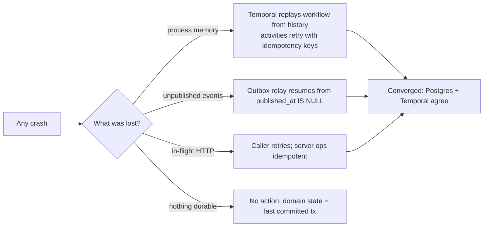

# 33 — Failure Modes & Recovery

Status: v1.0 — Implementation-ready

Reliability doctrine (brief §2.9, _DECISIONS.md §8–9): domain truth lives in Postgres; work
progress lives in Temporal; events are at-least-once with idempotent consumers; every automated
response has a human-visible surface. This catalog gives, for **every failure class**, the
detection signal, the automatic response, what the Founder sees, and the runbook step. Metrics
referenced are defined in 25-OBSERVABILITY.md §2.4; alerts in §3.

Watchdog constants **[WRITER-DECISION — defaults, all env-tunable]**:
`STUCK_NO_STEP_T = 10 min` (agent session with running workflow, no new step),
`WAITING_WATCHDOG_T = 30 min` (task WAITING with unresolved deps),
`STARVATION_AGE_T = 24 h` (ASSIGNED/PLANNED tasks aging), `HEARTBEAT_T = 60 s`.

---

## 1. First-principles recovery model

Nothing important exists only in RAM. Recovery is therefore always "restart the process; durable
layers replay/resume" — the sections below only describe what happens in the gap.

## 2. Failure catalog

### 2.1 Worker crash (agent-worker / execution-worker, incl. kill -9)
- **Detection:** `acos_heartbeat_timestamp` stale (ProcessDown alert); Temporal
  schedule-to-start latency rises on its queues; Docker restart count.
- **Automatic:** compose `restart: unless-stopped` relaunches; Temporal reassigns pending
  activities after their heartbeat/StartToClose timeout; workflows replay deterministically;
  activities with idempotency keys (§3) do not double-apply.
- **Founder sees:** brief agent "no progress" gap; Agent Monitor sessions stay `running`.
- **Runbook:** if restart-looping — logs by `svc`, roll back image (27-INFRASTRUCTURE.md §7).

### 2.2 Workflow crash (unhandled workflow-code error / non-determinism)
- **Detection:** Temporal WorkflowFailed / NondeterminismError metrics + Temporal Health panel;
  `agent_sessions.status='failed'`.
- **Automatic:** task→BLOCKED via failure handler (finally-style), `agent.session.ended` (status=failed) event,
  manager notified (help-request message) to reassign or retry; replay-determinism CI
  (32-TESTING-STRATEGY.md §3) makes this class rare.
- **Founder sees:** nothing (manager handles), unless manager escalates per chain.
- **Runbook:** inspect history in Temporal UI; if non-determinism after deploy → roll back
  worker, patch with versioning API.

### 2.3 App restart mid-work (server or workers, deploy/upgrade)
- **Detection:** deploy event; WS clients disconnect.
- **Automatic:** WS clients reconnect + `resume after_seq` (exact replay, 22-REALTIME-
  ARCHITECTURE.md); relay leadership re-acquired via advisory lock; Temporal continues; migration
  lock orders schema change before workers poll (27-INFRASTRUCTURE.md §7).
- **Founder sees:** sub-second UI "reconnecting" toast; zero lost timeline events.
- **Runbook:** none — this is the designed upgrade path.

### 2.4 Host restart
- **Detection:** all heartbeats stale; boot event.
- **Automatic:** compose `restart` policies bring the full stack up in dependency order;
  workspace containers are gone → sandbox-manager reconciles on boot: `workspaces` rows in
  `in_use/ready` without a live container → re-provision from bare repo + branch (worktree is
  reconstructible; uncommitted changes in a crashed workspace are lost — mitigated by the
  runtime's auto-WIP-commit after each successful tool step, 14-PROJECT-RUNTIME.md).
- **Founder sees:** downtime banner until server healthy; sessions resume.
- **Runbook:** verify `/data` mounted before compose starts (systemd unit dependency).

### 2.5 Duplicate events
- **Detection:** by design (at-least-once relay + JetStream redelivery); redelivery counter.
- **Automatic:** consumers dedupe on event id (processed-ids unlogged table / unique side-effect
  keys); WS clients dedupe on `seq`. No duplicate is ever user-visible.
- **Runbook:** persistent redeliveries on one type → see poison messages §2.15.

### 2.6 Network partition to LLM provider
- **Detection:** `acos_llm_errors_total{kind=timeout|5xx}` spike; LLMProviderDown alert.
- **Automatic:** ModelRouter fallback chain (_DECISIONS §17): retry ladder then next provider
  (§2.7); if **all** providers unreachable → degraded mode NO-LLM (§4): sessions park in
  `waiting`, timer-based re-probe every 2 min with jitter; no task fails because of a partition.
- **Founder sees:** UI banner "LLM providers unreachable — agents paused", Agent Monitor shows
  WAITING.
- **Runbook:** check egress/DNS from host; verify provider status pages; optionally flip company
  profile to Ollama offline profile.

### 2.7 LLM timeout / 429 — retry ladder & fallback
- **Ladder (per call, in the ModelRouter adapter):** timeout 120s (reasoning/coding) / 30s
  (fast/embedding); retries on timeout/5xx: 3 attempts, exp backoff 2s→8s→30s + jitter; on 429:
  honor `retry-after` (cap 60s), 2 attempts, then **fallback to next provider in the purpose
  chain** (records `llm_calls.fallback_from`); chain exhausted → activity fails → Temporal
  activity retry (backoff 1m→5m→15m, max 6) keeps the workflow alive; then §2.6 parking.
- **Founder sees:** nothing below chain-exhaustion; latency only.

### 2.8 External API rate limits (GitHub, web fetch, Phase-2 socials)
- **Detection:** adapter-level 429 counters per integration.
- **Automatic:** token-bucket client-side limiter per integration (config in adapter); on 429
  backoff + honor headers; tool returns typed `rate_limited` result → agent loop treats as
  `wait_for(timer)` not failure (no failure-memory noise).
- **Runbook:** raise limits/keys in Settings → Integrations.

### 2.9 Partial tool failure (tool ran, side effect uncertain)
- **Detection:** gateway records `tool_invocations.status='unknown'` on transport
  timeout after dispatch.
- **Automatic:** R0/R1 idempotent tools (§3) safely re-execute. Non-idempotent (rare R2: e.g.
  external POST) → gateway performs **read-back verification** where the tool defines a verifier
  (e.g. git push → ls-remote the ref); no verifier → invocation marked `needs_verification`,
  agent receives structured uncertainty result and must verify or escalate (this is a prompt-level
  contract in the tool result schema).
- **Founder sees:** nothing; audit trail shows the uncertain invocation.

### 2.10 sandbox-manager down
- **Detection:** its heartbeat + gateway dispatch errors; `acos_workspace_count` frozen.
- **Automatic:** compose restarts it (fast, stateless — reconciles containers from Docker + DB
  labels on boot). During the gap: workspace ops **queue** as Temporal activity retries
  (execution-worker activities against it retry with backoff up to 15 min); agent loop degrades:
  steps needing sandbox tools park (`wait_for`), non-sandbox actions (messaging, planning,
  reviews of diffs already in PG) continue.
- **Founder sees:** Terminals view "execution temporarily unavailable" chip; office continues.
- **Runbook:** check Docker daemon health first (it's the usual root cause).

### 2.11 NATS down
- **Detection:** relay publish errors; `acos_outbox_lag_seconds` climbs (OutboxLagHigh); WS
  gateway consumer disconnects.
- **Automatic:** **outbox buffers everything** — events keep committing with `published_at NULL`;
  relay retries with backoff and resumes the backlog in `seq` order on reconnect; JetStream
  durable consumers resume from their ack floor; WS clients meanwhile fall back to short-poll of
  the events API (gateway auto-switch) so the timeline stays live-ish; terminal frames (ephemeral)
  are lost for the gap except the ring buffer + file log.
- **Founder sees:** at worst a delayed office/timeline; a "realtime degraded" chip.
- **Runbook:** restart NATS; verify `/data` JetStream store disk.

### 2.12 Postgres down — full stop
- **Detection:** every service's health check fails; ProcessDown-class alert.
- **Automatic:** **full stop by design** — no writes can be accepted safely; server returns 503;
  workers' activities fail-fast and Temporal pauses retries (activities also can't record).
  Temporal server itself shares the PG instance → it stops too, which is consistent (nothing can
  progress anyway). All processes crash-loop politely with backoff until PG returns; then: relay
  drains outbox, Temporal resumes workflows, WS clients replay.
- **Founder sees:** full-page "system unavailable" state.
- **Runbook (recovery):** 1) check disk (§2.17 is the top cause) and PG logs; 2) start postgres
  alone; run `pg_isready`; 3) if corrupt → restore latest dump (27-INFRASTRUCTURE.md §6),
  accept RPO = last backup for domain data (Temporal histories restored to same point —
  consistent because same instance); 4) `docker compose up -d`; 5) verify Event Pipeline panel
  drains; 6) spot-check newest `events.seq` continuity per company.

### 2.13 Temporal down (server or its schema)
- **Detection:** worker poll errors; Temporal Health dashboard dark; schedule-to-start ∞.
- **Automatic:** **agents pause** — no steps execute; domain reads/writes, comms UI, approvals,
  timeline all keep working (server doesn't need Temporal for reads); message delivery to active
  agents queues (signals fail → messages persist in PG regardless, delivered on recovery by the
  inbox reconciler sweep).
- **Founder sees:** **UI banner "Agent execution paused (workflow engine unavailable)"**; Agent
  Monitor cards freeze in last state with a stale badge.
- **Runbook:** restart temporal container; auto-setup re-checks schema; workers reconnect
  automatically; verify a canary workflow (`system.healthcheckWorkflow`) completes.

### 2.14 Agent behavioral failures (guards, _DECISIONS §8)
| Mode | Detection (guard) | Automatic response | Surface |
|---|---|---|---|
| Stuck in loop | (d) action-hash ≥3 in last 6 steps | forced `request_help` to manager; step budget note | `agent.guard.triggered`, Monitor badge |
| Infinite delegation | (f) depth >5 goal→subtask | delegation refused at creation; manager must restructure | task creation error + manager message |
| Message ping-pong | (e) >8 alternating msgs, same pair/thread, no task-state change | manager notification thread opened; pair's `wait_for(reply)` gets cooldown timer | escalation channel entry |
| Reassignment churn | >3 reassignments | forced manager intervention (_DECISIONS §7) | task history |

### 2.15 Deadlock between waiting tasks
- **Detection:** **dependency-cycle detector**: `task_dependencies` is cycle-checked on write
  (DAG invariant), so true graph cycles cannot be created; runtime deadlock = mutual `wait_for`
  at the *runtime* level (A waits reply from B, B waits dependency owned by A). Watchdog cron
  (agent-worker, every 5 min) finds tasks `WAITING > WAITING_WATCHDOG_T`, builds the wait-for
  graph (task deps + pending reply targets from `wait_for` payloads), runs cycle detection.
- **Automatic:** cycle found → creates a **manager task** ("resolve wait cycle: TASK-81 ⇄
  TASK-90") assigned to the lowest common manager in the reports_to forest, with the cycle
  explanation; participants get a `managerDirective` nudge.
- **Founder sees:** nothing unless the manager escalates.
- **Runbook:** none normally; manager UI shows the cycle graph (Cytoscape).

### 2.16 Task starvation & stuck-agent detection
- **Starvation:** tasks in BACKLOG/PLANNED/ASSIGNED older than `STARVATION_AGE_T` get an **aging
  boost**: effective priority raised one level per period (P3→P2→…, capped P1 automatically; P0
  is human/manager-set only) in the delegation engine's ranking; managers see an "aging" lane.
- **Stuck agent (system-level, distinct from loop guard):** watchdog: session `running` and
  `HEARTBEAT` fresh but **no new `agent_steps` row for `STUCK_NO_STEP_T`**, or heartbeat stale
  with workflow open → session flagged `stalled` (`acos_agent_sessions_stuck` gauge, StuckAgents
  alert), `agent.session.stalled` event → **manager notified** with context (last step, pending
  activity, trace link). Manager actions: nudge signal, pause, reassign.
- **Founder sees:** stalled badge on Agent Monitor; StuckAgents alert if operator.

### 2.17 Poison messages (event consumers)
- **Detection:** JetStream max deliveries (5) exceeded → DLQ subject.
- **Automatic:** DLQ consumer writes `dead_events` row (event id, consumer, error, payload
  snapshot) + DeadLetterEvents alert; consumer advances (no head-of-line blocking).
- **Runbook:** fix consumer bug → replay tool `pnpm ops replay-dead-events --consumer X`
  (re-publishes from events table by id; idempotency makes replay safe).

### 2.18 Disk full
- **Detection:** DiskLow alert at 15%/10% free per `/data/*` volume; PG "no space" errors are the
  too-late signal.
- **Automatic (preventive):** retention jobs — terminal logs >7d deleted; workspace GC destroys
  `merged/discarded` workspaces immediately and `idle > 48h` ones (state machine _DECISIONS §19);
  llm payloads >30d purged (25-OBSERVABILITY.md §4); `dead_events` >90d archived. At 10% free:
  sandbox-manager **refuses new workspace creation** (`workspace.creation.deferred` event) —
  graceful degradation before PG is threatened.
- **Founder sees:** low-disk banner (operator surface), deferred-workspace chips.
- **Runbook:** grow disk / prune Docker images (`docker system prune`) / verify GC ran.

### 2.19 Clock skew
- **Detection:** startup cross-check: each service compares its clock to Postgres `now()` at
  boot and hourly; skew >5s → `system.clock.skew` warning event, >60s → service refuses to start.
- **Automatic:** ordering never depends on wall clocks: event order = per-company `seq`
  (PG-assigned), workflow timing = Temporal's clock, `occurred_at` set by PG `now()` in the
  outbox tx. Budgets/deadlines evaluate against PG time.
- **Runbook:** enable NTP/chrony on host (hardening checklist, 27-INFRASTRUCTURE.md §10).

## 3. Idempotency & retry matrix (per operation class)

| Operation class | Idempotency mechanism | Retry policy (Temporal unless noted) |
|---|---|---|
| Domain write activities (task transition, message insert) | idempotency key `(workflowId, stepNo, opName)` unique index; replay = no-op | 5× backoff 1s→60s |
| LLM call activity | key on step; result persisted in `llm_calls` before return — replay returns stored result | ladder §2.7 inside activity; activity retry 6× |
| Tool via gateway | `Idempotency-Key` header = invocation uuid; gateway dedupes on `tool_invocations` | R0/R1: retry 3×; R2: **no auto-retry**, needs_verification path §2.9 |
| Sandbox exec | exec id; re-exec allowed only for read-only cmds, else status check first | 3× only for provisioning ops |
| Event publish (relay) | `published_at` marker; publish is at-least-once | infinite backoff (capped 30s) |
| Event consume | dedupe on event id | JetStream redelivery ×5 → DLQ |
| Workflow start | `workflowId = agent-task-<taskId>` (dedupe policy: reject-duplicate) | caller retries safely |
| Migrations / seed | advisory lock + version table / slug key | manual |

## 4. Graceful-degradation modes

| Mode | Trigger | Behavior | Exit |
|---|---|---|---|
| NO-LLM-PROVIDER | all provider chains exhausted | sessions park WAITING; comms/UI/approvals fully live; probe every 2 min | first successful probe |
| OFFLINE (Ollama-only profile) | operator config (_DECISIONS §0 A3) | local models via ModelRouter; embeddings 768d; no web tools (gateway denies network scope); slower, functional | config change |
| REALTIME-DEGRADED | NATS down §2.11 | outbox buffers; UI short-polls; terminals ring-buffer only | NATS back, lag drains |
| EXECUTION-DEGRADED | sandbox-manager/Docker down §2.10 | planning/comms/review continue; sandbox steps queue | service back |
| LOW-DISK | <10% free | no new workspaces; GC aggressive; PG protected | space freed |
| BUDGET-FROZEN | company circuit breaker | only critical agents (26-COST-MANAGEMENT.md §5) at fast-model caps | budget restored/period reset |
| READ-ONLY-DB-GONE | Postgres down §2.12 | full stop, 503 | PG restored |

## 5. Chaos-testing plan (kill -9 matrix, extends 09-WORKFLOW-ENGINE.md scenarios)

Nightly job on the E2E compose stack (scripted LLM), running scenario 06 (implementation) while a
chaos driver injects, one per run; assertion after each: master E2E still reaches DONE, no
duplicate side effects, no lost timeline events (`seq` continuity check), all invariants in §1.

| # | Injection | Primary assertion |
|---|---|---|
| C1 | `kill -9` agent-worker mid-LLM-activity | step not duplicated (idempotent key), workflow resumes |
| C2 | `kill -9` execution-worker mid-`npm test` | exec re-attached or re-run; single tool_invocations outcome |
| C3 | `kill -9` server (relay) between commit & publish | event published exactly-once-effectively after restart |
| C4 | `docker stop nats` 120s | outbox drains in order; consumers no gaps/dupes |
| C5 | `docker stop temporal` 120s | banner shows; agents resume; no task corruption |
| C6 | `docker kill postgres` (then start) | full-stop then converged recovery §2.12 |
| C7 | `docker rm -f` a workspace container | reconcile re-provisions; WIP commit preserved |
| C8 | Toxiproxy: LLM endpoint 100% timeout 5 min | fallback → parking → auto-resume |
| C9 | Fill `/data/workspaces` to >90% | creation deferred event; GC recovers |
| C10 | Duplicate-deliver 1k random events | zero duplicate side effects |

### 5.1 Chaos harness details

The chaos driver is a small script (`tools/chaos/run.ts`) that: (1) boots the E2E compose stack
and starts scenario 06 via the API; (2) waits for a mid-work marker event
(`task.status.changed → IN_PROGRESS` on the demo task); (3) injects exactly one fault from the
matrix (via `docker kill/stop/rm`, Toxiproxy for network faults C8, and a tmpfs filler for C9);
(4) waits for recovery signals (heartbeats fresh, outbox lag 0); (5) runs the invariant checks:
`seq` continuity per company (no gaps in `events`), side-effect uniqueness (count queries with
expected exact values), workflow completion, and the Playwright completion assertions from
scenario 11. Each matrix row is one CI job; a red row files an issue with the full compose logs
and the Temporal history export attached. The matrix is additive — every new failure class fixed
in production gets a chaos row reproducing it before the fix merges.

## 6. Detection → surface summary (operator quick reference)

| Failure | Metric/alert (25-OBSERVABILITY.md) | Domain event | Founder-visible surface |
|---|---|---|---|
| Worker/process down | ProcessDown | — | none (self-heals) |
| Outbox/NATS trouble | OutboxLagHigh | — | "realtime degraded" chip |
| DLQ arrival | DeadLetterEvents | `event.dead_lettered` | operator only |
| LLM providers down | LLMProviderDown | `system.llm.unavailable` | banner + WAITING agents |
| Temporal down | TemporalBacklog/poll errors | `system.execution.paused` | banner "agent execution paused" |
| Budget breach | BudgetBreach | `budget.exceeded` | Costs view + notification |
| Stuck agent | StuckAgents | `agent.session.stalled` | Monitor badge, manager notified |
| Guard trips | — (product-level) | `agent.guard.triggered` | Monitor badge, manager thread |
| Wait-cycle deadlock | — | `task.wait_cycle.detected` | manager task created |
| Disk low | DiskLow | `workspace.creation.deferred` | low-disk banner |
| Clock skew | — | `system.clock.skew` | operator only |

Design rule this table enforces: **every automated response leaves a durable trace** (event row
and/or audit row) — silent self-healing is allowed, invisible failure is not.

## 7. Runbook index

Ordered by likelihood at MVP scale: 1) LLM provider incident §2.6–2.7 (weekly-ish),
2) disk pressure §2.18 (monthly), 3) stuck/looping agents §2.14/§2.16 (weekly early on, should
decay as prompts/guards tune), 4) poison messages §2.17 (after event-schema changes),
5) sandbox/Docker issues §2.10, 6) full restarts §2.3–2.4 (routine, zero-drama by design),
7) Postgres incidents §2.12 (rare; the only class with potential data loss — bounded by backup
RPO). Each section above is written to be followed under stress: detection first, then what the
system already did, then the single next command.

## 8. Cross-references

- Guard implementations & workflow branches: 08-AGENT-RUNTIME.md, 09-WORKFLOW-ENGINE.md
- Outbox/relay/DLQ details: 10-EVENT-ARCHITECTURE.md; WS resume: 22-REALTIME-ARCHITECTURE.md
- Alerts/metrics/playbooks: 25-OBSERVABILITY.md; budgets & circuit breaker: 26-COST-MANAGEMENT.md
- Backup/restore & hardening: 27-INFRASTRUCTURE.md; test harnesses reused for chaos:
  32-TESTING-STRATEGY.md
