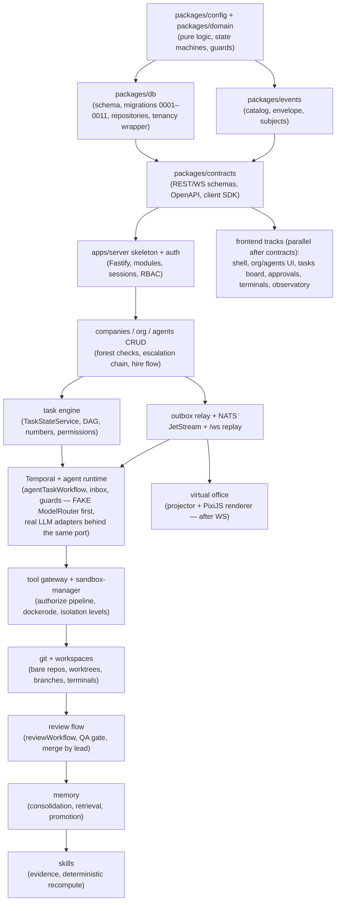

# 35 — CLAUDE CODE HANDOFF

Status: v1.0 — Implementation-ready · This file is the entry point for implementation.

This is the final document of the architecture package. It tells an implementation team (human or
Claude Code) exactly what to build, in what order, with which acceptance checks — with **zero
redesign**. Everything here is derived from `_DECISIONS.md` (binding) and docs 00–34; nothing is
newly decided. When this file compresses a topic, the referenced doc is the full specification.

---

## 1. Exact recommended stack (normative)

From `_DECISIONS.md` §1. Do not substitute anything without an ADR revision.

| Concern | Choice | Version / detail |
|---|---|---|
| Language | **TypeScript** (strict) on **Node.js 22 LTS** | one language everywhere; `tsconfig.base.json` strict flags per 28 §5 |
| Monorepo | **pnpm workspaces + Turborepo** | pnpm 9.x via corepack |
| HTTP (control plane) | **Fastify 5** + **Zod** (`fastify-type-provider-zod`), OpenAPI generated | REST + WebSocket; no GraphQL, no tRPC |
| Database | **PostgreSQL 16** + **pgvector** | the ONLY database: domain state, events, memory, vectors |
| ORM / migrations | **Drizzle ORM + drizzle-kit** | SQL-first, migrations committed in `packages/db/migrations` |
| Durable workflows | **Temporal** (self-hosted, TypeScript SDK) | namespace `acos`; agent loop, consolidation, intake, review |
| Event distribution | **Postgres transactional outbox** → relay → **NATS JetStream** | `events` table is source of truth; NATS 2.10 (`-js`) |
| Cache / locks | **Postgres** (advisory locks, unlogged tables) | **No Redis in MVP** |
| LLM abstraction | Own **`ModelRouter`** port; adapters on **Vercel AI SDK v5** | Anthropic, OpenAI, OpenRouter, Ollama/vLLM (OpenAI-compat) |
| Agent framework | **NONE** — own Temporal workflow loop | ADR-004; CrewAI/LangGraph/MetaGPT/OpenHands rejected |
| Sandboxing | **Docker** via `sandbox-manager` (dockerode), git worktrees, egress allowlist proxy | gVisor optional Phase 3 |
| Frontend | **React 19 + Vite + TanStack Router + TanStack Query + Zustand + Tailwind CSS** | desktop-like SPA |
| Office renderer | **PixiJS v8** | driven only by projector instructions |
| Graphs | **Cytoscape.js** (+ dagre/fcose) | org chart, memory graph, task DAG |
| Terminal UI | **xterm.js** | live PTY frames from NATS |
| Charts | **Recharts** | cost/skill dashboards |
| Realtime | **WebSocket** single endpoint `/ws`, per-company monotonic seq + replay | SSE rejected |
| AuthN | Cookie sessions (HttpOnly, SameSite=Lax), **Argon2id**, optional TOTP, PATs | no third-party IdP; OIDC Phase 3 |
| AuthZ | RBAC (platform roles) + own DB-backed **policy engine** + autonomy matrix | OPA rejected |
| Secrets | libsodium sealed boxes, master key from env/OS keyring | `secrets` table |
| Observability | **pino** → stdout, **OpenTelemetry**; optional Grafana/Loki/Tempo/Prometheus compose profile | in-app dashboards read Postgres |
| Testing | **Vitest**, **Testcontainers** (PG/NATS/Temporal), **Playwright** | fake ModelRouter in CI (§14) |
| Embeddings | via ModelRouter: OpenAI `text-embedding-3-small` (1536d); offline Ollama `nomic-embed-text` (768d) | dimension stored per memory row; HNSW per active dimension |
| IDs | **UUIDv7** everywhere | per-company human-readable sequences (`TASK-81`, `employee_number`) |

## 2. Exact repository structure

From `_DECISIONS.md` §3 and 28-REPOSITORY-STRUCTURE.md. Workspace scope: `@acos/*`.

```
agent-company-os/
├── apps/
│   ├── server/            # control-plane monolith (Fastify)
│   └── web/               # React SPA
├── workers/
│   ├── agent-worker/      # Temporal: agent loop, delegation, memory, intake
│   └── execution-worker/  # Temporal: sandboxed tool activities
├── services/
│   └── sandbox-manager/   # Docker-socket owner, PTY streaming
├── packages/
│   ├── domain/            # PURE domain: entities, value objects, state machines, policies (no IO)
│   ├── db/                # Drizzle schema + migrations + repositories
│   ├── events/            # event catalog: Zod schemas, types, versioning helpers
│   ├── contracts/         # API Zod schemas, OpenAPI gen, typed client SDK
│   ├── llm/               # ModelRouter port + provider adapters + prompt assembly
│   ├── tools/             # tool definitions (schemas, risk classes) shared by gateway & runtime
│   ├── config/            # env parsing (Zod), shared constants
│   └── ui/                # shared React components/design system
├── infrastructure/
│   ├── docker/            # Dockerfiles, compose files, egress-proxy config
│   └── grafana/           # optional observability provisioning
├── docs/                  # this architecture package (+ docs/adr/)
├── turbo.json
├── pnpm-workspace.yaml
├── .env.example
├── eslint.config.mjs      # flat config incl. eslint-plugin-boundaries
├── tsconfig.base.json
└── package.json           # root scripts only (turbo run …)
```

One-line responsibilities (full spec: 28 §2):

- **`@acos/domain`** — pure entities, value objects, canonical state machines, guards, autonomy
  matrix, promotion/scoring rules; zero runtime deps, zero IO.
- **`@acos/db`** — Drizzle schema for every table in doc 20, migrations, one repository per
  aggregate, the `CompanyContext` tenancy wrapper, `withOutbox(tx, event)`, advisory-lock helpers.
- **`@acos/events`** — the 189+1 event catalog as Zod schemas, `EventEnvelope`, `defineEvent()`,
  version helpers, NATS subject builders `subjectFor(companyId, type)`.
- **`@acos/contracts`** — REST + WS protocol Zod schemas, OpenAPI generation, generated typed
  client SDK (`@acos/contracts/client`) — the frontend's only server knowledge.
- **`@acos/llm`** — ModelRouter port + resolution (purpose → binding → profile → fallback), AI SDK
  provider adapters, prompt assembly with S5 provenance markers, token counting, embedding client.
- **`@acos/tools`** — tool *definitions only* (name, Zod IO, risk class R0–R3, scopes, cost
  estimator, isolation level); no execution code.
- **`@acos/config`** — `loadConfig(processEnv)` Zod-validated env, shared constants (queue names,
  subject prefixes, default budgets).
- **`@acos/ui`** — Tailwind preset + primitives (Button, Card, Dialog, DataTable, StatusPill) +
  domain widgets (AgentAvatar, RiskBadge, MoneyText, EventRow); no data fetching.
- **`@acos/server`** — Fastify modular monolith, one module dir per domain area
  (`companies,org,agents,tasks,projects,memory,skills,comms,approvals,policies,costs,events,
  tool-gateway,realtime,office-projector,auth`), outbox relay, WS gateway, Tool Gateway HTTP.
- **`@acos/web`** — the SPA; depends on `contracts` + `ui` **only**.
- **`@acos/agent-worker`** — Temporal worker for queues `agent-tasks`, `memory`, `intake`:
  `agentTaskWorkflow`, `agentInboxWorkflow`, `reviewWorkflow`, `memoryConsolidationWorkflow`,
  `projectIntakeWorkflow`; LLM/DB/messaging activities.
- **`@acos/execution-worker`** — activities-only Temporal worker for the execution queue
  (`runCommandActivity`, `gitOperationActivity`, `runTestsActivity`, `buildActivity`); talks only
  HTTP to sandbox-manager; **no `db` dependency**.
- **`@acos/sandbox-manager`** — the only Docker-socket process: workspace container lifecycle,
  worktree volume provisioning, PTY exec, NATS frame publishing, resource limits.

## 3. Service boundaries (5 deployable units)

From `_DECISIONS.md` §2 and 02-SYSTEM-CONTEXT.md §3. Modular monolith + specialized workers — NOT
microservices (ADR-002).

| # | Unit | MAY | MAY NOT |
|---|---|---|---|
| 1 | `apps/server` | Own all domain state in Postgres; serve REST + `/ws`; run the leader-elected outbox relay; authorize every tool call (Tool Gateway); project office instructions | Touch the Docker socket; execute sandboxed work itself; call LLMs in-request (LLM calls live in agent-worker activities) |
| 2 | `apps/web` | Render from the generated SDK + WS stream; send commands via REST | Hold authoritative state; animate the office except from projector instructions; import anything but `@acos/contracts` + `@acos/ui` |
| 3 | `workers/agent-worker` | Run control-plane workflows/activities: agent loop, inbox, review, consolidation, intake; call LLMs; call the Tool Gateway | Touch Docker or the sandbox directly; write domain state except via repositories/Gateway inside activities |
| 4 | `workers/execution-worker` | Execute sandboxed activities by calling sandbox-manager over HTTP | Touch the Docker socket; access Postgres (**no `db` dep — the execution plane holds ZERO domain state**); bypass the Gateway decision that dispatched it |
| 5 | `services/sandbox-manager` | Own `/var/run/docker.sock` (the ONLY process, S1); create/destroy workspace containers; provision worktree volumes; stream PTY frames to NATS ephemeral subjects | Write Postgres; make authorization decisions; give workspaces the socket, host mounts, or un-proxied egress |

Sacred rules (repeat because everything depends on them):

1. **Only sandbox-manager touches Docker** (S1). Compose mounts the socket only there.
2. **Every tool execution passes the Tool Gateway** in `apps/server` — validate → permission grant
   → policy engine → `allow|deny|require_approval` → audit → dispatch (17-TOOL-GATEWAY.md §4).
   No bypass path exists in code (S3).
3. **The execution plane holds no domain state.** Destroying every execution-plane container loses
   no domain fact; work resumes from Temporal + Postgres (02 §3).
4. Apps/workers/services **never import each other** — they share only `packages/*`.
5. Control plane = server+web+Postgres/NATS/Temporal. Execution plane = execution-worker +
   sandbox-manager + workspace containers. agent-worker straddles: control-plane logic on
   Temporal, no sandbox access.

## 4. Package boundaries — dependency rule matrix and enforcement

Canonical rule (`_DECISIONS.md` §3, 28 §3). Rows = importer, allowed internal deps listed:

| Package | May depend on |
|---|---|
| `domain` | **nothing internal** |
| `config` | nothing internal |
| `events` | `domain` |
| `tools` | `domain` |
| `db` | `domain`, `events`, `config` |
| `llm` | `domain`, `config` (DB logging via injected callback — no repositories) |
| `contracts` | `domain`, `events` |
| `ui` | nothing internal (type-only imports from `contracts` allowed) |
| `apps/server` | all packages except `ui` |
| `apps/web` | **`contracts` + `ui` only** |
| `workers/agent-worker` | `domain`, `db`, `events`, `llm`, `tools`, `config` |
| `workers/execution-worker` | `domain`, `tools`, `config`, `contracts` — **never `db`** |
| `services/sandbox-manager` | `config`, `contracts`, `tools` — **never `db`** |

Enforcement — three independent CI-blocking nets (28 §3):

1. **eslint-plugin-boundaries** in root `eslint.config.mjs` (element types per directory; explicit
   deny `app → app`; `web` restricted to `[contracts, ui]`). Fails `turbo run lint`.
2. **pnpm workspace manifests** + `scripts/check-deps.ts` diffing declared deps against the
   allow-matrix (also blacklists Redis clients and agent frameworks — 29 §6).
3. **TypeScript project references**: each package's `tsconfig.json` `references` list exactly its
   allowed deps — violations cannot typecheck.

Deep imports blocked by `exports` maps + `eslint-plugin-import/no-internal-modules`.

## 5. Database migration order

From 20-DATABASE-DESIGN.md §19 — exact, binding. `packages/db/migrations/NNNN_*.sql`, generated by
drizzle-kit then hand-audited (partitions, HNSW/partial indexes, CHECKs appended as custom SQL).
Applied at server boot under `pg_advisory_lock`; forward-only; no squashing after first release.

| # | Name | Tables created |
|---|---|---|
| 0001 | `0001_extensions_identity_companies` | extensions `vector`,`pg_trgm`,`btree_gin`; users, sessions, personal_access_tokens, model_providers, rate_limits; companies, company_members, company_settings, company_sequences, secrets, model_profiles, idempotency_keys |
| 0002 | `0002_org_structure` | org_units, positions |
| 0003 | `0003_agents` | agents, agent_model_bindings, agent_sessions, agent_steps (partitioned parent + 3 partitions), org_edges (lands here, not 0002 — FKs agents) |
| 0004 | `0004_projects_tasks` | projects, project_members, repositories, environments, deployments; tasks, task_dependencies, task_assignments, artifacts, reviews (projects precede tasks inside the migration) |
| 0005 | `0005_events` | events (partitioned parent + 3 partitions + default), dead_events; outbox partial index |
| 0006 | `0006_communication` | channels, channel_members, messages, notifications |
| 0007 | `0007_memory_knowledge` | memories (+ HNSW partials), memory_versions, memory_evidence, memory_relations, memory_promotions; decisions, experiments, experiment_results, incidents |
| 0008 | `0008_skills` | skills, agent_skills, skill_evidence, performance_snapshots |
| 0009 | `0009_governance` | tools, tool_permissions, tool_invocations, policies, approvals, audit_log |
| 0010 | `0010_workspaces_costs` | workspaces, workspace_locks, terminal_sessions; budgets, cost_entries (partitioned parent + 3 partitions), llm_calls; cost_rollup_daily matview |
| 0011 | `0011_phase2_marketing` | assets, content_items, publish_jobs, metric_snapshots — **ships in MVP** (schema-in-MVP rule, `_DECISIONS` §23), features dark |

Cross-migration FKs (`projects.intake_report_artifact_id` → artifacts,
`tasks.approval_policy_id` → policies, `experiments.learning_memory_id`) are appended as
`ALTER TABLE … ADD CONSTRAINT` at the end of 0004/0007/0009 once both tables exist.

## 6. Implementation dependency order (layered build graph)



Rules embedded in this graph: the runtime is proven on the **fake ModelRouter** before any real
LLM adapter is exercised end-to-end; the office comes only after WS replay exists (it renders
projector instructions, nothing else); frontend tracks fork as soon as `contracts` is stable.

## 7. MVP milestones (M0–M5, from 29-MVP-PLAN.md §5)

- **M0 — Infrastructure & scaffolding.** Monorepo per doc 28; compose stack boots (postgres, nats,
  temporal, temporal-ui, server, web, agent-worker, execution-worker, sandbox-manager,
  egress-proxy); CI green with the dependency rule enforced; `packages/config` env validation;
  Drizzle migration harness; auth (Founder user, sessions). *Demo: clean-machine boot; login;
  empty dashboard.*
- **M1 — Company, org, agents (CRUD + UI).** Companies, org units, positions, typed `org_edges`
  with forest/cycle checks; agent CRUD with model bindings; tenancy wrapper enforced; REST +
  generated SDK; org chart, agent views, hire wizard. *Demo: create company → build org → hire 8
  agents → chart shows reporting lines.*
- **M2 — Events, realtime, office skeleton.** Outbox + relay (advisory-lock leader), JetStream,
  `/ws` with seq replay, event timeline; Office Projector v1 + PixiJS office rendering presence
  from real events; agent monitor cards. *Demo: hire an agent with the office open in two
  browsers; cut the network and watch replay catch up.*
- **M3 — Agent runtime, task engine, delegation.** Full task engine; `agentTaskWorkflow` with
  Working-Set builder, ModelRouter, AgentAction union, all six guards; communication system;
  approvals engine + Approval Center; CEO→CTO→EM→devs delegation on a *toolless* task. *Demo:
  Founder objective decomposed live; Founder inbox stays empty.*
- **M4 — Sandbox, git, engineering flow, review.** sandbox-manager, execution-worker activities,
  Tool Gateway full pipeline + MVP toolset, terminal streaming, project create/import +
  `projectIntakeWorkflow`, independent review, QA gate, merge by lead, workspace locks. *Demo:
  import a real repo → intake report → feature implemented → tests fail then pass → merged via
  review, watched live in terminals and office.*
- **M5 — Memory, skills, observatory, executive report.** `memoryConsolidationWorkflow`,
  promotion rules, retrieval with re-ranking; skill evidence + deterministic recompute; Memory
  Observatory; CEO executive report; cost dashboards; full 25-step suite as Playwright. *Demo:
  the complete 25-step run, uncut, on a clean machine.*

Milestone spine: M0→M1→M2, then M3 (runtime track) and early-M4 plumbing (sandbox track) in
parallel; M4's engineering flow needs both; M5 needs M3+M4.

## 8. Definition of Done per milestone (testable checklists)

Gates from 29 §5 + 32 §11. A milestone is not done until its gate is green in CI — no manual
sign-off substitutes.

**M0 DoD**
- [ ] `git clone && cp .env.example .env && docker compose up` on a clean Linux box reaches all
      services healthy (compose healthchecks green; `GET /api/health` 200).
- [ ] `pnpm install && pnpm build && pnpm lint && pnpm typecheck && pnpm test` green at root.
- [ ] eslint-plugin-boundaries + `scripts/check-deps.ts` fail the build on a deliberate violation
      (verified by a fixture test).
- [ ] Testcontainers harness runs one Postgres test and one Temporal test in CI.
- [ ] Migrations 0001–0011 apply on empty PG16; `drizzle-kit check` reports no drift; the
      advisory-lock migration race test (two runners, one migrates) passes.
- [ ] Founder login works (Argon2id session cookie); demo step 1 passes.

**M1 DoD**
- [ ] Demo steps 2–5 pass via UI (company, org units/positions, 8 agents hired, reporting lines
      rendered).
- [ ] Escalation-chain endpoint returns Dev→EM→CTO→CEO→Founder(virtual) for the seed org.
- [ ] Tenancy suite green: the Drizzle wrapper **rejects** tenant-table queries lacking a company
      filter (negative tests); two-company isolation probe passes at repository layer (R2 basis).
- [ ] Org-forest cycle check rejects a cyclic `reports_to` write.
- [ ] `pnpm e2e --grep @smoke` includes company+org+hire scenarios green.

**M2 DoD**
- [ ] Every M1 mutation emits its catalogued event (producer-fixture contract tests, 32 §4).
- [ ] Outbox suite: commit ⇒ publish exactly once to `co.<companyId>.<type>`; relay crash between
      commit and publish ⇒ republish after restart; two relays → one leader.
- [ ] Kill the relay mid-stream ⇒ nothing lost (replay from `events`); WS reconnect with
      `resume after_seq` replays gap-free; per-company `seq` gap-free under concurrent tx.
- [ ] Office shows hire/placement live in two browsers; **zero** animation without a
      `causeEventId` (dev-build throw + lint rule active).

**M3 DoD**
- [ ] Demo steps 8–12, 14–15 pass with real LLM calls (and deterministically with
      `LLM_MODE=scripted`).
- [ ] All §3-of-doc-32 workflow tests green: step loop, signals, `continueAsNew` at 50 steps,
      **crash-replay determinism** against golden histories in `workers/agent-worker/test/histories/`.
- [ ] Guard tests: budget exhaustion → BLOCKED + `budget.exceeded`; deadline (time-skip) →
      escalation; loop detector (3 identical hashes) → forced `request_help`; ping-pong (>8) →
      manager notification; delegation depth 5 → refusal.
- [ ] R1 resilience: `docker kill agent-worker` during a toolless delegation run → full resumption.
- [ ] Approval Center works end-to-end (`approvalVerdict` signal resumes the waiting workflow);
      Founder inbox contains zero routine/technical items for the M3 demo run.

**M4 DoD**
- [ ] Demo steps 6–7, 13, 16–19, 23 pass.
- [ ] Invariant probes green: S1 (server/workers cannot reach dockerd; only sandbox-manager can),
      S2 (no raw secrets in any assembled prompt fixture), S3 (no code path executes a tool
      without a `tool_invocations` audit row), S8 (workspace containers: no socket, no host
      mounts beyond volume, dropped caps, egress via proxy only — denied domains emit
      `workspace.egress.denied`).
- [ ] Review flow rejects author==reviewer; REVIEW→CHANGES_REQUESTED loop exercised at least once.
- [ ] Terminal streaming: xterm shows real `npm test` output; WS kill → ring-buffer replay.
- [ ] Gateway authorize suite: allow / deny(permission) / deny(budget) / require_approval, with
      constraint JSONB (path prefix, spend cap) enforced.
- [ ] R1 repeated during a tool-using run (worker kill mid-step 13–18) → resumption.

**M5 DoD**
- [ ] Demo steps 20–25 pass; failing test ⇒ `memories` rows status=candidate type=failure with
      evidence refs; consolidation promotes candidate → active with importance/confidence.
- [ ] Retrieval token budgets respected: agent 1.5k / project 2.5k / company 1k.
- [ ] Skill evidence recorded (task_success/review_accepted) and deterministic recompute updates
      `agent_skills.level/confidence`; monotonicity property tests green.
- [ ] The full 25-step `mvp-demo` Playwright suite + R1 + R2 addenda green in CI on a clean
      compose boot; injection suite (§14) green; coverage floors met; perf budgets met (32 §8).
- [ ] Exit criteria of 29 §8 all satisfied (including 3 consecutive nightly live-LLM passes).

## 9. First 50 implementation tasks (T01–T50, dependency order)

Format: **Txx Title** — Deliverable. *Depends:* … *Read:* … *Accept:* …

**Scaffolding & infra (M0)**

1. **T01 Scaffold monorepo** — pnpm+Turborepo workspace with all 13 packages stubbed, root
   configs, `.env.example`. *Depends:* —. *Read:* 28 §1,5,6; `_DECISIONS` §3. *Accept:*
   `pnpm install && pnpm build && pnpm lint` green (full spec in §15 below).
2. **T02 Boundary enforcement** — `eslint.config.mjs` (flat, eslint-plugin-boundaries,
   `no-restricted-imports` for agent frameworks, `no-internal-modules`), `scripts/check-deps.ts`,
   TS project references. *Depends:* T01. *Read:* 28 §3,5; 29 §6. *Accept:* a fixture violation in
   each net fails CI; removing it passes.
3. **T03 `packages/config`** — `loadConfig()` Zod env parsing of all §13 vars, shared constants
   (task queues, subject prefix `co.`, default budgets). *Depends:* T01. *Read:* 28 §7; 27 §13.
   *Accept:* boot with a missing required var prints a named error listing every problem, exits 1.
4. **T04 Compose infra services** — `infrastructure/docker/compose.yaml` (+`compose.dev.yaml`)
   with postgres(pgvector), nats(-js), temporal(auto-setup), temporal-ui, healthchecks, volumes
   under `${DATA_DIR}`. *Depends:* T01. *Read:* 27 §2,3,5; 28 §8. *Accept:*
   `docker compose up postgres nats temporal temporal-ui` all healthy.
5. **T05 App Dockerfiles + full compose** — images for server/web/agent-worker/execution-worker/
   sandbox-manager (hello-world Fastify/Vite stubs with `/healthz`), `web` proxying `/api`+`/ws`,
   dev Mode A watch config. *Depends:* T03, T04. *Read:* 27 §2,3,14; 28 §8. *Accept:* full
   `docker compose up` healthy from clean clone; Mode B (`pnpm turbo dev` against infra) also runs.
6. **T06 CI pipeline** — stages lint → typecheck → unit → integration → e2e-smoke, turbo-affected,
   coverage thresholds wired. *Depends:* T02, T05. *Read:* 32 §9; 28 §6. *Accept:* pipeline green
   on main; a seeded failing unit test blocks merge.
7. **T07 Testcontainers harness** — shared helpers booting PG16+pgvector, NATS, Temporal dev
   server for `*.int.test.ts`; one passing PG test + one Temporal test. *Depends:* T06. *Read:*
   32 §2,3,12. *Accept:* `pnpm test:int` green locally and in CI.
8. **T08 Egress proxy + workspace network** — `acos/egress-proxy` (squid allowlist per 27 §12),
   `acos-workspaces` internal network, `workspace.egress.denied` plumbing stub. *Depends:* T05.
   *Read:* 27 §12,10; `_DECISIONS` §13. *Accept:* a container on the network reaches
   registry.npmjs.org via proxy and nothing else; denial logged.

**Domain, DB, events packages (M0/M1 foundations)**

9. **T09 `packages/domain` core** — entities/factories (Agent, Task, Project, Memory, Approval,
   OrgEdge…), value objects (Money, RiskClass, AutonomyLevel, Seniority), UUIDv7 helpers.
   *Depends:* T01. *Read:* 03-DOMAIN-MODEL.md; `_DECISIONS` §4–6. *Accept:* unit tests green; zero
   runtime deps (`check-deps` verifies).
10. **T10 Domain state machines + policies** — all §19 state machines as data + `canTransition`,
    transition-permission matrix, delegation limits, `maxRisk(level)` autonomy matrix, guard
    functions (loop hash, ping-pong, depth), memory scoring/promotion rules, org-forest cycle
    check. *Depends:* T09. *Read:* `_DECISIONS` §7,8,10–12,19; 07 §4–6; 08 §9. *Accept:*
    property tests over every (state,event) pair; 90% coverage floor on `packages/domain`.
11. **T11 Drizzle schema + migrations 0001–0003** — identity/companies, org structure, agents
    tables incl. `agent_steps` partitions. *Depends:* T07, T09. *Read:* 20 §1–6,19. *Accept:*
    empty PG → migrate → `drizzle-kit check` clean; advisory-lock migration race test passes.
12. **T12 Migrations 0004–0011** — projects/tasks, events, communication, memory, skills,
    governance, workspaces/costs, phase-2 marketing; partitions, HNSW partials, late FKs.
    *Depends:* T11. *Read:* 20 §7–19. *Accept:* all 11 migrations apply in order; row-level tests
    insert/read every table (dark tables included).
13. **T13 Repositories + tenancy wrapper + outbox helper** — one repository per aggregate,
    `CompanyContext`-enforcing wrapper, `withOutbox(tx, event)` writing `events` in the same tx,
    per-company gap-free `seq`, idempotency-key helper. *Depends:* T12. *Read:* 20; 10 §2–4;
    `_DECISIONS` §4,9. *Accept:* tenancy negative tests; gap-free seq under concurrent tx;
    outbox row committed atomically with state change.
14. **T14 `packages/events` catalog** — all 189 durable + 1 ephemeral event types as Zod schemas,
    `EventEnvelope`, `defineEvent()`, version helpers, subject builders; CI check comparing
    registry keys against doc 10's table. *Depends:* T09. *Read:* 10 §4,8,10. *Accept:* every
    catalog entry has a schema + ≥1 fixture parsing green; registry↔doc check green.

**Server, auth, org/agents APIs + UI shell (M0/M1)**

15. **T15 `apps/server` skeleton + `packages/contracts` base** — Fastify 5 with zod type provider,
    module layout (28 §2), boot sequence (config → migrate under advisory lock → routes),
    `/api/health`, error envelope, OpenAPI generation, client SDK codegen pipeline. *Depends:*
    T05, T13. *Read:* 21 §1,2,6; 28 §2. *Accept:* OpenAPI snapshot test green; SDK compiles;
    health aggregates dependency checks.
16. **T16 Auth module** — users, Argon2id, HttpOnly session cookies, optional TOTP, PATs, RBAC
    platform roles, `audit_log` hooks, first-run wizard endpoint. *Depends:* T15. *Read:* 18
    §1–3,6; ADR-013/014. *Accept:* login/logout/PAT flows tested via `fastify.inject`; auth events
    audited; demo step 1 passes.
17. **T17 Companies module + seed v1** — company CRUD, settings, `company_sequences`, idempotent
    `pnpm seed` creating Acme Technologies (founder user, settings). *Depends:* T16. *Read:* 27
    §4; 20 §3. *Accept:* `company.created` emitted via outbox; seed idempotent (run twice, one
    company).
18. **T18 Org module** — org_units, positions, typed `org_edges` (agent- and unit-edges, CHECK
    exactly one target), forest/cycle check on write, escalation-chain endpoint, org read models.
    *Depends:* T17. *Read:* 04 §1–4,6; `_DECISIONS` §5. *Accept:* cycle write rejected; chain for
    seed org = Dev→EM→CTO→CEO→Founder; demo steps 3,5 API-level green.
19. **T19 Agents module** — agent CRUD + lifecycle (draft→active⇄paused→offboarded), employee
    numbers, `agent_model_bindings`, `agent_sessions` read API, hire flow emitting `agent.hired`.
    *Depends:* T18. *Read:* 05 §1–4,7; `_DECISIONS` §6. *Accept:* hire the 8 seed agents; binding
    never leaks into identity (schema test); demo step 4 API-level green.
20. **T20 Web shell + org/agents UI** — Vite React 19 app, TanStack Router layout `/c/$companyId`,
    login/setup pages, TanStack Query + SDK wiring, `packages/ui` primitives, Organization view
    (Cytoscape org chart), Agents list/detail, hire wizard. *Depends:* T15, T16, T19. *Read:* 24
    §1–4,6; 28 §2 (`ui`). *Accept:* Playwright `02-company-and-org` + `03-hire-agents` specs green;
    M1 demo clickable end-to-end.

**Events pipeline, realtime, office skeleton (M2)**

21. **T21 Outbox relay + JetStream** — leader-elected relay (advisory lock) publishing to
    `co.<companyId>.<type>`, `published_at` marking, stream/consumer provisioning, DLQ →
    `dead_events` + alert, consumer idempotency helper (dedupe on event id). *Depends:* T13, T14.
    *Read:* 10 §1,4–7; `_DECISIONS` §9. *Accept:* outbox integration suite of 32 §2 green
    (exactly-once publish, crash republish, leader election).
22. **T22 Event emission audit + timeline API** — wire every M1 mutation through `withOutbox`
    with its catalogued event; `GET /events` timeline with filters; producer-fixture contract
    tests. *Depends:* T21. *Read:* 10 §10; 21 §3. *Accept:* contract matrix "every emitted type
    parses against catalog" green; timeline view returns seeded events.
23. **T23 `/ws` gateway** — cookie-auth WS, `subscribe`/`resume` ops, topics
    `events:<companyId>` / `terminal:<sessionId>` / `presence:<companyId>`, per-topic seq
    tracking, replay from events table, heartbeats. *Depends:* T21. *Read:* 22 §2–7,12; 21 §4.
    *Accept:* WS replay integration test: connect, drop, `resume after_seq` ⇒ exact gap replay.
24. **T24 Web realtime client + Events view** — `packages/contracts` realtime client (seq cursors,
    reconnect/resume), `RealtimeDispatcher` in the layout route, Event timeline view, Query-cache
    invalidation from events. *Depends:* T20, T23. *Read:* 22 §9; 24 §5. *Accept:* scripted
    frame-sequence unit suite (gap, duplicate, out-of-order, reconnect) green.
25. **T25 Office Projector (server)** — module mapping domain events → office instructions
    (`office.avatar.moved`, `office.interaction.started/ended`, `office.status.changed`), every
    instruction carrying `causeEventId`; floor-plan layout from org data; recovery/reconciliation.
    *Depends:* T22. *Read:* 23 §3,4,12,13; 10 §10.8. *Accept:* projector unit tests: given event
    stream X, instruction stream Y (golden); no instruction without `causeEventId` (throws).
26. **T26 PixiJS office skeleton + Agent Monitor** — office scene (zones/desks/avatars),
    `officeStore` (rejects instructions without `causeEventId`), animation queue, debug hooks
    (`window.__acosOffice.lastAppliedEventId`), presence-derived monitor cards. *Depends:* T24,
    T25. *Read:* 23 §5–8; 32 §11.1; 24 §6. *Accept:* headless-ticker instruction-replay tests;
    M2 demo (two browsers, live hire, replay catch-up) green; office lint rule active.

**Task engine, Temporal, agent runtime (M3)**

27. **T27 Task engine service** — tasks CRUD, `TaskStateService` as the ONLY status writer
    (row-locked transitions via domain `canTransition`), per-company numbers, DAG with cycle
    check, `task.*` events, Tasks board UI (tree/kanban/DAG tabs). *Depends:* T13, T10, T22, T20.
    *Read:* 07 §1–5; `_DECISIONS` §7. *Accept:* transition-permission suite (owner/reviewer/
    manager); forbidden transitions 409; demo step 12 UI green.
28. **T28 Delegation + budgets** — `create_task`/`delegate_task` semantics inside the manager
    loop (no separate delegationWorkflow — doc 09 §4), depth ≤5, reassignments ≤3 then forced
    manager intervention, pro-rata budget inheritance, `budgets` + `cost_entries` writes +
    circuit-breaker events. *Depends:* T27. *Read:* 07 §6–9; 26 §1,4,5. *Accept:* limit tests
    trip exactly at 5/3; `budget.exceeded` pauses non-critical agents (policy hook).
29. **T29 `packages/llm` — ModelRouter + adapters** — port interface, resolution chain (purpose →
    agent binding → company profile → fallback on 429/5xx), Anthropic/OpenAI/OpenRouter/Ollama
    adapters via AI SDK v5, per-call token caps, `llm_calls` logging callback, embedding client.
    *Depends:* T03, T09. *Read:* `_DECISIONS` §17; ADR-015; 28 §2. *Accept:* resolution unit
    tests incl. fallback; adapter smoke behind env flag (not CI).
30. **T30 Fake ModelRouter (`packages/llm/testing`)** — `LLM_MODE=scripted` YAML scripts per
    (role, taskFixture), validated against the AgentAction Zod union at load; canned consolidation
    extractions; content-hash pseudo-embeddings. *Depends:* T29. *Read:* 32 §6,6.1. *Accept:*
    the canonical `backend-dev.task-implement.yaml` loads and drives a scripted sequence; a
    schema-drifted script fails at load.
31. **T31 `workers/agent-worker` scaffold** — worker registration on `agent-tasks`/`memory`/
    `intake` per doc 09 §4.1, workflow client module with deterministic IDs
    (`agent-task.<taskId>.<agentId>`, `agent-inbox.<agentId>`), TestWorkflowEnvironment harness.
    *Depends:* T07, T29. *Read:* 09 §2–5,10. *Accept:* a trivial workflow round-trips on compose
    Temporal and in the test env.
32. **T32 `agentTaskWorkflow` core loop** — Working-Set builder activity (task context, messages,
    persona, org context, tool list — memory retrieval lands in T45), LLM-call activity via
    ModelRouter, strict AgentAction parse (bounded auto-repair ×2 then `request_help`), action
    dispatch, `agent_steps` append, `agent_sessions` lifecycle + presence events. *Depends:* T31,
    T30, T27. *Read:* 08 §1–4,8,11–13. *Accept:* scripted loop drives a task
    ASSIGNED→IN_PROGRESS→REVIEW; step order + idempotency keys asserted.
33. **T33 Signals, inbox, communication** — signals (`messageReceived`, `dependencyResolved`,
    `reviewVerdict`, `approvalVerdict`, `managerDirective`, `cancel`), `wait_for` semantics,
    `agentInboxWorkflow` (signalWithStart, cheap-model triage), comms module (channels/members/
    messages, auto-provisioning, delivery pipeline), Communication UI. *Depends:* T32. *Read:*
    08 §5–7; 11 §1–7; 24 §6. *Accept:* message to idle agent wakes inbox workflow; to active
    agent delivers signal; demo step 14 green.
34. **T34 Guards + continueAsNew + cost accounting** — all six runaway guards wired per step,
    `continueAsNew` after 50 steps/5k events with carried state, company daily-spend breaker,
    per-step cost entries. *Depends:* T32, T28. *Read:* 08 §9,10,13; `_DECISIONS` §8. *Accept:*
    every guard test of 32 §3 green incl. time-skipped deadline and 50-step continueAsNew.
35. **T35 Approvals engine + Approval Center** — `approvals` lifecycle, structured 11-field brief
    (no raw conversation), endorsement chains, expiry sweeps, `approvalVerdict` signal back into
    waiting workflows, Approval Center UI, Founder-only category hard-coding (S6). *Depends:*
    T33. *Read:* 19 §1–8,11,12; `_DECISIONS` §15. *Accept:* R3-style request blocks a workflow
    until Founder verdict; expired approvals emit `approval.expired`; S6 matrix test green.
36. **T36 M3 gate: toolless delegation E2E + determinism** — scripted CEO→CTO→EM→devs
    decomposition (`05-objective-to-tasks.spec.ts`), R1 worker-kill resumption test, golden
    replay histories checked in, real-LLM variant behind nightly flag. *Depends:* T34, T35, T26.
    *Read:* 29 §3 (steps 8–12,14–15), §5 M3; 32 §3,5. *Accept:* M3 DoD checklist (§8) fully green.

**Tool gateway, sandbox, git, engineering flow (M4)**

37. **T37 `services/sandbox-manager`** — dockerode lifecycle, isolation levels
    `analysis`/`coding`/`testing` with the resource-limit matrix (27 §11), hardened container
    opts (S8), PTY exec, NATS ephemeral frame publishing + 64KB ring buffer + rolling logs,
    workspace GC, `/healthz`, internal-auth API (contracts). *Depends:* T08, T15. *Read:* 27
    §11,12; `_DECISIONS` §13; 28 §2. *Accept:* create/exec/destroy round-trip; limits enforced
    (fork-bomb dies at pids cap); S1 probe: server/workers cannot reach dockerd.
38. **T38 Git model + workspaces** — bare repos `/data/repos/<project_id>.git`, per-task worktree
    volumes, branch `task/<task-number>-<slug>`, workspace state machine, `workspace_locks`
    (soft, warn-only), `workspaces`/`terminal_sessions` records + `workspace.*` events.
    *Depends:* T37. *Read:* 15 §3; 14 §1; ADR-010; `_DECISIONS` §13,19. *Accept:* two tasks on
    one project get isolated worktrees; lock warning surfaces on overlapping paths.
39. **T39 Tool Gateway** — `packages/tools` MVP definitions (`fs.read`, `fs.write`, `fs.search`,
    `git.commit`, `git.branch`, `git.diff`, `git.merge`, `terminal.run`, `db.inspect`,
    `web.fetch`, `web.search`, `task.query`, `memory.search`), gateway module: identity →
    `tool_permissions` grants+constraints → policy engine (autonomy×risk×cost×budget) →
    `allow|deny|require_approval` → `tool_invocations` audit → dispatch; credential injection
    server-side (S2). *Depends:* T35, T37. *Read:* 17 §2–7; `_DECISIONS` §12; 18 §4. *Accept:*
    authorize suite (allow/deny×2/require_approval + constraints) green; audit row always written.
40. **T40 `workers/execution-worker`** — activities-only worker on the execution queue
    (`runCommandActivity`, `gitOperationActivity`, `runTestsActivity`, `buildActivity`) calling
    sandbox-manager; wire agent loop `use_tool` → Gateway → dispatch; heartbeats on long runs.
    *Depends:* T39, T32. *Read:* 09 §2,4; 08 §12; 28 §2. *Accept:* scripted agent runs
    `terminal.run("npm test")` in a real workspace; result + cost recorded; no `db` import
    (check-deps).
41. **T41 Terminal streaming UI** — Terminals view with xterm.js on `terminal:<sessionId>` topic,
    ring-buffer resume, session list, 7-day retention job. *Depends:* T23, T37, T20. *Read:* 22
    §5; 23 n/a; 24 §6; `_DECISIONS` §16. *Accept:* demo step 16: live `npm install` output; WS
    kill → replay; demo `08-terminals.spec.ts` green.
42. **T42 Projects + intake** — project CRUD/state machine, import (path/URL → bare repo),
    `projectIntakeWorkflow` on the intake queue running `analysis`-level containers, Intake
    Report artifact + routed tasks, fixture repo, Projects/intake UI. *Depends:* T38, T40.
    *Read:* 14 §1–4,6; 09 §4. *Accept:* import fixture repo → report artifact + tasks for
    CTO/leads (demo steps 6–7); intake degrades to partial report on a hostile fixture, never
    blocks creation.
43. **T43 Engineering review flow + injection defenses** — `reviewWorkflow` (independent
    reviewer ≠ author, enforced), REVIEW→{CHANGES_REQUESTED,QA} verdict signals, QA gate, merge
    by lead into bare-repo main, review/diff UI; S5: provenance wrapping of all external content
    in prompts, policy-flagging of instruction-following, `policy.injection.flagged` +
    `security.alert` events; S1–S8 invariant test suite. *Depends:* T40, T42, T36. *Read:* 15
    §2,4–7,10; 18 §10,11,13; 34; 32 §7. *Accept:* M4 DoD (§8) fully green incl. injection
    fixtures and author==reviewer rejection.

**Memory, skills, observatory (M5)**

44. **T44 `memoryConsolidationWorkflow`** — memory-trigger consumer (every N significant events /
    task completion), pipeline extract→score→scope→embed→similarity(top-k, pgvector cosine)→
    merge/dedupe or contradiction-flag→persist with status; versions/evidence/relations rows;
    fully deterministic under fake LLM + pseudo-embeddings. *Depends:* T36, T30. *Read:* 12
    §3–5; `_DECISIONS` §10. *Accept:* pipeline integration suite of 32 §2 green at both
    dimensions (1536/768); demo step 20–21 with scripted run.
45. **T45 Retrieval in Working-Set** — structured SQL slice + semantic top-k per scope with
    re-ranking (0.55·cosine + 0.2·importance + 0.15·recency + 0.1·confidence), per-scope token
    budgets (agent 1.5k / project 2.5k / company 1k), retrieval logging. *Depends:* T44, T32.
    *Read:* 12 §7; 08 §8; 25 §5. *Accept:* budget-respect tests; retrieval p95 <250ms at 100k
    seeded memories (nightly perf).
46. **T46 Promotion + contradiction handling** — promotion-rules table + nightly evaluation
    (failure ≥3 evidence across ≥2 tasks → project candidate; project→company needs ≥2 projects +
    manager approval), `derived_from` links, "single event never creates company-scope memory"
    enforcement, contradiction surfacing. *Depends:* T44. *Read:* 12 §6; `_DECISIONS` §10.
    *Accept:* promotion rule end-to-end creates approved copy + relation; negative test for the
    single-event rule.
47. **T47 Skills & careers** — evidence hooks (task completion, review acceptance, failures),
    deterministic level recompute (weighted evidence + time decay; senior+ requires
    promotion_review artifact), `agent.promotion.recommended` flow, Skills matrix UI. *Depends:*
    T43, T27. *Read:* 13 §2–6,10; `_DECISIONS` §11. *Accept:* golden numeric cases +
    monotonicity properties; demo step 22 green.
48. **T48 Memory Observatory** — graph/timeline/list/search views, provenance inspection
    (evidence → source events/artifacts), contradiction badges, Founder memory-edit path.
    *Depends:* T44, T24. *Read:* 12 §8; 18 §12; 24 §6. *Accept:* demo step 21 UI assertions;
    `10-learning-and-memory.spec.ts` green.

**Executive report & full MVP (M5 close)**

49. **T49 Executive report + cost dashboards** — CEO report generation (outcome, cost, learnings)
    as artifact + message to Founder on project completion; cost rollups/matview refresh, burn
    forecasting, Costs + Reports views. *Depends:* T47, T46, T28. *Read:* 26 §7–9,12; 29 step 24;
    24 §6. *Accept:* demo steps 23–24 green; report references real cost ledger numbers.
50. **T50 Full MVP E2E + hardening gate** — complete `apps/web/e2e/mvp-demo.spec.ts` (25 steps as
    scenario files 01–11), R1 (worker kill) + R2 (two-company isolation) addenda, injection suite,
    perf budgets, out-of-scope guards (29 §6), nightly live-LLM run wiring. *Depends:* T43, T48,
    T49, T41. *Read:* 29 §3,8; 32 §5,7–9. *Accept:* MVP exit criteria (29 §8) all satisfied; this
    file's §8 checklists all checked.

## 10. Parallelization lanes

Three lanes after M0; every lane merges only through green CI.

| Lane | Tasks | Notes |
|---|---|---|
| **Infra** | T04–T08 → T37 (sandbox-manager early), T08→T37→T38 continues independently after M2 | sandbox track of 29 §5 ("M4pre") — can start right after M0, stubbing gateway calls |
| **Backend core** | T09–T14 → T15–T19 → T21–T23, T25 → T27–T36 → T39–T40, T42–T43 → T44–T47, T49 | the critical path; T29/T30 (llm + fake) can run parallel to T27/T28 |
| **Frontend** | T20 (after T15 contracts) → T24, T26 → task board part of T27 → T35 UI → T41, T48 → e2e specs in T36/T43/T50 | works against the generated SDK + MSW fixtures; never blocked by worker internals |

Sync points (hard):

1. **SP1 — end M0 (after T08):** compose + CI + harness stable; lanes fork.
2. **SP2 — contracts freeze v1 (T15):** frontend lane starts; API changes now go through OpenAPI
   snapshot review.
3. **SP3 — end M2 (T26):** event substrate proven; runtime lane (T27–T36) and sandbox lane
   (T37–T38) proceed fully in parallel (29 §5 spine).
4. **SP4 — gateway contract (T39):** execution-worker, runtime `use_tool`, and sandbox-manager
   integrate; requires SP3 both lanes done.
5. **SP5 — end M4 (T43):** real failures exist; memory/skills lane (T44–T48) starts at full
   speed (T44 can begin earlier against scripted fixtures after T36).

## 11. Which documents Claude Code must obey (authority map)

**Conflict rule: `_DECISIONS.md` wins over everything; then the topic's domain doc below; then
the relevant ADR; examples in other docs are illustrative, never normative.** Do not re-decide
anything; if something is genuinely unspecified, prefer the smallest choice consistent with
`_DECISIONS.md` and record it in the PR description.

| Topic | Authoritative doc(s) |
|---|---|
| Stack, names, state machines, invariants | `_DECISIONS.md` (binding, all sections) |
| Product scope / MVP boundary | 01-PRODUCT-SCOPE.md, 29-MVP-PLAN.md §4, `_DECISIONS` §23 |
| System/container boundaries, planes | 02-SYSTEM-CONTEXT.md |
| Domain model & entities | 03-DOMAIN-MODEL.md |
| Org graph, edges, escalation | 04-ORGANIZATION-ENGINE.md |
| Agent lifecycle, persona, bindings | 05-AGENT-LIFECYCLE.md |
| Autonomy levels & escalation policy | 06-AUTONOMY-AND-ESCALATION.md |
| Task engine, hierarchy, transitions | 07-TASK-ENGINE.md |
| Agent runtime loop, actions, guards | 08-AGENT-RUNTIME.md |
| Temporal topology, queues, workflows | 09-WORKFLOW-ENGINE.md |
| Events: envelope, outbox, catalog | 10-EVENT-ARCHITECTURE.md |
| Channels, messages, delivery | 11-COMMUNICATION-SYSTEM.md |
| Memory: scopes, consolidation, retrieval | 12-MEMORY-ARCHITECTURE.md |
| Skills, evidence, careers | 13-SKILL-AND-LEARNING-SYSTEM.md |
| Projects, intake, deployments metadata | 14-PROJECT-RUNTIME.md |
| Engineering flow, git model, review/QA | 15-ENGINEERING-DEPARTMENT.md |
| Marketing (Phase 2, schema in MVP) | 16-MARKETING-DEPARTMENT.md |
| Tool definitions, gateway pipeline | 17-TOOL-GATEWAY.md |
| AuthN/AuthZ, tenancy, injection defense | 18-PERMISSIONS-AND-SECURITY.md |
| Approvals | 19-APPROVAL-ENGINE.md |
| Every table, index, migration | 20-DATABASE-DESIGN.md |
| REST + WS API surface | 21-API-DESIGN.md |
| Realtime gateway & client | 22-REALTIME-ARCHITECTURE.md |
| Office projector & renderer | 23-VIRTUAL-OFFICE.md |
| Frontend routes, state, views | 24-FRONTEND-ARCHITECTURE.md |
| Logs, traces, dashboards | 25-OBSERVABILITY.md |
| Costs, budgets, breakers | 26-COST-MANAGEMENT.md |
| Compose, env, dev modes, ops | 27-INFRASTRUCTURE.md |
| Monorepo, packages, enforcement | 28-REPOSITORY-STRUCTURE.md |
| Milestones, demo script, scope guards | 29-MVP-PLAN.md |
| Phase 2 / Phase 3 boundaries | 30-PHASE-2.md, 31-PHASE-3.md |
| Test pyramid, gates, fakes | 32-TESTING-STRATEGY.md |
| Failure handling per component | 33-FAILURE-MODES.md |
| Threats, injection suite fixtures | 34-THREAT-MODEL.md |
| Rejected alternatives & rationale | docs/adr/ADR-001…ADR-020 |

## 12. Architectural invariants — NEVER violate

Numbered for citation in code review (`INV-x`). INV-1…8 are the security invariants S1–S8 of
`_DECISIONS.md` §20, verbatim in intent; all are CI-tested where testable (18 §13, 29 §6, 32).

1. **(S1)** Only `services/sandbox-manager` touches the Docker socket. No other container mounts
   it; server/workers must demonstrably fail to reach dockerd.
2. **(S2)** Agents never receive raw secrets — tools inject credentials server-side; no secret
   material ever appears in an assembled prompt.
3. **(S3)** All tool executions pass the Tool Gateway. No bypass path exists in code; every
   invocation has a `tool_invocations` audit row.
4. **(S4)** Tenant isolation at the repository layer: every tenant table has `company_id NOT
   NULL`; all repository methods take `CompanyContext`; the Drizzle wrapper refuses unfiltered
   tenant queries. (RLS added Phase 3 as defense in depth.)
5. **(S5)** All external content (repos, web pages, analytics, tool output quoting it) is
   untrusted: provenance-wrapped in prompts; instruction-following from it is policy-flagged;
   risky tool calls triggered by it require elevated review.
6. **(S6)** Founder-only action categories (payments, legal, credentials, destructive prod) are
   platform-hard-coded `require_approval` at every autonomy level — not tenant-editable.
7. **(S7)** Full audit log for auth, permission changes, approvals, and R2+ tool invocations.
8. **(S8)** Workspace containers: no docker socket, no host mounts beyond their volume, dropped
   capabilities, egress only via the allowlist proxy on the internal `acos-workspaces` network.
9. **Agent identity ⊥ model.** Nothing outside `agent_model_bindings` references a model; swapping
   a binding changes no identity, memory, skill, or history data.
10. **Domain core owns all state.** Postgres domain tables are the single source of truth. No
    framework is a source of truth: Temporal holds execution progress, NATS holds distribution,
    the LLM holds nothing (ADR-004/005/006/007).
11. **Events are append-only and transactional.** The `events` table is written in the same
    transaction as the state change (outbox); rows are never updated (except `published_at`) or
    deleted (partition retention aside); NATS is a delivery detail, replay truth is Postgres.
12. **No random office animation.** Every renderer motion is caused by a projector instruction
    carrying `causeEventId`; the office module cannot call animation APIs outside the
    instruction handler (lint-enforced); dev builds throw on missing `causeEventId`.
13. **Task state changes only via the state machine.** `TaskStateService` is the only status
    writer; transitions obey the canonical table and per-role permission matrix; terminal states
    are immutable; every transition emits `task.status.changed`.
14. **Reviewer independence.** REVIEW→{CHANGES_REQUESTED, QA} may only be performed by a
    *different* agent with reviewer capability; author==reviewer is rejected at the engine level.
15. **Memory scope isolation.** Agent-scope memories never leak across agents; promotion only via
    the promotion rules with required approvals; a single event can never directly create a
    company-scope memory.
16. **A single agent failure is never a company failure.** Failures route to guards →
    `request_help` → escalation chain → (only if policy demands) Founder; no crash of one
    workflow/worker/container may corrupt domain state or halt unrelated agents.
17. **The execution plane holds zero domain state** and never writes Postgres directly; its only
    write paths are activity results and the Tool Gateway HTTP API (02 §3).
18. **UUIDv7 everywhere** for entity IDs; human-readable numbers are per-company sequences stored
    alongside, never the primary key.
19. **Runaway guards are always on.** Budget, deadline, step-cap, loop detector, ping-pong
    detector, delegation depth — checked every step; company daily-spend circuit breaker active.
20. **No Redis, no Kafka, no Kubernetes in MVP**, and no third-party agent framework in core —
    ever — without revising ADR-006/018/004 first (lint/check-deps enforced).
21. **Approvals carry structured briefs only** — never raw conversation dumps (19 §10); approval
    transitions happen only via the Approval Engine.

## 13. Commands & environment for local development

From 27-INFRASTRUCTURE.md. Prereqs: Docker Engine 27+ with Compose v2.29+ (profiles +
`develop.watch`), Node.js 22 LTS, pnpm 9.x (`corepack enable`), 8+ cores/16+ GB RAM/100+ GB SSD,
Linux x86_64/arm64 (macOS ok for dev).

**Bootstrap (the brief's promise):**

```bash
git clone <repo> && cd agent-company-os
cp .env.example .env          # then: pnpm ops keygen  → fills MASTER_KEY
docker compose up             # infrastructure/docker/compose.yaml
# ≈2–4 min: postgres → migrate (advisory lock) → seed Acme → temporal/nats → workers → web
# "ACOS ready — http://localhost:5173 (founder@acme.local / <printed password>)"
```

**Canonical env keys (27 §13 = 28 §7, parsed by `packages/config`, fail-fast):** `NODE_ENV`,
`APP_BASE_URL`, `WEB_PORT`, `SERVER_PORT`, `DATA_DIR`, `LOG_LEVEL`, `SEED_DEMO`,
`DATABASE_URL`, `NATS_URL`, `TEMPORAL_ADDRESS`, `TEMPORAL_NAMESPACE`, `MASTER_KEY`,
`SESSION_SECRET`, `ARGON2_MEMORY_KIB`, `INTERNAL_API_TOKEN`, `ANTHROPIC_API_KEY` /
`OPENAI_API_KEY` / `OPENROUTER_API_KEY` / `OLLAMA_BASE_URL` / `VLLM_BASE_URL` (any subset;
none ⇒ Ollama offline profile), `EMBEDDINGS_PROVIDER`, `EMBEDDINGS_MODEL`,
`SANDBOX_MANAGER_URL`, `MAX_WORKSPACES`, `DOCKER_SOCK`, `EGRESS_PROXY_URL`,
`DEFAULT_COMPANY_DAILY_BUDGET_CENTS`, `OTEL_EXPORTER_OTLP_ENDPOINT`,
`GRAFANA_ADMIN_PASSWORD`, `BACKUP_S3_URL`.

**Two dev modes (27 §3):**

- **Mode A — everything in compose:** `docker compose -f compose.yaml -f compose.dev.yaml up`;
  `develop.watch` syncs `src/**`; server/workers run `tsx watch`, web runs Vite. Reproducible,
  ~1–3s feedback.
- **Mode B — apps on host, infra in compose (fast inner loop):**
  `docker compose up postgres nats temporal temporal-ui sandbox-manager egress-proxy` then
  `pnpm turbo dev`. sandbox-manager **always** stays in Docker. `.env.example` ships Mode-B
  (localhost) defaults; Mode A overrides hostnames via compose.

**Seed:** `pnpm seed` (idempotent, keyed on company slug; auto on first boot when
`SEED_DEMO=true`). Creates "Acme Technologies": Founder user, Engineering dept (Backend +
Frontend teams), positions, 8 agents (CEO, CTO, Engineering Manager, Backend Lead, 2 Backend
Engineers, 1 Frontend Engineer, 1 QA/Reviewer) with `reports_to` forest, model bindings from configured
providers, sample project + importable fixture repo, default budgets/permissions/profiles —
exactly the 25-step demo's starting state.

**Test commands (32 §12):** `pnpm test` (affected unit) · `pnpm test:int` (Testcontainers) ·
`pnpm test:wf` (Temporal TestWorkflowEnvironment) · `pnpm test:e2e --grep @smoke` /
`pnpm e2e` (Playwright, boots Mode-A compose) · `pnpm test:all` (CI stages 1–5) ·
`pnpm test:visual --update` (deliberate screenshot updates). Build/lint: `pnpm build`,
`pnpm lint`, `pnpm typecheck` (all `turbo run …`). DB: `pnpm --filter @acos/db db:generate`,
`db:migrate`. Ops: `pnpm ops keygen | backup now | restore <file> | replay-dead-events |
workspace gc|ls | seed [--reset-demo] | doctor`.

## 14. Testing requirements (gates, from 32-TESTING-STRATEGY.md)

- **Pyramid & coverage floors:** `packages/domain` unit coverage **≥90% lines/branches
  (CI-enforced)**; other packages 75% advisory. Riskiest logic (state machines, policy engine,
  guards, promotion/level formulas) is pure and exhaustively table/property-tested.
- **NO live LLM in CI.** The deterministic **fake ModelRouter** (`packages/llm/testing`,
  `LLM_MODE=scripted`, YAML AgentAction scripts validated against the real Zod union +
  content-hash pseudo-embeddings) drives all runtime/integration/E2E tests. Live models run only
  in the nightly eval harness with a hard budget cap (500¢/run), never blocking merges.
- **Replay-determinism tests:** golden Temporal histories in `workers/agent-worker/test/histories/`
  replayed via `WorkflowReplayer`; CI fails on non-determinism. TestWorkflowEnvironment with time
  skipping covers the step loop, all six guards, `continueAsNew` at 50 steps, every signal, and
  mid-run worker-kill simulation.
- **Integration (Testcontainers, real PG/NATS/Temporal):** tenancy-guard negatives, outbox
  exactly-once + crash republish + leader election, consumer idempotency + DLQ, gateway
  authorize paths, memory pipeline at both embedding dimensions, WS gap replay, migration race.
- **The 25-step demo is THE master E2E** (`apps/web/e2e/mvp-demo.spec.ts`, scenario files 01–11)
  against Mode-A compose with scripted LLM; office assertions via debug event-id hooks
  (event→animation contract, never pixels); `@smoke` subset on every PR, full suite nightly +
  release; plus R1 (worker kill) and R2 (two-company isolation) addenda.
- **Injection suite** (34-THREAT-MODEL.md fixtures): malicious-README intake, tool-arg
  injection/path traversal, message-borne injection — assert provenance wrapping, policy
  flagging (`policy.injection.flagged`), constraint denial + audit, no R2+ execution, no Founder
  escalation. Deterministic in CI; live replays monthly.
- **Contract tests:** OpenAPI snapshot + schema-generated round-trips; every event type has a
  producer fixture parsing against the catalog; generated SDK compiles against the frontend.
- **Perf budgets (nightly):** ≥500 events/s outbox sustained (lag <5s), WS p95 <300ms at 50
  clients, retrieval p95 <250ms at 100k memories, task/timeline APIs p95 <200ms, projector 200
  events/s without frame drops.
- **Discipline:** no real time/randomness/network in unit tests; shuffled test order; flaky
  tests quarantined within 24h, quarantine >7 days blocks the owning milestone gate.

## 15. First implementation task — T01 spelled out

**T01 — Scaffold the monorepo.** Goal: an installable, buildable, lintable empty skeleton with
every workspace present and compose infra bootable.

Commands (Node 22 active, `corepack enable` done):

```bash
mkdir agent-company-os && cd agent-company-os && git init
pnpm init
# pnpm-workspace.yaml
printf 'packages:\n  - "apps/*"\n  - "workers/*"\n  - "services/*"\n  - "packages/*"\n' > pnpm-workspace.yaml
pnpm add -D -w turbo typescript vitest eslint prettier tsup
mkdir -p apps/server/src apps/web/src \
         workers/agent-worker/src workers/execution-worker/src \
         services/sandbox-manager/src \
         packages/{domain,db,events,contracts,llm,tools,config,ui}/src \
         infrastructure/docker infrastructure/grafana scripts docs
```

Files to create (content per 28-REPOSITORY-STRUCTURE.md):

1. **Root `package.json`** — scripts only: `"build|lint|test|typecheck": "turbo run <task>"`,
   `"dev": "turbo run dev"`, `"seed"`, `"ops"` placeholders. Private, `"packageManager": "pnpm@9"`.
2. **`turbo.json`** — exactly the task graph of 28 §6 (`build` dependsOn `^build` outputs
   `dist/**`; `typecheck`/`test` dependsOn `^build`; `db:generate`/`db:migrate`/`dev` uncached).
3. **`tsconfig.base.json`** — `strict`, `noUncheckedIndexedAccess`, `exactOptionalPropertyTypes`,
   `module: "NodeNext"`, `verbatimModuleSyntax`. Root `tsconfig.json` referencing all packages.
4. **13 workspace `package.json`s** — names `@acos/domain`, `@acos/db`, `@acos/events`,
   `@acos/contracts`, `@acos/llm`, `@acos/tools`, `@acos/config`, `@acos/ui`, `@acos/server`,
   `@acos/web`, `@acos/agent-worker`, `@acos/execution-worker`, `@acos/sandbox-manager`; each
   with an `exports` map, `tsconfig.json` (`composite: true`, `references` = exactly the allowed
   deps from §4 of this file), a trivial `src/index.ts`, and one passing Vitest test.
5. **`eslint.config.mjs`** — flat config; placeholder for boundaries rules (fully wired in T02),
   but `no-restricted-imports` for `crewai|langchain|langgraph|@langchain/*` from day one.
6. **`.env.example`** — the canonical keys of §13 (27 §13 list + 28 §7 security/internal keys),
   Mode-B localhost defaults.
7. **`infrastructure/docker/compose.yaml`** — services `postgres` (pgvector/pgvector:pg16, volume,
   healthcheck `pg_isready`), `nats` (nats:2.10 with `-js`, volume), `temporal`
   (temporalio/auto-setup, depends_on postgres, namespace `acos`), `temporal-ui`. App services
   land in T05 — do not block T01 on Dockerfiles.
8. **`.gitignore`, `README.md`** (clone/boot instructions only — no architecture prose; docs/
   holds this package).

Acceptance (all must pass before T02):

```bash
pnpm install                                   # clean, no peer warnings treated as errors
pnpm build && pnpm lint && pnpm typecheck && pnpm test   # all green across 13 workspaces
docker compose -f infrastructure/docker/compose.yaml up -d postgres nats temporal temporal-ui
docker compose -f infrastructure/docker/compose.yaml ps  # all four healthy
docker compose -f infrastructure/docker/compose.yaml down
```

Commit as `feat: scaffold monorepo (T01)`. Then proceed to T02. From here on, this document's §9
ordering, §8 gates, and §12 invariants govern every change. Build exactly what the package
specifies — the architecture is finished; only the code is missing.
